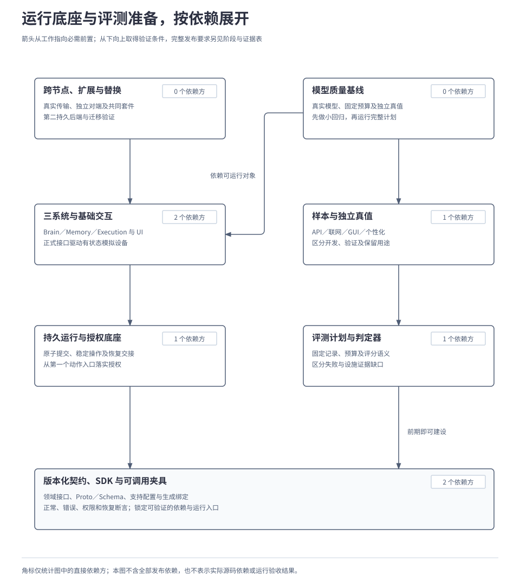

# 4.5 实施路线与能力验收

<a id="17-实施路线与能力验收"></a>

实施计划需要把单个用例的证据组织成有范围的阶段结论。本章用 M1–M4 交付阶段和逐项能力成熟度安排工作，明确独立替换、专项与恢复验证，并将同一候选版本的证据汇成可核验的完成声明。架构正文是实现与验收输入，文档完整不表示实现成熟。

## 本章要解决的问题

阶段说明准备交付什么，能力成熟度说明每项能力已有哪类证据，发布声明说明这份证据适用于哪个候选和环境。三者逐项对应，才能据此安排下一步工作。

M1–M4 表达项目交付阶段，L1–L4 表达每项通用能力的成熟度。L1 有明确契约；L2 有可重复验证的参考实现；L3 通过独立替换与互操作；L4 完成适用的异常恢复与治理验证，并保留此前等级的要求。C1–C9 是九项通用能力编号，其中 C9 是受控自进化，其 L4 还必须证明改进效果及回滚。A1–A4 是架构约束，V1、V2 分别是联网问答和手机 GUI 专项，后文逐项展开。

| 实施选择 | 理由与边界 |
| --- | --- |
| 先建设契约与可调用夹具，同时准备判定材料 | 运行实现与评测真值各有依赖，避免到阶段末才发现无法判定。 |
| 独立替换、完整质量和生产容量分别取证 | 接口存在、局部用例通过和完整能力成熟属于不同结论。 |
| M4 汇合同一候选的完整证据 | 不把不同版本的局部通过拼成一个可发布版本；缺口保留在报告中。 |

以下先用一份局部报告练习范围判断，再按依赖和阶段安排工作，最后把恢复要求落成可交付、可核验的工作包。

第 1 节用一份假设报告演示如何判断证据：摘要已交付，小型真实模型回归通过，但其他证据不齐。后文恢复工作包另从“电脑保存已确认、内核尚未收到结果”开始。两者均为教学条件，目前没有对应运行结果，不能据此声明 M1–M4 已完成。

## 1. 先判断这份报告能说明什么

报告采用《技术选型与开发组装》的单机配置：Go、SQLite、模型驱动大脑及独立有状态的模拟手机与电脑。摘要任务 T 按权限读取 E1《会议记录》与 E2《需求说明》，生成 D，保存 S、读回 R，再向手机交付位置和来源。

D 是要保存的摘要，S 是保存操作，R 是确认保存成功后执行的读回操作。摘要仍需区分“资料导入已验收”与“摘要导出仍在联调、尚未验收”。报告分别核对这次业务任务的结果、Harness 通用能力和版本完成声明，三者需要的证据范围不同。

| 教学报告中的材料 | 能支持的判断 | 尚需补齐的证据 |
| --- | --- | --- |
| 原 T 保存、读回并在手机呈现 | 该配置下，这个组合用例完成了交付。 | 各项通用能力、架构约束和专项的独立结果。 |
| 小型真实模型回归通过 | 固定样本及预算内取得了局部质量结果。 | 完整目录覆盖、独立单步／多步计分及适用专项。 |
| 接口声明存在，尚未运行替代实现 | 已有替换边界和验证计划。 | 独立实现、共同契约、实际协议边界及第二持久后端。 |
| 候选生成与发布流程可演示 | 改进过程可以被执行和追踪。 | 可比较基线、独立保留确认、有效改善及监测／回滚证据。 |

报告可以保留已通过用例的范围与证据引用，但这些材料还不足以宣布单机参考阶段完成，也不足以证明受控自进化达到最高成熟度。阶段报告须同时记录已取得的成果与未满足的条件；阶段目标见[第 3 节](#3-四个阶段分别交付什么)，证据状态与完成声明见[第 7 节](#7-怎样形成一份可核验的完成声明)。

## 2. 实现工作怎样按依赖展开

先固定领域接口、Proto／Schema、错误与权限语义、正常和故障夹具，再建设持久运行与授权底座。三系统、UI、传输和扩展分别通过这些接口接入；执行端从第一个动作入口起就检查权限，结果不明时沿原操作核对。这些约束贯穿实现过程，M4 验证的是完整覆盖与治理能力。

评测准备可以从记录和评分接口确定时开始。开发者同时建设数据、真值核验与判定器，参考实现具备运行条件后即可接入小型回归；完整目录和专项逐步扩展，判分规则在运行前固定。

下图中的箭头从**工作指向它需要的前置产物**。从底部契约向上看，运行底座和评测准备可以分别推进；质量基线同时需要可运行的系统与独立判定材料。图中只画首批主要依赖，发布与交接条件在后文展开。

[](../../diagrams/17-implementation-dependencies.html)

单机默认使用 SQLite，无需独立数据库、队列或工作流集群。真实模型与联网来源按能力接入；多个模拟节点可部署在同一开发机，通过实际 gRPC／WebSocket 链路验证跨端。模块职责、进程数量与设备数量分别记录。

工作组可以提前建设后续产物，进入对应验证前仍须满足依赖。具体包边界和启动方式见[4.1 技术选型与开发组装](01-implementation-and-technology.md)，计划、评分及候选比较见[4.4 评测、比较与发布](04-evaluation-and-release.md)。

## 3. 四个阶段分别交付什么

阶段目标如下；每项实际成熟度仍要由自己的报告证明。

| 阶段 | 需要交付的结果 | 可以形成的声明 |
| --- | --- | --- |
| M1 契约与验证基础 | C1–C9 的 L1 证据；版本化接口、Schema、SDK／生成绑定、正常与错误／权限／恢复夹具，以及可调用验证入口。 | 可公开设计与开发资料，明确后续运行方法；完整任务能力尚待实现验证。 |
| M2 单机参考能力 | C1–C8 达 L2，C9 保持 L1；三系统、SQLite、有限任务循环、用户控制、扩展和评测可运行，基础专项及协作有运行证据。 | 单机开发预览；报告已运行范围，完整质量与自进化效果尚未验收。 |
| M3 独立替换与互操作 | C1–C8 达 L3，C9 达 L2；三系统与关键 Adapter 的独立实现、真实协议边界、多节点、第二后端及双向迁移通过适用验证。 | 可扩展预览与 SDK／一致性套件；改进流程能运行，仍需完整质量和实际改善证据。 |
| M4 完整质量、恢复与治理 | C1–C9 在声明范围内达 L4，A1–A4 与 V1–V2 均通过；完整质量、控制、隐私、故障及改进发布证据齐备。 | 具备首个完整参考版本的发布资格，并列明平台、组件组合及环境边界。 |

各能力的目标进度分为两组。等级必须由对应报告证明，不能把阶段编号直接抄作所有能力的实际成熟度；逐项名称、等级要求和完整矩阵见[附录 05：成熟度](../../reference/05-validation-profiles-and-traceability.md#maturity)。

| 通用能力 | M1 | M2 | M3 | M4 |
| --- | --- | --- | --- | --- |
| C1–C8：任务决策、记忆、证据、执行、运行、扩展、控制与评测 | L1 | L2 | L3 | L4 |
| C9 受控自进化 | L1 | L1 | L2 | L4* |

\* C9 在 M4 同时补齐 L3：改进产物通过所属能力契约，并能被兼容组件使用。只演示候选被激活、监测和回滚，可用于验证流程；实际改善仍需《评测、比较与发布》规定的基线、评分、独立保留确认和适用统计证据。

M2 的运行范围包括问答、API、GUI、个性化、内部／外部 Agent 及基础端云协作。小型真实模型回归按改动选择用例，没有另加一套未经确认的固定样本数；报告须列明覆盖。完整千级基准可以从 M2 增量试跑，完整达标声明仍须满足 M4 的全部条件。

这些阶段表达依赖和验收目标。实际日期、人员与模型费用依据试跑测量安排，不能按代码量或经过的时间自动晋级；当前正文成文也不代表 M1 所需的 SDK、夹具与验证入口已交付。

## 4. 质量与专项怎样分别放行

《评测、比较与发布》解释了计分过程，本篇把报告放回阶段判断。每项都要绑定候选版本、环境、目录／数据、模型、评分器及预算；某组通过不能抵消另一组失败，关键约束违规也不能被平均成功率掩盖。

| 验收对象 | 完整放行需要什么 | 报告必须区分什么 |
| --- | --- | --- |
| 千级 API | 完整目录至少 1001 项独立业务 API；单步首次正确率至少 90%，有限纠错后的单步及多步任务成功率分别至少 95%，正确不执行另组至少 95%；覆盖、预算与控制要求同时满足。 | 首份提案与最终成功，单步／多步／正确不执行的分母，宏平均与逐 API 覆盖；小集合不能替代完整计划。 |
| V1 联网问答 | 固定资料与实际联网两组、各类别的完整回答判定均至少 90%；适用关键事实的引用支持与覆盖分别至少 95%。 | 实际取得的来源、时间与真值；录制响应、获取失败与真实网络运行分别记录。 |
| V2 手机 GUI | 结构树／图像两组可执行任务成功率分别至少 95%，各自的 50 例边界组正确处置率分别至少 95%（各至少 48/50）；五类情况逐项报告，必需动作、观察与控制断言全部通过。 | 真实模型选择与固定脚本，允许的观察与隐藏真值，模拟设备支持与真实平台支持。 |
| C2 个性化 | 成对用例中，适用回答与行动分别至少 95% 达到预定效果，各类边界处置分别至少 95%；隐私、删除和用途控制断言全过。 | 偏好是否实际改变允许的结果，以及不适用、过期、冲突或禁止披露时能否保持克制；两侧独立重置状态。 |
| C9 受控改进 | 适用质量与契约通过，有可比较基线、有效改善、独立保留确认，以及阶段启用、监测和回滚证据。 | 生成了候选、流程可运行、效果有改善、在声明环境中稳定，分别需要依据。 |

联网问答与 GUI 从 M2 提供运行证据，M3 验证相关实现替换，M4 完成独立质量及控制验收。GUI 仍覆盖点击、滑动、输入、返回、再次观察、效果核验及取消／接管；API 优先不降低这一专项要求。个性化也须经过对应阶段，检查严格留端信息及获准派生结果的实际处理与出口。

所有测试按原计划保留失败、原始尝试、用量和分母。被测实现不输出合法提案、超预算或未确认效果属于任务失败；独立测试设施无法取得必要依据则报告证据不完整。

如果本轮候选全部失败，或保留材料已经失效，或统计推断不适用，就不能判定 C9 的改善要求已经满足；不得为完成 M4 而降低门槛。

完整样本、预算、统计规则和专项配置已集中于[附录 05](../../reference/05-validation-profiles-and-traceability.md)，沿用既定评测及专项契约。脚本大脑的契约测试、真实模型质量和真实联网报告分别出具。

## 5. 替换、迁移与运行环境怎样验收

M3 要为三系统及关键 Adapter 提供独立构建的适用替代实现，并运行共同契约。两份配置、内存替身或同一实现的两层包装都不足以证明独立替换；每份报告明确替换了哪个对象，以及仍保留哪些参考组件。

独立替换逐项覆盖 Brain、Model、Memory、Execution、持久 Store、获取、传输、UI 和外部生态。每个对象注明独立实现、共同契约与真实调用边界；详细证据矩阵见[实施细则 A](../../reference/roadmap-details.md#replacement)。

第二持久后端是 M3 的实际依赖，默认开发与完整参考部署仍使用 SQLite。bbolt 覆盖所选完整配置所需的运行、执行、资源控制、记忆、授权、扩展、评测发布及界面状态，观测索引按事实重建。其首个验证组合限定 Linux amd64、本地文件系统；内核、挂载、同步及容量条件进入报告。

双向迁移验证同一受控节点上的 SQLite → bbolt 与 bbolt → SQLite：全范围停写、逻辑导出／导入、引用及水位核对、唯一活动配置、原操作恢复，并在各阶段注入中断和同步错误。授权消费、删除水位、待交接消息和旧 S／R／J 关联都须保留。目标产生新写入后，回切要重新停写并反向迁移，不能启动陈旧源库。步骤与故障要求见[4.1 技术选型与开发组装](01-implementation-and-technology.md)。

运行环境另行取证。端云能力使用真实传输、多模拟节点及位置交换，验证本地继续、断连等待、所有权移交和重连核对；模拟 GUI 无需真机，但不能据此声明 Android／iOS 已支持。严格留端信息要检查存储、上下文、模型请求、日志和评测等实际出口。

M4 的完整参考发布也不表示千万注册、百万日活、十万在线已经实测。生产配置仍须按[4.2 部署、存储与规模扩展](02-deployment-and-storage.md)和[4.3 故障恢复与运行保障](03-reliability-and-recovery.md)取得用户隔离、负载、耐久切换、恢复积压及资源余量的证据。单机迁移、模拟时钟和固定目录分数各有适用范围，不能换算为生产容量或真实观察周期。

## 6. 把恢复要求拆成一个工作包

“实现故障恢复”可以先拆成一个具有明确切点的工作包：电脑已确认原保存成功，内核未收到结果，重启后仍能完成原 T。这个工作包验证一次具体的恢复交接，完整故障矩阵仍由后续用例补齐。

本例用脚本 Brain 稳定产生既定提案，通过正式接口建立原 T、S、R；S／J 关联已经持久保存，R 已准入并等待 S。夹具暂时阻断电脑向内核交付 S 的结果，让 J 完成写入，执行模块持久确认成功并保留待交付结果。此时电脑已有 D，内核尚未确认 S；数据库与恢复材料完好，当前授权、控制和预算允许继续。

| 工作包要素 | 本例如何填写 |
| --- | --- |
| 可观察结果 | 重启后原 S 的成功事实被内核接纳，继续原 R，核验 D 后向手机交付；保存不重复发生。 |
| 前置契约 | 任务准入与领取、稳定操作和持久交接、Execution 查询与结果报告、处理端授权及手机呈现反馈。 |
| 输入与配置 | 固定候选、SQLite、脚本 Brain、两端模拟状态、E1／E2／D、原 T／S／R／J 及本例权限和预算；记录版本与测试期限。 |
| 注入位置 | S／J 已持久关联后阻断结果交付；确认电脑已保存、执行侧已记录成功，而内核尚未确认 S，再受控重启内核。 |
| 交付产物 | 对应恢复实现、可调用夹具、独立状态与动作历史核验、逐项断言结果、重现步骤和必要证据引用。 |
| 验证权限 | 夹具在隔离环境管理故障并读取获准真值；被测任务仍只通过正式授权接口执行。判定材料不送给 Brain。 |
| 范围说明 | 贡献 C4／C5／C7／C8 的相关契约与恢复证据；单个工作包不直接提升这些能力的完整等级，也不证明模型质量。 |

内核恢复时先合法领取原工作，核对当前条件和原 S；恢复的持久交接可能与主动查询并行到达，两者按原身份接纳。R 仍等待 S 的成功结果被内核确认，不能因“电脑应该已经保存”提前读取，也不能新建一次保存来补齐回执。

下面的伪代码说明夹具的验收步骤与观察结果，不是已存在的命令或接口实现：

```text
固定候选、环境、授权与测试预算
经正式接口建立 T、S、R 及 S／J 关联
阻断 S 结果交付，让 J 完成保存
核验：电脑已确认 S，内核尚未确认
重启内核，恢复结果通道
在预定期限内等待原 T 收尾
断言 原 S 的业务写入次数 == 1
断言 原 R 执行前，内核已确认 S 成功
断言 D 内容、来源及手机呈现符合预期
保存每项断言、失败与证据引用
```

写入次数来自模拟设备独立动作历史，文件内容由实际读回核验；仅比较最终文件摘要，不能发现一次重复覆盖。证据还应关联内核的准入／消费、执行端保存事实、当前授权、R 与手机反馈，证明结果属于同一候选配置和原任务。

正常路径通过后，再按预先登记的变体验证边界。各变体的预期结果独立定义，不能全部套用“任务必须完成”的断言。

| 变体或失败 | 预期处理与判定 |
| --- | --- |
| 同一保存结果重复到达 | 原事实去重接纳，既不再次保存，也不产生新的读回业务操作。重复消息记录可见。 |
| 电脑仍不可达，尚无可接纳结果 | 原工作有界等待或核对，遵守期限与预算，不把缺少回执当作未执行并再次保存。 |
| 授权或用户控制发生变化 | 新业务动作按当前条件拒绝、等待或停止；已发生的 S 保持真实，允许的核对与收尾沿原关联继续。 |
| 未到预期切点或缺少判定材料 | 被测实现未完成规定行为记失败；夹具注入失败、独立观察设施故障记证据不完整。保留原因与原始记录，不能把实现失败改称设施问题。 |

这一工作包的实现分别落在所属模块，验收围绕同一个可观察结果组织。其他故障窗口、未知外部提交、耐久切换及用户控制按[2.4 能力与执行](../02-subsystems/04-tools-and-devices.md)、[2.6 身份与授权](../02-subsystems/06-identity-and-authorization.md)和[4.3 故障恢复与运行保障](03-reliability-and-recovery.md)继续扩展；带编号的故障矩阵与组合注入要求见[附录 03](../../reference/03-state-and-failure-matrices.md#validation)。

## 7. 怎样形成一份可核验的完成声明

回到开篇报告，先固定要声明的候选版本与支持范围，再逐项收集 C1–C9 的目标／实际成熟度、专项结果和架构约束。M4 必须汇合**同一发布候选**的证据；候选包含多个兼容组合时逐组合列明，不能把不同提交各自通过的片段拼成一个已通过版本。

| 架构约束 | 报告需要展示的事实 |
| --- | --- |
| A1 逻辑职责 | 包依赖与运行记录共同证明：Brain 提案、Memory 访问、Execution 报告、Core 推进状态；扩展没有任意终态写入权。 |
| A2 默认实现与替换 | 单机默认实现可运行；独立实现通过共同契约，更换后仍保留授权、恢复和适用质量边界。 |
| A3 端云位置 | 多节点及三系统的位置变化实际运行，跨节点访问、离线、移交与重连具备证据；位置可变与真机支持分别记录。 |
| A4 契约与授权 | 四个基础接口领域、UI 扩展和管理操作落实共同语义；委派、撤销、隐私出口及版本错误在各实现与传输中按规则处理。 |

每份报告记录实现与依赖版本、操作系统／架构、部署拓扑、命令与配置、数据及目录版本、模型、评分器、预算、结果和原始证据引用。成功数、分母、缺失项与已知限制可复核；证据的访问与保留范围随来源继承。公开报告使用凭证引用或占位，秘密及未获准披露的样本不进入仓库。

状态也必须准确表达：

| 报告状态 | 含义与下一步 |
| --- | --- |
| 未实现 | 缺少所需实现或产物，不能用设计说明填成运行通过。 |
| 未运行 | 已具备运行入口，但尚未取得该计划结果；安排执行并保留配置。 |
| 通过 | 在列明范围内满足适用断言与门槛，且必要证据完整。 |
| 失败 | 已证实违反断言或未达到门槛；保留失败，修复后按版本重新取证。 |
| 证据不完整 | 无法完成规定判定；保留缺口，补证或按计划重测，不默认通过。 |
| 不适用／不支持 | 说明对象、条件和依据；可选范围据此限制支持声明，必需能力不能靠此标签免除验收。 |

报告中已通过的用例继续保留价值，未满足项阻止相应完成声明。例如，API 与专项均已通过，但 C9 尚无有效改善证据，就保留这些通过结果及其范围，同时将完整参考发布条件记为未满足。允许修复或提出新候选，评测门槛和失败历史保持可追溯。

若实施暴露既定契约无法解决的问题，交回可复现输入、失败证据、受影响目标及建议取舍，进入相应设计决策。普通兼容修复和依赖锁定按既有范围推进；平台、协议特性或能力目标改变时，同步维护契约和支持矩阵。

## 8. 从工作包走向开源交付

恢复工作包展示了一种拆分尺度：每项工作都有可观察结果、依赖、输入输出、权限、失败路径和验收入口。其余工作按同一结构组织，开发人员可以围绕契约分工，并在接口与前置产物具备后并行实现。

| 工作组 | 首个可验证产物 | 后续交接重点 |
| --- | --- | --- |
| 契约、SDK 与测试入口 | 可导入领域接口、生成绑定、Schema 注册及正常／故障夹具。 | 支持配置、版本兼容、共同测试命令与未覆盖行为。 |
| 内核与身份授权 | 单机启动、SQLite、任务／操作／授权的持久提交。 | 准入、恢复、稳定身份、执行端检查及原操作核对。 |
| 记忆、大脑、执行与信息获取 | 各系统参考实现和独立有状态数据，接入真实模型与信息来源。 | 默认组合、位置与披露约束、可替换边界及各能力运行报告。 |
| 协作、UI 与扩展 | 多模拟节点、用户交互、外部协议适配与扩展激活。 | 双角色、独立对端、控制传播、版本及迟到交互。 |
| 独立替换与迁移 | 共同契约套件、bbolt 完整配置、双向迁移与中断恢复。 | 维护屏障、唯一活动配置、耐久性及实际支持组合。 |
| 评测与受控改进 | 数据／判定器、完整基准、保留确认及发布控制。 | 方法适用性、实际改善、监测／回滚和证据生命周期。 |
| 参考发布与维护交接 | 配置、SDK 示例、复现步骤、支持矩阵及升级／迁移说明。 | 已知限制、贡献方式、兼容性检查入口和维护者发布记录。 |

完整开源交付包括架构规范、标准协议、可运行内核、三系统参考实现、扩展 SDK 和一致性测试。复现说明应让接手者按公开配置启动、运行适用验证、定位报告与失败材料；额外平台、更强隔离、自动接管及可选协议扩展分别声明支持范围。

M1 起即可公开规范与开发资料，M2／M3 可交付对应预览。M4 是完整参考能力的技术资格，实际代码发布仍由维护者执行；通过文档或评测不会自动授予发布权限。人员、日历和实际费用在实现试跑后安排，本篇交接工作包和验收方法，不创建实施任务或部署业务系统。

本篇依据[能力里程碑与实施依赖](../../../archive/architecture-v1/11-milestones-and-validation.md)、[专项验收、持久化替换与实施交接](../../../archive/architecture-v1/11-specialized-validation-and-handoff.md)，并对照[项目目标基线](../../../harness-project-goals.md)及[设计输入与硬约束](../../../archive/architecture-v1/00-design-constraints.md)。实现成熟度与运行验收仍须逐项取得证据。

[附录 01：对象与字段](../../reference/01-data-model.md)、[附录 02：接口与兼容配置](../../reference/02-api-and-message-catalog.md)、[附录 03：状态与故障矩阵](../../reference/03-state-and-failure-matrices.md)、[附录 04：容量演算与存储预算](../../reference/04-capacity-model.md)和[附录 05：验收配置与追溯](../../reference/05-validation-profiles-and-traceability.md)分别提供实现时所需的完整规格、参数及验证入口。

---

[上一章：4.4 评测、比较与发布](04-evaluation-and-release.md) · [正文目录](../README.md) · [下一章：4.6 架构主张的比较与验证](06-architecture-comparison.md)
