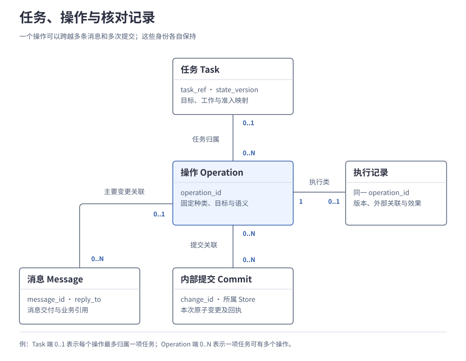
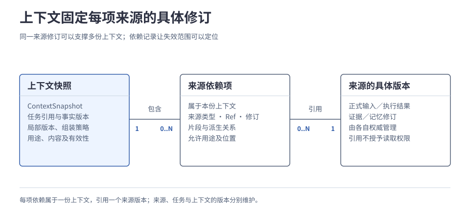
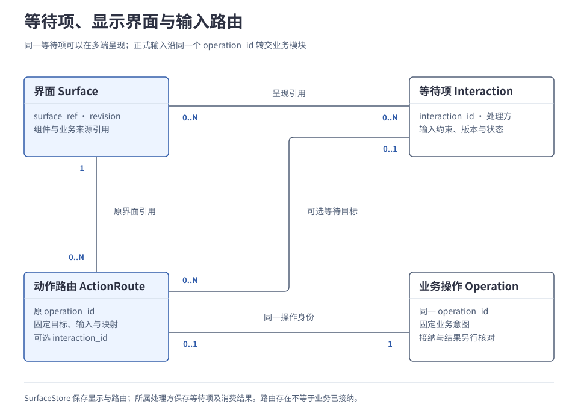

# 附录 01 对象、标识与字段

本篇维护当前规格；归档链接只用于来源追溯。规范缺口和实质冲突见[设计缺口](../maintenance/open-questions.md)，不能以历史文件覆盖当前条款。

本附录集中定义对象关系、字段含义、写入方、版本更新条件及恢复记录，供设计接口、实现存储和核对数据时查阅。查一个字段时，应同时核对它属于哪个对象、由谁提交、与哪些记录原子保存；只按字段名匹配不足以实现相同行为。机制的理由与运行过程仍在各专题正文解释。

本文整理已确认的设计契约，尚非已发布 SDK 或数据库 Schema。表中反引号保留已有字段名；中文字段组表示必须表达的语义，不预设最终字段拼写、编码类型或一对象一张表。未定实现细节集中列在[末节](#implementation-boundary)，成文不表示已有运行验收。

任务运行内核的本地类型、局部工作状态与 SQLite 物理布局已由[内核详细设计](../design/01-runtime-kernel.md)补齐。本附录继续维护跨模块对象语义，具体 Go 声明和 DDL 在该设计单独维护。

| 想查什么 | 入口 | 先理解机制 |
| --- | --- | --- |
| 一个任务有哪些对象，记录由谁负责 | [对象目录与关系](#objects) | [1.2 系统全貌](../main/01-system/02-architecture-overview.md) |
| ID 是否相同，版本何时变化 | [标识、作用域与版本](#identity-version) | [2.1 任务运行内核](../main/02-subsystems/01-runtime-kernel.md)、[2.5 应用与交互](../main/02-subsystems/05-interaction.md) |
| 提案怎样对应工作、操作、预算和子任务 | [任务运行数据](#runtime) | [2.1 任务运行内核](../main/02-subsystems/01-runtime-kernel.md)、[2.3 规划、决策与模型调用](../main/02-subsystems/03-planning-and-decision.md)、[3.3 多 Agent 协作](../main/03-coordination/03-agent-collaboration.md) |
| 保存是否发生，外部作业怎样关联 | [操作、执行与能力](#execution) | [2.4 能力与执行](../main/02-subsystems/04-tools-and-devices.md) |
| 来源、上下文、记忆与删除如何关联 | [内容、记忆与上下文](#content-memory) | [2.2 上下文、记忆与证据](../main/02-subsystems/02-context-and-memory.md)、[3.4 端云协同与离线运行](../main/03-coordination/04-edge-cloud-coordination.md) |
| 界面版本、等待项、正式输入分别在哪里 | [交互与呈现](#interaction) | [2.5 应用与交互](../main/02-subsystems/05-interaction.md) |
| 身份、策略、许可和消费记录保存什么 | [身份与授权](#authorization) | [2.6 身份与授权](../main/02-subsystems/06-identity-and-authorization.md) |
| 扩展与在途工作的版本如何固定 | [扩展与激活](#extension) | [2.8 扩展与运行保障](../main/02-subsystems/08-extensions-and-runtime.md) |
| 观测、评测、候选与发布如何关联 | [观测、评测与改进](#evaluation) | [4.4 评测、比较与发布](../main/04-engineering/04-evaluation-and-release.md) |
| 哪些数据一起写，哪些记录可以清理 | [交付与恢复记录](#recovery-records)、[原子组与保留](#atomic-retention) | [4.2 部署、存储与规模扩展](../main/04-engineering/02-deployment-and-storage.md)、[4.3 故障恢复与运行保障](../main/04-engineering/03-reliability-and-recovery.md) |

方法、消息信封与协议配置见[附录 02](02-api-and-message-catalog.md)，状态转换及故障窗口见[附录 03](03-state-and-failure-matrices.md)。容量演算见[附录 04](04-capacity-model.md)，完整验收配置与能力追溯见[附录 05](05-validation-profiles-and-traceability.md)。

## 1. 对象目录与关系

先从业务事实找到负责记录它的对象。例如，任务要继续什么工作归 Task，文件保存实际走到哪一步归执行记录，用户看到了什么归界面记录。下表中的“写入方”指有权提交该事实的逻辑权威；即使共用一个 SQLite 文件，也不合并这些责任。对象身份、关联引用、内部日志键和暂态上下文仍分别使用。

| 对象或记录组 | 代表什么 | 权威与主要关系 |
| --- | --- | --- |
| Task、Owner、Work | 任务目标与进展、推进责任、下一段待处理工作。 | 内核经 RunStore／WorkStore 保存；大脑和调度策略不另持一份任务终态。 |
| 决策提案、准入映射 | 大脑请求做什么，以及哪些请求正式成为操作。 | 大脑产生有限提案；内核保存准入摘要、局部键到操作的映射及依赖。 |
| Operation、ExecutionRecord | 一次固定的逻辑变更，以及执行类操作的事实。 | 各业务模块接纳自身操作；执行记录由执行协调器经 ExecutionStore 保存。 |
| 结果、Evidence、Artifact | 操作或任务的结论、支持结论的证据、产生的内容。 | 所属业务／采集／执行模块保存事实与受控引用；同一产物可被后续任务用作证据。 |
| Collection、MemoryRecord | 获准跨任务复用的记忆集合与记录。 | MemoryService 经集合的单一修改权威写入 MemoryStore。 |
| ContextSnapshot、来源依赖 | 某轮决策的固定输入及其所依据的来源修订。 | ContextAssembler 组装与验证；运行事实仍以原 Store 为准。 |
| Interaction、Surface、ActionRoute | 正式等待项、可恢复界面、固定的输入转交关系。 | 等待项归业务模块；SurfaceStore 保存呈现与转交，不代替业务消费。 |
| 身份登记、Policy、Grant、消费记录 | 谁在操作、允许什么、获准范围及实际使用。 | 身份／授权权威管理登记和许可；实际处理模块按契约保存消费。 |
| 扩展资产、锁定结果、Activation | 精确的扩展内容、解析结果及本地启用绑定。 | ExtensionStore 保存管理事实，节点应用进展分别报告。 |
| 观测记录、Evaluation、Candidate | 诊断投影、不可变计划下的评测、待验证的改进产物。 | 观测、EvaluationStore、EvolutionStore 分责；评分与发布权限分开。 |
| Message、Inbox、Outbox、提交回执 | 消息交付、接收处理责任及某次本地提交结果。 | 各发送／接收模块及所属 Store 保存；传输完成不决定业务成功。 |

下图只展开任务、操作与核对记录。靠近 Task 的 `0..1` 表示每个操作最多归属一项任务；靠近 Operation 的 `0..N` 表示一项任务可以关联多个操作。图不表示表结构或共同事务。

图中的 Task 关系只计主任务归属，父子任务与目标引用另计；Message 关系只统计消息携带的**主要变更身份**，查询目标、取消目标与因果引用另计。Operation 是共同身份语义，各模块保留专有记录，不要求建设一个万能操作服务。独立工具、记忆和应用操作可以没有 Task。

## 2. 标识、作用域与版本

### 2.1 引用怎样定位对象

`Ref` 表示带类型与作用域的引用；ID 是所属作用域内的稳定标识。引用可见不授予正文读取、操作执行或结果披露权限。涉及个人用户的数据、唯一键、索引、缓存及订阅都必须保持可信 `namespace` 边界。

| 标识或引用 | 作用域与语义 | 何时保持，何时另建 |
| --- | --- | --- |
| `namespace` | 受认证身份绑定的个人用户数据作用域。 | 转发、重连和迁移保持；不能由普通业务参数自报后直接信任。 |
| 用户／主体引用 | 用户是被服务的数据归属者；主体是获准发起或代理请求的身份。 | 显示名不作可信标识；代理主体、原发起主体及所属用户分别保留。具体字段编码待 Schema 固定。 |
| 节点／`endpoint_ref` | 节点定位运行参与方，端点定位交互或连接目标；使用受信登记关联。 | 节点、浏览器端点和当前连接不等同；重连不新建业务任务。 |
| `task_ref` | 命名空间中的一项任务。 | 多轮补充、Worker 更换与 Owner 移交保持；终态后的新目标另建任务。 |
| `owner_ref` | 对该任务负有推进责任的逻辑拥有者。 | 同一 Owner 可跨进程重启；显式移交改变拥有者及其世代。 |
| `operation_id`／OperationRef | 一次不可变的逻辑变更；ID 在 namespace 内唯一，Ref 补足作用域。 | 重试、转发及结果核对保持；改变种类、目标、期限或语义输入须形成新操作。 |
| 提案局部键、工作定位 | 前者在本批提案内描述依赖，后者在所属 Store 内定位持久责任。 | 内核准入时把局部键映射为正式操作；不要求额外的全局提案或工作 ID。 |
| `interaction_id` | 具体业务等待项，绑定提出它的受控处理模块。 | 更新同一有效等待项保持；问题语义已改变而需新等待点时另建，旧回答不自动改绑。 |
| `surface_ref`、`component_key` | `surface_ref=(namespace, endpoint_ref, surface_key)`；组件键在该 Surface 内定位。 | 重开界面使用新局部键或明确的新状态世代；一个任务可在多个 Surface 呈现。 |
| 记忆引用 | `namespace`、`collection_key`、`record_key` 定位集合内记录。 | 纠正保留记录身份并产生修订；已删除身份不重新用于另一条记忆。 |
| Evidence／Artifact／能力／扩展引用 | 带所属作用域的类型化资源引用；按用途附准确版本或内容摘要。 | 内容、实现或 Schema 变化分别记录；别名、路径和搜索名称不自动构成固定版本。 |
| `evaluation_ref`、`candidate_ref` | 命名空间内的评测与候选管理对象，由创建操作关联。 | 管理对象与创建／修改它的操作分别定位；不放入所有业务消息作为通用身份。 |
| `message_id`、`reply_to` | 一条应用消息；回复引用原请求消息。 | 原样补投保持 ID；新查询、新回复、新事件另建消息；多条回复不能只按 `reply_to` 去重。 |
| `change_id` | **所属存储作用域内**一次原子提交的核对键。RunStore 中还绑定具体任务。 | 同一提交重试保持；一次操作可有多次提交。各模块内部使用，不进入原生公共业务信封。 |
| `stream_id`／`seq`、`connection_id` | 逻辑流与单向位置、连接／协商上下文。 | 连接更新与业务身份分开；流位置不能替代消息身份。 |
| `trace_id`、`causation_ref` | 可选追踪信息，以及指向既有消息／操作的因果引用。 | 不参与业务去重或授权，不要求另建“因果对象”。 |
| 外部作业／协议引用 | Driver 或 Adapter 保存的服务器作用域、远端身份与映射版本。 | 查询原作业沿用原关联；不把远端 ID 当成本地操作 ID 或用户权限。 |

执行调用用执行类 `operation_id` 承担 `invocation_id` 的身份职责；请求与响应用 `message_id`／`reply_to` 关联，不另设独立 `request_id`。同样不新增 `ui_task_id`、`ui_request_id` 或 `ui_event_id`。共用身份不减少执行事实、去重、路由和提交回执各自的保存义务。

操作唯一性还依赖[接纳窗口](#delivery-records)确定唯一接纳权威；不能让同一 namespace 下的多个模块各自首次接纳同一个 ID。依据见[标识模型](../../archive/architecture-v1/03-identifier-model.md)、[后续数据链路补充](../../archive/architecture-v1/12-data-path-and-protocol-semantics.md)。

### 2.2 运行中的版本与资格

版本回答“依据的是哪次状态”，世代回答“哪一轮资格有效”，游标回答“已处理到哪里”。它们仅在各自作用域内比较。预期版本是请求携带的比较值，不是另一套计数器。

| 版本或资格 | 保存／更新方 | 变化条件与用途 |
| --- | --- | --- |
| Task `state_version` | 内核经 RunStore 原子提交。 | 正式接纳输入、提案、执行事实、控制或相关预算变化时推进。主状态仍为 `RUNNING` 也可更新。 |
| `expected_state_version` | 请求方根据获准快照填写；内核比较。 | 表示本次修改依据；生成输入采用领取决策工作、预留预算**提交后的**任务版本。 |
| `owner_epoch` | 任务拥有权记录。 | 按移交规则推进，隔离旧拥有者；重连或更换 Worker 本身不推进。 |
| Worker 领取代次与租约 | 所属运行／执行存储的受约束领取。 | 领取代次区分新旧处理资格；租约规定有效期。过期不证明外部动作已经停止。 |
| 执行记录版本、报告修订 | ExecutionStore／执行协调器。 | 前者约束局部并发提交，后者帮助接收方消费事实；不随任务版本简单同步。 |
| 暂停来源控制修订 | 任务运行记录，按根来源关联传播。 | 区分同一来源的 `ACTIVE`、`CLEARED` 先后；较旧消息不能复活已解除来源。 |
| 资源控制局部版本 | 对应执行协调方经 ExecutionStore 保存。 | 接管／恢复及适用控制更新时变化，供启动登记与控制请求检查。 |
| Owner 管理阶段 | 所有权记录中的 `ACTIVE / PREPARING / SEALED`。 | 表达可推进、准备移交、已封存；它是管理状态，不是 Task 业务主状态或额外任务身份。 |

普通 UI 刷新、草稿编辑和重复操作不直接推进任务版本；工作心跳也不要求每次推进该版本。若手机交付是任务完成条件，内核正式纳入相应交付事实时仍须按任务规则提交。详细例子见[2.1 任务运行内核](../main/02-subsystems/01-runtime-kernel.md#2-大脑返回提案内核决定能否接纳)、[2.5 应用与交互](../main/02-subsystems/05-interaction.md#补充要求怎样阻止旧方案继续执行)。

### 2.3 内容、配置与同步版本

内容修订说明采用哪份资料，配置版本固定本次实现，同步位置记录副本应用到哪里。它们可以在任务版本不变时独立变化，查阅时须保留各自的对象与作用域。

| 版本或位置 | 对象与写入方 | 变化条件与边界 |
| --- | --- | --- |
| Memory `revision`、来源修订 | 集合权威维护记忆修订；其他来源由各自权威维护。 | 纠正、删除等正式修改产生新修订；一条记忆改变不自动递增所有任务版本。 |
| 上下文局部版本、组装策略版本 | ContextAssembler 的组装结果与所用策略。 | 新组装结果与策略变更分别定位；快照还记录所依据的任务版本与每项来源修订。 |
| Surface `revision`／`base_revision` | SurfaceStore 的显示状态与补丁前提。 | 显示快照变化更新 revision；补丁仅在基版本匹配时应用，与等待项消费和任务版本分别管理。 |
| Policy／Grant 修订 | 所属授权权威。 | 策略、许可及撤销状态按契约更新；不等同签名材料版本、密钥版本或消费次数。 |
| 能力、实现、Schema、包版本 | 能力声明及扩展锁定结果。 | 分别变化；已固定的决策／操作保持准确绑定，不能统一用一个“插件版本”替代。 |
| 激活修订 | 节点本地管理范围的 ExtensionStore。 | 新贡献绑定原子生效时推进；其他节点未应用不算已升级。 |
| 评测计划版本、样本尝试号、判读版本 | EvaluationStore 与固定评分器结果。 | 计划固定比较条件，尝试保留每次运行，重新评分形成新判读，不能覆盖原始事实。 |
| 同步视图世代／变更游标 | MemorySync 与获准副本。 | 世代绑定记录／字段范围及策略，游标表示该视图已应用位置；权限或范围变化使旧视图失效。 |
| 可靠流连续位置 | 各方向收发日志。 | 只推进已持久化且无缺口的前缀；消息已收到与业务已消费分别保存。 |
| `route_epoch`、连接世代 | 用户归属目录、受信连接登记。 | 用户分片迁移与当前端点连接切换分别更新；不替代任务 `owner_epoch`。 |

## 3. 任务运行数据

### 3.1 Task 与当前运行快照

**写入方：** 当前有资格的内核，经 RunStore 提交；Scheduler／Worker 使用受约束接口领取和推进。RunStore 与 WorkStore 属于同一运行持久化单元。

| 字段或字段组（语义类型） | 含义与适用条件 | 更新约束 |
| --- | --- | --- |
| `task_ref`（Ref）、创建操作关联 | 定位任务，关联首次提交及其回执。 | 重复创建请求返回同一任务，不按聊天轮次重新创建。 |
| 目标、约束、验收与交付条件（结构化内容／Ref） | 明确要完成什么，允许的输入、输出及必要交付。 | 正式更新按任务预期版本接纳，保留输入来源和提交主体。 |
| `state_version`（局部修订） | 当前任务事实的版本。 | 随相关变更提交；新建使用明确的“不存在”前提。 |
| 主状态（枚举） | `QUEUED / RUNNING / WAITING / COMPLETED / FAILED / CANCELLED`。 | 有可推进分支时可保持运行；全部可调度工作受阻才等待；终态不重开。 |
| 等待原因（集合） | 缺少的输入、依赖、授权、子任务结果或效果核对，关联具体对象／分支。 | 原因可并存；满足一个条件不清除其他等待。示例类别不作为新增穷尽枚举。 |
| 控制来源、有效意图与进展（结构） | 暂停来源集合、取消及合并后的 `RUN / PAUSE / CANCEL`，分别记录受理和落实。 | 取消优先，其次有效暂停；恢复仅解除指定来源。 |
| `owner_ref`／`owner_epoch`、管理阶段 | 哪个逻辑拥有者当前可以推进。 | 状态提交在同一事务检查拥有权、版本及适用 Worker 资格。 |
| 准入记录、操作映射与工作依赖（集合） | 哪批提案已接纳，局部行动如何绑定操作、哪些步骤尚未完成。 | 重复准入不重复追加；重新生成不重写已准入动作。 |
| 预算、已知用量、预留与硬期限 | 生成、行动、委派和收尾的允许资源。 | 与相关工作一起保存；重启不清零、不自动延长。 |
| 结果与证据引用、未决事项 | 允许保留的部分／最终结果，已发生效果及未解决缺口。 | 任务完成须满足目标、交付及所辖工作的处置条件；外部关键效果未知不能伪造终态。 |

### 3.2 决策输入、提案与准入映射

**生产者：** 内核及 ContextAssembler 提供输入，大脑返回提案；内核持久保存准入或拒绝所需记录。模型增量、供应商会话和工具调用 ID 不成为业务权威。

| 字段组 | 内容 | 固定与变化规则 |
| --- | --- | --- |
| 决策基线 | task_ref、任务版本、目标约束、上下文引用、已准入工作摘要及剩余预算。 | 使用领取与预算预留后的版本；版本竞争时按新事实重新决策。 |
| 本轮绑定 | Brain、模型配置、适用 Skill、上下文组装策略及能力／Schema 的准确版本。 | 一轮决策固定；供应商实际可取得的版本、用量和调用结果另行记录。 |
| 主要决策类型 | 有限行动／委派请求、等待原因或结果判断，可附计划修订与简短依据。 | 主要类型互斥；参考实现不同时请求新动作与完整成功，部分产物不必要求终态。 |
| 批内行动与依赖 | 局部键、目标、固定参数或受控引用、能力与依赖条件。 | 检查类型、参数、依赖环、批次大小和预算；这里的局部键尚非 operation_id。 |
| 准入记录 | 提案摘要、局部键到 operation_id 的映射、工作依赖、预算和提交关联。 | 由内核分配或绑定稳定操作；有限批次的运行记录整体准入，外部效果分别确认。 |
| 拒绝／生成结果 | 原因、可披露依据、已知用量和未知用量预留。 | 未准入提案不构成执行凭据；纠错仍消耗原预算，不能删除首次错误记录。 |

### 3.3 Work 与一轮领取

**写入方：** 所属运行或执行模块的持久存储。Work 表达一段可恢复责任，例如派发、查询、消费结果或发布；它不是外部作业，也不要求与 Operation 一一对应。

| 字段组 | 必须能表达什么 | 使用条件 |
| --- | --- | --- |
| 工作定位与归属 | 所属任务／操作／管理对象、工作种类及局部定位。 | 不能仅保存在内存队列；不规定所有模块共享同一工作结构。 |
| 依赖与目标 | 要处理的原操作、消息或结果，前置工作和所需事实。 | 内核等待保存 S 的报告，执行端查询作业 J，是两个模块各自的责任。 |
| 调度条件 | 可处理时间、优先级、等待条件、适用期限及资源要求。 | 到期扫描得到的是候选，仍须检查依赖、当前控制、资格和预算。 |
| 领取信息 | Worker 绑定、领取代次、有效期与续租依据。 | 领取／续租受存储约束；旧代次不能直接提交进展。 |
| 本轮进展与后续责任 | 已取得事实、完成本轮或仍需处理的记录、后续查询／发送安排。 | 原子保存后才结束本轮；正常等待不要求占用 Worker 到租约过期。 |
| 用量与处置关联 | 本轮预留、已知／未知消耗及有界重试／核对依据。 | 本地槽位可释放，不代表外部作业占用或未结算额度已经释放。 |

### 3.4 预算、控制与委派记录

这些是 Task 的关联结构，使用既有任务和操作引用，不新增必需的预算服务或全局控制 ID。

| 记录 | 字段组 | 写入与不变量 |
| --- | --- | --- |
| 任务预算 | 各类上限、可用额度、已用量、未决预留、相关工作／生成／操作引用、硬期限。 | RunStore 随准入预留、按证据结算；金额估算与可保证的硬上限分别表达。 |
| 处置预算 | 取消、核对和恢复允许使用的有限资源及用量。 | 目标预算耗尽后仍可承接必要处置，不能拿来扩展原目标。 |
| 委派分配 | 原委派操作、父／子任务引用、分配份额、接收方与结算依据。 | 父先预留，子独立消费；未知消耗保留占用，确认旧方不能再用且消耗已核对后才回收。 |
| 暂停来源 | `origin_task_ref`、`origin_pause_operation_ref`、来源控制修订、`SELF / SUBTREE`、`ACTIVE / CLEARED`、接纳和落实进展。 | 来源集合随任务保存；关闭修订防止迟到 ACTIVE 复活。恢复操作指向原暂停，不修改原意图。 |
| 控制传播 | 根来源、受信委派关系、针对子任务的稳定控制操作、待发送及逐层受理／落实状态。 | 子操作有自己的目标与身份；重投保持，父子各自提交，不以送达证明后代停稳。 |
| 委派关系 | 子目标、原提交操作、已接纳子任务、权限与数据位置、预算、期限、结果 Schema、验收条件、必需性和依赖。 | 一次委派接纳至多关联一个子任务；必需性不因结果失败临时改变。 |
| 子任务结果 | 产物／证据、来源、覆盖、未解决项、效果状态及用量。 | 子任务保存自身事实；父验证后纳入自身状态，子完成标签不直接决定父成功。 |

### 3.5 Owner 移交记录

移交保持同一个 task_ref。下面只列要保存的依据；准备、封存、激活的完整时序见[3.4 端云协同与离线运行](../main/03-coordination/04-edge-cloud-coordination.md#2-在线时怎样把-t-移交到电脑)。

| 记录组 | 必须保存的内容 | 权威边界 |
| --- | --- | --- |
| 当前拥有权 | task_ref、owner_ref、owner_epoch、state_version、管理阶段及适用路由。 | 当前拥有者保存；源端封存后不因目标回执丢失恢复 ACTIVE。 |
| 移交意图与准备 | 唯一目标、源／目标关联、检查点引用、确切版本及保存字节的摘要。 | 目标准备仅表示状态已保存，尚无执行权。 |
| 检查点内容 | 任务与工作、操作映射、预算／控制、子任务关系、等待项、收发责任、窗口及去重水位。 | 未决操作和迟到事实不能遗漏；父移交不自动迁移子任务。 |
| 封存与激活依据 | 任务、源／目标、旧／新世代、准确检查点、受信凭据、封存结果及激活 Outbox。 | 源封存提交确认且旧执行端不再有资格启动新动作后，目标才可按规则激活。 |
| 目标应用与回执 | 匹配准备状态的新世代、激活提交结果、恢复与路由进展。 | 目标确认持久激活后才调度；重复激活核对原记录，不重复增加世代。 |

设计来源：[运行存储](../../archive/architecture-v1/02-runtime-and-state.md)、[决策与委派](../../archive/architecture-v1/06-decision-admission-and-collaboration.md)、[拥有权与恢复前提](../../archive/architecture-v1/04-recovery-state-and-failure-matrix.md)、[控制来源](../../archive/architecture-v1/12-data-path-and-protocol-semantics.md)。

## 4. 操作、执行与能力

### 4.1 Operation 的共同身份语义

**写入方：** 接纳该种操作的唯一业务权威；执行、记忆、授权和应用等模块分别保存其专有数据。

| 字段或字段组 | 含义与适用条件 | 不变量 |
| --- | --- | --- |
| operation_id、作用域及接纳窗口 | 一次逻辑变更的稳定定位和首次接纳范围。 | 不能通过换方法、转发节点或认证主体获得同域下的新含义。 |
| 种类、目标、语义输入及业务期限 | 规范化意图；输入可为允许保留的正文或受控引用，保存必要比较依据。 | 接纳后固定；相同 ID 配不同语义返回 `IDENTITY_CONFLICT`。 |
| 发起与出示关系 | 原始主体、可信代理／节点关联及授权依据。 | 查询／重试先检查当前访问资格；猜中 ID 不授予读取结果的权限。 |
| task_ref、父子／因果引用 | 适用时关联任务或产生本操作的既有对象。 | 独立操作可无任务；网络转发保留身份，真正的新子动作另建操作。 |
| 目标操作引用 | 取消等针对已有操作的变更使用 `target_operation_ref` 等既有引用；纯查询引用原操作，不因此新建 Operation。 | 取消操作与被取消操作各有身份及结果；不能覆盖已发生效果。 |
| 接纳与结果 | 原接纳结果、后续进展、受控结果／证据引用及恢复边界。 | 历史已接纳与当前内容仍可披露分别判断。 |
| 内部提交、消息及专有记录关联 | 查明本次意图经历哪些提交、交付和处理。 | 多条消息、多次提交仍可对应同一操作。 |

语义摘要是判断内容一致的依据之一，不能借此无限保存敏感载荷。清理后已无法可靠比较时，拒绝补交并提供允许的原状态查询，不重新首次接纳，也不只凭 ID 相同声称内容一致。

### 4.2 ExecutionRecord 与执行事实

**写入方：** ExecutionCoordinator 经 ExecutionStore 保存；Driver 报告实际目标的事实，内核核对后纳入 Task。

| 字段组 | 内容 | 更新约束 |
| --- | --- | --- |
| 原操作与输入绑定 | operation_id、原种类／目标／语义指纹、输入引用和接纳窗口。 | 执行类操作直接使用原身份，不另建 invocation_id。 |
| 固定能力绑定 | 能力及 Schema 准确版本、实现／Driver 版本、内容校验值。 | 启动、查询和恢复沿原绑定；版本不可用明确处置。 |
| 局部记录版本与报告修订 | 并发更新前提，以及对外报告的事实版本。 | 接收方按原操作与报告修订消费，不重复推进或结算。 |
| 资格与启动准备 | 适用任务／Worker 资格、权限／位置、资源控制、预算、适用单次许可消费，以及可预先确定的幂等键／业务关联。 | 外部调用前持久化准备与已有恢复关联；“已准备但无发送完成记录”不证明未发送。 |
| 执行、结果、效果维度 | 见下表，附允许披露的原因和证据。 | 迟到“处理中”不覆盖确认完成；矛盾终局证据保留并核对。 |
| 外部关联与恢复能力 | 目标声明支持且实际可取得的作业 J、服务器作用域、原幂等键或可证明的业务关联、有效范围／期限。 | 返回作业引用后先保存，再安排查询；只有随机作业号且回包丢失时可能无法自动恢复。 |
| 控制与在途处置 | 取消／接管请求关联、已受理与实际停止／处置进展。 | 控制受理不删除在途记录或未知效果。 |
| 观察、证据与结果内容 | 采样／取得时间、来源、观察范围、受控内容及结论引用。 | 返回成功与实际效果分别核验；敏感正文按数据策略保存。 |
| 后续工作与报告 Outbox | 下次核对条件、未决工作、结果报告及交付进展。 | 事实与后续责任共同提交；查询原作业不隐式重新执行。 |

| 维度 | 已定义取值 | 能够表达什么 |
| --- | --- | --- |
| 执行阶段 | `NOT_STARTED / IN_PROGRESS / FINISHED / UNKNOWN` | 动作目前推进到哪一阶段。 |
| 结果 | `SUCCESS / FAILURE / UNKNOWN` | 该操作报告的结果。 |
| 效果确认 | `NOT_APPLICABLE / UNVERIFIED / CONFIRMED / CONTRADICTED` | 独立事实是否支持预期效果。 |

`ACCEPTED` 表示业务接纳，不是上述效果枚举；`FINISHED` 或 `SUCCESS` 也不能单独证明整个任务完成。组合的允许转换归附录 03。

### 4.3 能力声明、检索结果与 GUI 数据

能力目录属于执行系统。CapabilityCatalog 提供声明与发现；检索索引是可重建投影，评分不授予执行权限。

| 对象／字段组 | 内容 | 约束 |
| --- | --- | --- |
| 能力身份与实现 | 稳定能力引用、能力版本、内容校验值、实现引用与准确版本。 | 别名只供发现；多个实现不重复计为不同业务 API。 |
| 输入输出与适用性 | 输入／输出 Schema、资源和用途、处理位置、前置条件、必需特性。 | 必需 Schema 或执行条件不满足时拒绝，不能猜参数。 |
| 执行保证 | 效果定义、幂等适用范围与有效期、取消／核对方式、资源冲突范围。 | 本地去重不自动提供外部恰好一次；恢复能力必须声明限制。 |
| 发现／检索结果 | 候选摘要、准确目录修订、可见覆盖、新鲜度、匹配依据及缺口。 | 区分零命中、节点不可达、索引滞后和预算耗尽；游标绑定授权视图及修订。 |
| GUI 观察 | 设备／应用定位、采样时间、设备生命周期与视图版本、图像／结构树引用、坐标系、尺寸方向及定位方式。 | 控件和坐标只在对应观察范围内有效；私有观察可仅留端。 |
| GUI 动作输入 | 点击／滑动／输入／返回的目标和固定参数、必要观察前提；输入明确替换或追加。 | 新观察导致目标／参数改变时另建操作；重复追加不能当作幂等。 |
| 资源控制记录 | 规范化资源范围、当前意图、局部版本、在途操作集合、落实进展。 | ExecutionStore 将接管接纳与启动登记在同一控制范围串行化；恢复不清除任务暂停或取消。 |

设计来源：[执行接口与记录](../../archive/architecture-v1/07-execution-contracts-and-validation.md)、[执行事实分维度](../../archive/architecture-v1/12-data-path-and-protocol-semantics.md)。

## 5. 内容、记忆与上下文

### 5.1 Evidence、Artifact 与受控内容

证据支持判断，产物是任务产生的内容，结果记录说明业务处理到了什么程度。它们可以相互引用，含义和生命周期分别管理。在摘要示例中，D 是摘要产物，S 是保存操作，R 是读回操作；S 的成功与 R 的证据才说明电脑上实际有什么。

| 字段组 | 内容 | 权威与限制 |
| --- | --- | --- |
| 类型化引用与内容定位 | 所属作用域、对象引用、内容或受控正文引用、适用 Schema。 | 所属采集／执行／业务模块管理元数据；引用不是任意文件或 URL 的读取许可。 |
| 内容版本与摘要 | 对应内容的版本、可核对摘要，取得源修订时记录该修订。 | 不用“当前 URL 相同”代替同一内容版本；源未提供修订时不编造。 |
| 来源与时间 | 原来源、可选片段定位、采集或生成方式、取得／产生时间。 | 区分用户输入、实际观察、模型推断和综合结论；时间不充当并发版本。 |
| 覆盖与确定性 | 已取得内容、冲突、未覆盖范围、获取失败或缺失及能支持的结论。 | 无权来源的存在性也受保护；一个成功片段不能代替完整覆盖。 |
| 数据策略与依赖 | 用途、可存储／处理／披露位置、接收方、来源依赖和保留限制。 | 派生摘要、截图、索引和输出继续受约束；进入上下文不等于可写长期记忆。 |
| 内容可用性 | 当前可读、已失效／删除、不可重建或受限等可披露状态。 | 大正文先暂存并确认可读，再发布引用；跨内容存储不假设有数据库事务。 |

### 5.2 Collection 与 MemoryRecord

**写入方：** 集合的单一修改权威经 MemoryStore 提交。索引、同步副本与检索评分均不能直接覆盖权威记忆。

| 字段或字段组 | 含义与适用条件 | 更新约束 |
| --- | --- | --- |
| 集合元数据 | namespace、collection_key、修改权威、集合策略及变更位置。 | 修改权威与获准副本分别登记；集合位置不是某条记录的 revision。 |
| 记录引用 | namespace、collection_key、record_key。 | 记录身份稳定，删除后不复用为另一条记忆。 |
| 修订关联 | revision、适用的前一修订、产生修订的 operation_id。 | Correct／记录级 Delete 检查预期修订；冲突不自动最后写入覆盖。 |
| 内容 | kind、schema_ref、受控 JSON 内容或内容引用。 | 类型区分事实、偏好、推断、经验；类型与 Schema 必须可解释。 |
| 来源 | 类型化来源 Ref、修订、可选片段、提取／生成方式。 | 来源可以是输入、证据、操作结果或其他记忆，引用不增权。 |
| 适用性 | 描述对象、条件、发生／记录／有效时间、置信判断及依据。 | 缺失与不适用分别表达；不按设备时间决定写入胜负。 |
| 控制 | 受信策略引用、用途、驻留与同步约束、保留规则。 | 读取、提取、保存和同步分别检查；客户端不能自改字段放宽策略。 |
| 生命周期 | 当前状态、纠正关系、必要删除元数据。 | 普通检索排除旧修订及已删内容；历史访问另校验用途与保留。 |
| 变更与回执 | 原操作结果、集合变更位置、必要失效／同步通知。 | 与记录或墓碑共同提交；历史提交成功不等于内容现在仍可读取。 |

Put 默认创建新记录；修改内容或目标修订形成新意图并使用新 operation_id。非权威端的离线修改作为待提交意图保存，保留原预期修订；同步回来时仍须由权威接纳。

### 5.3 ContextSnapshot 与来源依赖

下面展示一份上下文固定多项来源修订。同一来源修订可以支撑多份上下文；图中的来源集合是类型化引用的合称，不要求统一的 Source 服务或公共来源 ID。

**生产与维护：** ContextAssembler 组装和验证；Brain 消费固定输入，内核在准入时复核适用性。快照不替代原模块的持久运行事实。

| 字段组 | 内容 | 固定与变化规则 |
| --- | --- | --- |
| 快照定位与基线 | task_ref、任务事实版本、任务内局部组装版本。 | 不要求新增全局请求 ID；重组形成新结果，不改写原输入依据。 |
| 组装配置 | 策略版本、用途、所选模型容量及输入预算。 | 为输出和协议包装预留空间；保守估算仍由模型 Adapter 验证。 |
| 内容组成 | 目标、用户约束、任务进展、行动结果确定性、必要授权条件、获准证据与记忆、能力说明。 | 容量不足时明确处理，不能裁掉必需约束后继续。 |
| 逐项来源依赖 | 来源类型与 Ref、准确修订或内容依据、片段、提取／裁剪／派生关系。 | 同一来源变动只影响相关依赖；混合摘要受影响时整体失效，再从获准来源重建。 |
| 数据位置与披露 | 允许留存内容或可重建引用、处理位置、接收方和用途限制。 | 禁止留存的正文不因“快照”而持久化；引用无法恢复时明确缺失。 |
| 质量与覆盖 | 截断、冲突、缺失、未覆盖范围及来源可用性。 | 不把部分检索当作完整无结果，不把失效输入当作可继续使用。 |
| 验证依据与有效性 | 已核验来源修订、适用新鲜度／离线窗口、失效原因。 | 模型前、模型后与发布／执行前按规则复核；不承诺跨库全球原子撤销。 |

### 5.4 查询投影、同步视图与删除进展

| 记录组 | 必须保留的内容 | 权威与约束 |
| --- | --- | --- |
| 查询／索引投影 | 来源引用与修订、索引覆盖／新鲜度、获准范围及分页依据。 | 可重建；命中后仍由 Memory 校验当前可见性，计数与片段同样受权限约束。 |
| 同步视图 | 集合、获准记录／字段范围、用途、策略版本、视图世代。 | 权限或投影范围变化使旧视图失效；部分字段副本不能当全量记录覆盖提交。 |
| 快照与增量位置 | 一致快照边界、分页位置、对应变更游标、已应用位置。 | 副本在本地事务应用变更并推进游标；接收回执不代替应用完成。 |
| 离线待提交意图 | 原操作、目标记录、预期修订、规范化修改及用途／期限。 | 与权威快照分开；重建视图不能把草稿混入正式修订。 |
| 删除／纠正传播 | 权威提交状态、本地阻止新使用与清理进展、各副本应用状态、派生内容与备份处置范围。 | 不可联系或已移出管理的副本不记作已清理；墓碑与水位见[保留表](#retention)。 |

设计来源：[记忆字段与生命周期](../../archive/architecture-v1/05-memory-data-and-lifecycle.md)、[端云驻留与检索](../../archive/architecture-v1/05-edge-cloud-memory.md)、[对象与依赖](../../archive/architecture-v1/review-reference.md#22-记忆证据与上下文依赖)。

## 6. 交互与呈现

正式等待项 I 由提出问题的业务模块保存；多个界面可以呈现同一 I。用户回答 U 经界面转交后仍是同一个操作，随后的保存 S 才是另一个业务动作。

图中的操作表示固定的逻辑意图：路由已保存时，目标业务可以尚未接纳。ActionRoute 记录首次提交的原界面引用，跨界面重试复用原路由；独立表单可以不关联等待项。

### 6.1 Interaction：业务等待项

**写入方：** 提出等待的 Task、Authorization 或登记应用模块。UI 保存引用与已知状态。

| 字段组 | 内容 | 约束 |
| --- | --- | --- |
| 定位与处理方 | interaction_id、受控作用域、发布／处理模块。 | 无 task_ref 时仍能定位真实业务权威；不为等待用户输入伪造任务。 |
| 业务关联与请求内容 | 适用的任务／操作、具体问题、待确认对象或内容引用。 | 等待用户确认哪版摘要，必须有可复核的对象与条件。 |
| 输入与回应主体 | 输入 Schema、允许回应的主体／范围、必要权限。 | Renderer 上报 `confirmed=true` 不直接授予业务或资源权限。 |
| 适用版本与期限 | 业务状态／内容前提、有效期和等待项有效性。 | 迟到输入仍指向原等待项；不自动消费新的问题。 |
| 消费与撤销 | 当前状态、已合法消费的操作及结果关联，适用撤销依据。 | 消费与业务变更同事务；需要多人独立回答时显式建立多个等待项。 |

### 6.2 Surface 与呈现回报

**写入方：** UIStateManager 经 SurfaceStore 保存权威显示快照；Renderer 报告自己应用到哪一版。

| 字段或字段组 | 内容 | 约束 |
| --- | --- | --- |
| surface_ref、组件定位 | namespace、endpoint_ref、surface_key，Surface 内的 component_key。 | 多窗口分别定位；关闭后不复用旧版本空间。 |
| revision、base_revision | 当前显示版本和补丁依据。 | 缺口或基版本不符时取快照；不能盲目应用补丁。 |
| 快照与组件声明 | 允许保存的完整内容或可重建引用、具名 UI 类型／版本、schema_ref。 | 必需组件不支持时明确失败或采用声明的等价交互，不假装完成输入。 |
| 来源与有效交互 | 业务来源引用及已知版本、有效等待项引用、适用显示状态。 | 显示版本不能代替任务／授权版本；来源不可重建时显示不可用。 |
| 转交与发布责任 | ActionRoute、原操作结果引用、待转交／待核对／待发布工作、回执及 Outbox。 | 可恢复地更新投影，不自行认定业务成功。 |
| PresentationStatus | Renderer 报告的已应用版本、呈现失败或组件不支持，关联对应界面与发布。 | 只证明端侧报告的呈现进展，不证明用户已阅读、理解或同意。 |

`PresentationStatus` 是呈现回报的契约名称，不是新增任务主状态，也不要求独立数据库实体。普通草稿、光标、token 预览与心跳不逐条成为正式业务记录。

### 6.3 ActionRoute：固定输入的业务含义

**写入方：** UIStateManager。首次接纳路由时与转交责任在 SurfaceStore 共同保存；目标模块在自己的事务中接纳业务。已登记的 UI 自有偏好可由 SurfaceStore 自行接纳，不能据此代替任务或授权模块消费它们的等待项。

| 字段组 | 内容 | 固定与恢复规则 |
| --- | --- | --- |
| 原操作及输入依据 | operation_id、原输入摘要与获准保存的必要内容。 | 同一 ID 不同输入拒绝；已有路由重试先查原记录。 |
| 界面与登记事件 | 原 surface／component、事件绑定、映射和输入 Schema 的准确版本。 | 事件后来升级不能重新解释旧输入。 |
| 规范化意图 | 固定业务处理目标、操作种类、规范化语义摘要及受控输入。 | UI 包装和目标业务请求使用同一 operation_id，不建立第二个“UI 操作”。 |
| 可选业务关联 | task_ref、interaction_id 或其他登记应用对象。 | 普通独立表单可以同时没有 task_ref、interaction_id。 |
| 转交与结果 | 待转交、结果待核对、业务原回执／结果引用、显示投影进展。 | UI 已保存路由不等于业务已接纳；回执丢失查原操作，随后补齐显示。 |

恢复时仍检查当前查询与披露权限。原表单已关闭、等待项已消费或映射已升级，不应把**原操作重试**误当作新输入；新操作才检查当前界面、事件及业务前提。

设计来源：[UI 字段与恢复](../../archive/architecture-v1/03-ui-interaction-contracts.md)、[SurfaceStore 与动作路由](../../archive/architecture-v1/12-data-path-and-protocol-semantics.md#4-补齐独立-ui-的状态权威与存储)。

## 7. 身份与授权

身份登记回答“是谁”，Policy 表达约束，Grant 表达授权，签名材料帮助另一处理端核验，消费记录说明许可如何实际使用。它们分别保存，合法签名不自动证明当前未撤销或仍具任务／资源控制资格。

### 7.1 受信身份与策略

| 记录／字段组 | 内容 | 写入方与约束 |
| --- | --- | --- |
| 主体与节点登记 | 受信身份、所属 namespace、允许代理主体、认证材料／密钥版本、失效状态。 | 受保护身份管理处理器按版本更新；节点自报名称不形成信任。 |
| 初次登记依据 | 待加入公钥、目标作用域、一次性短期登记请求、受信管理确认及签发结果。 | 节点私钥留在所属节点；连接成功不等于已获准登记。 |
| 浏览器会话／认证上下文 | 受信用户绑定、不透明会话、有效期与失效状态、端点及当前连接关联。 | 由受信入口构造；节点、浏览器、原发起主体分开，业务载荷不能覆盖。 |
| 代理关系 | 原发起主体、实际出示节点／Gateway、受信签发方、接收方及收缩范围。 | 后端核对实际出示身份；不能直接相信自报用户头。 |
| Policy 定位与修订 | 命名空间内的策略键、修订、管理／签发权限及所属权威。 | 各范围修改权威明确；子范围不能放宽上级强制限制。 |
| Policy 范围与条件 | 资源选择器、允许／禁止动作、用途、位置、数据出口、接收方、单次／持续及离线条件。 | 资源用受信精确引用、枚举集合或登记树范围；未知条件不生成允许结果。 |

### 7.2 Grant、验证材料与授权判定

| 字段组 | 内容 | 约束 |
| --- | --- | --- |
| 授权引用与签发关系 | 授权引用、产生它的操作、签发方、被授权主体、代理执行者限制。 | 不重复创建全局授权请求身份；签发权不能从普通执行权推导。 |
| 授权范围 | 目标资源、动作、用途、允许位置、接收方。 | 委派只收缩；无法证明子范围包含于父范围时拒绝。 |
| 时效与额度 | 生效／到期、单次或持续使用、接收方限制、适用的原操作绑定、额度条件与委派深度。 | 单次许可绑定原操作；持续授权可覆盖范围内多次操作但仍有限。授权额度与任务预算分别满足。 |
| 父授权与当前状态 | 父引用、适用策略修订、撤销状态及传播依据。 | 所有祖先限制继续有效；权威已撤销、接收方已应用、在途效果分开记录。 |
| 验证材料 | 类型／版本、授权引用与约束、`iss / sub / aud / iat / nbf / exp`、密钥编号、签名与 `cnf.x5t#S256` 出示证书绑定。 | 按固定兼容配置核验；签名不加密内容，材料不携带私有正文或原始凭证。 |
| 本地验证依据 | 实际出示关系、已知策略／撤销位置、有效窗口、适用可信时间锚点及异常状态。 | 记录已验证关系不等于保留一条旧连接；离线重启不能凭剩余时长恢复远端执行资格。 |
| 授权判定 | 允许／拒绝／需要输入、限制、所依据的策略／撤销修订及适用区间。 | 纯判定不隐式消费；处理端无法落实必需限制时拒绝或报告不支持。 |
| 确认与签发关联 | 请求内容、回应主体、等待项与有效版本、回应操作及签发结果。 | AuthorizationStore 原子消费自己的等待项并保存签发结果；普通任务确认不增权。 |

期限、允许偏差和轮换重叠期由获准配置提供，不能缺省为无限。认证与签名绑定的过程见[2.6 身份与授权](../main/02-subsystems/06-identity-and-authorization.md)，固定认证与材料配置见[附录 02](02-api-and-message-catalog.md#identity-configuration)。

### 7.3 预留、消费与凭证记录

| 记录 | 数据内容 | 写入边界 |
| --- | --- | --- |
| 签发端预留 | 原授权／操作、接收方、分配额度、交付及回收依据。 | 签发端先持久预留；交付未知不再分配相同额度。 |
| 执行消费 | 原操作与语义、单次许可绑定、消费及启动登记。 | ExecutionStore 将消费与原操作启动登记原子提交；外部动作仍在事务外。 |
| 其他业务消费 | 授权、原操作及原处理结果；单次读取还保存读取修订／结果引用。 | 能合并的随业务提交保存；不能合并的先本地受控预留。重试恢复原结果，不重新读取更新内容。 |
| 撤销应用 | 原撤销操作、权威修订、通知责任、接收方已应用位置与待送达范围。 | 权威提交与远端应用分别持久化；原动作的真实效果继续保留。 |
| 凭证元数据与密文 | 受控凭证引用、主体、目标服务、格式／密钥版本、nonce、认证加密密文、适用有效期和轮换进展。 | 留在获准执行位置；认证附加数据绑定可信引用、主体、目标及格式。主密钥独立保管。 |

凭证正文、主密钥和完整敏感授权材料不进入任务、模型、日志或普通 Outbox。更新签名或轮换凭证不改变原操作语义及业务期限。

设计来源：[授权字段、消费与身份](../../archive/architecture-v1/08-authorization-lifecycle-and-interfaces.md)。

## 8. 扩展与激活

**写入方：** ExtensionManager 经 ExtensionStore 管理资产、锁定、验证和本地激活记录。运行器提供实际实例状态；清单声明不等于已授权或验证通过。

| 对象／字段组 | 内容 | 固定与更新约束 |
| --- | --- | --- |
| 扩展身份与来源 | namespace、扩展名、类型、版本、来源位置、不可变内容摘要及发布者信任关联。 | 同名同版本不同内容拒绝覆盖；本地目录导入形成快照。 |
| 提供内容 | 能力、Skill、Agent 模板、Interface 实现、Schema、Renderer 和 UI 类型及各自版本。 | 贡献版本独立于包版本；同能力多实现由配置明确选择。 |
| 运行入口 | 编译组装键、进程入口、受限运行器资产或远程端点，平台与必需特性。 | 外部 Agent 是接入记录；清单不使宿主动态编译或自动信任代码。 |
| 依赖声明 | 必需／可选依赖、版本范围、接口与 Schema、位置和运行器要求。 | 准备时解析；缺必需项或冲突拒绝，可选项缺失则撤去对应贡献。 |
| 权限与数据声明 | 资源／动作／用途、处理位置、读写数据、凭证引用需求及必需隔离。 | 权限申请不是 Grant；不能嵌入原始凭证或签发权。 |
| 配置与恢复声明 | 配置 Schema、非秘密默认配置、状态／检查点版本、迁移入口和兼容范围。 | 不兼容恢复需明确迁移或处置，不能丢弃旧工作约束。 |
| 精确锁定结果 | 资产摘要、选定版本、接口／Schema、运行器配置、非秘密配置修订。 | 激活与运行只用锁定结果，不按远程“最新版本”临时替换。 |
| 验证记录 | 精确资产／配置／运行器／测试集、声明范围、测试结果与证据引用。 | 另一版本的通过记录不能复用；静态检查与行为验证分开。 |
| 激活记录 | 管理对象版本、预期版本、目标节点、锁定引用、本地激活修订、贡献绑定、操作回执及通知／恢复工作。 | 本地原子提交绑定；目录等投影未应用新修订时不使用新贡献。 |
| 实例与节点应用 | 原锁定／激活关联、实例真实运行状态、节点准备／应用／失败／待联系进展。 | 进程启动在事务外；阶段意图不等于所有节点已经运行新版本。 |
| 旧版本保留依据 | 尚在使用的决策／操作／恢复引用、停用或隔离状态、可清理条件。 | 已固定的在途工作沿原版本核对，不只靠进程内计数决定卸载。 |

Skill 还保留不可变资产中的指令、引用文件与脚本／资源声明及适用条件；按需加载和执行继续受位置、授权与预算约束。外部协议与 SDK 的具体版本配置查附录 02。

设计来源：[扩展清单、锁定与激活](../../archive/architecture-v1/09-extension-contracts-and-activation.md)。

## 9. 观测、评测与改进

### 9.1 观测记录与覆盖

观测保存诊断投影；任务、执行、授权和记忆等原模块继续保存恢复所需事实。

| 字段组 | 内容 | 约束 |
| --- | --- | --- |
| 来源与去重位置 | 经验证的节点／模块、作用域、源变更位置及项次。 | 不信任载荷自报来源；重复导出不重复统计。 |
| 业务关联 | task_ref、operation_id、适用版本、主体及可选 trace_id／因果引用。 | 不新增必需通用业务 ID；时间戳与 Trace 顺序不裁决业务先后。 |
| 诊断内容 | 状态、错误类别、耗时、用量、必要引用与采样／缺失标记。 | 正文、截图、模型输入输出另作受控内容，不记录内部思维链。 |
| 查询与覆盖 | 授权视图、投影修订、分页游标、来源接纳与投影应用位置、采样和不可恢复缺口。 | 没有观测记录不等于没有动作；关键判分事实不得按临时 Trace 采样。 |

### 9.2 Evaluation、样本与报告

**写入方：** EvaluationStore 保存计划、样本调度、事实与比较；Evaluator 依据获准真值独立评分，不修改任务或批准发布。

| 对象／字段组 | 内容 | 固定与更新约束 |
| --- | --- | --- |
| 评测对象 | evaluation_ref、创建／控制操作、管理版本、不可变计划引用、授权与预算。 | Start 先保存计划与样本工作，再提交隔离任务。 |
| 计划：样本与目录 | 测试集／版本、样本键、分类、预期结果、能力目录与采样／计分口径。 | 样本引用由计划版本与样本键定位；开始后不更换分母。 |
| 计划：被测与环境 | Brain／模型／Skill／配置、运行器、环境初始状态、故障脚本、评分器、预算与基线版本。 | 绑定准确条件；被测 Agent 无权读取独立真值。 |
| 样本运行 | 样本引用、尝试号、原提交操作、隔离任务关联、实际输入引用、首次提案、过程与效果证据、用量。 | 保留所有尝试；任务内有界纠错属于一次尝试，设施重测另记运行，不能择优计分。 |
| 生命周期与取消 | `QUEUED / RUNNING / WAITING / COMPLETED / CANCELLED`、控制与在途处置进展。 | 运行结束与 gate_result 分开；取消请求不等于样本已停止。 |
| 评分结果 | 通过／失败／不可评估、证据及规则依据、评分器与判读版本。 | 新评分器形成新判读，不覆盖原始运行；任务失败与设施无法判定分别记录。 |
| 汇总与 gate_result | 逐例结果、原定分母、各指标／分组、`PASS / FAIL / INCOMPLETE`、证据缺口及原因。 | 关键证据缺失不能缩小分母宣布通过；模型自身失败不能借设施缺证据排除。 |
| 比较报告 | 两个完整运行、相同计划与比较条件、分组／配对结果、统计适用性、区间和结论。 | 不可比时明确报告；样本预算、统计方法和门槛由附录 05 完整承接。 |
| 证据资格与可用性 | 精确内容／版本、用途授权、来源依赖、有效报告和不可读取材料范围。 | 删除或权限收缩后按策略处理报告资格，摘要校验值不能替代缺失证据。 |

### 9.3 Candidate 与阶段发布

**写入方：** EvolutionStore 保存候选和阶段意图，ExtensionStore 独立保存激活事实，两者通过稳定操作交接。

| 字段组 | 内容 | 约束 |
| --- | --- | --- |
| 候选定位与来源 | candidate_ref、创建／修改操作、对象版本、问题／经验及来源引用。 | 候选不是已证实改善；来源受用途和删除限制。 |
| 精确产物 | 改进类型、目标资产／配置及摘要、版本、影响范围、原基线与可用回滚引用。 | 另一份资产不能沿用旧报告资格；代码产物仍须维护者确认发布。 |
| 评测与批准依据 | 适用计划、运行／比较报告、独立保留确认、发布策略及当前授权。 | 评测通过不授予发布权限，当前基线或材料变化需重验资格。 |
| 试运行分配 | 参与资格、持久任务／关联工作组引用、基线或候选分配、固定版本。 | 同一任务恢复或继续决策时不中途换组；共享可变资源须隔离或排他。 |
| 阶段与监测 | 已提交阶段意图、进入条件、观察窗口与指标、扩大／停止／回滚依据。 | 阶段阈值见附录 05；有证据缺口时不把等待写成退化或已通过。 |
| 发布交接与实际版本 | 原激活操作、目标节点、Outbox、回执和逐节点已应用／待处理状态。 | 回执丢失核对原激活；管理端阶段变化不改写在途工作的原绑定。 |

设计来源：[观测与评测对象](../../archive/architecture-v1/10-observation-evaluation-and-evolution.md)、[评测契约与发布判定](../../archive/architecture-v1/10-evaluation-contracts-and-release-gates.md)。

## 10. 交付与恢复记录

### 10.1 Message、Inbox、Outbox 与接纳窗口

本节只列数据责任；完整信封及方法清单归附录 02，重投和清理的故障窗口归附录 03。

| 记录 | 数据内容 | 保存方与语义 |
| --- | --- | --- |
| Message 关联 | message_id、reply_to、namespace、适用的 operation_id／task_ref、类型化目标／因果引用。 | 一条消息携带其适用身份；查询不为自身伪造变更操作。 |
| Message 交付与载荷 | 流与单向 seq、交付类别、业务期限、授权引用、可选追踪、固定载荷或登记的动态 Schema。 | 可靠与临时消息使用不同逻辑流；RPC 等待超时与业务期限分别处理。 |
| Inbox 接收 | 消息身份、受信来源作用域、载荷指纹、流位置、持久接收位置及未处理标记。 | 接收方保存后才回 PERSISTED；重启能扫描未处理责任。 |
| Inbox 消费 | 原消息／操作、消费状态、业务结果及必要回复关联。 | 同 Store 时消费与业务变更、回复 Outbox 共同提交；跨 Store 时保存幂等转交与核对责任。 |
| Outbox | 原消息、目标／路由、必要且获准的载荷或引用、业务关联、待投递与确认进展。 | 发送方随业务或管理变更保存；缺回执可原样补投，不重新创造动作。 |
| 流恢复位置 | stream_id、方向、已持久化连续前缀、可补读范围、适用流世代／关闭边界；游标绑定 namespace、端点／订阅视图、授权范围和保留窗口。 | 缺口后的消息不能推进累计确认；过期后明确换快照／操作核对。 |
| 接纳窗口 | namespace、允许种类、唯一接纳权威、世代、有效范围／期限与关闭水位。 | operation_id 内部绑定窗口，外部仍为不透明身份；不是执行授权，也不要求公共窗口服务。 |
| 操作回执 | 原操作的接纳／结果、当前确定性、允许披露的结果引用及过期边界。 | 各业务模块持有；短期受理回执不能代替执行操作完整恢复记录。 |

PERSISTED 回执本身无需递归持久确认，可由接收记录重建。容量不足须背压或拒绝新受理，不能删除仍有交付责任的可靠记录。

### 10.2 内部提交与耐久依据

| 记录组 | 内容 | 约束 |
| --- | --- | --- |
| 原子变更 | 所属 Store／对象、change_id、语义一致性依据、预期版本、适用 Owner／Worker 等前提、受约束变更集。 | 认证与访问检查后先查原提交，再对新提交比较版本；不开放任意远程写库。 |
| 提交回执 | 原变更身份、提交确定性、结果版本及必要核对引用。 | 同变更同内容返回原结果；一次查不到不证明旧请求永远不会成功。 |
| 耐久派发依据 | 存储声明的耐久条件、原提交在当前权威上的确认，以及适用可派发状态。 | 生产配置不以旧主本地可见代替耐久确认；具体标记／日志位置由 Adapter 定义。 |
| 恢复扫描信息 | 可分页定位的未决责任、适用阶段、下次检查条件与当前领取前提。 | ListRecoverable 只返回候选；队列通知和缓存不是唯一恢复依据。 |

各模块按自己的提交契约核对结果，核对方法和身份键不必相同。例如，Memory 通过原记忆操作查询业务提交结果；其他 Store 是否提供 LookupCommit 等方法，以所属接口定义为准。

### 10.3 用户分片、连接与配额元数据

这些属于生产放置和资源管理的数据，不替代单个 Task 的拥有权。

| 记录组 | 内容 | 权威与约束 |
| --- | --- | --- |
| 用户归属目录 | namespace、区域／Cell／分片、route_epoch、迁移阶段与唯一目标，分区的持久可写栅栏。 | NamespaceDirectory 持久管理归属，分区保存栅栏；缓存只是投影，写入检查当前分区资格。 |
| 端点连接登记 | 已认证端点、当前 Gateway／连接世代及可恢复路由。 | SessionRegistry 保持持久权威；换网关重新绑定出示关系，同一用户其他合法端点继续独立存在。 |
| 用户迁移检查点 | 各原子组的稳定边界／摘要、原操作、预算、控制、墓碑、界面、收发记录及水位。 | 源封存与目标激活有证据；目录改路由不自动证明旧端已不能写。 |
| 用户额度与下级分配 | 用户账本、任务／委派／执行接收方的预留与消费、未知占用及结算证据。 | 用户／Cell／供应商准入分别约束；消息与缓存不能独自决定余额。 |
| 恢复编排管理记录（生产建议） | 故障范围、配置修订、管理阶段、领取代次、重试时间、扫描游标及证据引用。 | RecoveryController 只编排有界恢复，不复制完整业务状态或新增公共任务状态；属于生产建议，尚待实现验证。 |

设计来源：[消息关联](../../archive/architecture-v1/03-contract-message-catalog.md)、[恢复记录与窗口](../../archive/architecture-v1/04-recovery-state-and-failure-matrix.md)、[生产存储](../../archive/architecture-v1/13-distributed-deployment-and-storage.md)、[耐久确认](../../archive/architecture-v1/14-distributed-recovery-and-operations.md)。

## 11. 原子提交组与保留边界

### 11.1 哪些数据必须一起保存

实现提交接口时，先按下表确定同一事务内必须检查的前提和保存的数据，再为组外责任安排持久交接。表中的组是对外承诺的局部原子边界；物理共库不扩大承诺，生产拆分时也必须让一个原子组完整落在同一事务分区。

| 原子组 | 同一提交内的前提与数据 | 组外责任 |
| --- | --- | --- |
| RunStore／WorkStore：单任务 | 适用拥有权／领取、任务版本及控制前提；状态、准入与操作映射、工作、预算、回执和必要 Outbox。 | 模型、工具、记忆、子任务、UI 分别调用和核对。 |
| ExecutionStore：操作及相关资源控制 | 操作去重、输入／资格／资源前提、启动准备及适用许可消费、局部状态与工作；结果报告随必要 Outbox 保存。 | 外部动作、Driver 查询及取消在事务外，实际效果独立核验。 |
| MemoryStore：集合变更 | 当前修订／权限前提、记录或墓碑、操作结果、集合变更和必要失效通知。 | 索引、副本、派生内容与备份分别清理或重建。 |
| AuthorizationStore：授权管理 | 授权／策略修订、操作回执、必要配额预留及接收方绑定；批准时包括等待项消费和签发结果，附必要通知。 | 签发材料在提交确认后交付；执行端消费、远端应用撤销及外部效果另行保存。 |
| SurfaceStore：单界面 | 预期 revision、来源版本、快照／可重建引用、ActionRoute、提交回执和必要 Outbox。 | 业务等待项不移入 UI 事务；原业务结果核对后补齐显示。 |
| EvaluationStore | 管理对象版本、计划／证据引用、样本工作与回执、取消或报告进展及后续责任。 | 隔离任务与评分分别取得事实，不能在评测中重放真实副作用。 |
| EvolutionStore | 候选／阶段版本、准确证据、当前发布前提、操作回执和交接 Outbox。 | 激活交给 Extension，回执丢失核对原操作。 |
| ExtensionStore：本地管理范围 | 管理版本、锁定与验证引用、激活绑定／修订、回执、通知与恢复责任。 | 进程启动、投影应用和其他节点激活分别确认。 |

### 11.2 回执、墓碑与水位各保留什么

保留期由具体恢复义务和数据策略共同约束，不设置一个覆盖所有记录的通用 TTL。清理敏感正文与保留最小动作事实可以分别推进；元数据本身也受权限及保留限制。

| 记录 | 何时仍需保留 | 清理前或清理后必须守住什么 |
| --- | --- | --- |
| 消息日志与 Inbox／Outbox | 仍承诺补投、去重、业务消费或回复交付。 | 保存已接收／已消费等不同位置；过期明确恢复边界，不静默丢弃义务。 |
| 操作与执行核对记录 | 长任务、未决效果、取消、重试或恢复仍需查询。 | 不能随短期消息回执一起删除；记录不可得不表示从未执行。 |
| 提交回执 | 仍允许核对原 change_id 或重试原提交。 | 不因明细清理重新接受旧提交；结果未知先按所属 Store 查明。 |
| 接纳窗口关闭水位 | 需要拒绝过期身份再次首次接纳。 | **先持久关闭，再确认无恢复义务，最后清理明细**；迁移／重连不归零。 |
| 等待项与输入路由 | 回答、业务消费、原操作转交或结果核对尚可能恢复。 | 保存固定输入语义；旧 Surface 或等待项关闭不能把旧操作解释成新请求。 |
| 暂停来源关闭修订 | 较旧 ACTIVE 或传播控制仍可能迟到。 | 保留 CLEARED 顺序依据；清理后仍能拒绝过期来源。 |
| 记忆墓碑 | 受控副本仍可能持有旧记录、旧修订或待提交意图。 | 副本已应用，或旧同步世代已持久关闭且重返必须重建，才可按策略清理。 |
| 同步／撤销应用位置 | 副本与处理端需要证明当前已应用范围。 | 游标失效改取获准快照，不清空水位后继续用旧资格或旧内容。 |
| Owner／分片封存依据 | 旧执行者、旧副本或旧路由仍可能出现。 | 不凭缺记录、失联或旧备份自行恢复权威；重启与备份回滚分别处理。 |
| 授权消费、预算预留 | 接收方可能继续使用，或历史消耗尚未核清。 | 未知消耗不变成可用余额；不因等待超时释放在途占用。 |
| 旧实现、Schema 与资产 | 已固定工作、原结果核对或获准回滚仍依赖它们。 | 停用新接纳与清理旧恢复材料分别判断。 |
| 观测／评测／改进材料 | 诊断、评分、比较或发布资格仍需有效证据。 | 沿用途与删除策略处理；诊断材料期限不替代业务恢复记录期限，材料丢失不得伪造有效报告。 |

详细删除与恢复边界见[2.2 上下文、记忆与证据](../main/02-subsystems/02-context-and-memory.md#5-记忆变化后已有上下文怎样处理)、[3.4 端云协同与离线运行](../main/03-coordination/04-edge-cloud-coordination.md)、[4.3 故障恢复与运行保障](../main/04-engineering/03-reliability-and-recovery.md)、[4.4 评测、比较与发布](../main/04-engineering/04-evaluation-and-release.md#7-谁能批准改进证据怎样留存)。

## 12. 用同一项摘要任务查记录

以下沿用[连续示例](../examples/README.md#example-task)：结合手机《会议记录》E1、电脑《需求说明》E2 和获准格式偏好 P@1，生成摘要 D，保存到电脑“输出”目录，再向手机交付位置与来源。

本节用 T 表示任务，S 表示保存操作，R 表示读回操作，J 表示电脑端的异步作业，C1 表示上下文快照。P@1 的“1”是偏好修订，v7、v8 是示意任务修订；这些教学编号不表示数据库样本或运行证据，也不与验收章节的 C1 能力编号共用含义。

### 12.1 正常分支的关联快照

| 时点 | 可以查到什么 | 此时不能据此认定什么 |
| --- | --- | --- |
| 组装 C1 | T 在领取决策工作和预算预留提交后为 v7；C1 固定 T@v7、E1／E2 的取得依据及 P@1。 | C1 的“1”、P 的修订和 T 的“7”不是同一个计数。 |
| 大脑返回提案 | 本批局部键“保存”“读回”，后一项依赖保存成功；引用 D 和固定能力版本。 | 仅有提案尚无已准入工作，不代表文件已写入。 |
| 准入确认 | T 推进到示意 v8；局部键绑定 S、R，预算、工作、内部提交回执与发送责任共同保存。 | 此次提交不是保存动作；一个提交可登记两个操作。 |
| 执行端接纳并启动 S | ExecutionRecord 沿同一个 S 保存准备、适用的许可消费及外部作业 J；后续工作查询 J。 | J 不是新 Task 或新的 Harness Operation，Worker 一轮结束不代表 J 已结束。 |
| 保存确认、继续 R | 执行端保存 S 的事实及报告；内核纳入事实后按依赖、权限与控制推进原 R。 | 不必重新调用模型，也不重新分配一个保存操作。 |
| 读回与手机交付 | R 的证据支持 D 已按要求保存；Surface 更新显示，Renderer 报告应用版本，内核核对必要交付条件。 | 单次呈现回报不等于用户同意；终态还需无影响结论的未决处置。 |

### 12.2 两个独立变化分支

下表分别从自己的起点开始，不与上表拼成一条虚假的连续版本历史。

| 分支 | 哪些记录发生变化 | 哪些标识／依据保持 |
| --- | --- | --- |
| **生成期间追加要求。** T@v7 正在生成，S 尚未准入；A 要求“确认后再保存”。 | A 接纳时保存新要求和后续工作，T 变为 v8；依据 v7 的旧提案不能准入。新内容形成后建立等待项 I，回答操作 U 通过固定 ActionRoute 转交。 | T 身份不变；A、U 和未来的 S 是不同操作。I 不是 task_ref，也不是界面 revision。 |
| **生成期间删除偏好。** C1 正依赖 P@1，保存尚未准入。 | 记忆权威提交删除修订与失效责任；来源复核发现旧依赖不可用，获准后组装不含 P 的 C2。 | 删除操作不自动推进所有 T 的版本；原记录身份、删除依据和必要恢复事实仍按策略保留。 |

### 12.3 常见混淆速查

| 容易混同 | 区分依据 |
| --- | --- |
| 聊天会话、Task、Surface | 会话组织消息，Task 管一项目标和交付，Surface 管一个显示容器；三者不能直接按轮次或窗口合并。 |
| 提案、Work、Operation、外部作业 | 提案请求工作，Work 保存后续责任，Operation 固定业务意图，作业由外部目标推进。 |
| operation_id、message_id、change_id | 分别核对逻辑变更、应用消息、本地原子提交；不能用其中一个去重全部层次。 |
| Task 状态、控制意图、执行阶段、效果 | 分别表达任务进展、希望执行的控制、动作进度、预期效果证据。 |
| revision、epoch、seq／cursor | 分别表示所属对象修订、资格／视图世代、处理位置；比较必须带作用域。 |
| 结果、证据、产物 | 结果说明结论，证据支持结论，产物承载生成内容；存在产物引用不等于目标已完成。 |
| PresentationStatus、正式确认、Grant | 分别是呈现回报、合法回答和授权记录，不能从显示成功推导后两者。 |
| 引用存在、内容可用、操作从未发生 | 数据删除或权限变化可使内容不可读；历史动作是否发生仍靠允许保留的权威事实核对。 |

## 13. 逻辑契约与实现 Schema 的边界

本文覆盖既定对象和语义字段组。下列事项仍须在实现契约定稿时明确；实现选择不得削弱本附录中的身份、条件、权威、原子性和保留规则。

内核范围的 Go 关键类型、Work／Decision 局部枚举、内部规范化规则及 SQLite DDL 已见[接口规格](../design/01-runtime-kernel-contracts.md)与[存储规格](../design/01-runtime-kernel-storage.md)。以下缺口仍适用于其余模块、跨语言编码、bbolt 物理实现与运行验证，不再把内核本地规格整体列为未设计。

| 待定项 | 本附录已固定 | 实现时还需明确 |
| --- | --- | --- |
| 字段定义与类型 | 已有字段名、语义类型、适用条件及独立版本含义。 | 中文字段组的最终拼写、数值位宽、单位、边界、缺省／零值／null 与条件必填表达。 |
| Schema 与编码 | 固定契约和登记的动态载荷、准确版本绑定与未知必需内容拒绝。 | Go 类型、Protobuf 字段编号／presence／oneof、JSON Schema 及兼容夹具；完整目录归附录 02。 |
| 存储实现 | 用户作用域、局部原子组、版本前提、耐久和恢复义务。 | SQLite／bbolt 等各自的表或键布局、索引、迁移编码和内部工作／日志键。 |
| 语义摘要与引用 | 同身份不同语义拒绝、检查点绑定明确保存字节、内容受控。 | 各载荷的规范化字节、摘要配置、Ref 编码与必要互操作测试，不能假定任意重新编码字节相同。 |
| 状态与参数配置 | 已确认的状态维度、更新前提、有限预算和保留边界。 | 未穷尽的局部枚举、扫描／保留参数和 Adapter 能力配置；按附录 03–05 维护并验证。 |

设计与验收继续遵循[项目目标基线](../../harness-project-goals.md)和[设计约束](../main/01-system/01-purpose-and-scope.md)。本附录中的来源链接用于核查设计依据；实际实现、持久化、并发和故障验收由[4.5 实施路线与能力验收](../main/04-engineering/05-roadmap-and-validation.md)提供证据。

[返回阅读导航](../README.md) · [附录 02：接口、消息与兼容配置](02-api-and-message-catalog.md)
