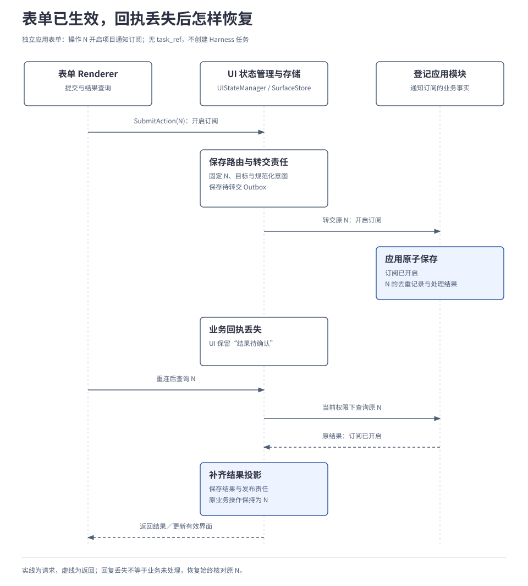

# 第 08 章 · 交互实现细则与验证

本页补充[第 08 章正文](../main/02-subsystems/05-interaction.md)的完整恢复、控制和扩展规则，供接入与实现时核对。这里的约束与正文共同适用；完整字段和接口仍在已有附录维护。

<a id="updates"></a>
## A. 更新、任务版本与在途工作

| 情况 | 规则 |
| --- | --- |
| 正式接纳输入、运行事实或控制变更 | 内核推进任务版本 `state_version`，随任务记录保存在运行存储 `RunStore`。任务仍显示“运行中”，不表示要求没有变化。 |
| 本地草稿、普通界面刷新 | 不直接推进任务版本；若手机交付是任务完成条件，正式纳入相应呈现事实仍按任务规则提交。 |
| 已接纳更新，旧提案返回 | 旧版本提案不能继续使用；按新要求重新组装上下文并安排决策。 |
| 新更新的预期版本不匹配 | 返回冲突；应用读到新状态后判断是否形成新更新。同次更新重试查询原结果，不能重复修改或误报新冲突。 |
| 尚未发出且已不适用的工作 | 停止派发。 |
| 动作已经发出 | 按能力取消或核对实际效果；需要改变参数时创建新操作，保留原操作含义。 |
| 生成正在进行 | 可尝试中止，已发生用量仍须结算。 |
| 更新后仍适用的已准入工作 | 可以继续；并非每次版本变化都要重调大脑。 |
| 更新要求 | 不增加权限或预算，不重开终态任务。 |

完整版本语义见[2.1 任务运行内核](../main/02-subsystems/01-runtime-kernel.md#2-大脑返回提案内核决定能否接纳)，查询和更新接口见[附录 02](02-api-and-message-catalog.md#task-service)。

“仍适用”的默认实现采用先冻结、再由新提案显式复核；冻结、派发准备与 KEEP／DROP 的精确竞争规则在[内核详细设计](../design/01-runtime-kernel.md#updates)维护。这里不再另定义字段级自动适用性判定。

<a id="handoff-recovery"></a>
## B. 动作路由、提交未知与恢复边界

| 核对对象或异常 | 处理要求 |
| --- | --- |
| 同一操作标识对应不同输入 | 核对原输入摘要并拒绝不同输入；不能重新解释成另一个请求。 |
| 两个处理者并发创建同一路由 | 由存储唯一键裁决，保持原目标与原含义。 |
| 界面存储自身提交结果不明 | 先核对原存储提交。 |
| 目标业务是否处理成功不明 | 查询原业务操作；界面副本落后不能证明业务未处理。 |
| 界面重启 | 从持久记录扫描待转交、待核对和待发布工作；不依赖已经丢失的内存订阅。 |
| 原查询仍不能确定结果 | 保留待核对；需要补投时使用原操作，由目标模块按原身份去重。 |
| 等待项已被原回答消费 | 原操作查询仍取得原结果；只有新的回答检查能否再次接纳。 |
| 原记录超过保留窗口且无法核实 | 明确报告回执过期等边界，不把旧操作重新当成首次请求。 |
| 窗口关闭或事件映射升级 | 沿原路由核对；取得结果后更新仍有效界面或供用户查询，不重开旧窗口。 |
| 查询、披露及恢复 | 持续检查当前认证端点、用户作用域和权限；结果受当前授权、删除及用途限制约束。 |

三处提交分别负责：界面提交动作路由与转交待办；目标模块提交业务事实；界面再提交结果投影与发布责任。对应存储方法见[附录 02](02-api-and-message-catalog.md#42-store-方法不能被统一改名)。

<a id="independent-form"></a>
## C. 独立应用表单的恢复示例

用户把“项目通知订阅”从关闭改为开启，接入应用保存设置并据此改变通知投递行为。这个例子不创建 Harness 任务，也没有正式等待项。前提是表单和处理模块已登记、用户有修改权限，应用能按原操作去重并查询结果。

图中的 N 是开启订阅这次操作。应用已保存“开启”，业务回执却丢失；界面恢复后查询原 N，取得结果再补齐显示，不需要任务引用或等待项标识。



表单已关闭或映射已升级时，仍按细则 B 沿原路由处理。应用保存业务事实，界面保存交接与显示。“转交责任已保存”“业务已处理”“端侧已显示”分别取得证据，前一步回执不代替后一步结果。

<a id="control"></a>
## D. 控制来源、传播与设备接管

| 条件或对象 | 规则 |
| --- | --- |
| 暂停作用范围 | `SELF` 只作用于本任务；`SUBTREE` 覆盖受辖子任务树，默认采用后者。 |
| 恢复暂停 | 以新操作提交，引用原暂停操作并沿用原范围；父任务解除自身来源不清除子任务用户或其他祖先的暂停。 |
| 新控制请求与原重试 | 新请求检查权限与预期任务版本；原操作重试返回原受理结果。 |
| 每个暂停来源的控制修订 | 记录该来源变更先后，与任务版本分别管理。新“解除 P”先到时保存解除记录，后到的旧“暂停 P”不能覆盖它。 |
| 解除记录保留 | 在控制恢复窗口内保留，清理后仍拒绝过期接纳。 |
| 向子任务传播 | 持久保存目标明确的子操作，重复投递沿用同一子操作标识。 |
| 暂停受理 | 一起保存来源、合并控制意图和必要传播工作；任务此时可仍为 `RUNNING`。 |
| 暂停落实 | 在途工作停稳或完成必要处置后，报告已落实并进入相应 `WAITING`。覆盖子树时确认相关后代，且无关键效果未知；离线未确认则待落实。 |
| 资源接管或恢复的交接 | 保留原操作、受信主体、资源范围和预期控制版本；具体停止与处置归执行系统。 |
| 获准恢复自动化 | 重新观察设备，核对任务条件后再继续；恢复资源不清除任务暂停。 |
| 已接纳取消或终态 | 恢复任务不能撤销取消或重开终态；取消与完成交错时按实际结果判定。 |

完整传播过程见[3.3 多 Agent 协作](../main/03-coordination/03-agent-collaboration.md)，跨 API／GUI 的资源范围及在途处置见[2.4 能力与执行](../main/02-subsystems/04-tools-and-devices.md#5-多个任务使用设备用户接管怎样落实)。控制与提交接口见[附录 02](02-api-and-message-catalog.md#task-service)。

<a id="surface-recovery"></a>
## E. 窗口、显示版本与重连

| 恢复内容 | 核对要求 |
| --- | --- |
| 容器与组件定位 | `surface_ref` 包含用户作用域、受认证端点和端内窗口键；组件键定位容器内控件，不能仅用用户或任务编号定位窗口。 |
| 窗口重开 | 使用新的局部键或状态世代，不复用旧显示版本空间；旧窗口消息不能误用到新窗口。 |
| 显示版本 `revision` | 与任务版本分开；补丁指定基版本与目标版本，基版本不匹配先取快照。 |
| 可恢复显示内容 | `SurfaceStore` 保存快照，或保存能在权限及保留期内重建内容的受控来源引用。关键来源不可读、无法重建时明确不可用。 |
| 正式结果和有效等待项 | 必须能够恢复；本地草稿不能覆盖权威状态。 |
| 多端回答 | 同一操作重试查原结果；新操作竞争同一等待项，由任务事务裁决合法首次消费，另一端据结果刷新。一般表单按自身业务版本与更新规则处理。 |

重连按以下顺序推进：

```text
重新认证并检查当前读取／披露权限：
  核对端点与用户作用域，同账号不自动拥有所有窗口权限
取得当前快照与有效等待项：
  过期、撤销或已处理的问题不接受新回答
  本地草稿不覆盖恢复结果
核对本端未决操作：
  沿原操作标识与已保存路由查询
  原等待项已结束，也不改变原操作的查询含义
接续增量更新：
  基版本不匹配、游标过期或状态世代变化：重新取快照
  旧连接消息不能重开窗口或消费新等待项
持续核对版本：
  通过周期核对或可靠版本通告，发现末次补丁丢失
```

消息可各有 `message_id`，正式动作跨重试仍沿用原 `operation_id`，不新增一套 UI 业务操作身份。

### 临时预览与正式结果

| 内容或条件 | 处理边界 |
| --- | --- |
| 参考大脑的默认输出 | 发布受控的事实进度；确认用摘要已完整校验。 |
| 可选答案预览 | 仅在允许逐段披露时发布，标明草稿、失效与正式结果；需要整篇判断披露条件时先缓冲。 |
| 恢复临时流 | 无需重放每个临时 token；已经显示或被复制的内容无法保证撤回。 |
| 草稿进入交互通道 | 不自动获得长期保存或跨端同步许可。 |

<a id="extensions"></a>
## F. 类型登记、兼容与交付保证

| 环节 | 约束 |
| --- | --- |
| 新组件登记 | 声明类型及支持版本、输入字段及校验约束、允许事件、处理模块与所需权限，并说明缺少组件时的等价交互。 |
| 连接协商 | 交换支持的类型、事件与限制，分别检查版本兼容和权限。未知必需组件、事件或主版本明确返回不支持。 |
| 降级呈现 | 已登记的等价表单可以完整展示摘要并收集确认；缺少确认能力则报告不支持并保持等待。仅明确可忽略、不承担关键操作的装饰内容可跳过。 |
| 跨端编码 | 沿用 Protobuf 定义与编码，自定义类型放入预留扩展容器，新增普通组件无需修改顶层消息。 |
| 输入校验 | 按登记的 Schema 检查，传入数据不能触发任意远程 Schema 解析。 |
| 呈现器插件 | 安装并启用后才在端侧运行；收到类型声明不自动下载或执行代码。 |
| 正式输入与关键结果 | 正式输入、授权选择、控制意图、关键业务结果必须可靠保存。 |
| 临时事件 | 悬停、光标移动等只有契约明确允许时才可合并或丢弃。 |
| 大资源与高频流 | 限制载荷、队列和速率，正式输入及取消保留独立预算，通过背压限制发送方，避免被临时流挤占处理机会。 |
| 敏感输入 | 保存、发布和重放持续受当前权限约束。 |

完整字段见[附录 02：UI 消息与自定义类型](02-api-and-message-catalog.md#ui-messages)，插件接入见[2.8 扩展与运行保障](../main/02-subsystems/08-extensions-and-runtime.md)。

<a id="verification"></a>
## G. 验证矩阵

使用多个模拟 UI 端和不同呈现器，观察动作是否改变正确的业务对象，以及重试、断线和多端操作后的显示依据。

| 验证场景 | 要观察的结果 |
| --- | --- |
| 连续聊天 | 新建、补充、回答与控制指向正确对象；多个目标有歧义时先澄清，终态后的新工作另建任务。 |
| 生成期间修改要求 | 正式更新使依据旧状态的提案失效；草稿与普通刷新不推进任务版本。 |
| 查看并确认摘要 | 显示、合法确认、实际保存分别取得证据；呈现失败不会被当成用户确认，旧问题的点击不能确认新内容。 |
| 独立应用表单 | 没有任务也能提交、查询和恢复；业务结果保存在应用模块，关闭窗口不丢失原操作的核对入口。 |
| 转交或回执丢失 | 在路由保存前后、业务接纳后、显示副本更新前注入崩溃或丢回执；恢复原操作，只产生契约允许的一次业务变更。 |
| 多端与多窗口 | 正确定位端点和窗口；分别处理原操作重试、新操作竞答、过期及撤销。 |
| 断线与状态恢复 | 补丁缺口、末次增量丢失、游标过期、旧窗口消息和本地草稿都不会覆盖当前权威状态。 |
| 暂停、取消与接管 | 保留独立暂停来源，乱序消息不复活已解除来源；受理与落实分别报告，未知效果或离线后代不被当成已经停稳。 |
| 呈现器与扩展 | 用对话、表单／卡片和通知动作验证；登记自定义类型及事件，无需修改核心信封或调度逻辑；缺少必需能力时明确降级或拒绝。 |
| 权限与流控 | 越权目标、未登记事件、失效授权和敏感输入限制得到执行；大资源与高频事件不造成无界队列或阻塞取消。 |

以上为设计与验证要求，尚无聊天归属、呈现器互操作或交互恢复的运行证据。等待项、界面容器、动作路由和呈现回报的字段见[附录 01](01-data-model.md#interaction)，版本更新条件见[版本规则](01-data-model.md#identity-version)。

[返回第 08 章](../main/02-subsystems/05-interaction.md)
