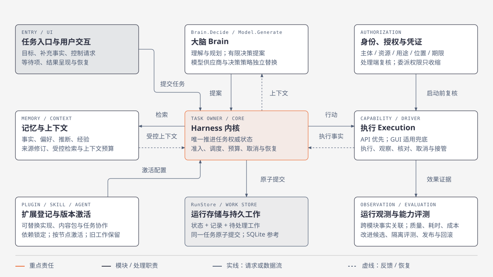

# 系统结构与 Interface 提纲

> 归档资料：本文件保存整合前的设计来源，不再维护现行规则。请从[当前架构文档](../../architecture/README.md)阅读；历史状态与当时的选型表述仅供追溯。

状态：Go 内核、运行存储、跨系统协议、端云恢复、记忆、大脑协作、执行、授权、扩展、观测评测/自进化及能力里程碑均已确认；尚未实现或完成运行验证。

本文件用于给后续技术决策提供共同起点。领域职责以 [项目目标基线](../../harness-project-goals.md) 为依据；设计约束见 [设计输入与硬约束](00-design-constraints.md)。

## 逻辑职责

图示概括内核、大脑、记忆、执行及公共保障的关系；节点表示逻辑职责。图例与补充说明见 [HTML 图集](diagrams/lerna-harness-architecture.html#overview)。

| 逻辑组成 | 责任 | 后续必须明确的技术问题 |
| --- | --- | --- |
| Harness 内核 | 任务生命周期、调度、持久化、授权检查、取消与恢复、执行记录。 | 内核推进权威状态；每个任务由唯一逻辑拥有者推进，移交遵守封存/激活规则；外部更新经校验转为任务事实。 |
| 大脑系统 | 理解目标、规划与决策、消费上下文和结果，输出行动或委派请求。 | 已确定有限决策提案、Brain/Model 独立替换、受控委派、完成依据和预算；内核落实准入及恢复。 |
| 记忆系统 | 长期信息与经验的受控访问、更新和跨任务复用。 | 已确定统一记录、上下文组装、纠正删除和集合单一修改权威；按数据驻留策略进行端侧挖掘与联合检索。 |
| 执行系统 | 工具、设备与外部系统交互，执行端准入，结果与观察反馈。 | 已确定 API 优先、千级能力检索、执行持久化、Driver、资源接管及模拟验证。 |
| 跨系统能力 | 扩展接入、运行观测、能力评测和受控自进化。 | 已确定扩展管理、观测查询、评测/评分与候选发布的职责；业务事实、评分证据和发布资格分别管理。 |

以上表达责任，不预设每一行独立进程。具体 Module 需要在清楚的 Seam 上定义小而完整的 Interface，将实现复杂度保留在模块内部。不同 Adapter 应通过同一 Interface 接受验证。

## 已确定的实现方向

核心采用 Go。模块向调用者暴露完成一类职责所需的接口，SQLite、具体模型供应商和具体传输实现位于接口之后，由启动入口组装。核心行为不直接依赖某个实现的 SQL、连接对象或供应商响应类型。接口需要覆盖事务、错误和恢复语义，不能只把实现方法换成同名接口。

开发期由 SQLite 提供持久化参考实现，配合无需独立服务的本地组件完成运行。生产环境替换存储或其他组件时，需维持共同契约，并定义数据迁移和启动配置；更换实现不自动等于获得分布式运行保障。任务级原子提交及替换验证要求见 [Go 内核与本地持久化](02-runtime-and-state.md)；原生协议接口见 [接口与消息目录](03-contract-message-catalog.md)，替换和支持范围的验证阶段见 [能力里程碑](11-milestones-and-validation.md)。

执行系统主要通过 API 接口调用完成工作，GUI 用于没有可用 API 对接的第三方应用及适用的兜底情况。API 调用同样需要效果核对、授权和恢复保障；GUI 保留完整专项验收，具体执行方案见 [工具执行与多模拟设备](07-tools-and-simulated-devices.md)。

执行系统的参考设备使用多个模拟设备：每个设备拥有可观察的独立状态，动作改变状态，后续观察验证效果。设备可以声明不同能力并注入断连、延迟、回执丢失与接管事件。模拟设备不必与进程或运行节点一一对应；跨节点验证仍需覆盖真正的协议边界及其故障行为。真实手机驱动以后经同一能力契约扩展。

## 评审补充与生产配置

方案优势、替代路线和收益推导见 [架构总述](review.md)，完整逻辑图、对象依赖和五条关键时序见 [实现参考](review-reference.md)。新增 UIStateManager/SurfaceStore 承接独立界面的持久状态与动作转交，任务暂停/恢复按来源合并并保留父子控制边界，契约见 [数据链路补充](12-data-path-and-protocol-semantics.md)。

千万注册、百万日活、十万在线及个人用户隔离由用户确认。生产方案将长连接、任务状态、工作资源池及模型准入解耦，按用户划分云侧归属与存储分片；具体选型、事务边界、故障和容量假设见 [分布式部署与存储](13-distributed-deployment-and-storage.md)。逻辑接口保持，单机参考依赖不变；新增生产方案仍需评审与运行证据。

总述围绕在途工作复用、必要决策、端侧独立运行和用户故障范围四条主张展开，并与持久工作流、云端统一 Owner 和共享资源池比较；接口齐全或可替换不直接证明效果与成本优势。生产自愈按实例/连接、数据库高可用、持久工作恢复和业务效果收敛分责；恢复执行者、HA 参考组合、耐久派发屏障及故障演练见 [分布式故障自愈](14-distributed-recovery-and-operations.md)。这些补充是待验证设计，不将实例重启或主备切换等同于业务已恢复。

## 关键协作路径

1. 任务入口提交目标与用户约束，内核建立可跟踪的任务运行状态。
2. 按授权、用途及允许的处理位置读取任务进展、相关证据与长期记忆，组织带来源修订的任务上下文；需要时在端侧检索并完成受限信息的处理。
3. 大脑基于当前版本输出有限决策提案；内核校验并原子保存准入工作和预算，旧版本提案拒绝并重新决策。
4. 内核先提交动作意图及待处理工作，检查适用授权；执行端落实准入并返回契约所定义的结果。
5. 任务状态与执行记录持久化，新的结果可用于下一步上下文和决策。
6. 运行观测关联任务、调用、授权与结果；能力评测提供契约和实际效果的证据。
7. 自进化提出候选改进并使用评测依据，按已确认权限发布、监测或回滚。

任务级原子提交与默认进程内调用已确定；进程间 gRPC、端云 WebSocket 及消息语义见 [协议方案](03-contracts-and-protocols.md)。跨节点恢复和所有权见 [端云恢复方案](04-edge-cloud-and-recovery.md)。

## 需要定义的 Interface

| Interface 领域 | 调用者必须知道什么 | 必须由设计说明的失败行为 |
| --- | --- | --- |
| 任务与协作 | 目标、输入、状态、行动和委派结果、取消与恢复的含义。 | 超时、重复请求、断连、进程重启、结果不明和取消后的行为。 |
| 能力调用 | 能力声明、输入输出、授权范围及效果确认方式。 | 不支持的能力、调用失败、未知效果和无法核对。 |
| 上下文与记忆 | 工作信息与长期记忆的区别、来源、适用范围、访问与更新权限。 | 信息缺失或冲突、权限不足、纠正删除与同步未完成。 |
| 端云连接 | 节点身份、能力声明、连接状态及消息关联方式。 | 重连、重复或延迟消息，以及连接状态与任务状态不一致。 |
| 扩展管理 | 清单、精确锁定、验证、激活和节点应用状态；管理、运行器、存储分别提供接口。 | 依赖冲突、运行限制不足、部分激活、停用与在途恢复、回滚不兼容。 |
| 观测与评测 | 运行记录的关联、测试集与基线、证据结果和测量条件。 | 记录缺失、评测失败、证据不足及不具可比性的结果。 |
| 改进发布 | 改进对象、版本、评测依据、可生效权限及回滚目标。 | 评测未通过、权限不足、效果退化和恢复旧版本。 |

外部标准可能覆盖其中部分领域，具体映射依据 [核实现行协议与 Skill 规范的适配边界](../../research/harness-protocol-contracts.md) 和 [定义内部契约与外部协议映射](03-contracts-and-protocols.md)。表中的领域数量不等同于要新建的协议数量。

## 首批设计取舍

- [确定 Go 内核模块与本地持久化 Interface](02-runtime-and-state.md) 已确定内核与参考实现的最小依赖、原子提交及复用范围。
- [确定端云任务所有权与恢复语义](04-edge-cloud-and-recovery.md) 决定端云任务所有权和恢复语义。
- [确定上下文、记忆与同步的数据模型](05-memory-and-context.md) 已确定各类数据生命周期，以及端云驻留、联合检索与端侧挖掘，详见 [记忆方案](05-memory-and-context.md)。
- [确定大脑循环与多 Agent 协作方式](06-brain-and-agent-collaboration.md) 已确定大脑与模型 Interface、提案恢复、持续交互、协作收尾和预算，详见 [大脑方案](06-brain-and-agent-collaboration.md)。
- [确定身份、授权与凭证的执行位置](08-authorization-and-user-control.md) 已确定授权与凭证在各 Interface 上的实际执行位置，以及认证、委派、撤销和离线恢复，详见 [授权分册](08-authorization-and-user-control.md)。

SQLite 参考存储、任务级原子提交、调度职责和远程协议映射已确定；执行方案现已覆盖目录检索、API 调用恢复、GUI 兜底、资源控制及模拟验证。

- [确定多模拟设备与工具执行的验证方案](07-tools-and-simulated-devices.md) 已确定 API 优先执行、千级调用目标及验证边界，详见 [执行接口与故障验证](07-execution-contracts-and-validation.md)。

- [确定插件、Skill 与外部 Agent 的接入生命周期](09-extension-ecosystem.md) 已确定统一登记、内容与执行分离、运行器/SDK 基线及逐节点激活恢复，详见 [扩展接口与生命周期](09-extension-contracts-and-activation.md)。

- [确定观测评测与自进化的发布闭环](10-observation-evaluation-and-evolution.md) 已确定 Observation、Evaluation、Evaluator、Evolution 的职责与恢复，千级基准、预算、统计比较及分阶段发布规则见 [评测接口与发布判定](10-evaluation-contracts-and-release-gates.md)。

- [确定能力里程碑与实施依赖](11-milestones-and-validation.md) 已确定四阶段、专项质量与预算、第二持久后端及迁移，实施入口见 [专项验收与工作包](11-specialized-validation-and-handoff.md)。
