# 架构实现参考：组件、契约与故障矩阵

> 归档资料：本文件保存整合前的设计来源，不再维护现行规则。请从[当前架构文档](../../architecture/README.md)阅读；历史状态与当时的选型表述仅供追溯。

本页承接 [架构总述](review.md) 的实现依据，按职责、数据、协议、流程、算法、生产部署及验收索引查阅。[独立 HTML 参考页](diagrams/lerna-harness-reference.html) 包含全文和 21 张图。方案适用场景、四条优势主张、对照路线与收益推导以总述为入口，具体接口语义以各源分册为准。

状态：既有 Go 内核、单机参考配置和运行契约为设计基线；智能参考策略、生产 HA 组合及恢复编排是待实现验证的建议。图示完整不代表质量、容量或故障验收已经通过。

阅读目录：[组件](#architecture) · [数据](#data) · [协议](#protocol) · [流程](#flows) · [算法](#algorithms) · [生产部署](#deployment) · [取舍与验收](#decisions)。

## 1. 执行机制与 L0 / L1 / L2 逻辑架构

这里的 L0/L1/L2 是**架构观察粒度**，不同于项目已定义的**能力成熟度 L1–L4**。三层分别回答“与谁交互”“由哪些逻辑职责完成”“职责通过什么模块和契约落实”。它们不规定进程、服务数量或端云部署位置。

### 1.0 A00：先看执行机制与持久化边界

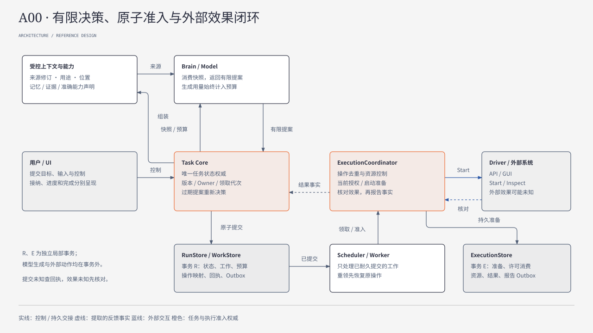

主路径为：入口接纳 → 版本化任务事实 → 受控上下文与有限提案 → Core 准入 → 持久工作 → 执行端准备 → 外部动作与核对 → 新事实进入下一轮。图中箭头表达这个过程的数据/控制交接；A03 的箭头另按接口依赖解读。

**运行事务 R** 由 RunStore 保存任务状态、操作映射、工作、预算和必要 Outbox；**执行事务 E** 由 ExecutionStore 保存操作去重、资源/许可消费、启动准备和结果交接。R 与 E 通过原操作身份持久交接，不存在跨端大事务。模型生成、外部动作和长期记忆修改都在 R 之外。

| 机制 | 在哪里落实 | 防止的问题与代价 |
| --- | --- | --- |
| 状态版本 `state_version` | 生成基线与 Core 原子准入 | 新输入/事实到来后旧提案不能覆盖；冲突需重新组装和决策，增加用量与延迟。 |
| 任务世代 `owner_epoch` | 任务权威提交和移交 | 旧拥有者不能继续推进；失联不自动赋予另一端拥有权。 |
| Worker 领取代次 | 工作领取、续租及完成提交 | 迟到 Worker 不能覆盖新领取者；租约到期仍不证明外部调用停止。 |
| 稳定 `operation_id` | 各操作接纳权威及执行端 | 重复交付恢复原操作；更换 ID 不能消除未知副作用。 |
| 本地原子组与 Outbox | 业务 Store | 状态和交接责任一起保存；派发可重复，接收方须幂等。 |
| 启动准备与效果核对 | ExecutionCoordinator / Driver | 外部成功而回执丢失时仍有恢复依据；不可核对的效果保持未知。 |

当前状态与追加记录共同持久化，是已选恢复模型；日志不承担唯一权威，不要求完整事件重放重建所有任务。生产 Store 还必须保证耐久确认先于派发，不能把同步提交等待期间的本地可见性当作外部执行许可，见 [耐久屏障](14-distributed-recovery-and-operations.md#42-本地可见与可对外执行之间的耐久屏障)。

### 1.1 L0：系统上下文

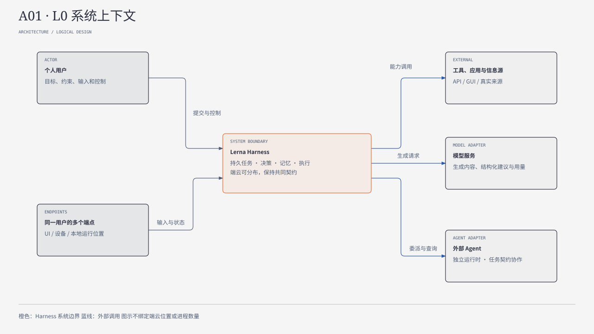

Harness 对用户提供任务、进度、结果与控制入口，通过受授权的工具取得信息或改变外部状态，通过模型 Adapter 请求生成，通过任务 Adapter 与外部 Agent 协作。同一用户可有多个端点；图中的端点代表 UI 和设备接入位置，部分 Harness 模块也可以驻留其上。

**关键边界：**模型输出是建议，外部回执是待核对事实。认证连接只建立对端身份，不代替业务授权；引用可见不等于正文可读取。端云是部署维度，不能把“记忆在端、大脑在云、执行在手机”固化为逻辑结构。

依据：[系统结构](01-system-architecture.md)、[项目目标 A1–A4](../../harness-project-goals.md)。

### 1.2 L1：三系统、内核与公共职责

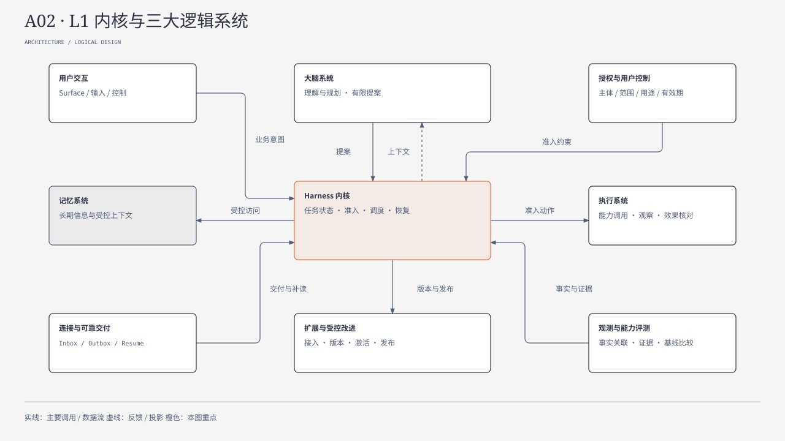

内核协调大脑、记忆和执行，并将准入工作与预算持久化。用户交互负责界面快照和动作转交；授权负责可落实的判定；连接负责消息交付；扩展与观测评测承接实现接入、证据及受控发布。

**阅读约定：**连线只表示主要调用或反馈方向，图下说明补充跨系统约束。公共职责并非可省略的附属项，也不要求分别部署为微服务。C1–C9 是能力目录，不能直接转换为九个进程。

依据：[逻辑职责](01-system-architecture.md)、[模块职责](02-runtime-and-state.md)。

### 1.3 L2：组件职责与依赖总图

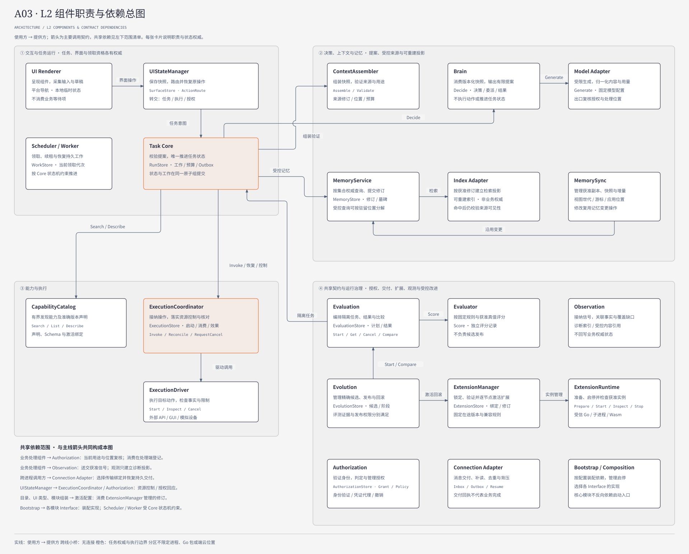

[打开可缩放的 L2 SVG 总图](diagrams/review-a03-components.svg)。图中 22 个组件按四个职责分区组织；每个组件只出现一次，并注明职责、关键契约或状态权威。专有 Store 合入其所属组件说明，仍通过独立接口访问。

**依赖口径：**本图所有箭头统一为“使用方 → 提供方”的调用／契约依赖。Core 调用 ContextAssembler.Assemble/Validate 与 Brain.Decide，Brain 返回的提案不再画成反向依赖；MemorySync 的箭头表示修改复用 MemoryService，未将同步数据流误作调用方向。共享授权、观测、连接、激活配置及 UI 转交目标在图内左下列出作用范围。图中分区不限定进程、Go 包或端云位置，也不宣称已经确定全部内部方法调用关系。

**① 交互与任务运行。**UI Renderer 负责呈现、本地草稿与输入采集；12 分册评审补充中的 UIStateManager/SurfaceStore 保存界面快照和 ActionRoute，将原操作转交给任务、执行或授权处理端。正式业务等待项仍由原业务模块消费。Task Core 是唯一任务状态权威，RunStore 原子提交状态、操作映射、工作、预算和必要 Outbox；Scheduler/Worker 通过 WorkStore 领取、续租及恢复工作，并受 Core 状态机与当前领取资格约束。RunStore 与 WorkStore 属于同一运行持久化单元，不产生第二份任务终态。

**② 决策、上下文与记忆。**Core 协调候选检索和上下文准备，再调用 Brain.Decide；ContextAssembler 组装、验证来源修订、用途、位置和预算，Brain 输出有限提案，Model Adapter 提供受限生成与用量。MemoryService 通过集合单一修改权威提交 MemoryStore，Index Adapter 建立可重建索引，MemorySync 管理获准视图、快照和增量。长期记忆、运行记录与上下文分别管理；端侧查询可仅返回获准摘要或引用，离线、未授权与零命中必须区分。纠正、删除使相关来源依赖失效，传播和清理状态另行报告。

**③ 能力与执行。**CapabilityCatalog 是分册定义的内部目录接口，对外绑定为 CapabilityService；Search/List/Describe 支持先找候选、再读取准确版本的声明和 Schema。ExecutionCoordinator 管理稳定操作准入、资源控制、启动登记及效果核对，ExecutionStore 保存启动、许可消费、资源状态、结果及报告 Outbox；ExecutionDriver 提供 Start/Inspect/Cancel 并声明实际能力限制。开始外部动作前先保存“已准备、可能发出”的恢复事实。GUI 默认按设备串行控制，API 按业务资源和版本前提控制并发；授权拒绝或 API 超时都不能成为改走 GUI 重做的依据。

**④ 共享契约与运行治理。**Authorization 管理身份、判定、授权及凭证使用，实际处理端仍复核并按自身原子边界登记消费。Connection Adapter 交付、补读和恢复消息；交付回执不判定业务完成。Observation 接纳受控信号并报告覆盖缺口，不回写业务权威事实。Evaluation 编排隔离任务并比较结果，Evaluator 独立评分；Evolution 基于精确候选、证据及发布权限调用评测和扩展管理。ExtensionManager 管理锁定、验证和逐节点激活，ExtensionRuntime 管理获准实例；Bootstrap 按配置装配接口实现、管理启停，核心模块不反向依赖启动入口。

**跨组件边界：**模型调用、工具动作、长期记忆变更和子任务接纳均在 RunStore 事务外。提交未知先 LookupCommit，确认提交后才调度原工作。已准入工作保持固定版本，激活配置供适用的新工作选用。运行结束、评测通过、发布获准和节点激活是四种事实；插件与内核代码发布仍需要维护者对精确产物确认。

依据：[Go 内核与组装](02-runtime-and-state.md)、[大脑接口](06-brain-and-agent-collaboration.md)、[决策准入](06-decision-admission-and-collaboration.md)、[记忆模型](05-memory-data-and-lifecycle.md)、[端云记忆](05-edge-cloud-memory.md)、[执行契约](07-execution-contracts-and-validation.md)、[授权](08-authorization-lifecycle-and-interfaces.md)、[扩展](09-extension-contracts-and-activation.md)、[观测与改进](10-observation-evaluation-and-evolution.md)、[评测发布](10-evaluation-contracts-and-release-gates.md)、[UI 状态权威](12-data-path-and-protocol-semantics.md)。

### 1.4 职责、默认机制与依赖约束

| 组件组 | 决定什么 / 输出什么 | 默认机制及必要依赖 | 禁止越过的边界 |
| --- | --- | --- | --- |
| Task Core / Scheduler / Worker | 接纳与推进任务、持久调度、恢复 | Go 状态机；RunStore/WorkStore；有限提案、版本与领取检查 | 调度策略不能修改终态定义；模型调用不持有数据库长事务。 |
| Brain / Model Adapter | 计划、行动/委派/等待/结果提案；生成与用量 | 观察—有限提案—反馈循环；ContextAssembler、准确能力声明、模型能力配置 | 不私自执行工具、写记忆、授予权限或绕开预算。 |
| ContextAssembler / Memory / Index / Sync | 有来源和用途的上下文、记忆修订及受控副本 | 文本/元数据检索、预算组装、来源依赖、集合单一修改权威 | 摘要/索引不替代任务事实；不因端侧不可达上传私有原文。 |
| Catalog / Coordinator / Driver | 发现能力、启动操作、核对效果 | 分阶段检索/加载 Schema；ExecutionStore；资源控制与 Driver 能力声明 | Schema 合法不证明业务参数正确；API 与 GUI 不能互相绕过权限或未知效果。 |
| UI Renderer / UIStateManager | 呈现、采集输入、持久路由与界面恢复 | SurfaceStore、ActionRoute、原 Task/Execution/Authorization 入口 | 界面确认不等于业务接纳，渲染状态不代表授权同意。 |
| Authorization / Connection | 身份和受限授权；可靠交接与补读 | 策略/凭证接口、处理端复核、Inbox/Outbox、gRPC/WebSocket | 连接在线、ACK、拥有凭证分别不代表获准行动或业务完成。 |
| ExtensionManager / Runtime / Bootstrap | 固定实现、装配、运行与激活 | 精确清单/摘要、兼容检查、受信 Go 或受限执行环境 | 安装不等于激活；新版本不改写已准入工作的绑定。 |
| Observation / Evaluation / Evaluator / Evolution | 诊断、隔离评测、独立评分、受控发布 | 来源记录、不可变计划、精确候选、发布权限 | 观测不回写事实，评测通过不等于生产已生效。 |

“智能”主要位于 Brain 的决策策略、检索/组装策略及适用的感知/验证能力；Core、授权和恢复的关键判断由可测试规则落实。生产追加的 CellRouter、Gateway、HA Manager 和 RecoveryController 负责位置、容量及恢复编排，不再建立一套独立业务状态权威，详见 [生产恢复组件](14-distributed-recovery-and-operations.md#2-生产恢复组件与依赖)。

依赖沿 Interface 注入：调用者不接触其他模块的 SQL、供应商对象、设备连接或任意凭证。替换实现需要同时满足输入输出、失败、授权、耐久性和恢复测试；只实现同名方法不足以证明可替换。

## 2. 关键数据对象与关系

以下是逻辑对象模型，不要求一对象一张表。个人业务对象处于受认证身份绑定的 namespace 中；跨作用域引用必须显式授权。图中 `0..N` 表示可选多项，`1` 表示对应关系中的单项；基数按图示关联理解，不把消息或内部提交都当作业务对象。

### 2.1 任务、操作与交付记录

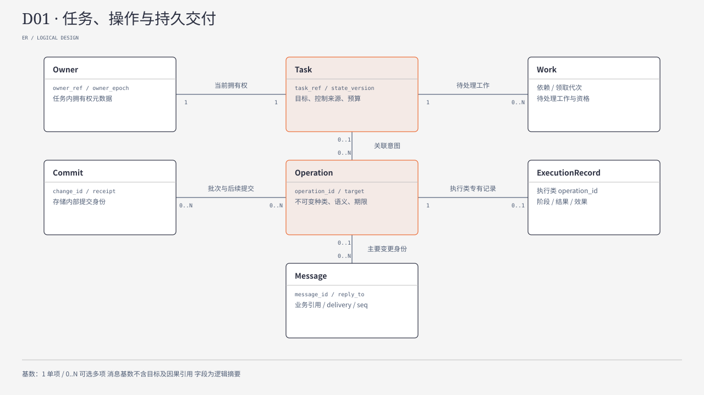

Task 可以产生多个 Operation；独立能力调用、记忆变更和 UI 自有操作也可以没有 Task。执行类 Operation 使用同一 operation_id 定位 ExecutionRecord。一次操作可有多条 Message、经历多个 Commit；有限批次的一次 Commit 也可接纳多个操作，因此操作与提交不是一一对应。

图中 Operation—Message 的基数只统计消息携带的主要变更身份；查询目标、取消目标和因果引用不计入这一基数，一条消息可以引用其他操作。

| 身份 / 字段 | 表达什么 | 不能代替什么 |
| --- | --- | --- |
| task_ref、state_version | 任务及其权威状态版本。 | 消息身份、拥有者世代、工作领取代次。 |
| owner_ref、owner_epoch | 当前逻辑拥有者与拥有权世代。 | 连接在线状态；失联不能自动抢占。 |
| operation_id | 固定种类、目标、语义摘要及期限的一次逻辑变更。 | 消息、一次网络尝试或任意新参数。 |
| message_id、reply_to | 一条应用消息及其关联回复。 | 操作去重、任务完成或执行效果。 |
| change_id | 存储内部的一次原子变更及回执。 | 对外业务操作身份；不进入原生公共信封。 |
| stream_id、seq | 逻辑流及其单向序号、顺序和补读位置。 | task_ref、operation_id 或全局业务顺序。 |

接纳窗口固定 namespace、允许种类、唯一接纳权威和有效范围。相同 operation_id 携带不同语义返回 `IDENTITY_CONFLICT`；路由到错误权威不能另行首次接纳。已经取消独立 `invocation_id` 和 `request_id`，总述不重新引入它们。

依据：[标识模型](03-identifier-model.md)、[操作权威与原子组](12-data-path-and-protocol-semantics.md)。

### 2.2 记忆、证据与上下文依赖

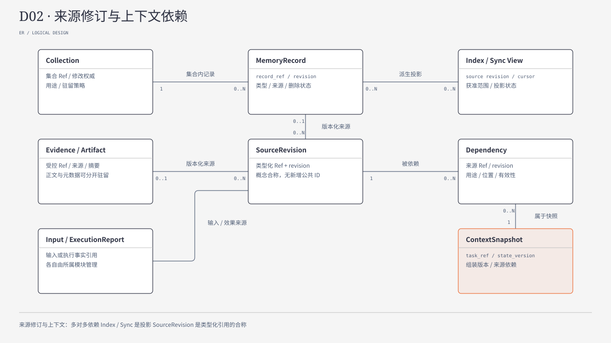

MemoryRecord 属于 Collection，保存类型、来源、时间、置信度、用途与驻留策略。ContextSnapshot 关联任务版本及组装版本，并依赖多个来源修订；同一来源修订可以服务多个上下文。来源包括输入、记忆、证据及执行结果；图中 SourceRevision 是这些类型化引用的概念合称，不新增统一来源服务或公共 ID。

| 对象 | 关键数据 | 写入与生命周期 |
| --- | --- | --- |
| MemoryRecord / Collection | 集合内 Ref、revision、类型、内容引用、来源、策略、删除状态。 | 集合单一修改权威；纠正、墓碑和变更日志一并提交。 |
| ContextSnapshot / Dependency | task_ref、任务版本、组装版本、来源 Ref/revision、用途、处理/披露位置、有效性。 | ContextAssembler 组装和验证；失效后阻止新使用或获准重建。 |
| Evidence / Artifact | 受控 Ref、摘要、来源、产生时间、版本、数据策略。 | 所属采集或执行模块管理元数据，正文按驻留策略存放。 |
| Index / Sync view | 来源修订、获准范围、同步视图及游标。 | 可重建的查询/同步投影；滞后、缺口和权限变化单独表达。 |

删除原文不等于所有副本和派生数据已经清理。普通检索排除已删除或旧修订，模型前、模型后及发布/执行前复核相关来源；跨节点仅能提供契约规定的新鲜度保证，不能声称全球原子失效。

依据：[数据契约](05-memory-data-and-lifecycle.md)、[驻留与联合检索](05-edge-cloud-memory.md)。

### 2.3 UI 与治理对象

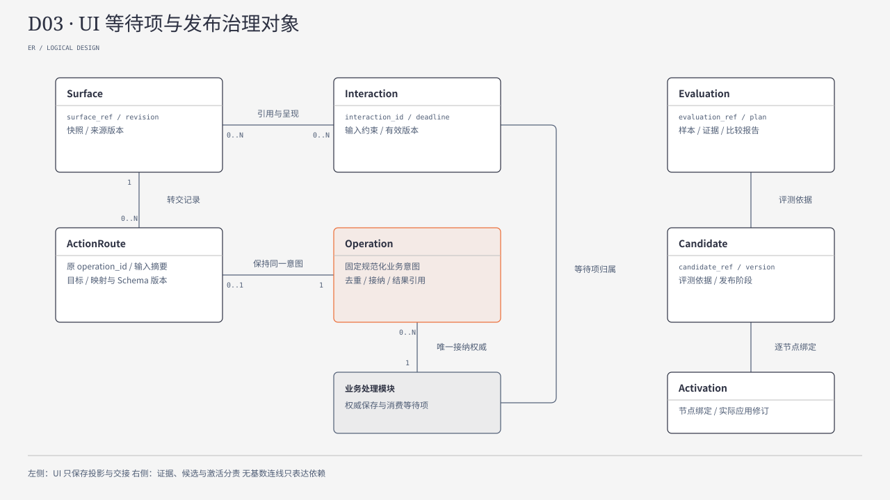

Surface 保存界面修订和来源引用；多个 Surface 可以呈现同一 Interaction。等待项由提出它的 Task、Authorization 或登记应用模块保存和消费。ActionRoute 固定原输入摘要、处理目标、映射/Schema 版本和规范化意图，转交同一 Operation；界面更新滞后可以恢复，不重复业务操作。

Evaluation 保存不可变计划和证据；Candidate 引用精确产物及适用评测依据；Activation 表达节点绑定和应用修订。评测绑定不可变计划及被测版本；候选发布仅引用与其精确产物和比较条件匹配的有效报告，旧报告不得授权另一份资产。

Grant/Policy 的主体、资源、动作、范围、修订、期限、父授权及撤销由 AuthorizationStore 管理；执行端单次许可消费与原操作启动在 ExecutionStore 中原子登记，其他处理模块按各自契约登记消费。资源控制也由 ExecutionStore 管理。这些权限对象在 A03 总图及算法 K04 中展开。

依据：[UI 契约](03-ui-interaction-contracts.md)、[数据链路](12-data-path-and-protocol-semantics.md)、[评测与发布](10-evaluation-contracts-and-release-gates.md)。

### 2.4 原子组与跨组交接

| 原子组 | 同一局部事务内 | 事务之外如何恢复 |
| --- | --- | --- |
| RunStore：单任务 | 资格和版本前提、状态、操作映射、工作、预算、回执、必要 Outbox。 | Commit 未知查 LookupCommit；工具和子任务接纳未知查原 Operation。 |
| ExecutionStore：操作与相关资源控制 | 操作去重、输入/资格、启动准备、消费记录、局部状态及 Outbox。 | 外部动作在事务外；Inspect/Reconcile 核对效果。 |
| MemoryStore：集合变更 | 权限/修订前提、记录或墓碑、回执、变更日志及失效通知。 | 索引、副本和派生清理分别推进。 |
| AuthorizationStore | 策略/授权修订、回执；批准时包括等待项消费与签发结果。 | 通知送达、远端应用和已发生动作分别报告。 |
| SurfaceStore：单界面 | 预期 revision、来源版本、快照或可重建引用、ActionRoute、回执及 Outbox。 | 原业务模块接纳后再更新投影；崩溃查询原操作补齐。 |
| Evaluation / Evolution / Extension | 各自对象版本、证据引用、阶段或本地绑定、回执及后续工作。 | 隔离任务、发布交接、逐节点激活各自查询和核对。 |

即使这些模块共用 SQLite 文件，也不扩大对外承诺的事务范围。生产拆分时，一个原子组必须完整落在一个事务分区；消息队列不成为任务、额度、授权或执行事实的唯一存储。

依据：[原子提交组](12-data-path-and-protocol-semantics.md)。

## 3. 协议框架、关键字段与扩展范式

### 3.0 交互原则与五种范式

协议按业务语义划分，传输选择不会改变接纳和效果的含义。同一逻辑变更保持原 operation_id；message_id 只标识一次应用消息。所有数据按受信身份绑定 namespace，不能靠客户端自报作用域路由。

| 范式 | 适用交互 | 成功的含义 | 超时、重复与恢复 |
| --- | --- | --- | --- |
| 命令 → 接纳 → 查询 | Submit、Invoke、记忆修改、批准/取消、激活 | 处理端持久接纳该操作；完成及实际效果另外表达 | 同身份同语义返回原事实；未知先查原操作，不盲目创建新命令。 |
| 查询 → 带版本结果 | Get、Describe、LookupCommit/Operation、状态核对 | 返回当前获准可见的事实、版本和覆盖范围 | 查询可重试但须限额；无记录、不可达、回执过期和无权查询分别表达。 |
| 事实事件 → 投影 | 执行结果、记忆变更、界面和观测更新 | 来源模块提交的事实供消费方核验和派生 | 允许重复，按聚合版本去重；缺口补读，不按到达时间覆盖新事实。 |
| 交互流 → 快照/补读 | 用户输入、进展、等待项、UI 增量 | 可靠、可恢复、临时消息分别承担约定责任 | 分离序号/额度，背压有界；游标过期转快照与原操作核对。 |
| 委派 → 子任务 → 结果验收 | 一段自主决策与恢复责任交给另一 Agent | 子端独立接纳、拥有和推进；父端验收结果 | 先预留预算；接纳未知不重复分配，父取消和子停止分别确认。 |

共同原则：预期版本用于防止覆盖；错误同时表达原因和结果确定性；可靠交接使用局部事务与 Inbox/Outbox；长操作以接纳及查询表达；取消是持久控制意图；必需能力/Schema 不兼容时显式拒绝；传输层 ACK、业务 ACCEPTED、动作效果及目标达成是不同事实。

调用方和处理端都有期限与大小上限。连接断开不清除任务，RPC context 取消不证明外部动作停止。权限检查落实在数据使用和动作处理端，Adapter 只能映射外部协议实际提供的能力，不能凭包装补出不存在的取消、幂等或核对保证。

### 3.1 共同语义与传输绑定

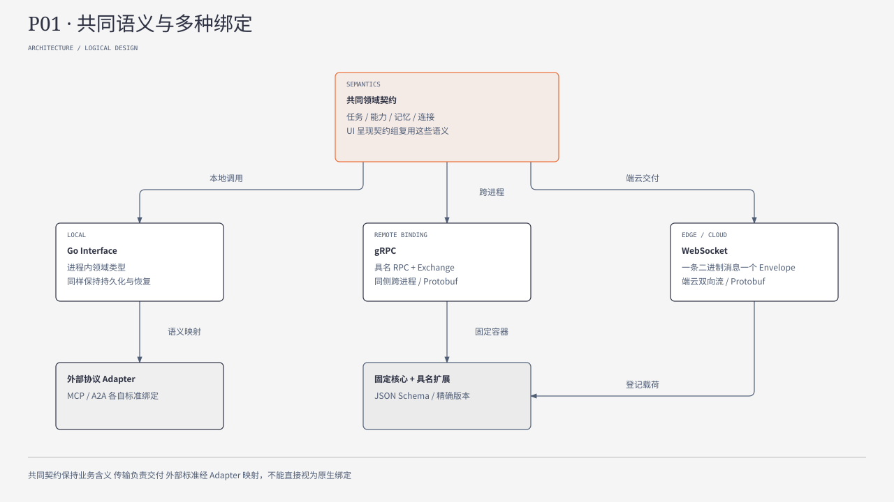

四个基础契约领域是任务协作、能力调用、记忆访问和端云连接；UI 交互呈现契约组复用它们的身份、授权及恢复机制。Authorization、Extension、Evaluation 等管理入口归任务协作领域，不按 RPC 服务数量增加逻辑系统或协议领域。

| 调用边界 | 绑定与编码 | 共同要求 |
| --- | --- | --- |
| 进程内 | Go Interface，领域类型。 | 不强迫本地 Interface 接收网络信封；仍需去重、持久化及恢复。 |
| 同一部署侧跨进程 | gRPC：具名 unary RPC 与双向 Exchange。 | 复用固定 Protobuf 消息，统一业务语义；不把所有 RPC 强塞进流。 |
| 端云 | WebSocket 二进制消息，一条消息一个 Envelope。 | 双向交互、流量额度、可靠补读和重新协商；连接恢复与任务恢复分开。 |
| 动态参数与扩展内容 | UTF-8 JSON 字节＋固定 Schema 标识/版本/摘要。 | 固定登记的 JSON Schema 资源集；拒绝重复键，明确整数精度、缺失与 null。 |
| 外部生态 | MCP / A2A 等独立 Adapter，遵守对应标准绑定。 | 映射可证明的能力、权限与恢复限制；原生 gRPC/WebSocket 不等同 MCP/A2A。 |

建立可信连接后，通过固定 bootstrap 的 Hello/Welcome 协商主版本、必需能力、大小与窗口限制，再开放获准业务流。实现支持、协商启用和本次授权是三件事。外部标准的固定版本及 SDK 基线见分册；本文不重新声称它们是当前最新版本。

依据：[协议方案](03-contracts-and-protocols.md)、[消息目录](03-contract-message-catalog.md)。

### 3.2 Envelope 与领域关键字段

| 分组 | 关键字段 | 含义与扩展边界 |
| --- | --- | --- |
| 协议 | protocol_major | 与协商配置一致；不随新 UI 控件增加主版本。 |
| 消息关联 | message_id、reply_to | 消息与回复关联；原消息补发保留 ID，新请求用新消息 ID。 |
| 业务关联 | namespace、operation_id、可选 task_ref | 变更操作携带稳定操作身份；查询目标放载荷，查询本身不伪造变更。 |
| 流与交付 | stream_id、seq、delivery_class | 单向序号；可靠、可合并及临时语义按声明处理，可靠与临时流分开。 |
| 调用上下文 | deadline、authorization_ref、可选 trace_id / causation_ref | 业务期限与 RPC 等待期限分开；诊断引用不参与授权或去重。 |
| 主体 | oneof request / response / event / receipt / flow_control / hello / welcome / resume | 固定核心结构；具名扩展放 request/response/event 内部。 |

`interaction_id` 只进入相关等待项载荷；`connection_id` 属于连接上下文；`change_id` 留在内部存储。原始第三方凭证不放入通用任务、UI 或追踪载荷。

领域载荷还须表达各自前提：任务的 `expected_state_version`，能力和 Schema 的准确版本，记忆的 `revision`、用途和位置，UI 的 `surface_ref / component_key / revision / base_revision`。这些版本约束不同，不能用一个 `seq` 代替。

### 3.3 回执、结果与错误分层

| 层次 | 可确认的事实 | 尚不能确认的事实 |
| --- | --- | --- |
| PERSISTED | 可靠消息及必要 Inbox/去重记录已持久保存。 | 业务已获准、已执行或完成。 |
| ACCEPTED | 业务处理模块已准入并持久提交。 | 已取得资源、外部效果成功或 UI 已呈现。 |
| 执行阶段 | NOT_STARTED / IN_PROGRESS / FINISHED / UNKNOWN。 | 仅 FINISHED 不证明结果成功。 |
| 执行结果 | SUCCESS / FAILURE / UNKNOWN。 | 仅 SUCCESS 不证明效果符合任务目标。 |
| 效果核对 | NOT_APPLICABLE / UNVERIFIED / CONFIRMED / CONTRADICTED。 | 一次动作效果确认不自动结束全部任务。 |
| 任务完成 | 内核依据目标、证据及所辖工作处置判断终态。 | 不自动证明用户已看到、理解或同意。 |

错误包含稳定 code、可披露说明、结果确定性、关联引用和建议恢复动作。`VERSION_CONFLICT` 需要重新读取；`IDENTITY_CONFLICT` 拒绝重解释身份；未授权或缺必需能力不能通过降级绕过；`RECEIPT_EXPIRED` 明确恢复边界，不能把旧操作再次当新操作。建议恢复动作由内核结合事实、授权及预算决定。

依据：[回执、错误与标识](03-contract-message-catalog.md)。

### 3.4 三种扩展与统一生命周期

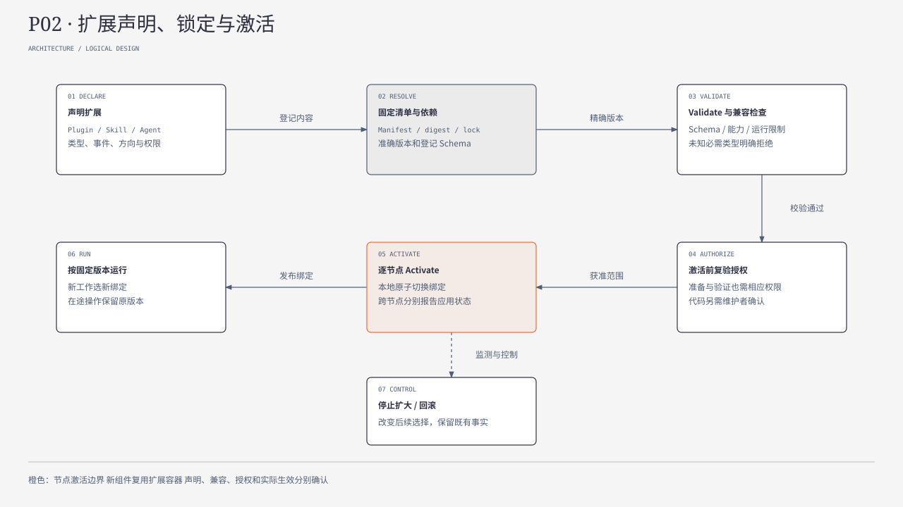

| 扩展层次 | 如何扩展 | 不变的行为 |
| --- | --- | --- |
| 协议内容 | 注册具名类型及版本，以 Schema 约束 payload；声明事件、方向、权限与降级。 | 新组件复用固定扩展容器；未知必需类型拒绝，关键交互不能静默忽略。 |
| 模块实现 | 通过相同 Interface/Adapter 替换存储、模型、工具或驱动。 | 接受共同契约检查；实现私有类型不泄露给核心调用者。 |
| 知识与协作 | Plugin 提供实现，Skill 提供操作知识，Agent 持有目标、上下文与决策循环。 | Skill 不授予执行权，外部 Agent 保持独立运行时。 |

以新增 `org.example.ui.chart` 为例，扩展描述包含 `type_name/type_version`、`schema_ref`、`payload`、`supported_events`、`delivery/persistence`、`required_features/fallback`。声明先绑定 Renderer、处理模块和允许方向；客户端协商支持后才能使用。消息不触发任意远程 Schema 加载或自动安装执行代码。

接入流程固定 Manifest 和资产摘要、准确依赖与能力版本，完成 Validate 后逐节点 Activate。准备与验证亦须具备管理和测试权限，激活前再次复验当前权限及运行条件。单节点绑定原子切换，跨节点报告各自实际状态；已有决策和操作固定旧版本，新工作才选择新绑定。停用先停止新接纳并处置在途工作；回滚改变后续选择，不能抹除已经发生的动作事实。

依据：[扩展生态](09-extension-ecosystem.md)、[清单与激活](09-extension-contracts-and-activation.md)、[UI 扩展规则](03-ui-interaction-contracts.md)。

### 3.5 贯通示例：一次表单回答

下表是**逻辑字段示例**，不是新增 wire Schema。namespace=`u-42`，任务=`t-7`，等待项=`i-3`，界面=`(u-42, phone-1, panel-2)`；其值仅用于说明关联。

| 步骤 | 消息 / 操作关联 | 处理与结果 |
| --- | --- | --- |
| 1. 用户提交 | SubmitAction：message_id=m-101，operation_id=o-9；载荷引用 i-3、surface_ref、输入和预期版本。 | UI 先鉴权并查原 ActionRoute；新操作才检查当前界面、事件和 Schema。 |
| 2. 固定路由 | 保存 o-9、原输入摘要、目标 TaskService.ProvideInput、映射/Schema 版本及规范化意图。 | SurfaceStore 原子保存转交责任；这一步不代表 Task 已受理。 |
| 3. 转交业务 | 远程新请求可用 message_id=m-102，仍为 operation_id=o-9、interaction_id=i-3。 | Task 原子验证版本、消费等待项、保存输入及回执；同一等待项竞答只允许合法首次消费。 |
| 4. 返回受理 | response 使用自己的 message_id，reply_to=m-102，关联 o-9。 | 返回原业务结果；UI 再提交呈现投影。PERSISTED 与 ACCEPTED 分开。 |
| 5. 断连恢复 | GetActionResult 查询目标 o-9；它是查询，不分配另一项变更操作。 | 当前权限检查后沿原路由查询；补齐投影，不按升级后的事件重新解释输入。 |

原消息重发保留 m-101；重新发起查询使用新的消息 ID；同一输入重试保留 o-9。之后若根据回答产生一个新的工具动作，该动作使用新的 operation_id 并关联原任务。

依据：[UI 输入顺序与恢复](12-data-path-and-protocol-semantics.md)、[原生消息目录](03-contract-message-catalog.md)。

## 4. 五条关键业务流程

五条链路沿用 [数据链路分册](12-data-path-and-protocol-semantics.md) 的完整性检查。图中呈现主路径；每图后的故障窗口说明其如何恢复。流程节点是处理步骤，不是新增部署服务。

### 4.1 任务决策与执行

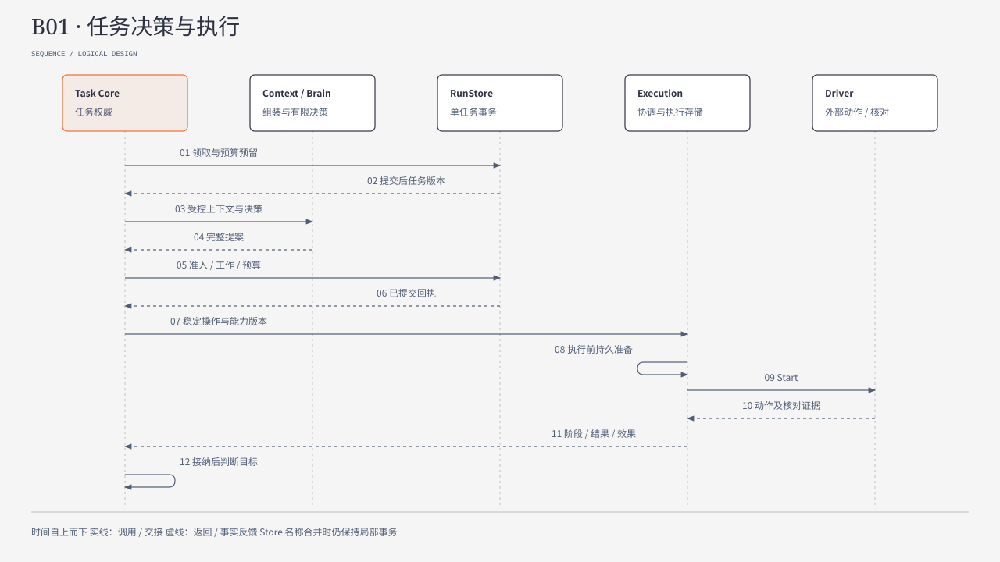

任务接纳后，内核先恢复既有工作并预留本轮生成预算，再取得受控上下文。大脑输出完整提案，经版本、来源、权限与预算校验后准入。调度触发执行端，执行端保存启动事实、调用 Driver 并核对效果，内核接纳结果用于下一轮判断。

**关键故障：**准入提交响应丢失查原 Commit；外部动作回执丢失查原 Operation 并核对实际状态；新输入推进任务版本则拒绝旧提案。没有证据时保留未知，不能直接走“任务完成”。

联网问答沿这条主路径取得实际来源、保存获取时间并形成有依据的回答；GUI 沿观察、动作、再观察、效果核对闭环执行。完整专项验收见 [专项分册](11-specialized-validation-and-handoff.md)。

依据：[决策准入](06-decision-admission-and-collaboration.md)、[执行持久化](07-execution-contracts-and-validation.md)。

### 4.2 端云与多 Agent 协作

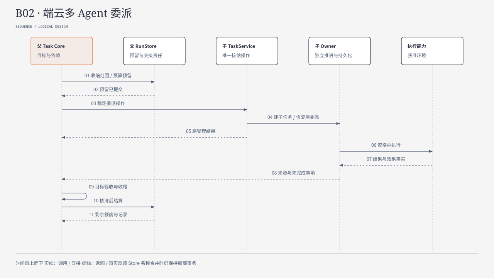

父任务固定子目标、结果 Schema、验收条件、依赖、期限、处理位置及更窄授权，先预留预算再发送稳定委派操作。子任务唯一接纳后由自己的 Owner 推进；父任务验证结果来源、未完成事项和效果，按目标验收并结算。

**关键故障：**子任务接纳未知时保留父预留并查原操作，不能再创建子任务或再分配额度。必要子任务失败阻断依赖工作；父任务收尾前处置受其管理的工作。暂停/取消的受理和远端落实分开报告。

端云断连不改变拥有权。本地能力、数据位置、授权和额度均满足时才能继续，依赖失联节点的步骤等待。协作移交遵循源端封存后目标新世代激活；移交尚未完成时不能双端推进同一任务。细节见 [端云恢复](04-edge-cloud-and-recovery.md) 与 [故障窗口](04-recovery-state-and-failure-matrix.md)。

依据：[协作决策](06-brain-and-agent-collaboration.md)、[依赖与预算](06-decision-admission-and-collaboration.md)。

### 4.3 记忆、上下文与来源生命周期

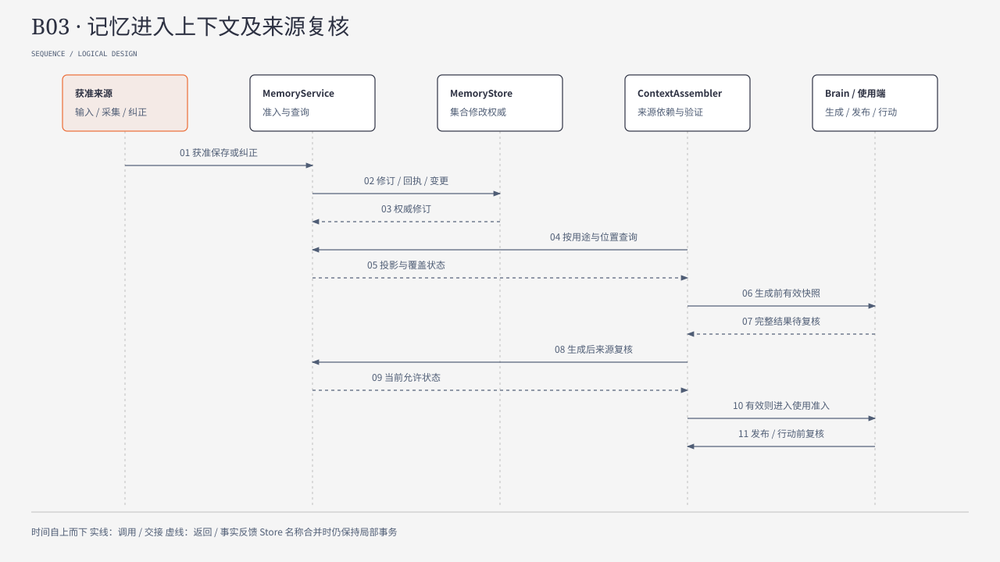

获准来源通过独立的保存准入形成集合修订；查询按允许位置到端侧或云侧执行，返回受控投影及覆盖状态。ContextAssembler 记录来源依赖，模型生成前后以及发布/执行前再次复核。普通任务上下文不会自动晋升为长期记忆。

**关键故障：**模型生成中来源被删除或用途改变时，相关上下文和待发布内容失效；阻止新使用并按权限重建或等待。端侧不可达不能报告为零命中，云端也不能借索引或摘要绕过原文策略。删除权威提交、远端传播和归档清理分别报告。

依据：[生命周期](05-memory-data-and-lifecycle.md)、[联合检索](05-edge-cloud-memory.md)。

### 4.4 UI 输入、暂停与用户控制

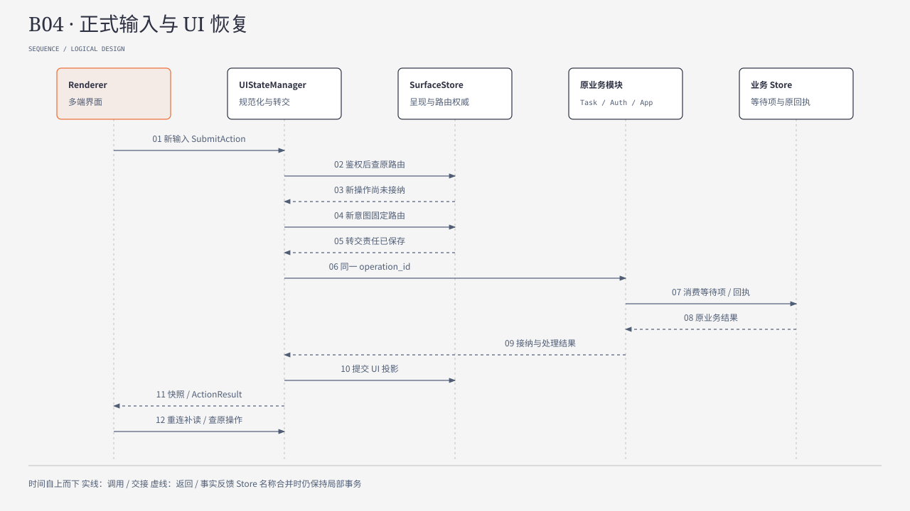

UI 从快照和有效等待项恢复界面。正式输入经登记事件映射为规范化业务意图，保存 ActionRoute 后交给原处理模块消费；业务结果返回后才更新 UI 投影。两端争用等待项由业务模块裁决，Renderer 的 PresentationStatus 不证明用户授权或同意。

**暂停合并规则：**已接纳取消优先；否则只要有任一有效暂停来源就保持 PAUSE；否则为 RUN。RUN 仅说明暂停/取消不再阻止调度，输入、权限、资源及依赖仍须满足。

RequestResume 使用新的 operation_id，并引用要解除的 `target_pause_operation_ref`。父任务恢复只清除对应来源，不清除子任务自己的暂停、其他祖先暂停、资源接管或已接纳取消。默认 SUBTREE 控制仅覆盖受管理委派树，终态不重开。

**关键故障：**业务接纳成功但 UI 未记账，恢复时查原操作补投影；旧界面快照不能复活已关闭等待项。已有操作先查原路由再返回获准结果，新操作才依当前界面及业务版本准入。

依据：[UI 契约](03-ui-interaction-contracts.md)、[控制来源与 UI 恢复](12-data-path-and-protocol-semantics.md)。

### 4.5 评测、改进与发布

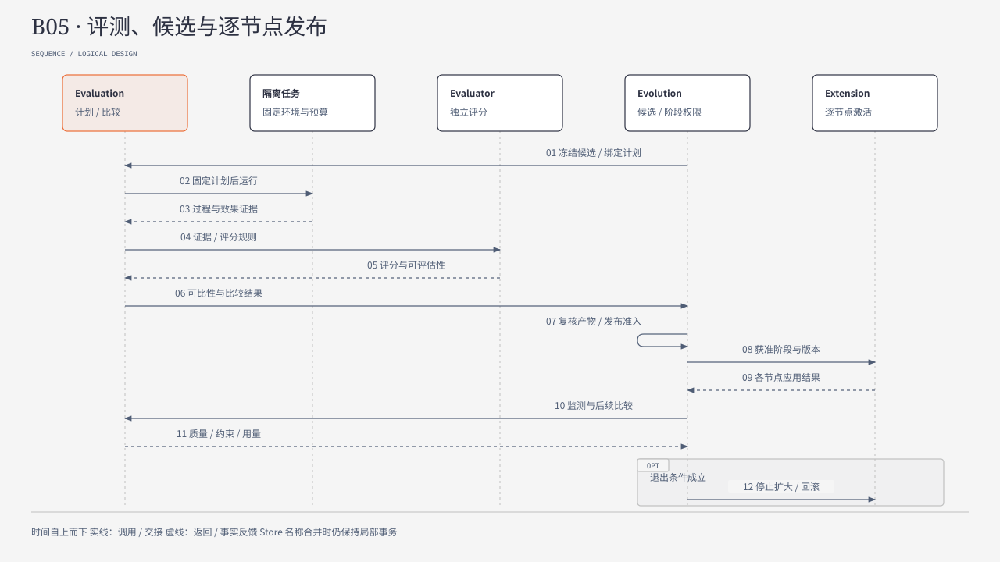

正式评测前冻结精确候选，不可变计划固定样本、环境、预算、实现版本和基线。隔离任务生成证据后，Evaluator 按固定规则评分；Evaluation.Compare 检查两个完整运行的可比性并生成基线比较。候选依据适用证据与权限进入分阶段发布，各节点分别记录激活结果，随后持续监测并在触发退出条件时停止扩大或回滚。

**关键故障：**运行结束但证据不足不能算评测通过；节点失联不能报告全部生效。已固定的决策与调用保持原绑定；试运行按任务或关联工作组固定候选版本，其他尚未固定的后续工作可按兼容配置选择版本。代码变更仍需维护者确认；回滚不撤销已发生的外部效果。常规记忆更新沿记忆授权规则处理，不能把所有记忆写入都强制套入代码发布流程。

依据：[观测与自进化](10-observation-evaluation-and-evolution.md)、[评测与发布门槛](10-evaluation-contracts-and-release-gates.md)。

### 4.6 贯穿案例：动作已经生效，回执丢失后重启

以有状态模拟 API 的一次“更新目标资源”为例，数据库与 API 之间没有共同事务。

| 故障发生点 | 已经可以依赖的事实 | 恢复动作 | 必须保持的结果 |
| --- | --- | --- | --- |
| Core 准入提交前 | 尚无已准入的新工作 | 读取当前任务，在剩余额度内重新决策 | 不执行只存在于模型输出中的动作。 |
| Core 提交回执丢失 | 提交是否成功未知，保留原 change_id | LookupCommit；确认后恢复原操作和工作 | 不新建第二批动作；查到记录仍须满足 Store 耐久确认。 |
| 执行端接纳，尚未调用 API | 原 operation_id 的启动准备已耐久保存 | 查询启动阶段与资格，按 Driver 契约恢复 | 重复 Invoke 不重复消费许可，不跳过资源控制。 |
| API 已更新资源，回执丢失 | 启动准备仍在，真实效果暂不明 | Inspect/Reconcile，读取外部操作关联或可验证状态 | 确认已生效则补结果；无法核对则保持未知，不重做。 |
| 执行结果已保存，Core 未收到 | 执行结果与报告 Outbox 已提交 | 补投同一结果；Core 按原操作/版本接纳 | 结果可重复交付，不重复推进状态或结算预算。 |

Worker 重启后只领取恢复责任。即使新 Worker 已有合法领取代次，旧外部请求仍可能完成；只有目标提供有效幂等保证，或已证明旧请求不会再执行且效果未发生时，才在当前授权、资源与预算下准入重试。这个案例应作为 RunStore、ExecutionStore、Driver 和传输 Adapter 共同的故障试验，不能仅验证各自正常返回。

将它放入五步任务：第 1、2 步已完成，第 3 步的外部作业正在执行，第 4、5 步尚未开始。自愈后使用同一 task_ref 查询第 3 步原作业，合并确认结果，再准入第 4、5 步；前两步保留，第 3 步不重新创建。若第 3 步效果未知，相关分支等待核对；无依赖分支仍可推进。任务级续跑依赖持久进度，外部作业自身能否断点恢复另由 Driver 能力决定。

## 5. 核心决策与控制算法

这里的算法是分册已经定义的架构控制逻辑，不涉及未定义的模型内部推理、训练、向量融合公式或任意任务通用完成证明。示意图保留输入、关键判定、输出与不变量；具体错误和故障注入以源规范为准。

### 5.1 K01：版本化提案准入

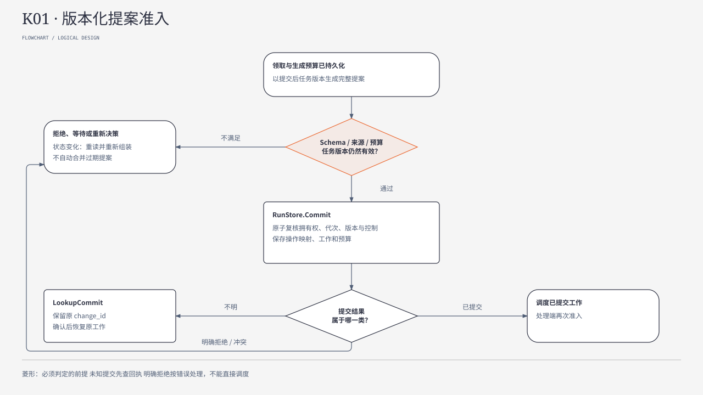

**输入：**当前任务事实、控制意图、Owner/Worker 资格、预算、上下文来源与固定能力版本。先持久化本轮领取和生成预算，以该次提交后的任务版本作为 Decide 输入基线。

**判定与输出：**完整提案必须满足 Schema、输入/能力、来源有效性及预算约束。严格检查状态版本；过期就重新读取、组装和决策，不自动合并。RunStore.Commit 原子复核 owner_epoch、领取代次、状态版本和控制意图，并保存操作映射、准入工作及预算。提交未知先 LookupCommit；确认后才调度。

**不变量：**有限批次整体准入只保证运行记录整体保存，外部动作仍分别成功或失败。模型生成用量无论提案是否采用都需结算，崩溃造成的未知用量保留占用。

依据：[准入六步](06-decision-admission-and-collaboration.md)、[原子提交](02-runtime-and-state.md)。

### 5.2 K02：千级 API 候选发现与路径选择

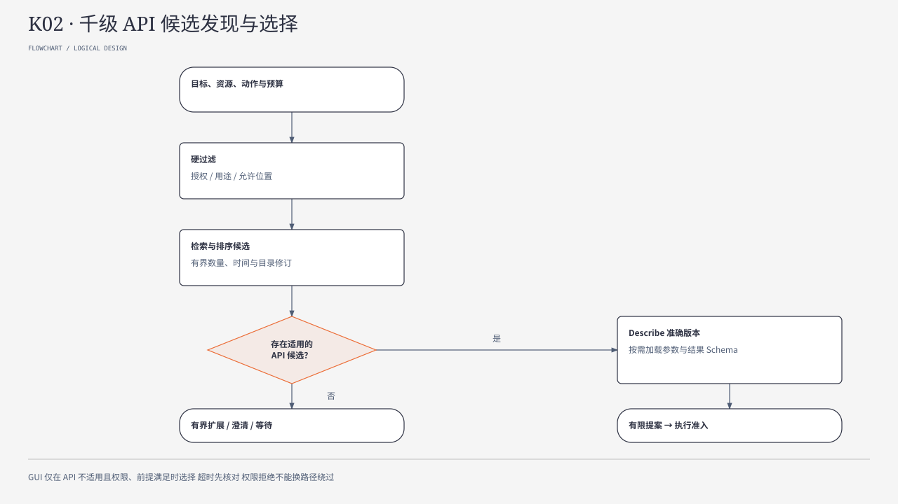

**输入：**目标描述、资源类型、必要动作、用途、允许位置及候选/时间预算。先按授权与位置硬过滤，再检索和排序候选，按准确版本 Describe 加载输入输出 Schema；参考实现从本地文本检索起步，语义检索与重排是可替换扩展。

**判定与输出：**候选充分时，大脑提出有限动作，内核与执行端继续检查参数、资源前提、预算及效果核对能力。候选不足时有界扩大检索、澄清或等待。没有适用 API 或能力明确不足时，只有满足相应权限与执行条件才选择 GUI。

**不变量：**不把千级全目录一次塞入模型上下文。无匹配、部分不可达、索引滞后和预算耗尽分别报告；API 超时先核对，权限拒绝不能换路径绕过。候选排名不是授权，也不证明首次调用正确。

依据：[API 路径与目标](07-tools-and-simulated-devices.md)、[CapabilityCatalog](07-execution-contracts-and-validation.md)。

### 5.3 K03：幂等接纳与未知结果恢复

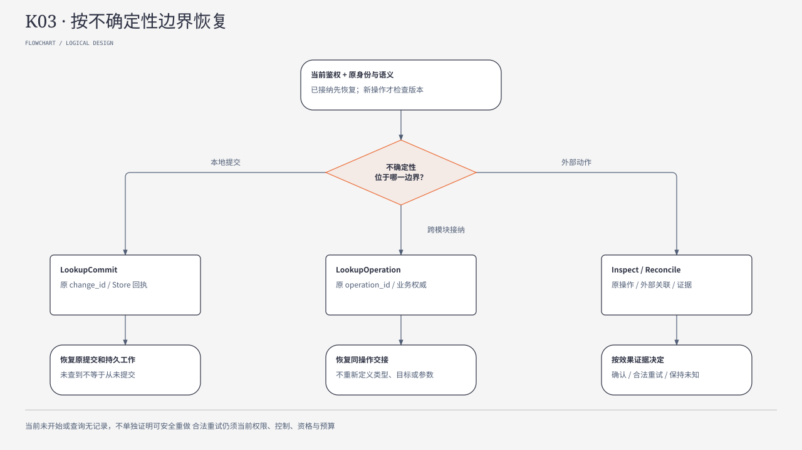

**输入：**稳定身份、原语义摘要、持久回执、当前权限与已知效果证据。先检查查询和结果披露权限，再核对既有操作；同身份同语义恢复原结果，同身份不同语义拒绝。真正的新操作才检查接纳窗口、当前版本与资格。

| 不确定性所在边界 | 首先核对 | 后续处理 |
| --- | --- | --- |
| 本地事务提交 | LookupCommit(task_ref, change_id) 或所属 Store 的提交查询。 | 按原提交身份恢复；不能重建一批新业务动作。 |
| 跨模块业务接纳 | LookupOperation / 领域查询，保持原 operation_id。 | 补齐交接责任或获准补投；保持原目标与语义。 |
| 外部动作及实际效果 | Inspect / Reconcile，利用受控外部关联和证据。 | 已确认则记录；仅在确认旧请求不会再执行且效果未发生，或目标提供仍有效的幂等保证时，重新检查权限、控制、资格及预算后准入重试；无法核对则保持未知。 |

**不变量：**查询暂时无记录不证明旧请求永远不会提交。关键去重记录清理前持久化关闭水位；过期请求不能重新首次接纳。目标或参数改变构成新操作，但不得借新 ID 绕开原操作的未知效果。

依据：[恢复骨架](12-data-path-and-protocol-semantics.md)、[执行恢复](07-execution-contracts-and-validation.md)、[故障矩阵](04-recovery-state-and-failure-matrix.md)。

### 5.4 K04：授权收缩与预算分配

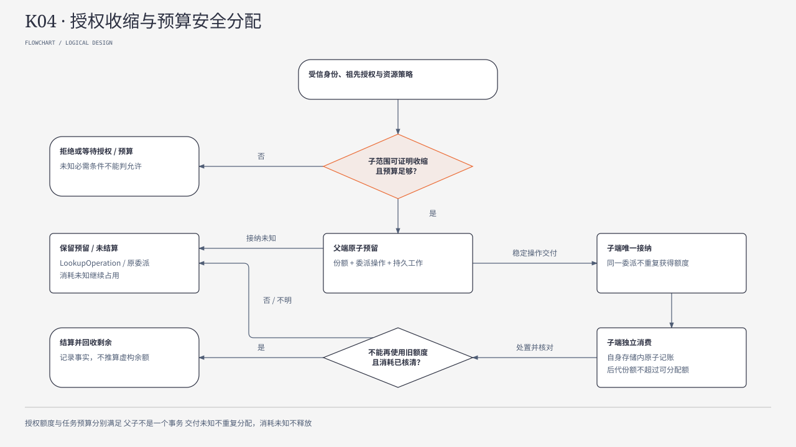

**输入：**受信主体、祖先授权链、资源策略、接收方、操作语义、允许位置、期限和可用预算。对资源范围、动作、用途和位置逐项比较，期限检查包含关系；任何硬性禁止、未知必需条件或无法证明的收缩都不能产生允许结果。

概念上，子权限满足 `child_scope ⊆ parent_scope ∩ resource_policy ∩ ancestor_limits`。这是可比较策略字段上的判定，不以任意自然语言规则证明包含。授权额度与任务预算分别检查，任一不足都不能准入。

**分配与结算：**父任务先将委派份额与待处理工作原子预留，子任务凭稳定委派操作唯一接纳，并在自身权威存储内独立消费。交付不明不重复分配，消耗不明不释放；只有证明接收方不能继续使用且已核清消耗后，才回收剩余额度。

**不变量：**这是持久交接，不是父子分布式事务。暂停、取消请求或失联不代表旧工作已停止。增加任务预算不扩大授权，取得授权不增加任务预算；外部金额估算不能冒充精确账单硬上限。

依据：[授权范围与消费](08-authorization-lifecycle-and-interfaces.md)、[预算规则](06-decision-admission-and-collaboration.md)。

### 5.5 智能参考策略：从可替换接口到可比较实现

以下为本轮建议的首个可运行策略，服务于既定千级 API 和 V1/V2 目标；尚无模型效果证据。它补充默认行为，不改变 Brain/Model/Memory/Catalog 的可替换契约，也不放宽 [既有评测预算](10-evaluation-contracts-and-release-gates.md#预算及运行器参考配置)。

| 环节 | 参考策略 | 失败/替换条件 | 需要报告的指标 |
| --- | --- | --- | --- |
| 能力召回 | 先按授权、位置、资源和动作硬过滤，再进行可解释文本检索；精确操作/资源匹配优先，词项覆盖和版本化同义词辅助排序，同分按稳定引用排序 | 初始读取前 8 个摘要，候选不足且预算允许时扩大到 16；仍不足则澄清/等待。数量是建议起点，须以新配置比较 | Recall@8/@16、零命中、近义误选、检索用量/耗时；发现阶段不注入答案 API。 |
| Schema 与参数 | 只对实际候选按精确版本 Describe；Brain 输出结构化能力/资源/参数及依赖；参数引用指向可见输入、证据或先前结果 | 缺资源身份或必要参数时等待输入/受控读取；不能以 Schema 通过代替语义正确 | 能力、资源、参数分别计错；首次提案保留，修复不改写首次得分。 |
| 上下文组装 | 扣除输出与协议开销后，依次装入目标/硬约束、关键运行事实/未决动作、必要证据，再分配相关记忆和补充材料；固定分词/计量与排序版本 | 必保内容装不下即报告不足；默认截取带来源的片段，摘要模型作为可选策略且用量计入总预算 | 必要证据覆盖、约束保留、裁剪/冲突/来源失效、输入 token。 |
| 长任务压缩 | 持久运行事实与工作独立保存；历史对话/大结果通过受控产物引用和带来源修订的摘要缩减 | 来源删除、纠正或用途改变即失效；无法读取原证据时报告缺口 | 压缩前后关键事实保留、错误引用、重建耗时，不能以压缩率代替质量。 |
| 决策与重规划 | 采用观察—有限提案—反馈循环；行动、委派、等待、提交结果为互斥主类型；过期提案严格重算 | 持续新事实按一次消费多条已持久事实合并触发；重算仍计预算，不丢事实以维持旧提案 | 有效提案率、废弃率、每任务决策次数、模型用量及延迟。 |
| 无进展与完成 | 比较规范化请求、既有工作、观察变化和验收条件进展；机械条件由规则/验证能力核验，开放式回答提供来源、冲突与缺口 | 建议连续 3 次无新事实/目标进展时澄清或停止新增工作；必须分支未知时不能完整成功 | 错误完成率、无进展停止率、部分完成、最终业务状态与错误副作用。 |

候选数和无进展阈值属于本轮待验证配置，必须在运行前冻结；正式评测仍以既有总查询、模型、操作和时间上限为准。扩大检索、Describe、模型格式修复、子 Agent 和压缩请求共用总预算；预算不足时缩小候选或返回不足，不能把这些准备步骤当成免费调用。

中文/英文分词、词项归一化和同义词来源需固定并加入双语近义用例，不能假定任意数据库全文检索配置具有相同语言效果。语义召回、重排或复杂规划可替换参考策略；比较时固定目录、样本、模型、预算及其余策略，报告质量增益、延迟和成功任务成本。

**效果证据链：**正确候选进入集合 → 选对能力与目标 → 生成正确参数 → 执行前提满足 → 结果被核验。逐段保留失败归因；首次调用 ≥90%、有界任务成功 ≥95% 仍分别按既定完整目录和单步/多步口径验收，不把任一中间指标当成最终达标。

## 6. 海量用户的部署、存储与分布式自愈

逻辑架构保持稳定，部署负责选择模块位置、实现及故障隔离单元。生产建议不反向增加单机开发的必需依赖。

| 逻辑责任 | 已确认的单机参考条件 | 生产建议配置与待验证事项 |
| --- | --- | --- |
| 任务与模块运行 | Go 核心，默认进程内，另有同机多进程验证。 | 用户归属 Cell/分片，任务状态与模型/工作资源池分离；验证迁移及旧执行者隔离。 |
| 权威存储与原子组 | SQLite；M3 验证 bbolt 第二持久后端及迁移。 | PostgreSQL 等持久存储按用户分区；每原子组完整落入一个事务分区。 |
| 长连接与消息 | 原生 WebSocket/gRPC Adapter、本地持久 Inbox/Outbox。 | 独立网关和持久交接，Kafka 等只承担声明的交付责任；Gateway 使用登记的受信代理配置、保留原始主体，以绑定实际出示证书及目标服务的更窄材料转交。验证补读、背压和故障恢复。 |
| 缓存、索引与大内容 | 本地参考实现及受控引用；端侧隐私原文可留端。 | Redis/索引/对象存储按用户隔离；缓存和索引不接管业务权威。 |
| 调度与配额 | 任务预留、Worker 资格、模拟设备资源控制。 | 用户/Cell/供应商分层准入；用户持久额度账本与下游消费核对。 |
| 运维与隔离 | 单机无需独立数据库、消息或工作流服务。 | Kubernetes 等编排组合待评审；容量、隔离、灾难恢复及迁移需实测。 |

千万注册、百万日活、十万在线是已确认规模目标；连接数、活跃任务、模型并发、吞吐和存储保留量必须分别推导。示例负载、容量估算和 P95 指标属于设计输入或建议，不是实测结果或 SLA 承诺。

namespace 隔离覆盖可信身份、路由、存储键、缓存、索引、对象授权、订阅和配额。同一用户多端不自动共享所有界面或资源权限；生产路由世代也不能替代任务 owner_epoch 或 Worker 领取代次。

依据：[生产部署与存储](13-distributed-deployment-and-storage.md)、[单机约束](00-design-constraints.md)。

### 6.1 用户归属、部署资源池与故障域

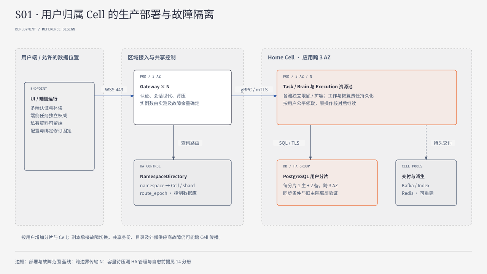

可信身份绑定 namespace，经稳定桶/目录定位 Home Region、Home Cell 和数据库分片。一个用户的云侧可变数据默认归属一个 Home Cell，端侧私有数据及端侧 Owner 保持原责任。多个 Cell 独立持有业务工作与存储，不共用一张全局任务领取表。

长连接、Task/Brain、Execution 和后台批处理使用可分别限额/扩容的资源池；示意图将同一 Cell 的应用池合并表示，不要求全部同进程。区域内跨三个可用区部署，数据库每分片一主两备是本轮生产验证建议；副本不是新的业务分片。共享身份、路由、模型供应商和区域基础设施的故障仍可能影响多个 Cell，必须单独验收。

路由 `route_epoch`、任务 `owner_epoch`、Worker 领取代次和连接世代各自保护不同对象。数据库每次写入复核分区可写栅栏；目录切换不会自动停止旧分区。扩容迁移采用“准备 → 静止边界 → 源端封存 → 唯一目标激活 → 核验清理”，迁移全部原子组、回执、水位、授权与预算，不仅复制任务正文。

### 6.2 数据存储与访问路径

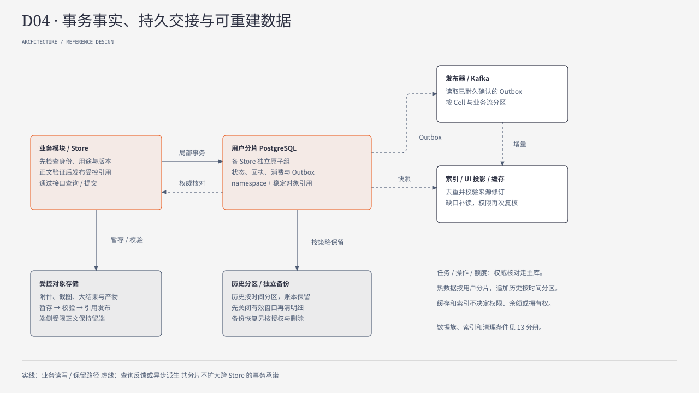

| 层次 | 放置与主键方向 | 一致性 / 生命周期 | 扩展与恢复 |
| --- | --- | --- | --- |
| 权威热数据 | 用户分片 PostgreSQL；namespace + 对象引用 | 状态、回执、工作/消费及必要 Outbox 保持各 Store 局部原子组 | 按用户增加分片；强一致查询走主库，角色切换后查原提交。 |
| 历史与操作账本 | 活跃操作/窗口账本保留稳定唯一键；追加历史在分片内按时间分区 | 操作回执覆盖有效恢复期，先关闭窗口再清明细；未决效果不按固定天数直接清掉 | 冷热分层与归档引用；历史时间分区不替代用户分片。 |
| 正文与不可变产物 | 受控对象存储，元数据由所属 Store 管理；禁止离端内容留端 | 暂存 → 校验 → 事务发布引用；删除传播/对象版本/备份清理分别报告 | 分块传输、独立下载授权、保守孤儿回收。 |
| 交付通道 | Inbox/Outbox 为持久责任；Kafka 按 Cell/业务流分区 | 允许重复，保持聚合必要顺序；ACK 不证明业务完成 | 回放、补读与恢复扫描；不按千万用户创建千万 topic。 |
| 查询投影与缓存 | namespace / 来源修订约束的索引和 Redis | 可丢失重建，不决定授权、余额、操作接纳或拥有权 | 从获准快照/变更恢复，限制回源；滞后明确可见。 |
| 控制与运维数据 | 身份/路由/会话为独立控制数据库；HA 仲裁用 etcd | 路由、领导权和业务状态分别管理 | 控制面 HA、备份与故障范围单列，不从 Redis 恢复权威。 |

热表只保留调度和核对所需的紧凑字段，大段模型输出/截图通过受控引用访问。任务按 `(namespace, task_ref)` 查询，操作按其接纳权威中的稳定 ID 查询，工作按用户、ready 时间及领取状态访问；活动/未决部分索引减少历史扫描。数据库连接池与客户端长连接解耦。

物理表族、索引路径、历史分区、唯一性、热冷分层和保留责任见 [生产存储设计](13-distributed-deployment-and-storage.md#数据族访问路径和保留方式)。读副本的无记录不能证明没有接纳；恢复核对和写入准入须读取权威事实并满足耐久条件。

### 6.3 自愈：恢复可信权威，让在途任务继续

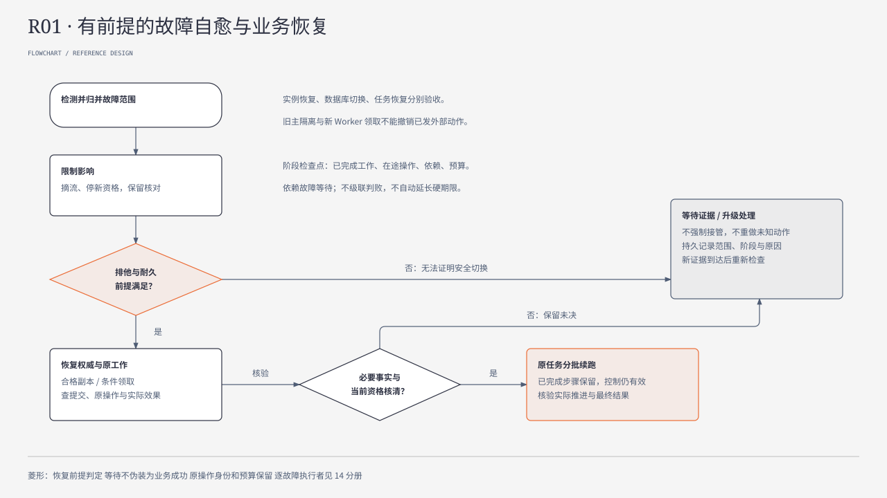

**验收目标是故障前已接纳且仍具备条件的任务，用原身份保留进度并继续。** Worker、数据库或网络暂时不可用不直接转换成 FAILED；受影响分支记录依赖等待或效果核对，其他分支继续，全部受阻时任务才 WAITING。数据库不可写期间保留最后已确认状态并标注陈旧性，恢复后逐项核对。父任务不因子任务失联而级联失败，用户暂停和取消保持有效。

| 层次 / 场景 | 自动恢复路径 | 停止条件与边界 |
| --- | --- | --- |
| Gateway / Worker 崩溃 | 重建实例；恢复会话/领取代次；查询原提交与操作，补齐交接 | 重启不重建业务身份、不清零预算，也不证明旧动作停止。 |
| 数据库主节点 / 单区故障 | HA 仲裁 → 旧主隔离 → 合格同步副本提升 → 写入口恢复 → 业务核对 | 缺仲裁、同步完整性或隔离证据即停写；数据库恢复不接管端侧 Owner。 |
| Kafka / 消费者故障 | 业务 Outbox 保留，按原消息补投，消费者去重/补读，坏消息隔离 | 队列有界；同一聚合缺口未解决不能跳过并伪造连续确认。 |
| 缓存 / 索引损坏 | 限流回源，获准快照 + 增量重建 | 不用旧缓存恢复余额/授权；重放旧修订不能复活删除内容。 |
| 外部效果未知 | 原 operation_id 的 Inspect/Reconcile，记录实际效果 | 无法核对则等待；不能换新 ID、换 GUI 或宣布取消完成。 |
| Cell / 区域事故 | 隔离故障范围，恢复同一权威或执行受控灾备流程 | 旧区域未隔离、丢失窗口未核对时，不自动把用户写入散发到新副本。 |

续跑检查点保存已准入/已完成工作、未决操作与外部作业引用、依赖/子任务、控制与等待项、预算和期限，分别由原 RunStore / ExecutionStore 负责。生成中断可在剩余额度内重新决策；已发动作先查原操作；外部异步作业继续 Inspect；已完成动作补交结果；GUI 重新观察后决定剩余步骤。故障期间熔断受影响依赖、持久退避并保留核对资源，恢复后先核清在途配额再按用户分批放行。

单次调用超时、Worker 租约、任务硬期限和授权有效期分别处理。系统自愈不重置预算，也不自动延长用户期限；只有预先声明的时长策略可以暂停相应计时，端到端耗时始终包含故障等待。真实期限届满或效果无法核清时，按原规则停止新动作、核对或升级，不能承诺所有任务必然完成。

本轮建议由 **RecoveryController** 编排检测、限流和恢复扫描，原模块 Reconciler 提交业务更新；数据库角色由 **HA Manager** 管理。生产验证组合为 PostgreSQL + Patroni + etcd，包含同步提交条件、旧主隔离和耐久派发屏障。分阶段续跑、期限/预算规则、14 类故障矩阵、恢复风暴治理及备份恢复见 [分布式故障自愈](14-distributed-recovery-and-operations.md)。

自动化覆盖可证明的恢复步骤；效果不可判定、数据损坏或永久失去仲裁时保留等待并升级处理。RTO 从故障到约定业务服务恢复测量，另报积压清空、原任务续跑比例、首次有效推进时间、最终完成比例、误判终态和未知效果。演练固定故障前任务集合及各执行阶段，保留取消、真实过期和未恢复任务，不能只统计幸存任务。Pod 存活、数据库可写、任务可接纳和业务收敛分开判定。

### 6.4 从用户规模推导容量与成本

沿用生产分册的**示例假设**：百万 DAU、每人每日 5 个任务、峰值系数 10、每任务 3 次模型调用、每次平均占用 8 秒。它对应约 579 个任务/秒、1,736 个模型请求/秒、约 1.39 万模型并发；这些是容量演算，不是用户行为预测或实测支持量。

| 资源维度 | 推导与限制 | 必须测量 |
| --- | --- | --- |
| 连接 | 十万在线 × 多端系数 × 每端逻辑流/扇出；预留单区失效与重连余量 | 单实例连接/带宽/缓冲、认证洪峰、补读和慢消费者。 |
| 模型与执行 | 到达率 × 每任务调用数 × 占用时长；受供应商 RPM/TPM、设备并发和预算限制 | 排队、首响应/完成、成功任务 token/费用、未知用量。 |
| 数据库 | 各类业务率 × 每项原子提交数，再加授权/UI/记忆/交付和恢复写入 | 每分片持续吞吐、锁等待、热索引、WAL/复制及连接池。 |
| 存储 | 存量 + 每类每日新增 × 保留期 × 索引/副本放大 + 备份/迁移余量 | 热/冷/正文分别测，未决记录和删除义务限制清理。 |
| 恢复 | 正常峰值 + 故障积压回放 + 重连/快照/核对 | 有界队列、最老年龄、公平性、控制通道和恢复完成时间。 |

过载时按用户 → Cell → 供应商分层准入，控制/核对与普通任务分池；负载超过持久接收能力时拒绝或背压，已接纳工作不静默丢失。扩容 Gateway 不能解决模型配额，扩容 Worker 不能解决热分片写入或外部设备串行上限。

正常在线、单区域且未触发背压时，任务提交到 ACCEPTED 的 P95 ≤300 ms、业务提交到网关发出更新的 P95 ≤1 s 是既有建议目标。排队、模型、第三方和公网端到端耗时另报，不能用局部延迟代替用户任务时延。恢复时间、各分片水位与实际成本待试验冻结，不补造已达成的 SLA。

## 7. 关键取舍、安全、验证与演进

### 7.1 决策、收益和代价

| 决策 / 状态 | 选择依据 | 代价与替换触发 | 验证入口 |
| --- | --- | --- | --- |
| Go 自有状态机、当前状态 + 追加记录；既有基线 | 单机可嵌入、明确权威和恢复契约 | 自行维护恢复正确性；若替换工作流引擎，仍需完整行为等价 | 原子提交、崩溃窗口、独立 Adapter 契约。 |
| 严格拒绝过期提案；既有基线 | 旧决策不能覆盖新输入/效果 | 高频并发可能频繁重算；先优化事实合并和调度，放宽版本需新证明 | 旧提案废弃率、控制响应、真实模型用量。 |
| 单 Owner、集合单一修改权威；既有基线 | 避免独立副本并发推进和静默覆盖 | 失联时部分工作/正式修改等待；多主或自动接管须独立设计 | 分区、迟到旧请求、封存/激活和恢复。 |
| 本地文本检索、有限候选和预算组装；参考建议 | 无独立检索设施也可启动，并能解释失败 | 语义召回可能不足；经同条件比较再增强语义检索/重排 | 完整目录召回、90%/95%、V1/V2 及成本。 |
| 按用户 Home Cell/分片；生产建议 | 局部原子性、用户隔离、故障与容量分治 | 热点需迁移，共享控制面仍可能全局受影响 | 混合负载、热点、单区/Cell 故障和迁移。 |
| 同步 HA 与旧主隔离；生产建议 | 在明确故障模型内保护耐久事实和单写权威 | 增加提交延迟，缺同步/仲裁时牺牲写可用性 | 提交取消窗口、旧主暂停、主备切换和对账。 |
| Outbox + 重复可恢复交付；既有契约 | 避免数据库更新与发送消息之间的丢失窗口 | 接收端需去重，积压占空间，外部效果仍可能未知 | 丢回执、重投、缺口、坏消息、保留清理。 |

### 7.2 安全、数据驻留与用户控制的执行点

| 执行点 | 必须落实的限制 | 反例验收 |
| --- | --- | --- |
| 入口和路由 | 可信主体绑定 namespace；当前会话资格及受控代理链 | 伪造用户头、旧连接、跨用户游标/订阅。 |
| 上下文与模型出口 | 来源、用途、处理位置、披露范围与当前有效性 | 私有内容经摘要/Embedding/工具参数外发；生成中来源被删除。 |
| 动作启动与凭证使用 | 执行端复核操作、资源、当前授权及单次许可；上下文只持受控凭证引用 | 旧确认用于新参数、API 拒绝后换 GUI、插件借宿主凭证增权。 |
| 存储与对象读取 | 带 namespace 的键/查询、RLS 纵深防御、独立对象授权、版本与删除复核 | 从缓存、历史回执、旧备份或索引读出不再获准内容。 |
| 扩展与发布 | 受信 Go 与隔离运行分别声明；固定精确产物、证据、权限及在途版本 | 任意同进程代码冒充沙箱；用旧评测报告授权新产物。 |

网页、Skill、工具回包和模型输出均不能修改策略或授予权限；用户的暂停、取消、接管及恢复沿持久控制契约落实。观测默认记录去敏引用与指标，诊断和评测没有额外的数据披露特权。信任边界详见 [授权](08-authorization-and-user-control.md)、[驻留](05-edge-cloud-memory.md) 与 [扩展运行](09-extension-contracts-and-activation.md)。

### 7.3 评审与实施索引

| 要回答的问题 | 详细依据 | 需要的验证证据 |
| --- | --- | --- |
| 任务状态由谁推进，提交未知怎么办？ | [内核](02-runtime-and-state.md)、[恢复矩阵](04-recovery-state-and-failure-matrix.md) | 竞争更新、旧 Worker、提交故障、重启及所有权移交。 |
| 不同实现能否替换和互操作？ | [消息目录](03-contract-message-catalog.md)、[扩展契约](09-extension-contracts-and-activation.md) | 相同正反例、绑定等价、版本与能力协商。 |
| 动作是否真的发生，效果能否核对？ | [执行契约](07-execution-contracts-and-validation.md) | 有状态模拟设备、外部成功回执丢失、取消/接管竞态。 |
| 删除、驻留和多端 UI 能否保持边界？ | [记忆生命周期](05-memory-data-and-lifecycle.md)、[数据链路](12-data-path-and-protocol-semantics.md) | 来源失效、禁止披露、竞答、转交崩溃和重连补读。 |
| 模型效果与改进是否成立？ | [评测门槛](10-evaluation-contracts-and-release-gates.md)、[专项验收](11-specialized-validation-and-handoff.md) | API 独立计分、V1/V2、可比证据、分阶段启用与回滚。 |
| 生产用户隔离及规模是否成立？ | [分布式方案](13-distributed-deployment-and-storage.md) | 明确负载与保留期，容量、故障隔离、持久配额和迁移测试。 |
| 在途任务能否避免级联失败，并在自愈后继续？ | [自愈与运行验收](14-distributed-recovery-and-operations.md) | 分阶段原任务续跑、完成步骤保留、未知效果核对、恢复风暴、期限/控制边界与真实 RPO/RTO。 |

实施按 [能力里程碑](11-milestones-and-validation.md) 与 [实施工作包](11-specialized-validation-and-handoff.md) 推进。能力成熟度 L1 契约、L2 参考实现、L3 替换互操作、L4 恢复治理分别提供证据；架构分层图、文档链接和图示检查不能代替这些运行验收。

建议首先交付一条可重启的完整执行链及共同故障夹具，再验证智能参考策略；生产路径独立交付分片 Store、Gateway/路由、HA/自愈和混合负载证据。业务与运维配置、Schema、协议及扩展版本分别管理；滚动升级须验证在途恢复兼容，数据迁移默认采用可兼容的先扩展后收缩步骤，回滚不回滚外部副作用。

生产放行报告至少包含拓扑/版本、负载与保留期、资源和费用、质量结果、故障注入与对账、权限/删除反例、迁移和备份恢复、已知不支持的自动恢复范围。文档完成、接口测试、模型效果和生产可用性分别提供证据。

### 7.4 图示维护说明

本参考页保留 21 张图：执行机制 A00、L0/L1/L2 三张架构、D01–D03 三张对象关系与 D04 存储分工、两张协议/扩展、五张业务流程、四张控制算法，以及 S01 生产部署、R01 自愈流程。L2 作为组件索引展开 22 个组件和 16 条主调用依赖；A00 突出事务与执行主线，生产新增职责由 S01、R01 和分册说明。

L2 的合并范围：资源控制、事实合并和效果核对归入 ExecutionCoordinator；索引、同步与扩展实例保留独立职责；连接与启动组装按内核分册补齐。获准来源、Evidence/Artifact 等数据对象不充当组件节点，端侧查询作为 Memory 的部署与适配能力说明。未固定的内部加载路径不新增调用边，模块之间的返回值和数据流由第 4 节展开。关系图按主题重复引用共同对象，完整故障矩阵留在分册；这些取舍不改变状态权威、操作身份或恢复责任。

[HTML 图文版](diagrams/lerna-harness-reference.html) 内嵌全部 SVG，导出的 `review-*.svg` 用于本文。图中橙色只强调每图一至两个关键节点；各图底部给出适用图例。L2 的箭头严格按使用方指向提供方；其他图的实线表示主调用、数据流或关系，虚线表示反馈、投影或恢复。对象关系线以基数为准，流程箭头不表达基数。

HTML 只依赖可选的 Google Fonts 样式，图形和正文均包含在文件内；简体中文采用 Noto Sans SC / Noto Sans CJK SC / PingFang SC / Microsoft YaHei 字体栈。离线或 SVG 导入器不加载远程字体时使用本机回退，字形可能不同；图中含可访问标题和内容描述。详细行为仍以所链接分册为准。

维护入口见 [构建说明](../../../scripts/architecture/README.md)。正文以本 Markdown 为准；新增机制图由仓库内绘图脚本生成独立 HTML 与 SVG，文档构建器分别生成总述与参考页并内嵌图形，避免仅改导出页面造成源文档失配。

