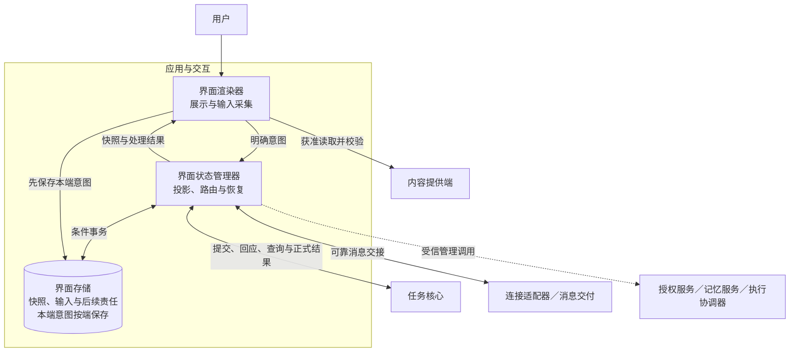
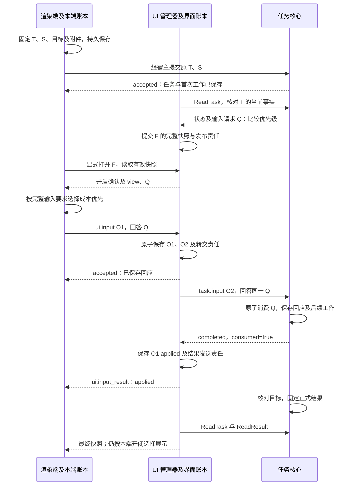

# 应用与交互详细设计

应用与交互把用户意图可靠交给业务权威，把任务、输入与成果转换成可恢复的界面。它保存呈现快照、待转交输入和本端用户选择；任务完成、授权签发、设备控制和记忆修改分别由原业务模块裁决。

本方案展开[系统全景图](../diagrams/system-panorama.drawio)的 `interaction` 分组：`renderer` 界面渲染器、`ui-manager` 界面状态管理器、`surface-store` 界面存储。对应 `ui-input`、`ui-present`、`ui-store`、`input-core`、`core-result` 五条边。受信宿主及内部适配器是这些职责的实现分工，不新增全景图模块。全景图只画关键交互，授权、内容和管理接口沿现行领域方案复用。

首次阅读沿本页主线，再读[UI 交互规范](interaction-contract.md)；第三方协议实现将该规范与[线映射](../endpoint-communication/task-and-ui.md)一起阅读。默认宿主实现沿[输入、呈现与恢复](interaction-and-recovery.md)，存储及组装查[接口、存储与部署](contracts-and-storage.md)，验收查[验证与交付](validation.md)。本次交付为详细设计，没有应用运行实现；现有协议 Schema 和示例只提供静态契约证据。

## 1. 首期范围与依赖

首期采用**受信本地宿主、固定界面权威、声明式 document 视图和本地事务存储**。受信宿主是完成身份绑定、保存本端意图并调用已安装业务接口的应用运行环境。界面权威是对指定用户的 surface 内容、呈现状态与 UI 操作作唯一裁决的状态管理器及账本。渲染框架可以替换，不改变这些职责。

| 范围 | 本次设计及能力缺席时的行为 |
| --- | --- |
| 默认闭环 | 用户提交任务 → 核心接纳 → 状态投影 → 请求补充输入 → 可靠转交 → 核心消费 → 正式结果及内容呈现；输入由完整请求与结构化必需预览共同构成，提交前核对精确预览获取依据，关闭、重启和结果恢复均保留原身份 |
| 独立 UI | 无 task_id 的说明页、获准内容页复用同一快照／开闭机制；交互页须装配具有耐久消费与原操作核对能力的本地业务适配器，缺少则不发布可提交控件 |
| 中间成果预览 | 采用核心固定投影读取接缝及 UI-P2；中间截图／产物必须有来源、保留和必需输入关联，缺内容时禁用依赖它的提交 |
| 受信管理 | 授权确认／撤销、记忆查看／修改／清理、设备接管及待处理操作，直接复用相应领域的本地管理接口；没有适配器时隐藏相应入口并说明能力未安装 |
| 必需依赖 | 已认证用户与端点、可写界面账本、业务权威、当前使用／披露依据、受控内容通道及可靠交接；身份不成立拒绝访问，持久化失败不报告接纳，业务暂不可达保留原操作核对责任 |
| 跨端 | 普通 UI 消息沿现行 v1；只有身份、活动端点所有者、领域恢复和内容访问依据齐备的部署才开放。跨端目录、管理与预览合同已定义；提供方及运行验证未交付前不能据 Schema 宣称端云已可用 |
| 离线 | 本地关闭始终立即隐藏；获准草稿可留本端。新提交、输入消费和管理操作只有本地权威及有效授权全部齐备才继续；远程权威不可达时不把本地排队显示为业务接纳 |
| 后续能力 | 多写者界面合并、权威自动迁移、任意聊天历史同步及原任务整体目标编辑；均不作为首期默认能力 |

同用户多个端点可以使用同一界面权威，开闭按端点分别裁决；首期不允许两个互不相知的账本修改同一 surface。默认将状态管理器与任务核心放在同一受信宿主，二者保持独立提交边界。需要云端管理器时，渲染端仍保留本地意图账本，不能只依赖浏览器内存提供关闭与重启恢复保证。

本模块直接承担[项目目标](../../../harness-project-goals.md) C6 的多种 UI 互操作与 C7 的用户控制，C5 对应提交和呈现恢复，C8 对应交接可追踪。C1／C3 通过准确呈现任务判断、证据与缺口支持，C2 通过记忆管理及来源展示支持，C4 通过取消与接管入口支持。C9 只展示已有评测和发布事实，不增加发布权限或自动演进循环。A1–A4 均适用；V1 验证答案、引用和时效信息没有在呈现中丢失，V2 验证中断与本地接管及效果未知的准确表达。

## 2. 分工、事实和交接

本模块分别保存可恢复界面内容（Surface）、每端开闭和输入转交记录；输入消费、任务成果及管理决定仍归业务权威。[规范中的事实归属](interaction-contract.md#facts)统一定义这些对象及其标识。

下图以一个用户的应用宿主为视角。实线表示本模块调用或持久交接，虚线表示已有领域管理接口；跨端时由连接适配器承载同样的交接，图不规定进程数。

图中的本端意图与权威账本属于界面存储的两种记录；分端部署时各自本地提交，不跨网络共用事务。受信管理调用由状态管理器内的宿主适配器执行，通用 document 数据不能指定管理方法。

| 事实 | 保存和裁决方 | 界面可以确认什么 |
| --- | --- | --- |
| 草稿、最新显式开闭选择、尚未核清的提交 | 本端界面账本；草稿保存须获准 | 本端已保存意图，不等于远方收到或业务接纳 |
| surface 内容修订、各端呈现修订、UI 操作及转交责任 | UI 管理器及界面存储 | UI 已承担责任，或本端开闭条件更新成功 |
| 任务状态、输入消费、取消与正式结果 | 任务核心及运行存储 | 原请求已消费、任务当前状态与固定原结果，分别展示 |
| 许可、接管屏障、执行效果、记忆修订与清理 | 各自领域权威 | 只展示领域回执允许得出的结论；不通过按钮或文案改写事实 |
| 消息已保存／业务已接纳／内容已取得 | 消息交付、业务模块、内容接收端分别记录 | 各层完成条件独立；网络连接和内容引用不能代替后两项 |

| 发起方 → 处理方 | 输入 → 输出及成功含义 | 持久责任与失败后的继续者 |
| --- | --- | --- |
| 渲染器 → 本端宿主 → 任务核心 | 固定任务、目标、附件及提交操作 → 核心 accepted／拒绝 | 宿主保存原提交；核心保存任务和后续工作。答复丢失由宿主查原操作，不新建任务 |
| 任务投影适配器 → 核心 → 管理器 | ReadTask、必要时 ReadResult → 当前状态／输入及固定成果 → 内容修订 | 核心保存原事实；管理器保存来源版本和刷新责任。通知仅加速，适配器以有界轮询补漏 |
| 渲染器 → 管理器 → 输入权威 | ui.input 父操作 → 固定子操作 → consumed／拒绝 | 管理器保存原输入及待转交工作，首次转交前固定父子关联；默认接纳事务一起提交。权威原子消费。管理器持续核对并返回父操作结果 |
| 渲染器 → 管理器 | 明确开闭、期望呈现修订 → completed／拒绝 | 本端先保存选择，管理器条件提交；冲突由本端按最新选择有限协调，未核清时保持隐藏 |
| 管理器 → 消息交付 | 固定快照、答复及事件 → 耐久接管／拒绝／未知 | 管理器保存发送工作；交付按原消息接管，任一确认丢失不换消息身份 |
| 受信管理入口 → 领域权威 | 原命令、精确对象／版本及真实用户依据 → 领域回执 | 领域保存业务决定，宿主查原命令或原操作；提交未知不新建命令掩盖 |
| 渲染器 → 内容通道 | 内容引用、当前用途及披露依据 → 已验证字节／缺口 | 内容方保存获准内容，渲染端保存必要缓存／校验结果；失败可有限重取原内容，不能重新执行任务 |

[UI 交互规范](interaction-contract.md)是领域行为的权威定义，[通信映射](../endpoint-communication/task-and-ui.md)统一对应消息和集中 Schema。以下关键选择解释规范与默认实现的依据；投影适配器、本端日志及界面事务在实现篇展开，管理控件见[管理实现](interaction-and-recovery.md#management)。

## 3. 关键选择

| 推荐 | 依据、主要代价与适用边界 | 替代及改变条件 |
| --- | --- | --- |
| 固定 UI 权威，端点分别保存开闭意图 | 输入竞争有唯一转交记录；不同设备互不抢开闭。失联端不能宣布远端已应用 | 多端可写副本能改善离线编辑，但须定义意图合并和消费去重；出现共同离线编辑需求后另行设计 |
| 完整快照为恢复基线，delta 只优化文字追加 | 表单、按钮及输入请求可一次恢复；快照比增量占更多带宽 | 任意补丁树需处理失序和交互语义变化，当前没有必要；经压测证明快照成为瓶颈后再比较 |
| UI 操作与业务操作分别落盘，固定父子映射 | 两处事务均可独立恢复；多一次写入和核对，换取接纳后崩溃不丢责任 | 与内核同库合成事务会绑定独立 UI 与部署；不作为共同接口前提 |
| 本端关闭立即隐藏，打开须确认并取有效快照 | 弱网和迟到消息不能覆盖新选择；打开可能多一次往返 | 乐观打开降低延迟，但可能显示旧权限或已关闭内容；首期不采用 |
| 宿主维护已知任务索引，以查询恢复投影 | 复用现有核心接口，没有“恰好送到一次”的事件前提；有轮询成本，不能枚举其他入口创建的未知任务 | 跨设备目录及有限订阅采用[目录合同](interaction-contract.md#directory)，未具备提供方时降为已知 ID 恢复 |
| 敏感管理使用受信宿主控件，普通内容使用 document | 现有授权／执行／记忆接口可直接复用，通用视图不能冒充用户批准；需维护少量领域适配器 | 全部放入通用远程表单须补齐证明、来源及回执绑定，沿[受信管理规范](interaction-contract.md#management)及所属领域合同处理 |

默认存储选型和替换条件见[部署与容量](contracts-and-storage.md#deployment)。没有证据表明需要独立 UI 服务集群、全量事件溯源或新增通用工作流引擎，首期复用事务表、有限扫描和既有消息交付。

## 4. 贯穿场景：联网比较前补充优先级

用户提交“联网比较方案甲和方案乙，先问我这次比较的优先级”。网络检索与结果呈现已获准；核心提出“成本还是延迟优先”的输入请求 Q，用户选择“成本优先”。该回应补充任务约束，不签发新增许可或自动保存长期偏好。应用固定任务 T、提交操作 S 和默认 surface F。任务接纳才显示“任务已接纳”，本端草稿保存仅显示“等待提交”。

下图展示业务责任链，省略消息回执与每步当前权限复核。O1 是 UI 输入操作，O2 是转交给核心的输入操作；检索、来源处理和完成核验仍由任务及执行链负责。

最关键的异常放在 Q 已消费、O2 答复丢失时：用户关闭手机上的 F，电脑也回应 Q。手机立即隐藏并保存关闭意图；管理器恢复 O2，电脑的新回应由核心裁决为冲突。即使原结果后来到达、任务完成或重连，手机仍保持关闭，电脑保留自己的呈现状态。UI 恢复依据是原操作记录，不能重新执行任务、换输入请求或改写已消费值。外部行为见[输入恢复规范](interaction-contract.md#input)，默认转交工作见[输入实现](interaction-and-recovery.md#input)。

## 5. 必须保持的保证

| 编号 | 保证 | 规范与实现依据 |
| --- | --- | --- |
| U1 | 显示事实来自对应权威，任务完成、输入生效、开闭及内容可用分别判断 | [任务与结果](interaction-and-recovery.md#task) |
| U2 | 接纳前保存原输入与后续责任，首次转交前固定父子关联；默认接纳时一起提交，重试不复制业务操作 | [输入规范](interaction-contract.md#input)、[默认事务](contracts-and-storage.md#transactions) |
| U3 | 快照完整且不回退；进度刷新不使同一有效输入失效 | [完整内容规范](interaction-contract.md#view) |
| U4 | 本端最新显式开闭意图持续生效；关闭不取消任务或已接纳输入 | [每端呈现规范](interaction-contract.md#presentation) |
| U5 | 用户、端点、动作来源和披露用途逐层核对；普通视图不获得管理权限 | [隔离与渲染](interaction-and-recovery.md#security) |
| U6 | 超时、未知提交和恢复缺口可查询、有下一步；控制与收尾保留容量 | [恢复](interaction-and-recovery.md#recovery)、[容量](contracts-and-storage.md#limits) |

本方案补齐模块内部 L1 设计；L2–L4 的运行、替换与故障恢复证据尚未具备。已采用跨端交接与验收集中在[交付范围](validation.md#proposals)；规范成立与运行实现已验证分别报告。
