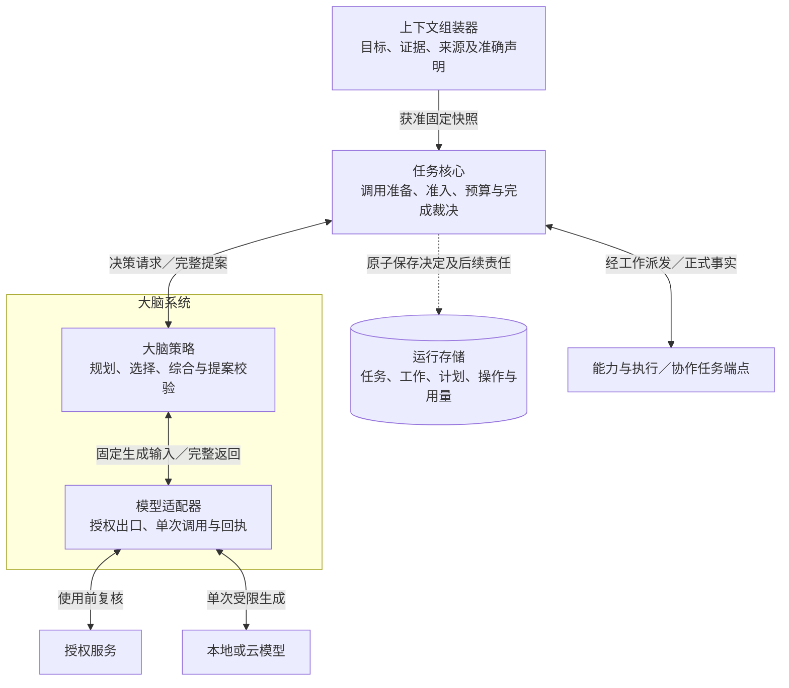
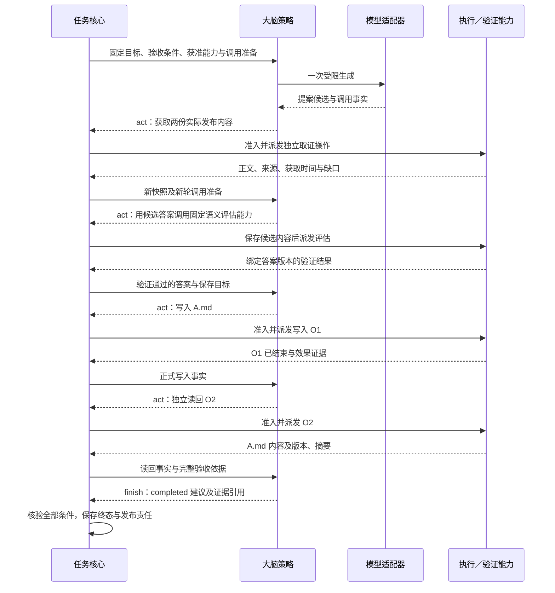

# 大脑系统详细设计

本方案采用受任务核心控制的单轮大脑：策略根据当前事实提出下一步，核心决定是否准入，执行端返回实际效果。规划跨轮调整，任务身份、预算和恢复责任保持连续，替换模型或策略可以沿用同一套任务规则。

本页解释分工与取舍。具体策略见[决策机制](decision-policy.md)，实现接口查[接口与模型运行](contracts-and-runtime.md)，依赖与验收查[验证设计](validation.md)。当前交付为设计文档，尚无大脑运行实现；质量、容量及 V1／V2 目标均待实测。

## 1. 为什么把决策切成单轮

长任务需要根据新证据调整计划，而权限、预算和用户意图也可能在执行期间改变。如果大脑自行运行工具循环，核心同时负责调度与恢复，两边就都要处理重试、取消和下一步行动的资格。尤其在工具已执行但答复丢失时，大脑重新规划可能重复产生同一效果。

因此，大脑每次只提交当前可开始的有界行动批次，后续步骤等正式事实进入核心后再决定。提案只有 `act/wait/finish` 三种，均由核心准入。自主 Agent 通过协作契约接入：内部子任务仍由内核管理生命周期，外部 Agent 保留独立运行时。

这一选择增加了串行步骤经过核心的次数。为减少重复生成，固定规则复用已保存计划，处理前提齐备、参数确定的步骤；理解、规划或综合需要生成时才调用模型。一次 `Brain.Decide` 可以零模型调用，也最多执行一次核心已准备的物理生成；结构修复交回核心，按有限修复规则准备下一次调用。计划不预先授予行动资格，每一步开始时仍须准入。

默认使用固定配置的单模型。多模型竞速可能改善延迟或质量，也增加在途调用、费用和数据披露。只有收益足以覆盖额外成本、逐调用账务与来源均可核对时，才重新评估这一选择。配置边界见[模型配置](contracts-and-runtime.md#model-profile)。

## 2. 策略与适配器为什么分开

策略决定下一步选什么，适配器处理模型调用与核对；两者可以分别替换。这对应[全景图](../diagrams/system-panorama.drawio)中 `decision` 分组的 `brain` 与 `model-adapter`。核心提供固定快照和调用资格，分别约束策略可用的事实与适配器可执行的生成。

下图从一轮决策看模块分工。实线表示请求与返回，虚线表示核心持久保存事实；框和连线表示逻辑职责，不限定进程位置。

上下文组装器把获准记忆、目录的准确声明和任务事实交给核心，大脑据此形成提案。策略先检查输出结构和引用，核心再独立检查当前条件并准入。执行与协作端点保存实际行动或子任务事实，核心持久接收后推进下一轮。完整交接字段由 [Brain.Decide](contracts-and-runtime.md#decide) 和[提案契约](contracts-and-runtime.md#proposal)定义。

适配器需要有限的调用账本，因为核心准备调用、授权消费和模型发送无法共同提交。发送后崩溃时，原调用仍须核对，未知用量和迟到结果仍须回送。因此，适配器保存使用映射、唯一发送门禁和回执，核心保存任务决定与预算，两者可复用宿主事务存储。若将调用回执并入核心，必须同时迁移发送门禁与恢复责任。

模型调用由核心分配的 `(work_id, attempt_no)` 标识。适配器按固定使用键核对授权，发送前复核当前资格，未知提交沿原记录恢复。核心凭输入版本、完整输出和正式事实恢复决策，不保存模型隐含推理；托管会话也须导出获准上下文及完整来源。原子边界见[调用交接](contracts-and-runtime.md#call-handoff)。

## 3. 默认装配与适用边界

应用首先需要定义“任务做成了什么”。核心加载的受信任务策略把用户目标和已确认输入固定为验收条件，验证器提供对应证据。条件仍为 draft 时，只能澄清、执行策略允许的只读取证或提出失败；无法建立受支持判据时，不准入相应目标行动。开放式答案可使用策略指定的语义评估器，其结论只具有该评估方法声明的保证。具体规则见[成果核验](../task-kernel/lifecycle.md#completion)。

这决定了框架的接入成本：新能力除了参数与结果格式，还可能需要目标解释和验证规则。能否复用已有策略、需要补写多少业务知识，须经实际接入验证。

参考实现将受信策略与模型适配器装配在同一进程，适配器封装本地推理或供应方原生 HTTP 接口。默认受限 JSON 结合供应方约束与本地完整校验形成提案；原生工具调用格式也可用于编码。适配器禁用隐式重试、自动工具执行和辅助生成。型号、并发及调用保证由固定 profile 声明，具体配置见[模型契约](contracts-and-runtime.md#model-profile)。

独立远程 Brain 按 [BS-P1 合同](contracts-and-runtime.md#remote)经网关 WSS 承担同一单轮调用，保存接纳与回送责任，任务权威仍在核心。这条路径与本地适配器调用云模型分别验证。个性化、委派、GUI 和离线生成按[依赖表](validation.md#dependencies)开放；离线还需全部本地依赖与有效许可。来源、调用准备或授权缺失不生成，准确声明缺失不提出该行动，必要验证器缺失不建议成功。

远程 Brain、跨端委派和受控策略发布已有合同，但不作为默认闭环前提。多模型并行投票、通用不可信插件隔离及未知调用风险配额保持后置。

## 4. 沿一次任务看决策与恢复

用户要求“核实项目 X 已发布的版本 V甲 与 V乙 的变化，附来源，保存到电脑的 A.md 并读回”。应用已提供这类目标的验收策略，取证、文件读写、语义评估能力及许可齐备；路径有歧义时先澄清，授权确认由受信入口完成。

核心先固定比较范围、保存位置和内容取值规则。答案生成并通过评估后，再把预期内容绑定到该答案的具体版本；写入和读回都核对同一摘要。这允许大脑逐步形成答案，也避免后来修改候选时，拿旧答案的评估或读回结果确认新答案完成。完整条件绑定见[贯穿设计示例](../design-walkthrough.md)。

图展示正常业务顺序，每个行动先经核心准入和持久工作派发。后续轮次可以复用规则与计划；图中未逐次展开模型生成、授权和内容保存。

如果 O1 已写入但答复丢失，核心保存效果未知，执行端沿 O1 核对。大脑此时没有依据再写一次，也不能改用 GUI 产生替身操作。用户随后撤销写权限，只会进一步限制新写入；原操作查询或独立读回是否可做，分别取决于其当前权限。若用户再取消任务，迟到成功仍保存为效果事实并结算用量，任务保持取消。各分支由[异常推演](decision-policy.md#recovery-example)集中定义。

模型调用丢失响应也需要保留原责任，但它付出的主要代价是容量与费用。关闭决策工作或 HTTP 超时，均不足以释放未知预算和物理并发占位；供应方始终无法提供终结依据时，占用可以持续未决，达到核对上限只停止主动查询。新轮能否开始取决于剩余预算和物理容量。选择默认模型后端时，因此必须验证其查询、终止和用量能力，不能只比较生成质量。当前不提供忽略未知占用的开关，完整行为见[调用恢复](contracts-and-runtime.md#recovery)。

控制变化也会关闭旧轮资格：暂停后要显式恢复才能重新决策或正常完成，补输入、补证和加预算均不解除暂停；取消后不再推进目标。两种情况下，迟到调用事实和账单仍按原身份保存。

## 5. 先验证这套分工是否划算

建议先实现上面的本地任务闭环，在冻结任务集上测量完成质量、模型调用次数、总耗时和费用，并注入“写入成功但答复丢失”的故障，检验规则复用与持久交接的实际收益。该实验不替代跨端、替换及 V1／V2 的[完整验收](validation.md)。

接着加入一种未为该场景专门设计的能力，记录策略、验证规则和核心各需改动多少。如果每接一个工具都要修改通用运行逻辑，应先检查能力声明与任务策略之间的接口。只有实际接入暴露了重复，才有依据增加新的抽象。

这两步用于检验现有取舍。若实测表明必须调整调用、预算或恢复保证，应另行决策并联动相关契约。

## 6. 契约与验收索引

本模块承担[项目目标](../../harness-project-goals.md) C1 的理解、规划与决策，并通过获准记忆、证据、行动和委派参与 C2 至 C5。策略与模型替换、授权约束和可追溯调用分别支撑 C6 至 C8；C9 的策略改进只产生可评测候选，发布与回滚由改进管理器负责。A1 至 A4 均适用；V1 验证有实际来源的回答，V2 验证依据观察选择手机动作并核对效果。

下列编号供[验收矩阵](validation.md#tests)引用，完整机制以链接专题为准。

| 编号 | 保证 | 权威位置 |
| --- | --- | --- |
| B1 | 大脑只生成提案；全部行动、等待和终态由核心准入 | [决策顺序](decision-policy.md#selection) |
| B2 | 输出继承固定快照全部来源，能力和证据引用不能伪造或越权 | [证据与上下文](decision-policy.md#evidence) |
| B3 | 每次物理生成均有核心调用准备、当前授权和唯一启动门禁；未知不重发 | [调用交接](contracts-and-runtime.md#call-handoff) |
| B4 | 模型输出完整性、任务准入、业务接纳和效果确认分别有证据 | [提案契约](contracts-and-runtime.md#proposal) |
| B5 | 旧轮输出不能进入新轮，未知费用和物理在途占用不因关闭消失 | [恢复与用量](contracts-and-runtime.md#recovery) |
| B6 | 计划复用、能力回退及委派均不能绕过当前前提、权限与预算 | [能力与协作](decision-policy.md#capabilities) |
| B7 | 替换与优化按冻结场景验证，质量目标和运行成熟度如实报告 | [验收矩阵](validation.md#tests) |
