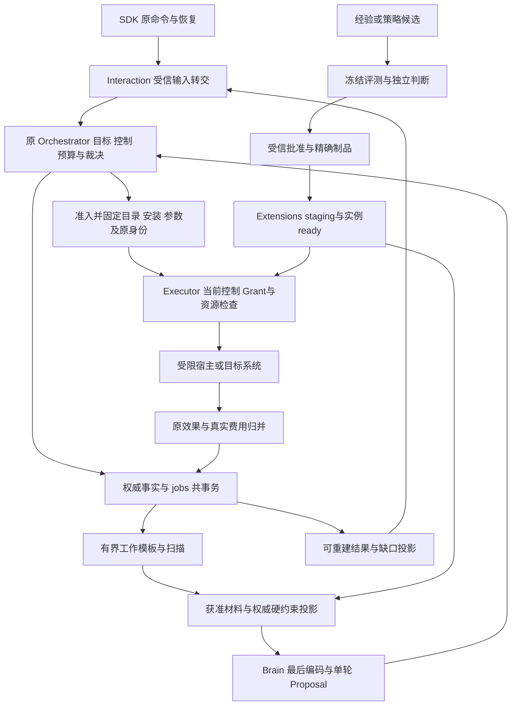

# 五个 Agent Harness 的模块对照与架构优化分析

此次调研支持的主要判断是：本项目已有的九模块、固定逻辑 Orchestrator、独立 Operation/Effect、用途授权、共事务持久工作和评测发布链应继续保留。参考项目最有用的增量是把这些设计落实为可审查的内部次序、适配器和故障语料：上下文投影与原事实分开，最终参数及目录绑定重新核验，先恢复原责任再开放新执行，多端输入与运行状态有准确关联。程序化工具、渐进式工具发现、读时整理和经验精炼需另取冻结对照证据。

这是一份架构分析，不修改 `.draft`、ADR 或公开协议。比较基线、24 项已采用方向与术语见[基线说明](architecture-baseline.md)；源码版本与内容摘要见[sources.json](sources.json)。五份完整报告分别为 [Codex](../codex/README.md)、[Pi](../pi/README.md)、[DeepSeek Harness](../deepseek-harness/README.md)、[Prime Agent](../prime-agent/README.md)、[Crush](../crush/README.md)。所有质量、费用、延迟和容灾收益仍待运行验证；下文的优先级是实现依赖判断，不是 benchmark 排名。

## 1. 先按运行主线比较

| 项目 | 核心组织与产品重心 | 权威状态与恢复 | 最值得抽取的机制 |
| --- | --- | --- | --- |
| Codex | Rust 多 crate；Session/Turn/Step，CLI/TUI/app-server，平台工具宿主 | canonical rollout JSONL；thread-history SQLite 是可重建投影，另有独立元数据/队列/goal/记忆工作状态。文件写者与回合恢复，不等价于分布式效果账本 | 步骤级模型/环境/工具绑定，Prepared MCP call，写权重取得与原回合恢复，类型化贡献点 [E01][E02] |
| Pi | TS workspace；经典 CLI、公开 AgentHarness、独立 pi-durable/Pico 并存 | 默认 CLI v3 JSONL；AgentHarness v4 Storage 和 SQLite adapter；独立 durable 的 format=1 JSONL/SQLite。恢复 open 与再次 drive 分开 | 小循环与宿主分离、可替换存储的一致性、effect_pending 与安全重放双检查、明确参数替换 [E03][E04][E26] |
| DeepSeek Harness | TS/pnpm 的 Definition/Provider/Consumer 能力系列，多种宿主；native/Python 辅助 | SessionEvent、模型 surface 与读投影分开；JSONL 世代/锁/耐久检查点。Goal/Schedule 有自己的状态，jobs-local 仍在内存 | 提交/存储接纳/flush 区分，实际出站前检查点、未启动/效果未知分类、依赖方向门禁 [E05][E06][E07] |
| Prime Agent | Rust supervisor/worker/SessionEngine + Python RLM，持续目标与经验精炼 | 会话 JSONL、command journal、worker queue、父子 ledger、goal/cron/harness state；多文件边界分别恢复 | 持久无进展计数、spawn/collect、上下文机械 digest、精炼 before/after、kernel 中断与复用区分 [E08][E09][E10][E22] |
| Crush | Go 单 module；App/Backend/Workspace，终端 UI 与可选 HTTP/SSE | SQLite 会话/消息/文件版本；运行 queue、确认 waiter 与后台 shell 多为内存 | accepted/cancel 水位、RunID 关联、stream debounce/final flush、多个界面 first-winner 确认 [E11][E12][E13] |

这些项目在同一固定日期的树中已包含不同新机制，不能用早期版本印象比较：Pi 已有 MCP 与多条 durable 线；Codex 已拆出 thread-store/history/rollout 并有 goals；DeepSeek 区分 TOOL_OUTCOME_UNKNOWN；Prime 的当前主干是 Rust/Python；Crush 有可选 server 装配。另一方面，存在这些机制不能证明它们具有本项目同名对象的完整行为。DeepSeek 的 Goal phase 持久、恢复后推进默认 disarmed，Schedule 则先向 session flush 再提交领取回执；二者与内存 jobs 的成功点各自成立。[DeepSeek Goal/Schedule](../deepseek-harness/README.md)

几个关键反例影响选型：

- **日志格式修复不能裁决效果。** Codex/Pi/DeepSeek/Crush 的历史配对或中断结果可恢复模型输入形状；DeepSeek 明确表达 unknown，Pi 部分路径仅在旧与当前声明均 safe 时重放。它们都不能自然替代本项目独立、持久的原 Effect 核对责任。[E03][E07]、[Codex 恢复](../codex/README.md)、[Crush 配对](../crush/README.md)
- **名称不能证明成功点。** Codex 的 `durable_write` 走 recorder.flush，普通追加路径未见 fsync；Crush 的 PublishMustDeliver 超时仍丢；Prime cron 的锁失败可继续无锁 action，状态写失败被忽略而仍返回 dispatch。[E01][E12][E14]
- **同仓并存不能拼接保证。** Pi CLI 的可变 hook 不重验，公开 AgentHarness 的显式 replacement 重验，独立 ToolTask 则 hook 后统一重验；只有实际装配启用的路径才具有对应行为。[E04][E23][E24]
- **模型视图不代表全部出站字段。** DeepSeek 挂载且启用 `session-log-deepseek` 并采用官方 adapter 扩展时，可把 canonical event prefix 另加为 `dsh_session_log`。它包含原事件 data 与会话元数据，受有界前缀和 accepted watermark 控制；压缩 surface messages 不证明这些附加字段已获准或未发送。[E25]、[数据出口条件](../deepseek-harness/README.md)
- **进程/VM 分离不自动构成隔离。** Prime Python 默认当前用户权限，Pi 默认继承进程权限；DeepSeek Cordis VM 明示仅管理合作代码 inspect/dispose，OS sandbox 是另一实现；Crush blocker/consent 仍是本机策略。[E15]、[Prime 安全](../prime-agent/README.md)、[Pi 安全](../pi/README.md)、[Crush 权限](../crush/README.md)

## 2. 九模块逐项反推

下表给出横向差异与本项目应优化的位置。详细数据字段、路径、时序及局部 C/P/D/R/K 编号保留在项目报告，避免将某条实现压成“支持/不支持”的二值表。

| 本项目模块 | 五项目对应实现的差异 | 本项目的优化方向与责任 |
| --- | --- | --- |
| Orchestrator | Codex run_turn/goal、Pi AgentSession 或 Lane/Task scheduler、DeepSeek AgentLoop/Goal/Schedule、Prime GoalDriver/queue/cron、Crush Coordinator/queue。共同点是持续推进；目标真值、运行阶段与会话结束的含义不同 | 保持 Task/Goal/Requirement 唯一裁决。细化无进展、wake、控制和原工作恢复；Goal 更新工具只形成候选，不赋予任务成功。O-01/02/04/07 |
| Brain | Codex capture_step/ContextManager，Pi projection/convertToLlm 与多 adapter，DeepSeek surface/Request/AssistantStreamAttempt，Prime prompt layers/digest/anchor，Crush prompt adjacency/summary | 形成有版本来源的纯投影和最终编码；保留权威硬约束；流展示、完整结果及辅助调用分别记录，默认单轮 Proposal 不变。O-01/03/05 |
| Execution | Codex ToolRouter/PreparedMcpCall/unified_exec，Pi effect_pending/replay/parallel，DeepSeek tool dispatch/checkpoint/unknown repair，Prime kernel/host_request，Crush tools/background shell | 准入后的准确绑定不漂移；记录最终参数、逻辑源序与实际完成序、输出覆盖、物理次数；恢复未知效果沿原 Operation。O-03/04/05/10 |
| Security | Codex OS sandbox/network proxy/approval，Pi hooks/QuickJS/默认进程权限，DeepSeek approval 与平台 probe，Prime 当前用户 Python，Crush permission/hook/blocker | Grant 与 consent、认证、代码运行各自成立。参数变换后重新核查；平台隔离按文件/凭证/网络/进程具体范围开放；合法授权也要有正例。O-03/08/10/12 |
| Memory | Codex 后台提取/合并，Pi branch/compaction/query，DeepSeek surface compression/FTS，Prime local/global HarnessEntry/refine，Crush summary/context/history | 会话材料不能自动变长期记忆。保存来源/时间/冲突、权限及派生关系；经验候选进入有版本的评测链，读时整理只在 X-02 取证。O-01/09/12 |
| Collaboration | Codex AgentControl/父子图/冷恢复，Pi 普通 CLI 子进程与独立 durable Reporter，DeepSeek stable child/Activation/capabilities，Prime ledger/spawn/collect，Crush 子 session/文本与 best-effort cost | 实现已有 Delegation 唯一子映射、结果范围、取消、效果及账务封闭。SDK 提供 admission handle/read/wait，冷恢复保持原安装组合；文本与 phase 不能取代 closure。O-06/07/12 |
| Interaction | Codex app-server pending 请求/事件，Pi Chord/attachment fence/RPC disposition，DeepSeek controller/store/React 与 live settlement，Prime queue/attach chunks，Crush Workspace/SSE/first-winner | SDK 区分接纳、转交、消费、运行呈现、效果未知与任务完成依据；旧流、重复确认、取消和断线按原身份恢复，读取权威快照。O-05/07 |
| Extensions | Codex typed registry/Skill/plugin staging，Pi loader stage/commit/多种 MCP exposure，DeepSeek Definition/Provider/Consumer/Cordis/Profile，Prime Python Skill/harness edits，Crush Skill manager/MCP reconcile/LSP | 精确制品、依赖、配置世代与 current approval 决定 ready；接口维持深模块与单向依赖。hook 不造授权，动态精炼只形成候选。O-03/08/09/11 |
| Evaluation | Codex mock/回归/OTel，Pi backend conformance/stream/paired eval，DeepSeek corpus/expected/benchmark，Prime faux/gates/refine/trace，Crush race/多客户端测试 | 将真实故障刺激改写为统一有界语料，机制套件与质量实验分开。保留全部物理尝试、暴露与费用，独立真值后决定候选资格。O-09/10/11/12 |

各行的项目事实详见五份报告相应模块映射；本项目现行责任定义见[基线](architecture-baseline.md#1-九个领域及其事实归属)。原草稿 ORC-01、EXE-03、SEC-01、COL-01、UI-01 等已经覆盖行为要求，这里的增量主要是内部组织和可验证反例。

## 3. 优化后的内部数据与调用关系

本节是建议的实现组织图；对象名沿现行契约，不新增公开方法或独立事实负责方。可重建视图、工作进程和传输 adapter 分别服务原领域。

这里的“投影”包括用途不同的模型输入、UI 读模型与诊断材料：它们可引用原事实和准确 Content，不能更新 Task/Effect/Grant 的真值。底层 PG/SQLite adapter 内部承接 SQL、领取、版本检查和重建，调用者不必知道生成 query 或每条锁序。共同工作模板的 interface 隐藏重复领取/旧完成等复杂性，同时保留领域成功点；这符合深模块（deep module）的组织方式。[工程布局](../../architecture/.draft/engineering.md#layout)、[可靠工作](../../architecture/.draft/reliable-work.md)

不需要为了参考项目新增 seam：PG/SQLite、模型 adapter、Executor driver、内部/外部 Agent、local/remote SDK 已有真实可变实现。能力 seam 在原接口上补足不变量、错误、恢复、配置和性能范围，比按每个目录再加一层 registry 更能集中复杂性。具体 import 门禁属于 O-08/12。

## 4. 十二项可落地优化

P0 先进入最小可靠闭环，P1 随能力和实验开放；任何依赖隔离或授权的路径须先满足其前提。每项都标注增量性质、原 owner、建议位置、参考机制、成本与验收。

### O-01：把上下文组织成有来源的纯投影（P0，落实＋细化）

**修改位置。** [Brain context optimization](../../architecture/.draft/brain/implementation.md#context-optimization)、Orchestrator 的快照组装、Memory 来源与 Interaction 读取。沿现有 DecisionRecord/ContentRef 记录准确输入材料、来源/使用范围、配置与编码参数；内部将权威硬约束、获准正文、近期事实、候选摘要和最后 provider 编码分别组织。硬约束由原事实机械重建，摘要不能覆盖它们；最终来源覆盖附加日志/插件字段，不能只登记模型 messages。

**依据。** Codex canonical history 与 SQLite projection；Pi 的 session projection；DeepSeek log/surface 与可挂载的请求附加字段；Prime 的机械 digest、fingerprint 和 retained-tail anchor；Crush 的 tool adjacency。[E01][E05][E09][E22][E25]、[Pi](../pi/README.md)、[Crush](../crush/README.md)

**成本与验收。** 增加材料版本/水位、重建和编码诊断成本。复用 ORC-01/02、BRN-01、MEM-01、UI-01 与 OPT-01/02/07：三次压缩、目标修订、冲突、unknown 写入、来源关闭后仍逐项可查；投影落后明确标记，超窗不发送。候选摘要的实际质量和全成本进入 X-01，不能从“摘要较短”推断改善。

### O-02：持久保存有界推进与无进展依据（P0，细化）

**修改位置。** [Orchestrator jobs/TaskPolicy](../../architecture/.draft/orchestrator/implementation.md)、[可靠工作](../../architecture/.draft/reliable-work.md)。将推进次数、已计数反馈、无进展原因与下一次可检查条件按原 Task 保存，唤醒依赖原 JobStore；区分新目标事实、新结果、新人工输入和纯重复通知。重启或重复领取不重置预算，也不把一次反馈计两次。

**依据。** Prime 的持久 no_progress_streak/turn 与 owed/pending continuation、Crush 的输入/输出工具签名检测、Codex/DeepSeek 的独立 Goal 状态。[E08]、[Crush](../crush/README.md)、[Codex](../codex/README.md)、[DeepSeek](../deepseek-harness/README.md)

**成本与验收。** 需先定义业务可观察进展，增加有限计数与诊断；不能把所有重复读回判为空转。重启、重复反馈、失联子任务、目标被修订、模型拒绝与预算耗尽分别取证。达到上限保留原未知及继续条件，不宣称成功；等待原效果不应反复调用模型探活。此项细化已有有界自治，没有新增 Goal 权威或自动跨端接管。

### O-03：固定最终参数与能力绑定后再准入（P0，落实＋细化）

**修改位置。** [Execution catalog](../../architecture/.draft/execution/implementation.md#catalog-conformance)、[Security 入口](../../architecture/.draft/security/README.md#boundary-validation)、Extensions hook 合同。hook、模板、MCP wrapper 和脚本对候选的变换全部在准入前完成；随后严格 Schema 校验、资源规范化、准确 CatalogVersion/InstallLock 绑定。实际入口再次核查当前控制、Grant、预算及资源。Brain 最后编码同样覆盖每个实际出站字段的来源、接收方和用途，诊断/日志字段不因模型 messages 已获准而豁免。

**依据。** Codex PreparedMcpCall 在捕获目录 lease 内执行；Pi 三条 hook 路径的不同重验证行为；Crush allow hook 可绕本机 permission 的反例；DeepSeek 附加日志字段显示最终请求核验的必要性。[E02][E04][E16][E23][E24][E25]

**成本与验收。** 多一次校验、绑定/当前资格查询和拒绝诊断。复用 EXE-01、SEC-01、EXT-01 与 OPT-03/08/09，注入参数改金额/收件人/路径、符号链接、同名能力、旧目录刷新、批准撤回等变化。旧 Operation 不因目录漂移改投同名新工具；合法变换有正例，hook allow 不能生成 Grant。

### O-04：恢复原责任与开放新执行分别完成（P0，落实＋细化）

**修改位置。** [host 重启](../../architecture/.draft/deployment.md)、[可靠工作](../../architecture/.draft/reliable-work.md)、Brain/Executor 的实际出站 gate。启动先加载原事实/未决工作，核验旧实例已隔离及当前批准/权限/存储资格，再开放新派发；恢复完成是可观察状态。提交 unknown 按原 command 查账，不以新身份补发。

**依据。** Pi create 返回 open 而不自动 drive；Codex 取得写权、核对 revision 再恢复；DeepSeek semantic checkpoint 失败阻止下游；Prime cron 锁失败/写失败仍可能返回派发项是负例。[E06][E14][E26]、[Codex 恢复](../codex/README.md)

**成本与验收。** readiness 窗口、扫描和真实提交等待；复用 ADR-0009、EXE-03、BRN-01。实际记录出站次数，在提交前失败、提交回执丢失、commit 成功后 crash、旧 writer 未隔离、PG 不可写及丢唤醒条件下验证。未确认耐久准入前不启动费用/效果；本机进程断点与生产单区故障独立取证。

### O-05：统一 adapter 的原始输出与覆盖诊断（P0，落实＋细化）

**修改位置。** [Execution 输出](../../architecture/.draft/execution/implementation.md#output-coverage)、Brain ModelAdapter、Interaction 结果投影。逻辑调用源序与实际完成序分别关联；保留原始准确结果、大字节引用、截断/分页/过滤/时间及 partial 范围。实时 token、物理尝试 settlement、模型兼容占位与权威 Operation 结果分开，费用沿原来源累计。

**依据。** Pi/Prime 并行完成顺序与 transcript 源序分开；DeepSeek live frame/settlement；Crush 的第一份媒体转换及消息 debounce/final flush。[E17][E12]、[Pi](../pi/README.md)、[Prime](../prime-agent/README.md)、[Crush](../crush/README.md)

**成本与验收。** 增加队列、原始字节/输出元数据、归并及有界 spill。落实 EXE-02/03、BRN-01、EVA-02、UI-02：工具乱序、漏页、合法空集、旧缓存、流半途错误、超量媒体和未知账单均用独立真值检查。不能用合成 interrupted 响应让 unknown 消失；重放通知不重复展示，不改变最终成功点。

### O-06：在原 Delegation 之上提供异步子 Agent 辅助（P1，落实＋细化）

**修改位置。** [Collaboration](../../architecture/.draft/collaboration/implementation.md)、sdk/go 与 sdk/ts。提供 admission handle、read/wait/batch read 等薄辅助，引用现有 Delegation 和唯一子 Task；handle 表示已接纳。内部冷恢复引用精确 InstallLock/组合和原父子映射，current capabilities 不足时拒绝新 activation，仍可查原责任。

**依据。** Prime spawn/collect、Pi durable Reporter、DeepSeek durable child/Activation、Codex 冷子恢复；Crush 子 cost best-effort 是封账反例。[E10][E18]、[Pi](../pi/README.md)、[Codex](../codex/README.md)、[Crush](../crush/README.md)

**成本与验收。** 有界等待、查询和投影维护，复用 COL-01/02 与 OPT-05/11：父在子效果后 crash、重复 report、父取消、晚到费用、子组合漂移、不支持字段、未封账预算均可解释。父成功仍查子必要效果与结果范围；SDK 不新增状态机，X-05 包含等待、汇总、清理和失败成本。

### O-07：把多端输入与运行呈现的竞态写成合同（P0，细化）

**修改位置。** [Interaction](../../architecture/.draft/interaction/implementation.md)、原业务 owner 的输入消费、[WSS](../../architecture/.draft/contracts/transport.md)及 SDK。使用现行 command/InputSubmission/InputRequest/Surface 世代，不另造 RunID 权威。持久记录 input 接纳和消费；取消只覆盖规定范围，后来的独立输入按规则处理。投影 commit 可读后发送可丢 hint，断线重读原快照。

**依据。** Crush accepted/cancel 水位、first-winner deny/confirm 和 RunComplete flush；Pi attachment fence/Chord revisions；Prime 分块快照；DeepSeek 实时/提交结果分离。[E11][E12][E13][E17]、[Pi](../pi/README.md)、[Prime](../prime-agent/README.md)

**成本与验收。** 连接水位、快照/缓冲上限、SDK 原命令存储和并发 Tx。落实 UI-01/02 与 ADR-0008：accepted 未领取取消、旧运行退出后新运行接入、队列切换、两设备 deny/confirm、旧 preview 与新版本、撤权、丢 terminal hint 和本地存储失败。败方不能写入自动许可，超时/断线不能当输入已消费或 Task 已完成。只允许呈现增量 debounce，业务接纳、Grant 和完成证据不可缓冲成“稍后可能保存”。

### O-08：集中安装 staging、配置世代和能力就绪（P1，落实＋细化）

**修改位置。** [Extensions](../../architecture/.draft/extensions/implementation.md#artifact-integrity)、runtime 组合根、adapter readiness。按已有 InstallLock 实际字节/依赖 stage 实例和工具注册，核验 current approval、健康、平台、配置世代后开放 ready；失败释放暂存 handler，原失败与恢复责任仍可查。Go 内置静态组合、第三方受控进程/服务的既定选择不变。

**依据。** Codex 类型化贡献点/plugin staging、Pi loader commit/discard、DeepSeek Definition/Provider/Consumer、Crush PendingConfig/Config 的 reconcile。[E19]、[Codex](../codex/README.md)、[Pi](../pi/README.md)、[DeepSeek](../deepseek-harness/README.md)

**成本与验收。** 生命周期、精确配置和失败清理；依赖门禁及生成新鲜度。落实 EXT-01/03、SEC-02 与 OPT-09/10：半包、stage 异常、依赖漂移、装载后字节被替换、初始化中配置再变、旧版批准失效。回退仍查 ADR-0007；Cordis/JS module unload 和子进程退出不证明外部效果或持有字节已清除。

### O-09：经验精炼形成准确候选，再走既有评测发布（P1，实验＋落实）

**修改位置。** Memory/Extensions 的候选形成与 [Evaluation](../../architecture/.draft/evaluation/README.md)。借鉴 kind/scope/version、来源、before/after、竞争检测和 rollback 关联；产生准确 Content 候选，未经独立保存许可的任务局部材料不进入跨任务 Memory。选择后冻结候选，经未暴露正式样本、独立判断与受信批准才影响后续任务。

**依据。** Prime continual harness/refinement 的可审查编辑链，Codex 记忆提取/合并，以及 Pi/DeepSeek Skill 发现与加载来源。Prime expected_outcome 与 shell gate 通过只是候选理由/特定检查，不是改善资格。[E20]、[Codex](../codex/README.md)、[Pi](../pi/README.md)、[DeepSeek](../deepseek-harness/README.md)

**成本与验收。** 额外模型调用、候选版本、完整评测和隔离存储；落实 MEM-01/03、EXT-02/03、EVA-01/03。条目在 plan 后变化拒绝误覆盖，部分应用显式报告；纠正、local_only、源关闭、正式样本暴露及回退批准失效均保留。读时整理用 X-02，Skill 策略用 X-03，自动生成经验需另冻结候选形成因素，不用“它会自我改善”作为采用理由。

### O-10：受限程序化工具作为适配器候选（P1，实验）

**修改位置。** Executor driver 和已验证的执行宿主，不装入 Brain 自主长循环。程序只能处理获准内容并经受控 host call 提出/执行有限工作；每次外部效果、额外模型请求及子委派仍按原接口逐项准入、关联和计费。代码、运行配置和输出固定版本，abort 回执与实际 cell/子进程停止分开；恢复不得执行不可信对象反序列化。

**依据。** Codex V8 code-mode、Pi QuickJS Codemode、Prime Python RLM 的组合能力及明确 kernel 生命周期。DeepSeek Cordis VM 仅约束合作代码的生命周期；Prime Python 默认使用当前用户权限，二者都不能仅凭运行时名字证明隔离。[E15]、[Codex](../codex/README.md)、[Pi](../pi/README.md)、[Prime 安全边界](../prime-agent/README.md#6-python-rlm工具与安全)

**成本与验收。** 运行时维护、隔离、字节/时间/输出上限、checkpoint 与跨 host call 记录，复杂度显著高于单一工具。先通过 SEC-02/EXE-03，实测出站、符号链接、DNS/重定向、凭证、子进程、取消与恢复。若编译为原有限计划，沿 X-06；交互 cell 另冻结实验，不能套用有限计划分母。与逐步执行比较独立成功率、违例、全部尝试、维护/失败/核对费用，结果 inconclusive 保留基线。

### O-11：渐进式目录发现与 Skill 加载独立对照（P1，实验）

**修改位置。** Brain 选择诊断、Execution 目录读路径、Extensions Skill/Agent 材料合同。在同一准确 CatalogVersion 与安装组合上比较 direct 目录、受控检索和延迟加载；记录召回、选择、正文实际加载及是否改善任务。发现结果是候选集合，不解除最终绑定、当前权限或安装资格检查。

**依据。** Pi 多种 MCP exposure、Codex 不可变 catalog binding、DeepSeek capability registry、Crush Skill metadata/LSP 懒启动、Prime Python Skill discovery。各项目只证明有发现机制，不能据此给出大目录召回率或费用收益。[E02]、[五份报告](README.md#reports)

**成本与验收。** 搜索调用、缓存当前性、加载延迟与失配诊断。落实 BRN-02、EXT-02 和 X-03：同名能力、旧 schema、断连、缺依赖、应触发/不应触发、加载过晚和加载无益分别计分；候选正负例及适用前提固定版本。不能仅比较工具目录 token 大小。

### O-12：共享可回放语料，保持机制与质量证据分离（P0，落实＋细化）

**修改位置。** [tests/conformance、integration、faults、quality](../../architecture/.draft/engineering.md#layout)、Evaluation 与各 adapter。从参考仓库抽取故障刺激方式，构造本项目统一 vector；真实 PG/SQLite 通过同语义 interface 分别执行，固定 stream 仅验证 ModelAdapter。公开契约生成结果要保持新鲜，consumer 不导入具体 backend。

**依据。** Pi backend conformance/paired eval、Codex 目录刷新/压缩重放/写失败、DeepSeek 历史格式 corpus、Prime goal/queue/kernel/faux、Crush race/多客户端/取消测试。[E21]、[Codex](../codex/README.md)、[DeepSeek](../deepseek-harness/README.md)、[Prime](../prime-agent/README.md)、[Crush](../crush/README.md)

**成本与验收。** 真实故障环境、语料版本/权限、数据暴露、执行矩阵及独立真值维护。机制契约通过不证明模型质量，质量评测必须完整样本/尝试/费用且未污染正式证据。注入评分误放行/误挡、包装器丢字段、UI 夸大，以及模型视图压缩但附加日志仍出站的情况 [E25]；EVA-02 只归因有证据的环节，保留未知。静态生成通过不得代替存储和平台实测。

## 5. 对工程、存储和部署的具体影响

| 现有位置 | 建议增量 | 不需要增加的结构 |
| --- | --- | --- |
| `internal/orchestrator`、`brain`、`memory` | 内部纯投影、来源/编码记录、持久 no-progress、独立摘要候选 | 另一 Task/goal scheduler 或第二个 Brain loop |
| `internal/execution`、`security`、driver adapters | 准入前变换与规范化、精确 binding、真实出站 gate、覆盖/物理尝试诊断 | 由 hook 创建的许可、自动同义补发或聊天状态代替 Effect |
| `internal/durable`、host、storage adapters | 共事务模板的细化用例、启动恢复/readiness、投影重建、明确 commit unknown | 新消息队列、工作流引擎、共享 JSONL 生产账本、九套数据库 |
| `sdk/go`、`sdk/ts`、Interaction、Web | 薄组合 facade、原命令恢复、child handle 辅助、多端确认与流世代检查 | 客户端完成裁决者或一条终结事件承担全部成功含义 |
| Extensions、runtime、packaging | staging、当前配置世代、精确安装/健康/批准，明确能力降级 | 动态 Go plugin、任意宿主 JS/Python 默认执行权限 |
| tests 与 Evaluation | 共享故障语料、跨 backend conformance、独立质量与全成本报告 | 以 CI 或 README 指标替代 EvaluationRun/ReleaseApproval |

所有位置均沿[现有布局](../../architecture/.draft/engineering.md#layout)，不是此次创建的代码目录。PG/SQLite 方言仍分别组织显式 SQL 与受控迁移；只有业务事实存在新归属或真实隔离/伸缩需求才拆分事务范围。代码规模、上游 crate 数量和 UI 目录数量不是拆服务的理由。

## 6. 建设顺序与退出证据

| 现有工程切片 | 接入的优化 | 退出时必须取得的证据 |
| --- | --- | --- |
| 1.1 契约/SDK；1.2 持久基础 | O-03/04/12，O-08 的必要精确安装/启动部分 | 真实 PG/SQLite Tx、重复领取/旧完成、commit unknown、实际出站次数；当前安装资格和失败关闭；生成/严格解析一致 |
| 1.3 第一条文件任务；1.4 模型费用 | O-01/02/05、O-06 最小已有映射、O-07 的业务消费 | 原 Operation 保存丢答复/晚到写、取消后的 unknown、目标条件独立核验、模型单次物理请求及累计费用恢复 |
| 1.5 Web/多进程与后续能力 | O-06/07/08、后台有界输出、真实能力覆盖 | 两端确认/撤权竞争、断连旧流、快照恢复、子原效果/费用、配置世代与排空；公司平台另验生产指标 |
| 长任务与选择/改善实验 | O-09/10/11 及 O-01 的候选策略 | 冻结样本/各臂/阈值，独立真值，全部物理尝试/完整成本，未暴露证据与批准，旧版独立回退资格 |

顺序是建议映射到[现有阶段](../../architecture/.draft/engineering.md#phases)，不估算工期，也不要求在最小任务前实现所有 105 方法。某项候选有静态结构但缺运行证据时，只交付诊断或实验材料；原 unknown、预算预留与清理责任继续存在。

## 7. 故障和实验的补充向量

| 组合刺激 | 已有要求/补充位置 | 独立断言 |
| --- | --- | --- |
| 提交答复丢失，worker 重启，通知同时丢；随后实际写入晚到 | OPT-05、FW 共同模板、O-04/05 | 原标识继续查；不换工具/Agent 同义写；Task 目标状态与效果责任分别正确 |
| hook 改最后参数，目录更新，Grant 同时撤回 | OPT-03/08/09、O-03/08 | 实际入口准确绑定/当前许可；未准入出站为零，合法授权正例仍通过 |
| 模型 messages 获准/已压缩，插件另附 canonical log、cwd 或 lineage | BRN-01、SEC-01、OPT-07/08、O-01/03/12 | capture 最后编码的全部字段；未获准正文/元数据不出站，当前许可正例及字段尺寸检查通过 |
| 三次压缩，目标条件修订，旧工具无结果，Memory 源关闭 | OPT-02/06/07、X-01/02、O-01 | 原硬约束、unknown、冲突与来源仍在；摘要不继续使用被关闭正文 |
| input accepted 未领取，旧 run 退出，新 input 到达，两设备 deny/confirm | 既有输入/控制规则、O-07 | 消费一次、败方不写许可；取消范围正确，后来的独立输入不被旧控制误杀 |
| 子效果已发生而父 crash，报告重复，child 组合失效，费用晚到 | OPT-05/11、O-06 | 唯一子映射不变；原报告消费与未决效果/累计费用可查；不因子 complete 误判父 |
| live chunk 到达但 settlement 失败，terminal hint 过载丢失，重连旧世代晚到 | 协议/流控、O-05/07 | 读取原事实解释缺口；部分流不拼成成功结果；旧流不覆盖新 Surface |
| refinement 计划后基线变动、部分应用，选择样本暴露，旧版批准失效 | OPT-09/10/11、O-08/09 | 候选准确版本及范围；证据不重用作正式未暴露样本；不能仅恢复旧文件就 ready |
| 平台 runner/probe 失败，VM helper 可访问宿主，程序中再发网络/子进程 | OPT-08/09、O-10 | 具体能力失败关闭，无裸执行；每个真实出口可追责，不用 VM 名字作为隔离证明 |

这些是拟加入现有套件的验收刺激，本次没有运行。X-01～06 的预先冻结和统计定义继续见[优化证据](../../architecture/.draft/validation/optimization-evidence.md#experiments)。新增程序化 cell 或精炼候选若不符合既有实验因素，单独冻结对照，不隐式扩展原实验含义。

## 8. 局部建议到综合方案的追踪

| 综合项 | 项目局部建议（详见各项目报告） | 现有设计关联 |
| --- | --- | --- |
| O-01 | C-01/02/11、P-01、D-01/08/13、R-01、K-03 | ORC-01/02、BRN-01、MEM-01、UI-01 |
| O-02 | C-01、R-02；Crush loop detection、DeepSeek Goal 机制 | 有界自治、预算与原 JobStore |
| O-03 | C-03/04、P-03、D-13、K-06 | EXE-01、SEC-01、EXT-01 |
| O-04 | C-12/13、P-02/05、D-02/03/11；Prime cron 负例 | EXE-03、BRN-01、ADR-0009 |
| O-05 | C-02/03/11、P-04、D-05/10/12、R-06、K-02/05 | EXE-02/03、EVA-02、UI-02 |
| O-06 | C-06、P-07、D-06、R-03；Crush 费用负例 | COL-01/02、EXT-01 |
| O-07 | C-07/11、P-08、D-05、R-06/07、K-01/02/04 | UI-01/02、ADR-0008、原控制/输入契约 |
| O-08 | C-08/14、P-10、D-04/06/07、K-06 | EXT-01/03、SEC-02、ADR-0010 |
| O-09 | C-05/09、R-05；Pi/DeepSeek Skill | MEM-01/02/03、EXT-02/03、EVA-01/03 |
| O-10 | C-03/04、R-04；Codex/Pi code mode、DeepSeek VM 隔离反例 | SEC-02、EXE-03、适用的 X-06 或独立实验 |
| O-11 | C-03/08、P-06、K-05；DeepSeek capabilities、Prime Skill | BRN-02、EXT-02、X-03 |
| O-12 | C-09/10/14、P-09、D-04/09/13、K-07；Prime 测试资产 | EVA-01～03、共同接口/后端/运行套件 |

上游没有提供等价完整机制的部分，继续按本项目基线建设：目标条件与真实成功链、用途授权及消耗结算、跨任务来源关闭、取消后持续效果核对、可信输入一次消费、准确制品评测批准和生产容灾。调研证据支持细化这些规则，尚不支持降低它们或宣称某项候选已优于当前设计。

## 固定提交关键证据

完整源码索引在每份项目报告；这里仅列影响综合判断的机制。所有引用使用固定 commit；范围核验见[验证记录](verification.md)。

[E01]: https://github.com/openai/codex/blob/d4a475adda850d80b6149c76454de94e0cf4fd51/codex-rs/thread-store/src/local/live_writer.rs#L327-L382
[E02]: https://github.com/openai/codex/blob/d4a475adda850d80b6149c76454de94e0cf4fd51/codex-rs/core/src/mcp_tool_call.rs#L436-L480
[E03]: https://github.com/earendil-works/pi/blob/8ce69e9d2b171d173fe4b6b2b6256f1f4411e69d/packages/agent/src/harness/runtime/drive/tools.ts#L478-L539
[E04]: https://github.com/earendil-works/pi/blob/8ce69e9d2b171d173fe4b6b2b6256f1f4411e69d/packages/agent/src/harness/execution/tools.ts#L100-L121
[E05]: https://github.com/deepseek-ai/deepseek-harness/blob/639ed015397290b3745d163aafe02ffee4aa3f84/packages/core/session/src/index.ts#L711-L795
[E06]: https://github.com/deepseek-ai/deepseek-harness/blob/639ed015397290b3745d163aafe02ffee4aa3f84/packages/session/session-checkpoint-policy/src/index.ts#L20-L82
[E07]: https://github.com/deepseek-ai/deepseek-harness/blob/639ed015397290b3745d163aafe02ffee4aa3f84/packages/core/session/src/repair.ts#L14-L97
[E08]: https://github.com/PrimeIntellect-ai/prime-agent/blob/5784abc2aef523a78d5a8850a0c0be89883388b2/crates/pa-core/src/session_engine/goal_driver.rs#L590-L688
[E09]: https://github.com/PrimeIntellect-ai/prime-agent/blob/5784abc2aef523a78d5a8850a0c0be89883388b2/crates/pa-core/src/session_engine/compact_session/prepare.rs#L87-L149
[E10]: https://github.com/PrimeIntellect-ai/prime-agent/blob/5784abc2aef523a78d5a8850a0c0be89883388b2/prime-agent-runtime/src/rlm/__init__.py#L390-L425
[E11]: https://github.com/charmbracelet/crush/blob/76cc5c574e15072b15aaed0f4f843a5711fae0d9/internal/agent/agent.go#L1299-L1410
[E12]: https://github.com/charmbracelet/crush/blob/76cc5c574e15072b15aaed0f4f843a5711fae0d9/internal/pubsub/broker.go#L1-L48
[E13]: https://github.com/charmbracelet/crush/blob/76cc5c574e15072b15aaed0f4f843a5711fae0d9/internal/permission/permission.go#L111-L174
[E14]: https://github.com/PrimeIntellect-ai/prime-agent/blob/5784abc2aef523a78d5a8850a0c0be89883388b2/crates/pa-core/src/cron/store/state.rs#L261-L375
[E15]: https://github.com/deepseek-ai/deepseek-harness/blob/639ed015397290b3745d163aafe02ffee4aa3f84/packages/extensions/cordis-host-runner/src/sandbox.ts#L1-L35
[E16]: https://github.com/charmbracelet/crush/blob/76cc5c574e15072b15aaed0f4f843a5711fae0d9/internal/agent/hooked_tool.go#L54-L94
[E17]: https://github.com/deepseek-ai/deepseek-harness/blob/639ed015397290b3745d163aafe02ffee4aa3f84/packages/core/agent-loop/src/agent.ts#L398-L538
[E18]: https://github.com/deepseek-ai/deepseek-harness/blob/639ed015397290b3745d163aafe02ffee4aa3f84/packages/subagent/subagent/src/continuation.ts#L1-L101
[E19]: https://github.com/charmbracelet/crush/blob/76cc5c574e15072b15aaed0f4f843a5711fae0d9/internal/agent/tools/mcp/lifecycle.go#L16-L117
[E20]: https://github.com/PrimeIntellect-ai/prime-agent/blob/5784abc2aef523a78d5a8850a0c0be89883388b2/crates/pa-core/src/refinement/planner.rs#L285-L358
[E21]: https://github.com/earendil-works/pi/blob/8ce69e9d2b171d173fe4b6b2b6256f1f4411e69d/packages/session-backends/sqlite-node/test/storage-conformance.test.ts#L1-L55
[E22]: https://github.com/PrimeIntellect-ai/prime-agent/blob/5784abc2aef523a78d5a8850a0c0be89883388b2/crates/pa-core/src/session_engine/compact_session.rs#L425-L473
[E23]: https://github.com/earendil-works/pi/blob/8ce69e9d2b171d173fe4b6b2b6256f1f4411e69d/packages/coding-agent/src/core/extensions/types.ts#L1198-L1212
[E24]: https://github.com/earendil-works/pi/blob/8ce69e9d2b171d173fe4b6b2b6256f1f4411e69d/packages/durable/src/harness/tool.ts#L33-L115
[E25]: https://github.com/deepseek-ai/deepseek-harness/blob/639ed015397290b3745d163aafe02ffee4aa3f84/packages/session/session-log-deepseek/src/index.ts#L38-L244
[E26]: https://github.com/earendil-works/pi/blob/8ce69e9d2b171d173fe4b6b2b6256f1f4411e69d/packages/agent/src/harness/runtime/harness.ts#L375-L408
