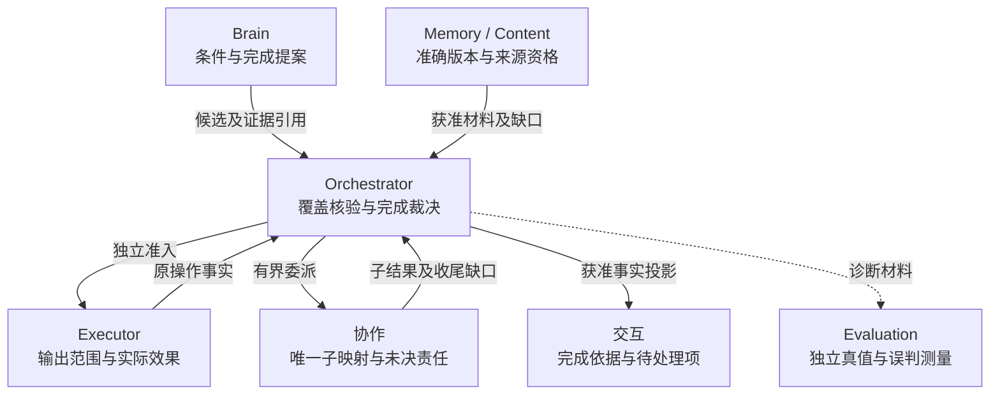

# 2026 年 9 月 AI 调研：各模块优化项

整理日期：2026-09-28。对照[项目目标](../harness-project-goals.md)、[现行架构](../architecture/README.md)及[交付审查](https://github.com/ruipengliu/lerna/blob/da9208c9fb24715d5509782e594981f08713cc54/docs/architecture/review.md)，将调研启发拆为九个模块、24 项优化工作。用户已确认按这些方向优化方案；正式规则、预期效果和验收落点见[采用清单](https://github.com/ruipengliu/lerna/blob/da9208c9fb24715d5509782e594981f08713cc54/docs/architecture/validation/optimization-evidence.md)。本文保留研究动机、原编号与优先级，行为以所属模块现行方案为准。

材料范围为[《AI领域调研报告》](chatgpt-conversation://6a5f09b7-ea50-83ec-bf6d-26a2576aac1d)当前可读取的 9 月 18—27 日 10 期日报，其中 7 期末尾被截断；未取得 9 月 1—17 日内容。[19 项一手来源核验](ai-report-2026-09-source-check.md)保留论文版本、核验深度及适用限制。优化方向来自本项目推论，论文成绩不作为项目收益承诺。

## 1. 优化范围与判定方式

推荐保持现有九模块和固定 owner 分工，先交付能准确解释完成、缺口与恢复的运行闭环，再比较上下文、Skill、计划和协作策略的收益。当前仍是设计与静态资产阶段，下表中的“落地”不表示已有运行实现。

| 标记 | 含义 |
| --- | --- |
| P0 | 优先纳入首批运行闭环及测量；不表示必须一次完成全部能力 |
| P1 | 基线可运行后验证增量；既有授权、隔离和恢复前提仍须先满足 |
| 落地 | 已有设计需要落实为默认实现、接入夹具或运行证据 |
| 增补 | 在既有模块职责内补具体规则、材料或呈现方式；本次确认后已纳入对应方案，运行待实现 |
| 实验 | 比较候选策略；只有通过适用范围内的质量与成本门禁后才考虑采用 |

所有优化方向已确认，运行实现与收益仍待验证；实验项不表示已经选定候选算法。优先使用既有对象、能力输出 Schema、受控内容和内部接口，本次方案修订没有新增公共线字段。既定分布式生产形态、多副本恢复、权限边界、90%／95% 质量目标及正式评测门禁保持。

## 2. 模块优化总表

| 牵头模块 | 优化重点 | P0 项 | P1 项 |
| --- | --- | --- | --- |
| [Orchestrator](#orchestrator) | 目标覆盖、上下文组装、有限计划的适用边界 | ORC-01、02 | ORC-03 |
| [Brain](#brain) | 实际输入校验、能力与 Skill 选择、规划策略 | BRN-01 | BRN-02、03 |
| [执行](#execution) | 准确能力解析、返回完整性、效果恢复 | EXE-01、02、03 | — |
| [记忆与内容](#memory) | 时间与冲突保留、读时整理、派生失效 | MEM-01 | MEM-02、03 |
| [权限与隔离](#security) | 不可信内容不能产生许可、实际执行出口 | SEC-01 | SEC-02 |
| [Agent 协作](#collaboration) | 子结果交接、委派收益与代价 | COL-01 | COL-02 |
| [应用与交互](#interaction) | 完成依据呈现、用户可操作的缺口 | UI-01、02 | — |
| [扩展与宿主](#extensions) | 实际制品核验、Skill 材料、策略发布 | EXT-01 | EXT-02、03 |
| [观测、评测与改进](#evaluation) | 分层评测、失败归因、组件收益 | EVA-01、02、03 | — |

共 15 项 P0、9 项 P1。R1—R7 保留为原调研主题编号，便于回查[来源与优化项映射](#research-mapping)。

图聚焦完成证据的交接，省略装配、许可查询及其他调用。实线表示提案、准入或业务事实交接，虚线表示获准诊断材料；方框是逻辑职责。

## 3. 各模块优化项

### 3.1 Orchestrator：把目标、事实和下一步连接准确

现有基础：[任务运行](../architecture/orchestrator/README.md)、[任务验证](https://github.com/ruipengliu/lerna/blob/da9208c9fb24715d5509782e594981f08713cc54/docs/architecture/orchestrator/verification.md)、[有限计划物化](https://github.com/ruipengliu/lerna/blob/da9208c9fb24715d5509782e594981f08713cc54/docs/architecture/orchestrator/implementation.md#finite-plan)。本模块裁决条件、行动准入和完成，负责组装固定上下文；Brain 的提案和交互的呈现不取得这些裁决权。

| 编号／优先级／性质 | 优化动作与交付物 | 协作依赖 | 验收重点 |
| --- | --- | --- | --- |
| ORC-01／P0／增补 | 建立原目标到 Requirement 的覆盖检查；显式清单保留逐项对应，开放要求保存审查依据。基于现有条件、Result 和 Operation 提供完成与缺口投影，关联准确成果版本。R1 | Brain 提出条件；验证实现提供判断；UI-01 展示 | 注入“漏掉一项要求、其余全 pass”；覆盖检查能够识别或如实保留不确定性，不能仅凭已有条件全通过宣称完整。旧版本证据不能套到新成果 |
| ORC-02／P0／实验 | 从当前任务、控制、未知效果、必要契约和获准内容重建 BrainContext。比较规则裁剪、原文片段选择及独立获准摘要工作；固定不可裁剪区、来源与累计读取预算。R3 | MEM-01 提供准确材料；BRN-01 复核最终编码；EVA-03 比较 | 多次压缩、目标修订和来源关闭后，硬约束与未决操作仍保留；必要材料放不下时明确缺口。分别报告成功、遗漏、时延和总费用 |
| ORC-03／P1／实验 | 为高频流程定义有限计划的适用输入、前置证据和退出条件，复用步骤输出绑定及 pass 条件；测量可省去的决策轮次。R6 | Brain 提出候选；EXT-03 固定获准版本；Executor 核对原效果 | 前提不符且行动责任已核清时可回到 Brain；存在未知或可能迟到效果时继续原操作核对。计划更新不重复派发旧步骤 |

ORC-01 的覆盖检查不预设每个任务都需用户逐项批准；能确定的显式约束直接处理，影响关键决定的歧义按既有规则澄清。语义覆盖可能仍依赖质量评估，不能据此提升为机械保证。主要成本是覆盖审查和每轮事实读取，先测读取放大与缺口率，再考虑更复杂的增量组装。

### 3.2 Brain：提高提案质量并减少无效推理

现有基础：[大脑行为](../architecture/brain/README.md)及[上下文读取、编码和来源](https://github.com/ruipengliu/lerna/blob/da9208c9fb24715d5509782e594981f08713cc54/docs/architecture/brain/implementation.md#2-上下文正文与资料来源)。上下文组装、裁剪归 ORC-02；Brain 校验固定输入和最终编码，不反向修改快照，也不在模型适配器里执行工具。

| 编号／优先级／性质 | 优化动作与交付物 | 协作依赖 | 验收重点 |
| --- | --- | --- | --- |
| BRN-01／P0／落地 | 对最终模型编码复核窗口、包装开销、实际输入来源及接收方；校验假设、事实、缺口的区分和提案引用。R3 | Orchestrator 固定输入；Memory／Content 提供准确字节；Security 核用途 | 组装估算可容纳但供应商编码超窗时不发送；模型未引用某来源时，输出也不能删除实际处理来源。格式修复仍按新决策计费 |
| BRN-02／P1／实验 | 记录能力候选选择、Skill 选用、加载时机及提案所用版本，比较规则加检索与模型选择。分别衡量未找到、误选、加载过晚和加载后无收益。R5 | EXE-01 提供目录和准确声明；EXT-02 提供 Skill 正反例；EVA-03 评测 | 相似名称、任务不匹配、Skill 冲突等负例中不猜工具或参数；“已加载”不计为“已有效”。诊断记录来自实际加载组件 |
| BRN-03／P1／实验 | 在固定模型和授权边界下，对纯问答、多步取证、GUI 等任务比较规划提示和提案粒度，先找出不必新增推理的步骤。R4、R6 | Orchestrator 执行计划和准入；Evaluation 固定任务分层 | 同任务成对比较真实目标达成、决策轮数、无效补上下文和总成本；高质量平均分不能覆盖某类任务约束违例 |

候选配置先在实验中固定，应用到新任务时沿既有安装锁和策略使用，不在原任务中追随最新配置。成本由模型调用与候选维护承担；证据不足时保持单模型、有界单轮和现有确定性路径，不提前增加模型竞速或第二套执行循环。

### 3.3 执行：让能力声明经得起实际调用

现有基础：[执行合同](../architecture/execution/README.md)及[目录与驱动装配](https://github.com/ruipengliu/lerna/blob/da9208c9fb24715d5509782e594981f08713cc54/docs/architecture/execution/implementation.md#6-能力目录与-api-驱动装配)。能力目录归本模块；搜索只给候选，完整描述和实例绑定才是准入依据。

| 编号／优先级／性质 | 优化动作与交付物 | 协作依赖 | 验收重点 |
| --- | --- | --- | --- |
| EXE-01／P0／落地 | 补闭世界能力解析夹具，覆盖成员身份、命名冲突、准确 Schema、绑定版本及当前实例可用性；建立大目录检索基线。R2、R5 | Security 限制可见范围；Brain 选择；Orchestrator 独立准入 | 虚构工具、错误提供方或停用绑定不发送，参数按所选 Schema 校验；同名能力不串用。目录不可达时已有准确绑定按自身资格判断 |
| EXE-02／P0／增补 | 在各能力准确输出和受控证据正文中表达覆盖范围、筛选、分页／截断、时间及缺口；为结构化结果提供可追溯的精简证据。R2、R3 | Memory 保存证据；Orchestrator 判条件；Evaluation 提供独立真值 | 包装器漏页、忽略筛选、丢字段和旧缓存不能被当成完整新结果；空测试集返回零不能证明要求满足。无法判定完整时保留未知 |
| EXE-03／P0／落地 | 把幂等、查询、重试与 GUI 在途边界做成驱动接入测试，核实真实物理发送和底层隐式重试。R2 | 原 Operation、TaskGate、资源 owner 及持久工作；COL-01 传递未决项 | 写成丢答复、读回暂为空但旧写晚到、取消先到、GUI 旧点击滞留均沿原身份处理；未知写不换键、换工具或换 Agent 重做 |

适配器维护者承担语义样例与真值成本，优先把搜索、受管文件和有状态模拟手机做深。参数结构合法仍需核对目标与授权，输出完整性也不能由适配器凭空推导；目标缺少去重或终结证据时，继续按实际能力声明保证，不把增加字段等同于增强保证。

### 3.4 记忆与内容：保留可用依据，控制跨任务损失

现有基础：[记忆、来源与清理](../architecture/memory/README.md)。本模块保存记忆版本、内容及派生关系；Orchestrator 负责当前任务上下文，记忆候选获准保存后才成为长期记忆。

| 编号／优先级／性质 | 优化动作与交付物 | 协作依赖 | 验收重点 |
| --- | --- | --- | --- |
| MEM-01／P0／增补 | 在去重、提取和返回材料时明确时间、适用范围、事实／推断和冲突；安全冗余才可合并，无法判断的内容分别保留来源。R3 | 内容版本及 SourceBinding；ORC-02 组装；Brain 处理冲突 | 同一设备先关闭后打开、用户偏好后来纠正等样本，不被合成无时间区别的结论；查询 partial 与来源缺口不丢失 |
| MEM-02／P1／实验 | 在获准保留的数据上比较已提取经验与面向当前任务的读时整理；必要时试验按当前进展检索经验。继续复用现有索引与内容引用。R3 | Orchestrator 发起有界整理工作；Brain／提取能力处理；EVA-03 评测 | 比较相关性、目标收益、延迟和读／存成本；没有原文保留许可、仅有云模型处理 local_only 数据时等待或返回缺口 |
| MEM-03／P1／落地 | 将源内容、摘要、经验、索引、缓存和跨端副本串成派生失效实验，覆盖来源关闭和旧备份恢复。R7 | Security 核当前用途；各 holder 停用与清理；UI-02 展示残留 | 封闭新使用后，扫描重启、通知丢失和离线重连仍可继续；未知持有者和残留不显示全部清理完成，旧对象不因恢复复活 |

新增成本集中在来源关系维护、原证据存储和读时整理。先采用有界候选与现有记录；只有真实查询证明关系遍历收益足以抵偿维护成本时，再讨论图索引。原文到期后不能继续承诺逐字核验，正常获准记忆更新也不等同于已证明能力改善。

### 3.5 权限与隔离：验证内容不能变成行动权

现有基础：[权限与用户隔离](../architecture/security/README.md)。Grant owner 裁决许可与使用，资源 owner 落实实际入口；该分工也适用于模型、记忆、Skill、外部 Agent 和改进过程。

| 编号／优先级／性质 | 优化动作与交付物 | 协作依赖 | 验收重点 |
| --- | --- | --- | --- |
| SEC-01／P0／落地 | 补不可信内容跨越授权边界的反例：伪造历史中的“用户已同意”、Skill 宣称额外权限、子 Agent 请求沿用父完整权限。R7 | Brain 的材料角色；受信确认入口；Orchestrator 与 Executor 的使用门禁 | 自然语言历史不能建立 Grant／Confirmation；准确本人确认只在原业务事务消费。提示内容不能改写租户、接收方或作用范围 |
| SEC-02／P1／落地 | 按拟开放的平台验证文件、凭证、网络出口和资源隔离，包含重定向、域名解析及子进程等实际路径；记录平台支持范围。R7 | Extensions 装配隔离宿主；Executor 实际启动；Evaluation 隔离实验 | 声明禁止的访问在实际出口被阻止；控制失效或无法证明隔离时关闭依赖路径。在线撤回与有限离线窗口分别报告 |

SEC-02 是开放相应不可信执行能力的前置验收，P1 不允许先开放后补测试。平台团队承担隔离和攻击验证成本；先维持受信插件与数据型 Skill，在测出真实缺口后再考虑更细传播标签或内核监测。来源标记本身不构成阻断证明。

### 3.6 Agent 协作：把委派结果和委派收益分开判断

现有基础：[协作与委派](../architecture/collaboration/README.md)。适配器保存唯一子映射和交接事实，父 Orchestrator 独立核验父目标；外部 Agent 的“成功”不裁决父完成。

| 编号／优先级／性质 | 优化动作与交付物 | 协作依赖 | 验收重点 |
| --- | --- | --- | --- |
| COL-01／P0／落地 | 对子目标、输入、结果版本、未决效果、控制和累计费用建立完整交接夹具；明确原生状态无法表达的缺口。R1、R2 | Orchestrator 保存父任务；Executor 核原效果；UI-02 展示远端状态 | 创建失答复不换键；子成功但写效果未知时父不能据此成功；父取消后的迟到结果只更新原责任；封账后可信费用更正不重开子目标 |
| COL-02／P1／实验 | 比较单 Agent 与有限并行委派，按任务分支独立性分层；计入重复上下文、交接、等待、汇总及收尾费用。R4 | Brain 提议分解；父 Orchestrator 准入；Evaluation 比较 | 稀疏分支和强顺序依赖分别报告，不能只比完成最快的样本；收益不足时保持简单配置，不默认增加递归深度 |

实验结论用于之后任务的委派配置，不在已有委派效果未知时通过“改回单 Agent”重做。外部提供方缺原任务查询、费用上界或相应控制能力时，继续按已确认合同限制可接纳工作。

### 3.7 应用与交互：让保证强度和下一步可见

现有基础：[应用、界面与用户输入](../architecture/interaction/README.md)。交互保存呈现和输入转交，业务 owner 保存实际消费与裁决；UI 从获准事实生成展示。

| 编号／优先级／性质 | 优化动作与交付物 | 协作依赖 | 验收重点 |
| --- | --- | --- | --- |
| UI-01／P0／增补 | 增加原要求、已覆盖范围、成果版本、证据入口和完成依据的结果视图；模型总结与这些事实共同展示。R1 | ORC-01 提供事实投影；Memory／Content 核当前披露资格 | 模型说“全部完成”而记录不支持时，界面仍明确缺口；verified、assessed、user_accepted 含义准确。证据已不可读时说明限制 |
| UI-02／P0／落地 | 将等待、原效果核对、补充资料、授权不足、远端未停及清理残留分别呈现，并指向用户有资格执行的动作。R1、R2、R7 | Orchestrator、协作、Security、Memory 各自提供状态与入口 | 取消已接纳不显示全局瞬停；“重试核对”沿原对象查询，不发起新副作用；断线或提示丢失后重读快照恢复当前事实 |

界面团队承担信息组织成本。默认展示结论与关键待处理项，详细证据按需展开；不要求用户阅读账本，也不把所有缺口都转成审批。涉及精确本人确认时继续由受信 Renderer 展示准确正文、业务 owner 消费原请求。

### 3.8 扩展与宿主：固定真实产物和可审查的使用范围

现有基础：[扩展、安装与切换](../architecture/extensions/README.md)。本模块保存安装锁、装配和实际激活事实；Evaluation 保存报告与批准，用户业务许可仍由 Security 及相关 owner 裁决。

| 编号／优先级／性质 | 优化动作与交付物 | 协作依赖 | 验收重点 |
| --- | --- | --- | --- |
| EXT-01／P0／落地 | 对实际下载、展开、依赖求解和装载内容核验精确摘要与完整安装锁；测试引用名称与实际内容不一致。R7 | 受信发布／批准入口；平台隔离与持久安装记录 | 制品替换、依赖漂移、越界路径和半包不形成可运行实例；内容摘要一致不被解释为发布者可信或已获用户权限 |
| EXT-02／P1／增补 | 为 Skill／Agent 配置的版本化材料补适用条件、正反例、所需证据、工具依赖与冲突说明，提供加载诊断关联。R5、R6 | Skill 作者；EXE-01 准确目录；BRN-02 选择；Evaluation 测量 | 可用负例检验不应触发的情况；运行记录能定位真实加载版本；材料更新产生新版本，不在任务中静默替换 |
| EXT-03／P1／落地 | 将有限计划／Skill 候选作为精确配置走既有评测、批准、排空和启用流程，验证撤回及旧版独立批准。R6、R7 | Evaluation 提供适用证据与批准；Orchestrator 消费获准配置 | 未获批准不能启用；新版撤回后仅在旧版当前资格与兼容条件满足时恢复；未知旧效果和账本不随回退被清除 |

发布者承担候选材料、旧版批准和回归成本。优先采用现有配置与安装锁；计划无法表达的机制才另行评估实现扩展。插件和内核代码继续生成可审查补丁并由维护者确认，评测通过不自动取得生产修改权。

### 3.9 观测、评测与改进：为每项优化提供可信比较

现有基础：[评测与发布](../architecture/evaluation/README.md)及[系统验收](../architecture/validation/README.md)。任务内检查由 Orchestrator 组织，操作事实由 Executor 等 owner 保存；本模块维护独立评测与改善证据，诊断 Trace 不替代恢复账本。

| 编号／优先级／性质 | 优化动作与交付物 | 协作依赖 | 验收重点 |
| --- | --- | --- | --- |
| EVA-01／P0／落地 | 建立稳定开发回归集、代表性选择集和未暴露正式保留集，固定配置版本、相关样本组、分母、尝试及停止规则。R4 | 各模块提供适用用例；隔离环境提供独立真值；Extensions 使用批准 | 反复使用的小集仅作开发／选择；取消、失败、重命名申请不能重置正式尝试。兼容证据与改善证据分别报告 |
| EVA-02／P0／增补 | 建立沿处理链的失败分类和证据要求，区分检索、参数、准入、传输、工具语义、资源、上下文、验证及完成汇总；校准错误放行与误挡。R1、R2、R4 | owner 的原事实及获准诊断引用；独立真值或限定人工标注 | 能识别“模型正确但包装器丢字段”和“动作成功但质量失败”；评分器更换的敏感性可见。禁止保存的输入不进入通用日志 |
| EVA-03／P0／实验 | 提供组件成对对照模板，固定模型、提示、工具、Skill、上下文、验证器及环境；单因素起步，再测必要交互。R3—R6 | 各模块候选；相同初始状态的独立环境；费用与物理调用记录 | 同时报告目标达成、覆盖／约束违例、未知效果、延迟和总费用；把构建、维护及评测成本计入复用收益，分类退化不能被总体均值覆盖 |

权限、隔离和必要效果门禁始终成立，消融只改变合法候选策略。先用可解释的固定分层样本；有充分历史数据和可接受维护成本后再研究自适应采样。正式统计门槛由既有冻结计划决定，不照搬论文的比例或成绩。

## 4. 关键跨模块交接与异常继续者

下表索引优化项之间的交付关系，实施时以[各模块现行规则](https://github.com/ruipengliu/lerna/blob/da9208c9fb24715d5509782e594981f08713cc54/docs/architecture/validation/optimization-evidence.md#1-采用范围与实施前提)为准。

| 链路 | 正常交接与可确认的结果 | 最可能推翻方案的异常 | 继续责任 |
| --- | --- | --- | --- |
| 目标覆盖到完成呈现 | Brain 提条件；ORC-01 核覆盖并组织检查；Executor／验证器给依据；Orchestrator 固定完成事实；UI-01 呈现 | 条件漏项、正文只读部分、候选改变或子任务仍有未知效果 | Orchestrator 保留条件缺口；原 Executor／协作继续效果核对；UI 不根据自然语言补造成功 |
| 内容到模型输入 | Memory 返回准确版本与当前资格；ORC-02 组装；BRN-01 核最终编码和实际来源 | 摘要引用已关闭来源，或编码后必需材料超窗 | 来源 owner 封闭使用并处理派生物；Brain 不发送不完整输入；Orchestrator 等待合法材料或按缺口调整 |
| 经验到有限计划 | Brain／离线改进过程提候选；Evaluation 比较；批准者准许；Extensions 固定版本；ORC-03 逐步准入 | 适用边界误判，旧步骤未知，或新版批准撤回 | 已派发步骤归原 owner 核对；未启动步骤服从当前门禁；可安全重新决策时才回 Brain，回退由 Extensions 核旧批准 |
| 来源污染到跨端收束 | 来源 owner 保存控制和影响责任；holder 停止新使用并清理；业务 owner 核活动任务依赖 | 离线副本仍在许可窗口、通知丢失、旧备份恢复 | 原 owner／holder 沿查询与持久工作继续；UI 展示 pending／残留。历史动作不因来源失效自动被判错或回滚 |

这些链路可以作为一个贯穿场景的不同故障点，避免各模块分别声明“本模块通过”却漏掉跨域交接。

## 5. 建设顺序与暂缓项

按既定[建设阶段](https://github.com/ruipengliu/lerna/blob/da9208c9fb24715d5509782e594981f08713cc54/docs/architecture/validation/README.md#5-建设顺序与退出条件)推进。以下是优化项的依赖顺序，不重排已确认的生产与故障域建设。

| 顺序 | 组合工作包 | 退出证据 |
| --- | --- | --- |
| 1 | EVA-01／02 建立最小真值与归因框架；ORC-01、EXE-01～03、BRN-01、COL-01、UI-01／02 配合；SEC-01、EXT-01 落实基础门禁 | “取证—保存—读回—报告”可运行，要求遗漏、失答复、晚到写及取消竞争均能正确解释；沿既有分布式与恢复要求取得证据 |
| 2 | ORC-02、MEM-01 与 EVA-03 建立长任务对照 | 多次压缩与目标修订后约束、冲突和未决操作仍正确；质量、时延和费用的差异可归因 |
| 3 | BRN-02／03、MEM-02、COL-02、ORC-03 与 EXT-02／03 选择性开展 | Skill、记忆、规划、协作各自在适用任务上证明净收益；候选固定后按既有正式门禁确认 |
| 贯穿并随能力开放加深 | MEM-03、SEC-02 及相关跨模块组合故障 | 基础来源／权限规则始终成立；不可信执行与跨端副本在开放前取得对应隔离、控制和清理证据 |

暂缓新增独立 Skill Router、图数据库、统一 Evidence 服务、默认多 Agent 编队和第二套工作流运行时。重新考虑的依据是现有职责不足、可测瓶颈或稳定净收益。全量轨迹永久保存、自主改写内核并直接上线、外部全局恰好一次和跨端瞬停均不能由本次调研直接推出。

模型、供应商、代表任务分布和成本预算仍待实现时冻结，因此没有预设省 Token 比例、最优 Agent 数量或工期。

## 6. 调研主题与优化项对应

本节保留研究动机，完整核验边界查[来源记录](ai-report-2026-09-source-check.md)。表内研究只支持实验方向，各模块建议属于本项目推论。

| 原主题 | 主要优化项 | 一手依据与可迁移启发 |
| --- | --- | --- |
| R1 可核查完成 | ORC-01、COL-01、UI-01／02、EVA-02 | [OverclaimBench](https://arxiv.org/abs/2609.20812v3)、[SpecHarness](https://arxiv.org/abs/2609.29921v1)：完成声明要关联规范与可采信依据，开放要求仍有判断边界 |
| R2 工具语义与效果 | EXE-01～03、COL-01、UI-02、EVA-02 | [Silent Failures](https://arxiv.org/abs/2609.26836v1)、[Exactly-Once](https://arxiv.org/html/2609.29095v1)：响应完整性与实际效果分别核验，空回读不消除在途不确定性 |
| R3 上下文与记忆 | ORC-02、BRN-01、EXE-02、MEM-01／02、EVA-03 | [CliffCompaction](https://arxiv.org/abs/2609.26779v1)、[JitMem](https://arxiv.org/abs/2609.27334v1)、[C3M](https://arxiv.org/abs/2609.29735v1)、[EviRCA](https://arxiv.org/abs/2609.19825v1)：分别研究运行压缩、读时经验、多模态来源和结构化证据，不合并为单一记忆架构 |
| R4 组件收益与误判 | BRN-03、COL-02、EVA-01～03 | [Harness 消融](https://arxiv.org/abs/2609.20804v1)、[Harness 价值](https://arxiv.org/abs/2609.20474v1)、[生产评测](https://arxiv.org/abs/2609.21267v1)、[Skill 评估](https://arxiv.org/abs/2609.30120v1)：分组件、分任务测量；验证器误挡、评分器偏差与运营成本均计入 |
| R5 能力与 Skill 选择 | EXE-01、BRN-02、EXT-02、EVA-03 | [工具解析](https://arxiv.org/abs/2609.19425v1)、[Skill 触发](https://arxiv.org/abs/2609.29454v1)：区分真实能力解析、准确选择、触发与执行收益；解析不替代目录访问授权 |
| R6 稳定经验复用 | ORC-03、BRN-03、EXT-02／03、EVA-03 | [Grow the Harness](https://arxiv.org/abs/2609.26760v2)、[HEXIS](https://arxiv.org/html/2609.30123v1)：试验复用稳定控制，历史回放不证明未见分支正确，编译也不保证省 Token |
| R7 来源与执行边界 | MEM-03、SEC-01／02、EXT-01／03、UI-02 | [MCP Skills 规范](https://github.com/modelcontextprotocol/ext-skills/blob/main/specification/stable/skills.mdx#security-considerations)、[Plugin4Shell](https://www.air.security/blog-posts/plugin4shell)、[模拟环境注入研究](https://alignment.openai.com/misalignment-reports/self-replicating-prompt-injections-exist/)：分别核来源、实际制品与执行权；模拟实验不表述为真实生产感染 |

## 7. 本次整理的审查范围

语义审查围绕目标漏项、输入超窗、工具静默失败、延迟提交、子结果缺口、计划误接管、来源失效和发布撤回，核对牵头模块、原事实 owner、成功依据及失败继续者。优化项没有移动上下文组装、能力目录、任务内验证、授权或激活的归属。

初次整理只重组研究建议并保留来源追溯；用户确认后已更新九模块相关方案和验收设计，公共线 Schema、示例及发布权限保持。采用后的检查记录见[交付审查](https://github.com/ruipengliu/lerna/blob/da9208c9fb24715d5509782e594981f08713cc54/docs/architecture/review.md#module-optimization-review)。

初稿静态检查：建议稿与来源记录共 2 份文档的表格、围栏、空白及 32 处本地引用／锚点通过检查；24 个优化编号唯一，覆盖 9 个模块，15 项 P0、9 项 P1 与总表一致。后续新增采用链接的检查归上述交付审查。

图示检查：1 张完成证据交接图已实际渲染并目视核对，消息方向与正文职责一致，无可见裁切；未验证所有 Markdown 阅读器的整页呈现。

运行验证：Harness 运行实验及引用论文复现均未执行，全部收益仍待验证。
