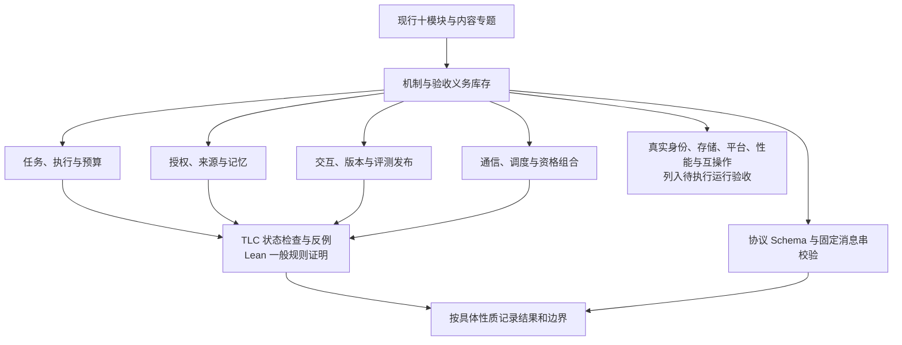

# 全方案机制验证结果

> 归档说明（2026-09-26）：本文讨论与验证的对象是当时的架构及形式化模型，引用已转向对应归档；本文结果不表示现行架构已经通过验证。

验证基线：2026-09-25 的现行架构文档，覆盖任务内核、大脑、执行、身份授权、记忆、交互、通信、Agent 协作、扩展运行及观测改进十个模块，以及内容来源专题。已明确后置的能力按关闭边界登记，没有算作已实现能力。文档版本指纹见 [基线清单](../archive/formal-2026-09-26/mechanisms/evidence/architecture-baseline.json)。

本轮将原来的单项持久交接验证扩展为全方案的机制库存、逐用例义务映射、TLC 检查与 Lean 证明。**结论按具体性质给出：形式模型检查通过、一般规则证明通过、静态资产检查通过，以及尚需运行验证的依赖分别记录。** 完整生产验收用例已执行数为 0；仓库当前提供设计与协议校验资产，没有可用于这些故障注入的完整运行实现。

本轮逐项登记 **104 个机制族、291 条模块用例及 6 条内容专题场景**，新增 22 个 TLA+ 模型和 7 份 Lean 源码。最终 **170 项检查均符合预期**，其中正常模型通过、错误变体如期失败、目标路径可达分别统计。本页的逐项证据以 [统一运行清单](../archive/formal-2026-09-26/mechanisms/evidence/final/manifest.json)、[全机制与用例覆盖索引](all-mechanisms-coverage.md)为准。每条用例均保留原文、来源位置、已建模子性质、尚未建模细项和真实提供方依赖，不能将一条局部性质通过解释为整行验收通过。

## 1. 验证如何覆盖方案

不同机制共享状态机方法，但关注的事实和成功边界不同。本轮按下列链路组织验证：先保证身份、原操作和事实归属稳定，再检查准入、交接、执行及恢复，最后检查派生视图、治理和版本生命周期。



图中每条分支是一组验证对象，不是新增运行时模块。四组模型各自保存动作与假设；只有显式组合模型检查了它所列出的交错关系。多个模型都通过，没有自动产生整个系统的组合证明。

| 机制族 | 本次检查的关键问题 | 证据入口 |
| --- | --- | --- |
| 固定权威、原身份与持久事实 | 重投是否复用原决定；提交未知能否误判为未应用；提案能否绕过核心准入 | [任务与执行](../archive/formal-2026-09-26/mechanisms/control/README.md)、[交接样板](handoff-verification-results.md) |
| 持久责任交接与消息流 | 先接管后卸责；连续 ACK 与乱序；缺口先存后清理；中继证明不可冒充目标接收 | [通信与组合](../archive/formal-2026-09-26/mechanisms/communication/README.md) |
| 版本、代次与控制屏障 | 旧领取、旧提案和旧缓存是否仍能发放；取消、暂停与派发准备如何竞争 | [任务与执行](../archive/formal-2026-09-26/mechanisms/control/README.md)、[资格向量](../archive/formal-2026-09-26/mechanisms/communication/Composition.tla) |
| 事实、知识与外部效果分离 | 没查到不等于未发生；未知不自动重做；可信否定与封闭原入口后才能新尝试 | [执行恢复](../archive/formal-2026-09-26/mechanisms/control/ControlRecovery.tla) |
| 预算与有限责任 | 父子份额是否双计；累计账单是否重复结算；未知占额、调整、收尾与公平份额 | [预算模型](../archive/formal-2026-09-26/mechanisms/control/Budget.tla)、[通信调度](../archive/formal-2026-09-26/mechanisms/communication/Scheduling.tla) |
| 权限收缩与逐次使用门禁 | 下级能否扩大权限；once 是否被不同操作消费；旧 allow 是否绕过撤权、来源变化或截止 | [授权与记忆](../archive/formal-2026-09-26/mechanisms/trust/README.md) |
| 来源闭包、发布与清理 | 声明来源能否隐藏真实依赖；登记与关闭竞争；逻辑禁用、平台回执和物理完成是否混淆 | [来源治理](../archive/formal-2026-09-26/mechanisms/trust/SourceGovernance.tla)、[来源闭包](../archive/formal-2026-09-26/mechanisms/trust/Lineage.tla) |
| 投影视图与用户交互 | 快照／增量有没有空档；旧轮／owner 是否误开门；用户关闭、请求替换和业务消费是否相互覆盖 | [信任恢复](../archive/formal-2026-09-26/mechanisms/trust/RecoveryView.tla)、[交互验证](../archive/formal-2026-09-26/mechanisms/lifecycle/README.md) |
| 引用、排空与版本发布 | 是否先登记后使用；在用版本能否提前回收；撤回、精确批准、远端应用与旧版恢复是否分别判断 | [运行与发布](../archive/formal-2026-09-26/mechanisms/lifecycle/README.md) |
| 证据、评测与改进 | 日志是否被当成独立效果；候选、计划、分母和批准是否固定；局部目标成功能否冒充整批完成 | [评测与改进](../archive/formal-2026-09-26/mechanisms/lifecycle/README.md) |

协议原语、附加项、路径能力和视图降级另由 [纯规则证明](../archive/formal-2026-09-26/mechanisms/communication/ProtocolRules.lean)及原有资产校验器交叉检查。诸如身份绑定和内容来源同时出现在多个模块时，覆盖索引保留各自交接位置，没有将其合并成一个无边界的“安全”结论。

资格组合模型区分远端权威失效与资源端应用屏障。其安全保证从**资源端已应用屏障且与本地接纳串行化**开始；远端已撤回、消息尚未应用的传播窗口单独给出可达见证。没有假定跨域撤回原子同步，也没有证明传播时限或有限离线机制本身可靠。

## 2. 实际工具结果

工具固定为 TLA+ v1.7.4 中的 TLC 2.19、Lean 4.19.0 和随附 Std。来源与工具指纹沿用 [工具来源记录](../archive/formal-2026-09-26/handoff/evidence/toolchain.json)。TLC 使用完整广度优先搜索，固定 1 worker、seed 1、fp 0；每次运行隔离临时目录。全部基准使用配置中列出的有限集合／数值；没有以随机模拟或提前中止结果替代完整检查。

最终统一复跑于 **2026-09-25 08:48:02（Asia/Shanghai）**完成，耗时约 181 秒。30 个 TLC 正向配置均完成探索、剩余队列为 0；7 份 Lean 源码均以退出码 0 完成，70 项 `#print axioms` 输出通过审计。

| 模型组 | TLC 正向配置 | 故意错误反例 | 可达见证 | 去公平性活性反例 | Lean 文件 | 总检查数 |
| --- | ---: | ---: | ---: | ---: | ---: | ---: |
| 通信与资格组合 | 5 | 9 | 6 | 0 | 2 | 22 |
| 控制、执行与预算 | 10 | 35 | 19 | 0 | 1 | 65 |
| 引用、交互与发布 | 7 | 15 | 14 | 1 | 2 | 39 |
| 授权、来源与记忆 | 8 | 18 | 16 | 0 | 2 | 44 |
| 合计 | **30** | **77** | **55** | **1** | **7** | **170** |

以上统计仅包含本轮新增包；既有 handoff 的一个 TLA+ 模型及一份 Lean 证明单独复用，没有重复计入。较大基准配置的不同状态数分别为预算 **1,461,028**、决策 **1,070,144**、消息流 **864,922**；对应参数、生成状态数和深度保留在配置及日志中。

各组结果和假设分别集中在 [control](../archive/formal-2026-09-26/mechanisms/control/README.md)、[trust](../archive/formal-2026-09-26/mechanisms/trust/README.md)、[lifecycle](../archive/formal-2026-09-26/mechanisms/lifecycle/README.md)、[communication](../archive/formal-2026-09-26/mechanisms/communication/README.md)。既有两域交接样板复用原始运行证据并核对源文件哈希。日志中的状态数属于对应配置，不能相加后解释成一个更大的系统状态空间。

协议资产检查实际通过：20 份 Schema、122 项标准类型／版本、2 份 manifest、285 条关联消息、7 条恢复／取消消息和 7 份 HTTP body；89 个非法用例按预期拒绝，completed／pending 回归通过。[原始输出](../archive/formal-2026-09-26/mechanisms/evidence/protocol-static.log)明确没有测试运行时交付、授权或外部效果；[运行与输入指纹](../archive/formal-2026-09-26/mechanisms/evidence/protocol-static.json)另行保留。

### 安全、活性与可达性分别判定

安全性质描述不允许的状态或一步变化。TLC 对所列有限实例完整探索；Lean 的归纳定理则针对自身定义的任意有限合法历史，参数范围以具体定理为准。不同 Lean 文件分别证明权限集合收缩、预算守恒、控制资格、引用保留、连续前缀和版本向量等规则，不是对所有 TLA+ 文件逐行翻译并自动证明。

活性只在明确配置的实例中检查。原交接样板要求最终稳定、具体动作公平调度和适用的剩余预算；通信健康流排除了窗口耗尽及消息丢失，要求每条消息相关动作获得调度；调度模型要求每项已接纳工作最终得到服务机会。引用排空还要求宿主最终稳定、可信完成证据最终到达及具体恢复／释放动作公平执行；公平性不能让真实外部工作凭空完成。其他模型的正常完成见证只证明路径存在，未证明所有公平执行最终完成。没有无条件的“最终成功”结论。

一般死锁报警关闭，允许完成、等待外部条件或耗尽额度后静止。需要推进的部分由显式时序性质检查；其余安全检查不提供无死锁或进展保证。TLC 的指纹碰撞估计保留在日志中。

### 反例怎样使用

负面对照通过显式变体切换故意破坏某条规则。它们保留了原正常链路，使检查器有机会找到具体错误交错。代表性反例包括：

| 刻意错误 | 违反的机制 |
| --- | --- |
| 未接管先确认、重复请求新建工作 | 提前卸责或同一原操作产生第二份责任 |
| 跳过流缺口、接受中继确认、用旧恢复位置覆盖游标 | 不存在的连续交付依据或已知事实回退 |
| 使用旧许可／提案／恢复视图，失效却不更新版本 | 过期资格仍能影响当前新行为 |
| 一次未找到就认定未发生，未知效果自动重发 | 缺乏可信否定时重复承担或执行原操作 |
| 子预算与父份额双计、重复累计账单再次相加 | 额度守恒或账单幂等失效 |
| 来源未登记即发布、删掉依赖、将逻辑关闭当物理清理 | 不可恢复发布、失效来源仍被使用或无证清理结论 |
| 在用引用提前释放、过期批准继续交接、候选版本混用 | 过早回收或未经当前精确资格的版本变更 |
| 旧 UI 代次覆盖最新选择、断裂增量直接应用 | 用户意图回退或投影不连续 |
| 按连接分别给用户额度、淘汰已接纳工作腾空间 | 汇总限额失效或责任静默丢失 |

这些反例是验证器的敏感性检查。它们不表示现行设计中已发现同样的缺陷。若基准出现反例，必须先区分规格编写错误、设计矛盾和环境假设不足；本轮开发中的语法、归纳分支及工具并行临时目录问题单独记录，未计作生产缺陷。

交叉审查曾发现三处模型覆盖不足，已补强并复验：响应现在按持久的轮次／尝试键保存，再单独决定是否属于当前调用；物理发送时独立检查发送资格和领取代次；同修订账单冲突后分别冻结新增结算与余额释放。对应检查新增六个错误对照、三个顺序明确的可达见证，以及 Lean 的冲突冻结规则。此前 161 项运行保留在历史目录，最终结果以补强后的统一清单为准。

## 3. Lean 证明的可信边界

统一复跑直接使用固定 Lean 可执行检查源码，逐文件保留 `#print axioms` 输出。最终没有未完成证明占位、自定义安全公理或原生求值证明。部分定理依赖 `propext`、`Quot.sound`，连续前缀证明还依赖 `Classical.choice`；具体依赖以原始输出为准。这些标准逻辑依赖与工程环境前提是不同层次。

例如，“提交动作原子且记录跨重启保留”“当前门禁的输入来自真实权威”“平台清理回执可信”是状态转移定义的前提。证明不能反过来证明真实数据库、身份提供方或删除适配器满足这些前提。将缓存读取、权威变化、决策与提交拆开，能检查模型中的失效交错；实际系统能否在同一边界落实仍需实现映射。

本轮对照了 TLA+、Lean 与设计规则，但没有提供三者之间机器检查的完整精化证明。纯判定规则证明和跨状态归纳证明在组内报告中分别注明；“许可交集不扩大范围”不能被解释成所有资源规范化、参数语义或授权缓存都已正确实现。

## 4. 全量覆盖与尚需证据

覆盖索引对原编号用例做集合核对，要求没有漏行、伪造编号或重复归属；首列带中文后缀和 `P` 专题编号也纳入。内容专题的无编号行使用明确标记的本地索引。每项机制的模型和定理映射均可回到源文件，已后置的迁移、直连和在线替换保持原边界。

交付期间工作区的大脑总览另有改写，已对照新旧文本复核：B1–B7 保证表与所属专题契约保持，变化不影响模型和验收映射；新旧快照与依据另存 [基线补充记录](../archive/formal-2026-09-26/mechanisms/evidence/architecture-changes-reviewed.json)。本轮没有改写该架构文件。

| 证据层次 | 本轮状态 | 仍不能据此推出的结论 |
| --- | --- | --- |
| 机制与文档语义审查 | 按模块、交接和异常情景核对；逐用例登记覆盖及余项 | 文档整体与未来任意实现必然等价 |
| TLC 与 Lean | 实际运行，保留基准、错误对照、见证和版本／哈希 | 任意规模、任意故障或全部子模型组合都正确 |
| 协议静态资产 | 已运行原有校验器；固定消息串和非法样例结果保存 | 实际网络、处理器及跨实现互操作通过 |
| 图示、链接及证据完整性 | 单独检查渲染、路径、配置注册、用例集合及源／日志哈希；见 [静态审计记录](../archive/formal-2026-09-26/mechanisms/evidence/static-checks.json) | 形式性质或业务运行正确 |
| 真实运行验收 | 待实现与提供方到位后执行 | 身份真实性、磁盘耐久、物理隔离／删除、真实效果、吞吐和尾延迟 |

系统层目标 C1–C9、A1–A4、V1/V2 仍按 [系统验证设计](../archive/architecture-2026-09-26/validation.md)分别取证。模块模型不能替代真实联网问答的支撑与时效、手机设备的独立真值、两个独立实现的替换与互操作、规模测试或真实治理残留核对。库存中的 `not_modeled`／`uncovered` 项表示抽象规则本身尚未进入当前模型，不能因同一行有运行依赖而隐藏它。

## 5. 复跑与维护

从仓库根目录运行 [统一检查器](../archive/formal-2026-09-26/mechanisms/run_checks.py)，用新的目录保存结果：

```sh
python3 docs/archive/formal-2026-09-26/mechanisms/run_checks.py --output /tmp/mechanism-verification-rerun
python3 docs/archive/formal-2026-09-26/mechanisms/build_coverage.py
```

工具位置可通过 `--java`、`--tlc`、`--lean` 指定；TLC jar 哈希和 Lean 版本会核对。检查器拒绝覆盖既有证据，逐项核对预期退出码与诊断。`all_expectations_matched=true` 包含“错误变体如期失败”和“可达性断言如期产生见证”，不能只按退出码 0 的数量判断覆盖。

架构规则变更后先更新相应模型、命题与用例映射，再复跑受影响配置；当提交边界、来源真实性或消息故障模型改变时，要重新审查假设。全包的通过记录保留为特定设计基线的证据，不自动沿用到后续版本。
