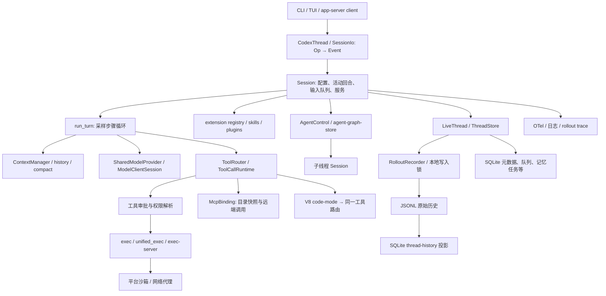
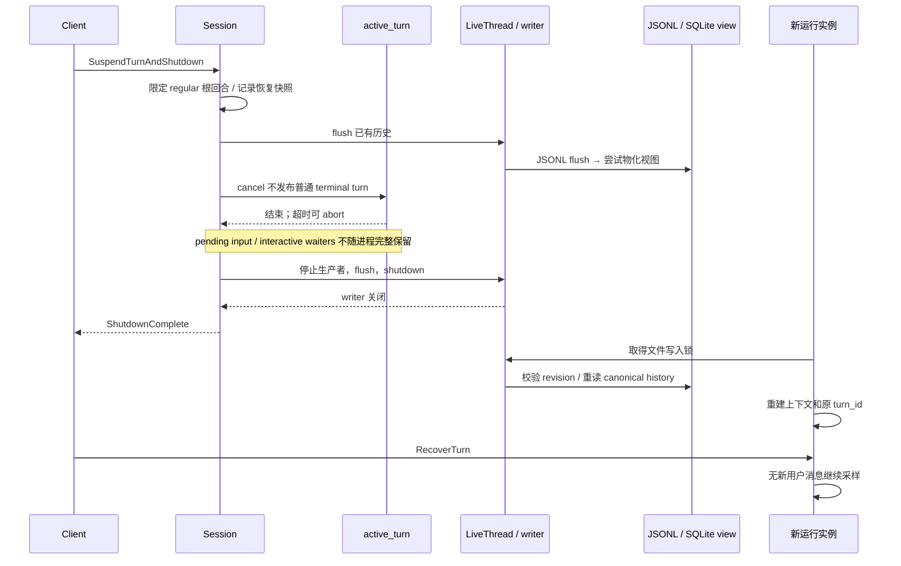
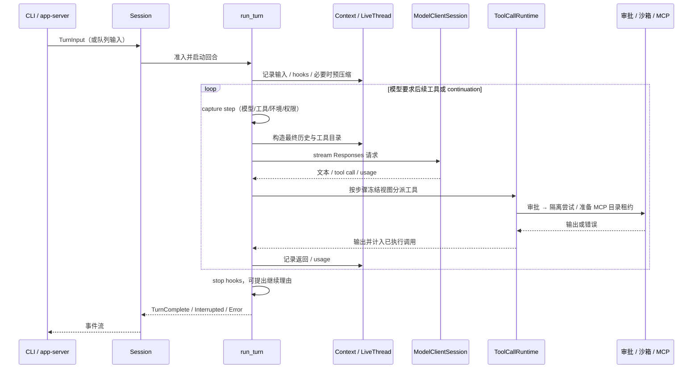

# OpenAI Codex 技术调研与本项目架构映射

补充：[同场景数据对象与读写比较](../agent-harness-comparison/data-flow-io-comparison.md)；[Codex 写入路径与完整公式](../agent-harness-comparison/io/codex-prime.md)。

## 1. 调研边界与结论

本报告分析研究时缓存于 `.reference/codex` 的[固定提交 `d4a475adda850d80b6149c76454de94e0cf4fd51`](https://github.com/openai/codex/commit/d4a475adda850d80b6149c76454de94e0cf4fd51)，提交时间为 2026-10-01 UTC。研究对象是该仓库提供的本地 coding agent、Rust 运行时、CLI/TUI、app-server、工具和扩展基础设施；README 中链接的云端产品、专有桌面应用及 IDE 前端不能视为本仓库完整提供的实现。许可证为 Apache-2.0。工作区采用 Rust 2024，多 crate 组织；该提交的 workspace 版本 `0.0.0` 不能作为发布版本使用。[产品范围][许可证][工作区]

采用一手源码静态追踪：从输入、模型请求、工具调用、持久化屏障到重放和 UI 事件，核对类型及实现。没有启动模型、外部 MCP 服务或沙箱，也没有运行全量测试，因此下文的“优势”指代码可证实的机制，“未发现”限定于本次审阅范围；静态阅读没有证明性能、任务质量、跨节点高可用或恰好一次执行。本项目比较基线为 [架构草稿](https://github.com/ruipengliu/lerna/blob/e493ad266d110097aeeb69e10abdabfa771967ab/docs/architecture/.draft/README.md)、[优化证据](https://github.com/ruipengliu/lerna/blob/e493ad266d110097aeeb69e10abdabfa771967ab/docs/architecture/.draft/validation/optimization-evidence.md)及 [来源清单](../agent-harness-comparison/sources.json)。

最值得借鉴的三个设计是：**按采样步骤冻结模型、工具目录和环境配置；把原始历史与可重建查询视图区分；把恢复定义成重新取得写入权、重建上下文并继续原回合。** 但 Codex 的本地线程运行时不等于本项目的 Task/Decision/Operation/Effect 账本：助手消息结束一轮、取消请求得到确认、补出 `aborted` 工具结果，都不能单独证明任务成功、外部效果撤销或副作用从未发生。[步骤冻结][本地存储边界][状态映射][提示归一化]

## 2. 总体架构与模块组织

图按职责抽象，箭头表示运行时协作而非全部 Cargo 依赖。`core` 保留 Session/TurnContext 编排及审批上下文；`history` 定义共享历史载荷，`rollout` 管理文件，`thread-store` 提供 LiveThread 和存储接口，`state` 管理 SQLite；`tools` 提供可复用工具部件，工具文档明确没有把依赖会话的编排强行下沉到公共 crate。`ext/extension-api` 提供类型化贡献点，宿主仍决定何时调用它们。[工作区][工具边界][历史载荷][本地存储边界][扩展注册]

| 目录 / crate 群 | 职责及依赖边界 |
| --- | --- |
| `cli`、`tui`、`exec`、`app-server*` | 产品入口、事件呈现、无交互运行、客户端 RPC；共享运行时而不是各自维护模型循环。 |
| `core`、`core-api`、`protocol` | 会话/回合运行时、公开入口和共享消息；当前实现已拆分至多 crate，不能按早期单一 `core/codex.rs` 架构解释。 |
| `model-provider`、`models-manager`、`codex-api`、`codex-client` | 模型发现、协议、请求和连接状态；HTTP 与 WebSocket 会话复用。 |
| `tools`、`exec-server*`、`unified-exec-server`、`sandboxing`、`linux-sandbox`、`windows-sandbox-rs`、`network-proxy` | 工具目录、进程执行、终端进程会话、平台隔离与网络约束。 |
| `history`、`rollout`、`thread-store`、`state` | 原始记录、上下文载荷、写入生命周期、SQLite 元数据及专用状态库。 |
| `agent-graph-store`、`ext/agent`、`ext/goal`、`ext/queue`、`memories` | 子线程关系、目标/输入扩展、记忆读写后台工作。 |
| `skills`、`plugin`、`core-plugins`、`codex-mcp`、`ext/*`、`code-mode-*` | 发现与注入技能、安装插件、MCP 绑定及宿主贡献点、受限 JavaScript 工具组合。 |
| `otel`、`rollout-trace`、各 crate 的 `tests` | 观测、诊断、协议与行为回归。不能据此推导生产质量评估闭环已等同本项目 Evaluation。 |

目录事实来自固定提交的 [workspace 成员][工作区]，非推断某个商业客户端的内部架构。

## 3. 身份、状态与核心数据结构

| 概念 / 符号 | 结构与关系 | 解读限制 |
| --- | --- | --- |
| `CodexThread` | 持有 `Arc<Session>`、`SessionIo`、驻留控制、来源、元数据与历史路径；`submit(Op)` 是线程操作入口。 | 它代表 agent 会话；不能直接替代本项目独立于连接的 Task。 |
| `Session` | `thread_id`、安装身份、事件/状态通道、SessionState、配置锁、active_turn、输入队列、服务；同一会话至多一个运行任务。 | Mutex 和进程内信号量提供本地排他，不是跨节点固定 Orchestrator 的租约。 |
| `TurnContext` / `StepContext` | 回合身份与起始配置、可调整的下一步骤设置、模型提供方、权限、环境、工具、扩展数据。已捕获步骤在一次采样和工具执行之间保持一致。 | 回合内后续步骤仍可采用新设置，不能把整回合理解成永远不变。 |
| `ThreadId` / `RolloutId` | UUIDv7；普通历史使用同一身份，revert 场景可使 rollout 身份变化而 thread 身份稳定。 | 应保留逻辑身份与历史世代的区别。 |
| `SessionMeta` | 创建来源、根 session、fork 来源/截止位置、parent_thread、工作目录等；fork 与 parent 是不同关系。 | 复制上下文并不自动形成委派关系。 |
| `HistoryPosition` / `ContextWindow` | 历史位置带 rollout、独占 ordinal 与字节偏移；压缩窗口另有 UUID。 | 位置不能只凭 UI 页码或消息 ID 替代。 |
| `TurnContextItem` | 持久化回合与根身份、模型、配置 hash、cwd、日期时区、审批/沙箱/权限与协作设置。 | 提供重建输入依据，不是完整授权消耗账本。 |
| `RolloutPayload` | tagged payload：响应项、回合上下文、压缩、token usage、agent 通信、保留上下文、world state、安全评分和事件等。 | 原始模型内容、系统事件和工具结果各有语义，不能都当成可信控制命令。 |
| `AgentStatus` / `TurnStatus` | 由事件映射 pending/running/completed/interrupted/errored 等；TurnStatus 有 completed/interrupted/failed/in_progress。 | `TurnComplete` 没有错误即可映射 Completed，不包含本项目 AcceptanceRule 所需独立成功证明。 |

证据分别为 [线程入口][会话类型][回合运行类型][步骤冻结][线程身份][历史位置][会话元数据][回合快照][历史载荷][状态映射][前端回合状态]。本项目应把这些会话/历史结构映射到 [Task / Operation 模型](../../../CONTEXT.md)，而不是照搬名称。

## 4. 存储、事务与恢复

### 4.1 三种不同的数据职责

**历史权威是 JSONL。** `ThreadStore` 区分低层 canonical history 和高层策略；启用分页历史的本地 LiveWriter 先把 JSONL 写入并 flush，再更新 SQLite history projection；Legacy 模式不走该投影分支。当前 `LocalThreadStore` 的[实际默认实现](https://github.com/openai/codex/blob/d4a475adda850d80b6149c76454de94e0cf4fd51/codex-rs/thread-store/src/local/mod.rs#L478-L481)为 Paginated，覆盖 trait 的 Legacy 默认，恢复已有会话时需按原模式判断。投影失败记录 warning，不推翻已成功的 JSONL 屏障。因此 history SQLite 是可重建查询视图，不能把两次写入描述成一个跨介质事务。投影内部用 `BEGIN IMMEDIATE` 将行变更和字节/ordinal 游标共同提交，防止游标宣称已物化实际上未提交的历史。[本地存储边界][历史写入顺序][投影事务]

**SQLite 也包含独立业务状态，不能一概称为缓存。** `state_5.sqlite` 包含线程元数据；`thread_history_1.sqlite` 包含分页回合/项目及物化游标；`goals_1.sqlite`、`queue_1.sqlite`、`memories_1.sqlite`、`memoryv2_1.sqlite`、`logs_2.sqlite` 分别服务目标、持久队列、记忆工作等。记忆表中有 worker、ownership token、lease、retry、watermark，队列表有线程内唯一顺序；这些并不是仅凭对话 UI 列表就能重建的同一种投影。[SQLite配置][线程元数据表][分页历史表][队列表][记忆任务表]

| 对象 | 形态及路径 / schema | 提交与恢复特点 |
| --- | --- | --- |
| 原始 rollout | `$CODEX_HOME/sessions`、`archived_sessions` 下的 JSONL；每行时间、可选 ordinal、typed payload；也支持 `.jsonl.zst` 表示。 | 后台 writer 由有界队列接收；`append` 接收与 `flush` 屏障不同。写失败保留未写后缀并重试；读取计数并记录 parse error，不能假设任意损坏必然 fail closed。 |
| 单线程 writer lock | `$CODEX_HOME/thread-writer-locks/<thread>.lock` 及协调锁。 | 本地文件锁在取得写入权时约束多进程；不是分布式 leader fencing。恢复可复用快照必须验证 history revision，否则重新读取。 |
| `threads` | `id` PK、rollout_path、时间、来源/provider/cwd/title、审批/沙箱、tokens、archive、git 等，后续迁移扩充。 | 初始迁移不是最终完整 schema；读取时需结合迁移版本。 |
| `thread_turns` / `thread_items` | `(thread_id,turn_id)` / `(thread_id,turn_id,item_id)` PK、状态、序号、item_json；projection 游标记录 next_byte_offset / next_ordinal。 | 从完整 JSONL 前缀增量物化；末尾不完整行留待后续。 |
| `queued_items` | id PK、thread_id、payload、sort_order、created_at；线程内顺序唯一。 | 承担等待输入的持久状态，与进程内正在接收但尚未持久化的输入不同。 |
| `stage1_outputs` / `jobs` | 源更新时间、raw memory、summary、生成/使用时间；`(kind,job_key)` PK、ownership token、lease、重试/水位。 | 适用于后台提取/合并抢占和续租，不能据此推出任意文件副作用与 SQLite 在同一事务内。 |

表中证据：[历史路径][行写入][后台写入][写入重试][写入锁][恢复取得写入权][线程元数据表][分页历史表][历史物化][队列表][记忆任务表]。

SQLite 使用 SQLx 池、WAL、5 秒 busy timeout、`synchronous=Normal`，并进行有时限的启动 quick_check。数据库策略有区别：部分库损坏采用保留备份后重建，thread-history 配置为 unavailable；“可以重建一个库”不等于“全部业务状态保证无损重建”。rollout 写入代码使用 `write_all` 和 `file.flush`，本次没有找到对应 `sync_all/sync_data` 屏障，不能将其称为断电 RPO=0。[SQLite运行配置][行写入]

历史文件压缩与模型上下文压缩是两件事。压缩 worker 将冷历史转为 `.jsonl.zst`，读路径透明识别两种表示，追加时重新物化普通 JSONL；编码后检查压缩产物及源文件是否变化，`sync_all` 临时产物并在 writer coordination 下发布。这里存在压缩产物的文件同步，不能把“普通 recorder 追加未找到 fsync”扩大成“仓库任何文件路径均无同步”。实验 `rollout/compress` 返回只表示已调度一个 best-effort pass，不保证任何文件已压缩。[文件压缩读取][文件压缩发布][压缩请求]

### 4.2 重放与压缩

`ContextManager` 把模型消息视图与独立于模型窗口的 retained host facts 分开，同时区分 history generation、reset 和 user-input 修订。普通本地 compaction 用专门采样获取摘要，重建保留用户消息的模型历史，重新注入适用初始上下文，保存 response ID、model hash、window 等 checkpoint 信息；这不是单纯把旧消息改成一段文本。它仍会消耗额外模型请求，迁移到本项目必须显式记费/授权。[上下文宿主事实][本地压缩]

恢复器重建历史、保留上下文、最后回合、权限/配置参照、world state 和 context window；只有最新有效且完整的上下文压缩 checkpoint 才能替换早期模型历史，否则重放原始项。rollback 按实际用户输入边界重建存活历史及压缩窗口。给模型的历史另做归一化：缺失工具返回时添加 `aborted` 响应，避免 API 所要求的调用/返回配对破损；源调用有 item ID 时用它派生稳定 UUIDv5，没有 ID 时保持兼容的空 ID。这是**提示格式修复**，没有检查远端效果是否真正发生。[重放构造][压缩恢复][回滚恢复][提示归一化][合成ID]

### 4.3 中断、暂停移交与恢复时序

`SuspendTurnAndShutdown` 为可恢复暂停单独设计：先冲刷历史，再取消原任务，避免制造一个普通终止事件；关停期间停止生产者，确认 writer 关闭才返回。源码明确 pending 输入和交互 waiter 不随移交保存，子线程快照也有尽力而为边界。恢复可以延续原回合身份，但没有本项目完整的 Operation/Effect 外部状态对账机制。[暂停移交][入口分派][恢复输入][恢复取得写入权]

## 5. 核心正常流程、模型与上下文

`run_turn` 将一次用户输入组织成若干次采样步骤：采样前处理压缩与待输入，捕获该步配置；历史按模型 modalities 构造，工具输出进入下一次输入。仅有助手最终消息时可以结束循环，但 stop hook 能阻止结束并提出 continuation。`end_turn=false` 也驱动下一步。这个停止条件适合交互 coding agent；本项目仍必须由 Orchestrator 检查 Goal、Requirement、Acceptance 与真实结果，不应把模型或 hook 的判断升级为权威终态。[回合循环][步骤冻结][请求完成][停止钩子]

`ModelClient` 提供线程级连接和路由状态，`ModelClientSession` 提供回合级 WebSocket 连接复用；增量输入只有在前后请求兼容且历史为前缀扩展时采用，必要时回到完整请求/HTTP。`ResponsesApiRequest` 使用 `store:false` 和 prompt cache 信息。这里能确认“有减少重复输入/重连的机制”，无法从静态源码给出延迟收益数字。[模型连接][增量请求][请求编码]

采样层存在受 provider `stream_max_retries` 控制的内部 stream 重试，并携带已执行工具调用以处理部分响应。此机制和本项目 Brain 的“一次 Decision 对应 0/1 次模型物理请求”不同：移植时必须由上层显式决定新 Decision，并分开计费、结果不明与已执行工具，禁止 SDK 隐式替换请求。[采样重试] 本项目现有 [BRN-01/EXE-03](https://github.com/ruipengliu/lerna/blob/e493ad266d110097aeeb69e10abdabfa771967ab/docs/architecture/.draft/validation/optimization-evidence.md) 已明确这些约束；建议是将案例转成验证，非宣布缺少该机制。

## 6. 工具执行、审批、隔离及并行

`ToolRouter` 结合当前工具目录与 handler 路由。内置 handler 覆盖 apply_patch、exec/write_stdin、MCP tool/resource、plan、请求权限/用户输入、image、tool search、multi-agent 等；extension registry 继续补充目标、队列、记忆等能力，最终可用目录受配置/策略控制。[内置工具]`ToolCallRuntime` 持有精确 StepContext，通过读写锁区分允许并行的工具和要求串行的工具；执行中的调用集合用于采样恢复。`unified_exec` 管理长驻进程、输入输出、产出大小/时间限制与进程数量。一个工具声明支持并行，并不证明它与另一个操作的文件/网络副作用彼此独立。[工具并行][采样重试][进程限额]

`ToolOrchestrator` 把审批要求分为 Skip、NeedsApproval、Forbidden，再选择沙箱执行；只有特定 SandboxDenied 分支允许按审批策略考虑提权重试，其他错误不自动采用该路径。审批缓存按工具序列化键保存 ApprovedForSession，可由用户或 Guardian reviewer 决定。它减少重复交互，但不同于本项目 exact bindings、受信 Confirmation、Grant 消耗和可撤销账本。[审批编排][审批升级][审批缓存][审批评审者]

平台策略支持 macOS Seatbelt、Linux 沙箱、Windows RestrictedToken 等，由执行边界把 `PathUri` 转成本机路径；网络代理提供域 allow/deny、私网目标及 limited HTTP method 策略；文档明确某些直连 loopback 阻断还依赖沙箱。GET/HEAD/OPTIONS 的“limited”机制不能证明目标 API 没有语义副作用。应以实际平台和启动参数验证限制是否生效。进程沙箱也不能代替对远程 MCP 服务内部行为的约束。[沙箱选择][网络代理] 本项目 [SEC-02](https://github.com/ruipengliu/lerna/blob/e493ad266d110097aeeb69e10abdabfa771967ab/docs/architecture/.draft/security/implementation.md) 已要求实际平台证据。

Code mode 在 V8 isolate 中运行短程序，将可用工具经 host callback 暴露；去除若干危险/不需要的全局对象，禁用 module import，工具集来自允许目录。它把多次工具调用的控制流留在一个程序内，方便数据处理和并行组合，但权限仍应由宿主工具入口执行。不能把 V8 的脚本边界描述为任意原生插件的 OS 隔离。[Code模式全局][Code模式导入]

## 7. 多 Agent、目标与协作

AgentControl 管理子线程身份、spawn reservation、执行容量和驻留限额；`agent-graph-store` 保存父子关系（每个 child 至多一个 parent，可被 upsert 替换）及 Open/Closed 边状态。冷恢复能从开放后代关系恢复身份，并检查父环境、执行策略是否兼容；spawn 继承已捕获的模型/权限/环境配置，提交 registry slot 前处理父子关系和初始历史屏障。[父子图][冷子线程恢复][子线程配置][子线程启动]

fork 与 spawn 的关系、历史模式和继承边界在类型上分开，这比“复制消息数组并启一个 goroutine”更可维护。但子线程最终结果向父线程的通知在实现中明确为 best effort：发送失败记录日志返回。父子图写入、fork 历史和 registry reservation 也不是一个可证明的分布式原子事务。因此本项目 DelegationClosure、费用/效果收尾、取消后晚到结果和原 Delegation 恢复必须继续由权威账本承担。[父子图][子线程启动][子线程完成]

本提交还实现了持久目标：`thread_goals` 保存 objective、active/paused/blocked/usage_limited/budget_limited/complete、token budget、usage 与时间。Goal 工具通过状态枚举限制 complete/blocked/paused 更新，并直接更新目标、发出事件和完成预算报告；本次该路径未发现本项目 Requirement 覆盖/AcceptanceRule 外部证据校验，不能把 goal complete 作为等价 Task succeeded 依据。存在目标机制与存在独立成功核验是不同事实。[目标表][目标更新]

共享预算有 rollout token usage 记录，适合 coding agent 的执行控制；这不等于跨 Orchestrator 金额预留、模型物理请求结算或 Effect 的持久归属。[子线程预算] 本项目 [COL-01/COL-02](https://github.com/ruipengliu/lerna/blob/e493ad266d110097aeeb69e10abdabfa771967ab/docs/architecture/.draft/collaboration/implementation.md) 已规定委派闭合证据与成本收益验证，Codex 可作为具体反例/负载来源。

## 8. 记忆与扩展

### 8.1 记忆管线

记忆写入是独立后台管线：非临时根会话、feature gate 和 memory store 可用时启动；先选取符合更新时间/空闲条件的 rollout，并行 phase1 提取 raw memory 与 summary，记录源快照与任务所有权；phase2 取得全局 consolidation job，准备文件和 Git 基线，启动专用 agent 合并，检查产物并续租/更新水位。库内任务 lease 与 ownership token、产物文件和 Git 基线提供可恢复步骤，但不是一个覆盖模型请求、SQLite、文件与 Git 的原子事务。[记忆启动][记忆一阶段][记忆任务表][记忆二阶段][记忆完成]

phase2 通常采用不交互审批和限定记忆目录的写策略；代码对 `External` 权限配置保留 network 取值，不能笼统声称 consolidation 永远没有网络权限。自动提取是否等于用户授予长期保存权限、源撤销如何传播到派生记忆和副本，本次未发现与本项目 Memory/Grant/source closure 等价的完整账本；须保持本项目 MEM-01/02/03，而不是照搬“后台自动整理即可”。[记忆权限] 本项目 [Memory 设计](https://github.com/ruipengliu/lerna/blob/e493ad266d110097aeeb69e10abdabfa771967ab/docs/architecture/.draft/memory/README.md) 与 [优化计划](https://github.com/ruipengliu/lerna/blob/e493ad266d110097aeeb69e10abdabfa771967ab/docs/architecture/.draft/memory/optimization-plan.md) 已有相应要求。

读取侧与写入管线分离：feature/`use_memories` 开启时，MemoriesExtension 从版本目录读取 `memory_summary.md`，按 token 限额截断后作为有类型的上下文片段注入；V2 进一步按片段字节上限拆分。专用 backend 声明 list/read/search，带 path、cursor、行位置、匹配模式、truncated/next_cursor 等字段。此机制提供渐进读取及可解释覆盖信息，不能凭摘要注入就推断全部记忆均已检索，也不能替代本项目读时许可检查。[记忆读取扩展][记忆摘要][记忆读取契约]

### 8.2 MCP、Skill 与 Plugin

MCP 连接支持 stdio 和 Streamable HTTP、初始化/工具超时、认证及目录过滤。`McpBinding` 把模型可见的工具目录、client、server 配置和 call map 固定为不可变快照；`PreparedMcpCall` 保留当时的绑定，调用前在 catalog lease 内核查目录仍有效并执行 approval 准备。cached 与 Ready 目录有区别，required server 会限制仅使用缓存的路径；刷新由发布闸门协调。这个设计直接对应本项目“描述给模型的能力与真正调用的 binding 必须相同”。[MCP连接][MCP绑定][MCP准备调用][MCP目录][MCP刷新]

Skill 模型含名称、描述、路径、scope、plugin 身份、依赖工具和隐式调用策略；加载器负责根目录优先级、元数据/错误与缓存。技能文本通过宿主贡献点进入上下文，而不是取得任意授权。Plugin manifest 声明 skills、MCP、apps、hooks、onboarding 等资源；安装目录按 marketplace/name/version，暂存复制再替换，失败恢复备份。此机制有版本和安装回滚价值，但路径版本及 name hash 不等于本项目冻结实际字节及全依赖闭包的 InstallLock，更未发现同等 ReleaseApproval/EvaluationQualification 生命周期。[技能类型][技能加载][插件清单][插件存储][插件替换]

扩展 registry 为 admission、上下文、模型/工具生命周期等贡献点分别维护类型化集合，构建后不可变。相比让一个通用插件接口任意修改会话，它能使依赖边界明确；代价是宿主需维护贡献点顺序、错误语义和兼容性。本项目可按已有九模块公共契约采用 Go 接口，保持单向依赖及 schema 的权威地位。[扩展注册]

## 9. UI、app-server、契约及观测验证

app-server 将请求处理/分派与可能较慢的 outgoing 写任务拆开；初始化前拒绝业务请求，实验协议必须显式启用。协议采用 request/notification/response/error 类型，但源码说明**并非完整 JSON-RPC 2.0，省略 `jsonrpc` 字段**；不可复制协议名称而假设 wire 格式兼容。Thread/Turn/Timeline API 支持历史模式、设置、位置与时间，审批请求通过 server-to-client 回调保持交互。[服务任务][服务准入][RPC格式][时间线]

outgoing 可重放当前线程尚未响应的 server request，回调还绑定 connection 和 request_id；这有利于 UI 断线重连，但 pending 回调是运行实例中的状态。实验 `userVerification/cancel` 的 acknowledgment 表示信号已接收，不等待 OS 提示退出，也不回滚已完成效果；本项目 UI 的 accepted/observed/published/用户已读更不能合并成一个状态。[待审批重放][取消说明] 此结论与现有 [interaction](https://github.com/ruipengliu/lerna/blob/e493ad266d110097aeeb69e10abdabfa771967ab/docs/architecture/.draft/interaction/implementation.md)、[ADR-0008](../../adr/0008-trusted-renderer-preview.md) 的方向一致。

Rust 类型导出 TS 与 JSON Schema，fixture 测试重新生成产物并比较，能约束协议漂移。SDK TypeScript 的 `Codex`/`Thread` 入口还包装本地 `codex exec` 子进程，而不是承诺整个 app-server 协议的对等 SDK。可见的前端源码主要为 TUI 和协议能力，不能据此称专有 Codex 桌面/IDE 的所有前端都开放在仓库。[协议导出][协议Fixture][SDK子进程][工作区][产品范围]

OTel 记录会话、请求及工具事件；Skill invocation 带显式/隐式、thread/turn/model/scope 等信息，文档明确仅表示检测到使用，排除技能正文/参数/输出，不能代表任务成功。用户提示和 assistant final response 的正文导出受独立配置控制，默认不导出 final response；业务权威仍在本地状态和历史，而非日志 exporter。[观测Skill][观测正文]

审阅发现的回归测试包括：

| 测试符号 | 验证的实现边界 | 不证明的性质 |
| --- | --- | --- |
| `persist_reports_filesystem_error_and_retries_buffered_items`、`writer_state_retries_write_error_before_reporting_flush_success` | 文件系统错误后保留 buffered items，flush 前恢复实际写入。[写入故障测试] | 不证明断电持久或分布式复制。 |
| `prepared_call_does_not_reroute_after_captured_connection_closes`、`prepared_call_is_rejected_after_catalog_refresh`、`stale_prepared_call_does_not_run_preparation` | 旧 client 关闭/目录变化拒绝调用，失效调用不执行 preparation。[目录漂移测试] | 不证明远端工具没有副作用或符合声明。 |
| `compact_resume_and_fork_preserve_model_history_view` | mock Responses 流下的 compact/resume/fork 保留模型历史视图。[压缩重放测试] | 不证明模型在真实复杂任务上的质量。 |
| `typescript_schema_fixtures_match_generated`、`json_schema_fixtures_match_generated` | TS/Schema/embedded exports 与固定类型生成结果一致。[协议Fixture] | 不证明 raw JSON 严格解析、认证或异构客户端互操作。 |

本次没有运行这些测试。建议把其故障刺激方式改写为本项目真实 PG/SQLite、模型适配器和目标模拟器的测试，而不是仅移植 assert 或把测试数量作为质量指标。

## 10. 可证实优势、代价与能力边界

| 优势 | 证据与收益 | 代价 / 不可扩大的保证 |
| --- | --- | --- |
| 步骤级配置、目录、权限快照 | `capture_step` 与 McpBinding 将模型输入、调用绑定保持一致。[步骤冻结][MCP绑定] | 快照、缓存失效、目录 lease 和刷新顺序需要测试；不提供 project-wide 授权事务。 |
| canonical JSONL + 查询投影 | 提供可审阅历史、增量分页和重建途径。[历史写入顺序][历史物化] | 文件/SQLite双写有滞后及错误；flush 不代表断电安全或跨AZ复制。 |
| 正常、暂停移交、重放路径分开 | 保留原回合及上下文世代，冷线程恢复可验证历史 revision。[暂停移交][恢复取得写入权] | 交互 waiters、未持久输入与外部效果不能从历史凭空恢复。 |
| 本地工具隔离与统一审批 | 平台沙箱、权限解析、缓存以及受限 escalation。[审批编排][沙箱选择] | 需实机验证；批准、沙箱拒绝、取消均不自动决定 Effect。 |
| 编码场景多 Agent 与记忆管线 | 身份/继承/驻留限额和后台 lease 比临时脚本结构化。[子线程启动][记忆二阶段] | 通知 best effort；自动记忆和模型 token 预算不同于长期授权/资金账本。 |
| typed extensions、协议生成与测试 | 降低宿主/工具/客户端的重复定义。[扩展注册][协议Fixture] | crate 数与协议表面大，实验/兼容性治理成本较高；不能把 Rust 类型输出改成第二个契约真源。 |

本次未发现与本项目完全等价的独立 Goal/Requirement/Acceptance/TaskOutcome 权威链、每次物理请求的金融结算、未知 Effect reconciliation、受信 Grant/Confirmation 单次消耗、跨 Orchestrator 委派闭合、InstallLock+资格/批准发布链，以及三可用区 RPO=0/RTO≤60s 的运行验证。此表述是经本次范围检索后对**等价完整机制**的限定，不否认 Codex 已有 goals、审批、预算、恢复及插件功能。[状态映射][目标更新][审批缓存][子线程预算][子线程完成][插件存储]

## 11. 对本项目草稿的模块对应与建议

本项目已经规定 24 项优化，覆盖目标保留、上下文来源、目录绑定、未知效果、沙箱证据、记忆权限、协作闭合、交付语义、制品和评测。下列建议以这些规定为基线：**“落实”是实现/验收具体化；“可选新增”是内部实现选项，不代表原架构缺少相应不变量。** 约束继续依据 [ADR 目录](../../adr)、[工程基线](https://github.com/ruipengliu/lerna/blob/e493ad266d110097aeeb69e10abdabfa771967ab/docs/architecture/.draft/engineering.md#stack)及 [优化证据](https://github.com/ruipengliu/lerna/blob/e493ad266d110097aeeb69e10abdabfa771967ab/docs/architecture/.draft/validation/optimization-evidence.md)。

### 11.1 九模块对应实现

| 本项目模块与准确位置 | Codex 对应符号 / 实现 | 适用判断及反推方向 |
| --- | --- | --- |
| [orchestrator：提案消费](https://github.com/ruipengliu/lerna/blob/e493ad266d110097aeeb69e10abdabfa771967ab/docs/architecture/.draft/orchestrator/implementation.md#proposal-consumption)、[核验](https://github.com/ruipengliu/lerna/blob/e493ad266d110097aeeb69e10abdabfa771967ab/docs/architecture/.draft/orchestrator/verification.md) | `Session`、`run_turn`、Goal tool / `thread_goals`。[会话类型][回合循环][目标表][目标更新] | **需改造；未发现等价完整成功链。** 借鉴回合/步骤区分及目标独立存储；保留 TaskCoordinator 和条件事务，完成须满足本项目 Acceptance。见 C-01。 |
| [brain：压缩策略](https://github.com/ruipengliu/lerna/blob/e493ad266d110097aeeb69e10abdabfa771967ab/docs/architecture/.draft/brain/implementation.md#context-optimization)、[原调用恢复](https://github.com/ruipengliu/lerna/blob/e493ad266d110097aeeb69e10abdabfa771967ab/docs/architecture/.draft/brain/implementation.md#key-sequence) | `ContextManager`、`capture_step`、CompactedHistoryMetadata、`normalize`、`run_sampling_request`。[上下文宿主事实][步骤冻结][本地压缩][提示归一化][采样重试] | **直接借鉴快照思路；需改造；隐式提示修复与内部 stream retry 不适用。** 从权威事实重建不可裁剪区，原始输入与模型传输派生项可追溯；压缩另建有界 Decision。见 C-02。 |
| [execution：目录](https://github.com/ruipengliu/lerna/blob/e493ad266d110097aeeb69e10abdabfa771967ab/docs/architecture/.draft/execution/implementation.md#catalog-conformance)、[发送门禁](https://github.com/ruipengliu/lerna/blob/e493ad266d110097aeeb69e10abdabfa771967ab/docs/architecture/.draft/execution/implementation.md#key-sequence)、[返回覆盖](https://github.com/ruipengliu/lerna/blob/e493ad266d110097aeeb69e10abdabfa771967ab/docs/architecture/.draft/execution/implementation.md#output-coverage) | `ToolCallRuntime`、`McpBinding` / PreparedMcpCall、`unified_exec`。[工具并行][MCP绑定][MCP准备调用][进程限额] | **直接借鉴 immutable binding；需改造执行账本。** 目录刷新不改绑原 Operation；并行能力须核验 mutex_domains，进程输出截断明确返回。见 C-03。 |
| [security：确认与使用](https://github.com/ruipengliu/lerna/blob/e493ad266d110097aeeb69e10abdabfa771967ab/docs/architecture/.draft/security/implementation.md#key-sequence)、[设计](https://github.com/ruipengliu/lerna/blob/e493ad266d110097aeeb69e10abdabfa771967ab/docs/architecture/.draft/security/README.md) | `ExecApprovalRequirement`、ToolOrchestrator、approved-for-session cache、SandboxManager、网络策略。[审批编排][审批升级][审批缓存][沙箱选择][网络代理] | **需改造；审批缓存作为授权权威不适用。** 可缓存展示与审阅建议，实际发送仍用原 Grant/Use/Confirmation 与当前撤权核验；沙箱按平台验证。见 C-04。 |
| [memory：候选与读时整理](https://github.com/ruipengliu/lerna/blob/e493ad266d110097aeeb69e10abdabfa771967ab/docs/architecture/.draft/memory/implementation.md#read-time-curation)、[写入水位](https://github.com/ruipengliu/lerna/blob/e493ad266d110097aeeb69e10abdabfa771967ab/docs/architecture/.draft/memory/implementation.md#memory-change-head) | phase1 extraction、phase2 consolidation、`stage1_outputs/jobs`、源更新时间和 lease。[记忆一阶段][记忆二阶段][记忆任务表][记忆权限] | **需改造。** 借鉴后台选取/提取/合并分段及源版本水位；独立长期保存许可、事实/推断/时间/范围和来源关闭不让模型补全。见 C-05。 |
| [collaboration：闭合](https://github.com/ruipengliu/lerna/blob/e493ad266d110097aeeb69e10abdabfa771967ab/docs/architecture/.draft/collaboration/implementation.md#delegation-closure)、[原子子创建](https://github.com/ruipengliu/lerna/blob/e493ad266d110097aeeb69e10abdabfa771967ab/docs/architecture/.draft/collaboration/implementation.md#key-sequence) | AgentControl、parent-child graph、spawn reservation、child config、best-effort result delivery。[父子图][子线程启动][子线程配置][子线程完成] | **需改造；单纯最终消息关闭委派不适用。** 子配置与继承快照有价值，结果通知只是唤醒；Closure 继续以效果、控制和费用证明为准。见 C-06。 |
| [interaction：输入转交](https://github.com/ruipengliu/lerna/blob/e493ad266d110097aeeb69e10abdabfa771967ab/docs/architecture/.draft/interaction/implementation.md#key-sequence)、[预览/用户证据 ADR](../../adr/0008-trusted-renderer-preview.md) | app-server OutgoingMessage、TimelineEntry、server approval callbacks、userVerification cancellation。[待审批重放][时间线][取消说明] | **需改造。** 借鉴时序位置、待请求展示和有限队列；恢复由原 Command/Surface/Input 权威读取驱动，信号/入队/显示/已读分别呈现。见 C-07。 |
| [extensions：制品完整性](https://github.com/ruipengliu/lerna/blob/e493ad266d110097aeeb69e10abdabfa771967ab/docs/architecture/.draft/extensions/implementation.md#artifact-integrity)、[最小宿主](https://github.com/ruipengliu/lerna/blob/e493ad266d110097aeeb69e10abdabfa771967ab/docs/architecture/.draft/extensions/implementation.md#module-shape) | typed extension registry、skill metadata/dependencies、plugin staged replacement/version dirs。[扩展注册][技能类型][插件存储][插件替换] | **需改造；版本目录替代 InstallLock 不适用。** 保持实际字节/入口/依赖校验和受信批准，read-only 贡献点可用类型化注册降低耦合。见 C-08。 |
| [evaluation：计划和证据](https://github.com/ruipengliu/lerna/blob/e493ad266d110097aeeb69e10abdabfa771967ab/docs/architecture/.draft/evaluation/implementation.md)、[优化实验](https://github.com/ruipengliu/lerna/blob/e493ad266d110097aeeb69e10abdabfa771967ab/docs/architecture/.draft/validation/optimization-evidence.md#experiments) | fixture drift tests、mock stream/history tests、OTel Skill event。[协议Fixture][压缩重放测试][观测Skill] | **直接借鉴故障构造；未发现等价冻结评测/发布资格链。** 回归通过与模型成功率分开，运行次数、实际请求和费用分母固定。见 C-09。 |

### 11.2 共享架构对应实现

| 本项目边界 | Codex 对应实现 | 判断与建议 |
| --- | --- | --- |
| [contracts](https://github.com/ruipengliu/lerna/blob/e493ad266d110097aeeb69e10abdabfa771967ab/docs/architecture/.draft/contracts/README.md)、[wire 规则](https://github.com/ruipengliu/lerna/blob/e493ad266d110097aeeb69e10abdabfa771967ab/docs/architecture/.draft/contracts/protocol.md) | Rust types → TS/Schema export、fixture 测试；自定义 RPC envelope。[RPC格式][协议导出][协议Fixture] | **直接借鉴派生产物漂移检查；Codex wire 不适用。** 保持本项目 JSON Schema/严格 JSON 和 Proto 外壳真源、WSS/gRPC 传输。见 C-10。 |
| [storage](https://github.com/ruipengliu/lerna/blob/e493ad266d110097aeeb69e10abdabfa771967ab/docs/architecture/.draft/storage-and-middleware.md#data-placement)、[索引水位](https://github.com/ruipengliu/lerna/blob/e493ad266d110097aeeb69e10abdabfa771967ab/docs/architecture/.draft/memory/implementation.md#index-watermarks) | JSONL canonical → SQLite view，投影行/游标一个事务，库按职责分离。[历史写入顺序][投影事务][SQLite配置] | **直接借鉴权威/视图区别；本地耐久参数需改造。** 本项目 PG 业务权威和不可变 ContentStore 保持；本地 SQLite 按 FULL 验收。见 C-11。 |
| [deployment](https://github.com/ruipengliu/lerna/blob/e493ad266d110097aeeb69e10abdabfa771967ab/docs/architecture/.draft/deployment.md)、[production](https://github.com/ruipengliu/lerna/blob/e493ad266d110097aeeb69e10abdabfa771967ab/docs/architecture/.draft/deployment-production.md#availability) | suspend → flush → cancel → shutdown；本地 writer lock 和冷 resume。[暂停移交][写入锁][恢复取得写入权] | **借鉴有序排空；文件锁替代分布式 owner 不适用。** 保持固定逻辑 Orchestrator 与 PG/角色部署，按现有可用性目标实测。见 C-12。 |
| [durable / reliable-work](https://github.com/ruipengliu/lerna/blob/e493ad266d110097aeeb69e10abdabfa771967ab/docs/architecture/.draft/reliable-work.md#admission)、[领域恢复](https://github.com/ruipengliu/lerna/blob/e493ad266d110097aeeb69e10abdabfa771967ab/docs/architecture/.draft/reliable-work.md#recovery) | append/persist/flush 不同屏障、resume revision、memory ownership token/job lease。[后台写入][恢复取得写入权][记忆任务表] | **需改造为现有公共模板。** 命令 accepted 只在领域事实、原回执与 jobs 共同提交后发；notify 和租约不决定 Effect。见 C-13。 |
| [engineering](https://github.com/ruipengliu/lerna/blob/e493ad266d110097aeeb69e10abdabfa771967ab/docs/architecture/.draft/engineering.md#layout)、[实施阶段](https://github.com/ruipengliu/lerna/blob/e493ad266d110097aeeb69e10abdabfa771967ab/docs/architecture/.draft/engineering.md#phases) | Rust 多 crate、tools 渐进抽取、immutable registry 与协议 fixtures。[工作区][工具边界][扩展注册][协议Fixture] | **直接借鉴依赖方向；Rust/Bazel 技术栈不适用。** 保持一 go.mod、公契约集中与 internal 深模块；按闭环阶段验证后再抽共享包。见 C-14。 |

### 11.3 可实施的 C-* 建议与验收条件

- **C-01｜Orchestrator 终态门禁，落实 ORC-01/02/03。** 在 TaskCoordinator/verification 测试装配中，用“助手 final + goal complete + 未满足 R2/未知 Effect”作为负例，确认只是提案/会话完成，Task 仍为当前合法状态；补全要求获准后先固定新目标并重开 decide，原提案动作不得同时启动。Codex 的 Goal 更新和 TurnComplete 作为反例触发方式。[目标更新][状态映射] 代价是多读一次准确条件/证据与更长等待；验收以独立目标真值、原 Decision 消费记录和未发送请求为据。**不新增第二个 Orchestrator 或完成字段。**

- **C-02｜固定输入与派生传输，落实 BRN-01/02 和 ORC-02。** 在 SnapshotAssembler 与 ModelAdapter 中复用“历史世代、逻辑事实、最终采样”分层，记录原 ContentRef/片段及最终编码来源。缺工具输出保留 `unresolved_effects`，不照搬 `aborted` 来隐式修复原 Decision 输入，更不伪造业务 `not_applied`。BrainContext 已能表达缺口；ModelAdapter 仅执行固定 profile 的编码映射，最终编码不完整或超窗时停止该轮。压缩/重连/流失败不能隐式再调用模型；需要摘要或新采样沿新有界工作/Decision 记费。[上下文宿主事实][提示归一化][采样重试] 代价是来源与编码元数据、缓存资格检查。验收交换“目标修订—多次压缩—调用失答复”的顺序，实际模型适配器计数保持每个 Decision 0/1，硬约束/冲突/未知效果不丢。

- **C-03｜准确执行绑定，落实 EXE-01/02/03；可选新增内部快照对象。** Executor 可采用类似 PreparedMcpCall 的只读内部句柄，把 capability digest、binding revision、driver/config、准确目标和 schema 闭包贯穿描述、准入、发送、结果解释；它承载已有字段，不增加外部版本体系。失效时沿原 Operation 等待/拒绝，不能自动指到同名新工具。并行依据现有 `mutex_domains` 和真实资源冲突，输出显式带覆盖/截断。[MCP准备调用][工具并行][目录漂移测试] 代价是快照保留和目录更新等待。验收覆盖旧连接关闭、同名工具版本刷新、旧 prepared 的审批后失效、截断输出；旧调用不会 reroute，实际 effect 与返回覆盖分别核查。

- **C-04｜审批与实际隔离分层，落实 SEC-01/02。** 在 ConfirmationStore/GrantLedger/发送入口分别保留受信批准消费和当前授权；如引入审阅建议，另作非授权事实。ApprovedForSession 只可用于体验或在现有 Grant 规则内的缓存，不能跳过原 use 核查；Guardian 建议也不升级为用户确认。sandbox denied 后的重新尝试，必须由原 Operation 的重试合同和真实效果检查裁决。[审批缓存][审批升级][审批评审者] 代价是授权读取与原效果核对。验收在各平台用“允许路径已写入后再访问禁路径”的命令、loopback 绕过代理、DNS 指向私网、撤权与旧按钮竞争；证明隔离边界，并确认先前写入不因后续拒绝而被误记零效果。

- **C-05｜分阶段记忆与准确源水位，落实 MEM-01/02/03。** ExtractionCoordinator/MemoryWriter 可借鉴源更新时间、ownership token 和阶段水位组织提取/合并，但复用本项目候选唯一发布/来源关闭/保存许可规则；仅整理供当前上下文不自动长期保存。源码在 External 权限下保留 network，是测试权限继承的有用刺激。[记忆一阶段][记忆任务表][记忆权限] 代价是候选及反向来源保留、索引滞后和续租成本。验收源更新、提取期间关闭源、两个 worker 竞争、phase2 崩溃与再读取；事实/推断、时间/范围及失败任务不得变成成功经验；MEM-02 仍须通过固定质量/费用对照后启用。

- **C-06｜冷子任务恢复及通知丢失，落实 COL-01/02。** 在 Delegation 的固定子映射/继承材料中保留准确目标、模型、环境和权限依据，恢复前重新核验当前许可，避免冷重启后自动扩权。子线程 completion 通知只唤醒已有持久核对作业；父 Task 从权威子状态与 Closure 证据收尾。[冷子线程恢复][子线程配置][子线程完成] 代价是子图读取和持续查询责任。验收删除全部通知、断连后晚到结果、父子同时重启、费用上调和未知效果；原 child/creation_key 不重复创建，未满足 Closure 不关闭。质量收益和多 Agent 成本仍按 COL-02 对照，不能以“有并发”判定改善。

- **C-07｜恢复可读事实与交互状态，落实 UI-01/02 与 ADR-0008。** Interaction/SDK 根据原 Command、Input 和 Surface 修订恢复待事项；app-server 的内存 pending callback 重放仅可作为 UI 优化。呈现“取消信号已接收、执行仍未退出/结果未核清”，不把 acknowledgment 改成取消完成。[待审批重放][取消说明] 代价是客户端本地事务与领域查询。验收页面刷新、connection/request_id 变更、确认过期、取消后 OS worker 仍活动及迟到 proof；合法原输入只消费一次，实际占用未退前不释放并发，UI 不展示已经关闭效果。

- **C-08｜类型化装配与制品闭包，落实 EXT-01/02/03；可选新增内部 registry。** 受信宿主可为只读 skill/context metadata、工具声明和诊断注册不同 Go 接口，并固定调用顺序及一次装配世代；这不新增任意插件脚本入口，不授予跨模块写权限。plugin 暂存替换可作为实现参考，真正装载仍由 PackageVerifier/BindingRouter 依 InstallLock 的准确字节与批准控制。[扩展注册][插件替换][插件存储] 代价是接口/版本与顺序测试，保留旧入口供原操作恢复。验收同版本不同字节、嵌套依赖替换、激活前后重启、批准撤回；实际读取的入口摘要与锁一致，registry 更新仅影响合法新快照。

- **C-09｜行为回归与模型评测分开，落实 EVA-01/02/03。** EvaluationPlan 明确普通协议/历史回归与独立任务质量集；复用 Codex 的故障注入方法，记录每项 pass/fail/inconclusive、实际请求/尝试与环境版本。Skill 被调用、日志已上报或 mock history 正确不是成功标签。[观测Skill][压缩重放测试][协议Fixture] 代价是独立目标 oracle、运行预算和证据封存。验收固定分母下把 timeout、取消、恢复额外请求与重试全部计入，按质量/成本/延迟配对比较，探索材料不进入独立 qualification 集。

- **C-10｜契约派生产物漂移检查，落实既有 contracts / [ADR-0010](../../adr/0010-monorepo-shared-contract-release.md)。** 借鉴 Codex TS/Schema fixture 对照，但本项目由已有权威 Schema/方法资产生成 Go/TS/文档，不倒置成 Rust/Go struct 第二真源。严格 raw JSON/Proto 检查先于普通解码，WSS/gRPC 继续使用本项目 envelope。[RPC格式][协议导出][协议Fixture] 代价是生成器维护和稳定/实验资产分别冻结。验收 CI 再生成无差异，并让 Go/TS/原始 gRPC 入口共同拒绝重复键、未知字段、数字/Unicode 变形和错误绑定；仅类型编译通过不合格。

- **C-11｜可重建视图的提交边界，落实 storage / Memory 水位；可选新增投影健康指标。** PG 仍保存业务权威；ContentStore 的耐久字节先就绪，再提交引用。借鉴 `apply_projection` 将投影行与扫描水位在同一本地事务保存；视图追赶失败记录 lag 与恢复责任，不回滚或重写原事实。SQLite 用本项目 WAL/FULL/foreign_keys/单写队列，不照抄 Codex Normal。[投影事务][SQLite运行配置][历史写入顺序] 代价是两方言查询与视图重建空间。验收在字节持久后、业务提交后、投影行写后/游标提交前分别崩溃；查询明确滞后，恢复不漏原事实、重复收费或误报未提交视图已最新。

- **C-12｜有序排空及 owner 接替，落实 deployment。** 拆出“停止新接纳—持久保存当前责任—发取消—等待实际本地工作退出—释放进程资源”阶段，沿原 Command/Operation 恢复；受限等待结束只能移交责任，不能关闭未知效果。Codex writer lock 可用于本地开发适配，本项目分布式权限仍由固定逻辑 Orchestrator 和 PG 裁决。[暂停移交][写入锁] 代价是关停延迟、保留控制/收尾容量。验收本机多进程和生产故障拓扑：旧 worker 晚回写、连接迁移与单区故障；分别取得 RPO/RTO/容量证据，不能借本地 suspend 测试声称跨AZ通过。

- **C-13｜准入、屏障和领域恢复，落实 durable / [ADR-0009](../../adr/0009-reliable-work-framework.md)。** 为各 storage/queue adapter 明确 enqueue/accepted/commit/flush 的不同语义，公共模板仅在原回执、领域责任与 job 同事务提交后发布 accepted。源码的 buffered write retry、resume revision 与记忆 lease 是具体失败场景来源；外部目标发送不套用“写入文件失败可重试”的推理。[后台写入][写入故障测试][恢复取得写入权][记忆任务表] 代价是提交未知处理和各领域独立 recovery probe。验收 FW-01/03/04/05/06 覆盖断线、失答复、旧租约和全部通知丢失，观察目标真值而非仅本地 job done。

- **C-14｜深模块与阶段退出，落实 engineering。** 复用 tools 的渐进抽取原则：先保持核心运行闭环与同一事务范围，再把确有多个消费者的纯模型/Schema/快照帮助类抽到 internal 公共包；不为了模仿 crate 数新增服务或拆 Go module。[工具边界][工作区] 代价是维护依赖检查、生成物和双数据库测试。验收按工程阶段完成同宿主→本机多进程→WSS/gRPC→端云真实故障的递进证据，禁止内部包成为扩展公共依赖，跨模块业务写入必须经过既定领域接口。

优先顺序为 C-02/03/04/06/10/11/13 的发送、身份和提交边界，再落实 C-01/05/07/09 的质量证据；C-08 的新 registry 只在已有装配出现实际重复时采用，C-14 贯穿实施。这里没有理由改掉固定 Orchestrator、PG 权威或引入新的工作流平台；新增内部对象与健康指标必须证明降低真实实现复杂度，才进入后续设计。

## 12. 固定提交来源索引

以下均链接至固定提交，不引用浮动 main。已核对来源文件存在、引用行号范围及本项目路径/显式锚点；测试未运行，报告建议尚未写回架构草稿。

[产品范围]: https://github.com/openai/codex/blob/d4a475adda850d80b6149c76454de94e0cf4fd51/README.md#L1-L12
[许可证]: https://github.com/openai/codex/blob/d4a475adda850d80b6149c76454de94e0cf4fd51/LICENSE#L1-L16
[工作区]: https://github.com/openai/codex/blob/d4a475adda850d80b6149c76454de94e0cf4fd51/codex-rs/Cargo.toml#L1-L178
[工具边界]: https://github.com/openai/codex/blob/d4a475adda850d80b6149c76454de94e0cf4fd51/codex-rs/tools/README.md#L1-L28
[线程入口]: https://github.com/openai/codex/blob/d4a475adda850d80b6149c76454de94e0cf4fd51/codex-rs/core/src/codex_thread.rs#L201-L253
[会话类型]: https://github.com/openai/codex/blob/d4a475adda850d80b6149c76454de94e0cf4fd51/codex-rs/core/src/session/session.rs#L57-L160
[步骤冻结]: https://github.com/openai/codex/blob/d4a475adda850d80b6149c76454de94e0cf4fd51/codex-rs/core/src/session/turn.rs#L426-L543
[线程身份]: https://github.com/openai/codex/blob/d4a475adda850d80b6149c76454de94e0cf4fd51/codex-rs/protocol/src/thread_id.rs#L11-L31
[历史位置]: https://github.com/openai/codex/blob/d4a475adda850d80b6149c76454de94e0cf4fd51/codex-rs/protocol/src/protocol.rs#L3090-L3115
[会话元数据]: https://github.com/openai/codex/blob/d4a475adda850d80b6149c76454de94e0cf4fd51/codex-rs/protocol/src/protocol.rs#L3123-L3145
[回合快照]: https://github.com/openai/codex/blob/d4a475adda850d80b6149c76454de94e0cf4fd51/codex-rs/protocol/src/protocol.rs#L3301-L3345
[历史载荷]: https://github.com/openai/codex/blob/d4a475adda850d80b6149c76454de94e0cf4fd51/codex-rs/history/src/rollout_payload.rs#L30-L72
[状态映射]: https://github.com/openai/codex/blob/d4a475adda850d80b6149c76454de94e0cf4fd51/codex-rs/core/src/agent/status.rs#L6-L30
[前端回合状态]: https://github.com/openai/codex/blob/d4a475adda850d80b6149c76454de94e0cf4fd51/codex-rs/app-server-protocol/src/protocol/v2/turn.rs#L30-L38
[本地存储边界]: https://github.com/openai/codex/blob/d4a475adda850d80b6149c76454de94e0cf4fd51/codex-rs/thread-store/README.md#L1-L34
[历史写入顺序]: https://github.com/openai/codex/blob/d4a475adda850d80b6149c76454de94e0cf4fd51/codex-rs/thread-store/src/local/live_writer.rs#L327-L382
[SQLite配置]: https://github.com/openai/codex/blob/d4a475adda850d80b6149c76454de94e0cf4fd51/codex-rs/state/src/sqlite.rs#L34-L132
[历史路径]: https://github.com/openai/codex/blob/d4a475adda850d80b6149c76454de94e0cf4fd51/codex-rs/rollout/src/lib.rs#L86-L87
[行写入]: https://github.com/openai/codex/blob/d4a475adda850d80b6149c76454de94e0cf4fd51/codex-rs/rollout/src/recorder.rs#L2058-L2096
[后台写入]: https://github.com/openai/codex/blob/d4a475adda850d80b6149c76454de94e0cf4fd51/codex-rs/rollout/src/recorder.rs#L998-L1088
[写入重试]: https://github.com/openai/codex/blob/d4a475adda850d80b6149c76454de94e0cf4fd51/codex-rs/rollout/src/recorder.rs#L1771-L1969
[写入锁]: https://github.com/openai/codex/blob/d4a475adda850d80b6149c76454de94e0cf4fd51/codex-rs/rollout/src/writer_lock.rs#L17-L85
[恢复取得写入权]: https://github.com/openai/codex/blob/d4a475adda850d80b6149c76454de94e0cf4fd51/codex-rs/thread-store/src/local/live_writer.rs#L25-L97
[线程元数据表]: https://github.com/openai/codex/blob/d4a475adda850d80b6149c76454de94e0cf4fd51/codex-rs/state/migrations/0001_threads.sql#L1-L23
[分页历史表]: https://github.com/openai/codex/blob/d4a475adda850d80b6149c76454de94e0cf4fd51/codex-rs/state/thread_history_migrations/0001_thread_history.sql#L1-L38
[历史物化]: https://github.com/openai/codex/blob/d4a475adda850d80b6149c76454de94e0cf4fd51/codex-rs/thread-store/src/local/thread_history_materialization.rs#L22-L140
[队列表]: https://github.com/openai/codex/blob/d4a475adda850d80b6149c76454de94e0cf4fd51/codex-rs/state/queue_migrations/0001_queued_items.sql#L1-L11
[记忆任务表]: https://github.com/openai/codex/blob/d4a475adda850d80b6149c76454de94e0cf4fd51/codex-rs/state/memory_migrations/0001_memories.sql#L1-L35
[重放构造]: https://github.com/openai/codex/blob/d4a475adda850d80b6149c76454de94e0cf4fd51/codex-rs/core/src/session/rollout_reconstruction.rs#L9-L24
[压缩恢复]: https://github.com/openai/codex/blob/d4a475adda850d80b6149c76454de94e0cf4fd51/codex-rs/core/src/session/rollout_reconstruction.rs#L57-L87
[回滚恢复]: https://github.com/openai/codex/blob/d4a475adda850d80b6149c76454de94e0cf4fd51/codex-rs/core/src/session/rollout_reconstruction.rs#L116-L143
[提示归一化]: https://github.com/openai/codex/blob/d4a475adda850d80b6149c76454de94e0cf4fd51/codex-rs/core/src/context_manager/normalize.rs#L21-L67
[暂停移交]: https://github.com/openai/codex/blob/d4a475adda850d80b6149c76454de94e0cf4fd51/codex-rs/core/src/session/turn_suspension.rs#L13-L118
[入口分派]: https://github.com/openai/codex/blob/d4a475adda850d80b6149c76454de94e0cf4fd51/codex-rs/core/src/session/handlers.rs#L420-L520
[恢复输入]: https://github.com/openai/codex/blob/d4a475adda850d80b6149c76454de94e0cf4fd51/codex-rs/core/src/session/turn_input.rs#L273-L296
[回合循环]: https://github.com/openai/codex/blob/d4a475adda850d80b6149c76454de94e0cf4fd51/codex-rs/core/src/session/turn.rs#L149-L195
[请求完成]: https://github.com/openai/codex/blob/d4a475adda850d80b6149c76454de94e0cf4fd51/codex-rs/core/src/session/turn.rs#L2952-L3000
[停止钩子]: https://github.com/openai/codex/blob/d4a475adda850d80b6149c76454de94e0cf4fd51/codex-rs/core/src/session/turn.rs#L653-L711
[模型连接]: https://github.com/openai/codex/blob/d4a475adda850d80b6149c76454de94e0cf4fd51/codex-rs/core/src/client.rs#L1-L26
[增量请求]: https://github.com/openai/codex/blob/d4a475adda850d80b6149c76454de94e0cf4fd51/codex-rs/core/src/client.rs#L1386-L1443
[采样重试]: https://github.com/openai/codex/blob/d4a475adda850d80b6149c76454de94e0cf4fd51/codex-rs/core/src/session/turn.rs#L1618-L1744
[工具并行]: https://github.com/openai/codex/blob/d4a475adda850d80b6149c76454de94e0cf4fd51/codex-rs/core/src/tools/parallel.rs#L44-L213
[审批编排]: https://github.com/openai/codex/blob/d4a475adda850d80b6149c76454de94e0cf4fd51/codex-rs/core/src/tools/orchestrator.rs#L125-L223
[审批缓存]: https://github.com/openai/codex/blob/d4a475adda850d80b6149c76454de94e0cf4fd51/codex-rs/core/src/tools/sandboxing.rs#L65-L116
[沙箱选择]: https://github.com/openai/codex/blob/d4a475adda850d80b6149c76454de94e0cf4fd51/codex-rs/sandboxing/src/manager.rs#L49-L114
[Code模式全局]: https://github.com/openai/codex/blob/d4a475adda850d80b6149c76454de94e0cf4fd51/codex-rs/code-mode-runtime/src/runtime/globals.rs#L15-L67
[Code模式导入]: https://github.com/openai/codex/blob/d4a475adda850d80b6149c76454de94e0cf4fd51/codex-rs/code-mode-runtime/src/runtime/module_loader.rs#L225-L236
[父子图]: https://github.com/openai/codex/blob/d4a475adda850d80b6149c76454de94e0cf4fd51/codex-rs/agent-graph-store/src/store.rs#L13-L59
[冷子线程恢复]: https://github.com/openai/codex/blob/d4a475adda850d80b6149c76454de94e0cf4fd51/codex-rs/core/src/agent/control/spawn.rs#L467-L525
[子线程配置]: https://github.com/openai/codex/blob/d4a475adda850d80b6149c76454de94e0cf4fd51/codex-rs/core/src/agent/child_config.rs#L50-L155
[子线程启动]: https://github.com/openai/codex/blob/d4a475adda850d80b6149c76454de94e0cf4fd51/codex-rs/core/src/agent/control/spawn.rs#L640-L870
[子线程完成]: https://github.com/openai/codex/blob/d4a475adda850d80b6149c76454de94e0cf4fd51/codex-rs/core/src/agent/control/completion.rs#L1-L129
[子线程预算]: https://github.com/openai/codex/blob/d4a475adda850d80b6149c76454de94e0cf4fd51/codex-rs/core/src/agent/control/budget.rs#L11-L37
[记忆启动]: https://github.com/openai/codex/blob/d4a475adda850d80b6149c76454de94e0cf4fd51/codex-rs/memories/write/src/start.rs#L20-L92
[记忆二阶段]: https://github.com/openai/codex/blob/d4a475adda850d80b6149c76454de94e0cf4fd51/codex-rs/memories/write/src/phase2.rs#L49-L178
[记忆权限]: https://github.com/openai/codex/blob/d4a475adda850d80b6149c76454de94e0cf4fd51/codex-rs/memories/write/src/phase2.rs#L314-L336
[MCP绑定]: https://github.com/openai/codex/blob/d4a475adda850d80b6149c76454de94e0cf4fd51/codex-rs/codex-mcp/src/binding.rs#L31-L98
[MCP准备调用]: https://github.com/openai/codex/blob/d4a475adda850d80b6149c76454de94e0cf4fd51/codex-rs/codex-mcp/src/binding.rs#L304-L362
[MCP目录]: https://github.com/openai/codex/blob/d4a475adda850d80b6149c76454de94e0cf4fd51/codex-rs/codex-mcp/src/connection_manager/tool_catalog.rs#L40-L165
[MCP刷新]: https://github.com/openai/codex/blob/d4a475adda850d80b6149c76454de94e0cf4fd51/codex-rs/core/src/session/mcp_refresh.rs#L7-L54
[技能类型]: https://github.com/openai/codex/blob/d4a475adda850d80b6149c76454de94e0cf4fd51/codex-rs/skills/src/model.rs#L6-L94
[技能加载]: https://github.com/openai/codex/blob/d4a475adda850d80b6149c76454de94e0cf4fd51/codex-rs/skills/src/loading.rs#L21-L114
[插件清单]: https://github.com/openai/codex/blob/d4a475adda850d80b6149c76454de94e0cf4fd51/codex-rs/plugin/src/manifest.rs#L3-L58
[插件存储]: https://github.com/openai/codex/blob/d4a475adda850d80b6149c76454de94e0cf4fd51/codex-rs/core-plugins/src/store.rs#L112-L136
[插件替换]: https://github.com/openai/codex/blob/d4a475adda850d80b6149c76454de94e0cf4fd51/codex-rs/core-plugins/src/store.rs#L605-L689
[扩展注册]: https://github.com/openai/codex/blob/d4a475adda850d80b6149c76454de94e0cf4fd51/codex-rs/ext/extension-api/src/registry.rs#L20-L169
[服务任务]: https://github.com/openai/codex/blob/d4a475adda850d80b6149c76454de94e0cf4fd51/codex-rs/app-server/src/lib.rs#L175-L187
[服务准入]: https://github.com/openai/codex/blob/d4a475adda850d80b6149c76454de94e0cf4fd51/codex-rs/app-server/src/message_processor.rs#L934-L1005
[RPC格式]: https://github.com/openai/codex/blob/d4a475adda850d80b6149c76454de94e0cf4fd51/codex-rs/app-server-protocol/src/rpc.rs#L1-L55
[时间线]: https://github.com/openai/codex/blob/d4a475adda850d80b6149c76454de94e0cf4fd51/codex-rs/app-server-protocol/src/protocol/v2/thread.rs#L1834-L1878
[待审批重放]: https://github.com/openai/codex/blob/d4a475adda850d80b6149c76454de94e0cf4fd51/codex-rs/app-server/src/outgoing_message.rs#L446-L494
[取消说明]: https://github.com/openai/codex/blob/d4a475adda850d80b6149c76454de94e0cf4fd51/codex-rs/app-server/README.md#L59-L82
[协议导出]: https://github.com/openai/codex/blob/d4a475adda850d80b6149c76454de94e0cf4fd51/codex-rs/app-server-protocol/src/lib.rs#L18-L23
[协议Fixture]: https://github.com/openai/codex/blob/d4a475adda850d80b6149c76454de94e0cf4fd51/codex-rs/app-server-protocol/src/schema_fixtures_tests.rs#L19-L63

[投影事务]: https://github.com/openai/codex/blob/d4a475adda850d80b6149c76454de94e0cf4fd51/codex-rs/thread-store/src/local/thread_history.rs#L103-L241
[SQLite运行配置]: https://github.com/openai/codex/blob/d4a475adda850d80b6149c76454de94e0cf4fd51/codex-rs/state/src/sqlite.rs#L349-L442
[文件压缩读取]: https://github.com/openai/codex/blob/d4a475adda850d80b6149c76454de94e0cf4fd51/codex-rs/rollout/src/compression.rs#L68-L113
[文件压缩发布]: https://github.com/openai/codex/blob/d4a475adda850d80b6149c76454de94e0cf4fd51/codex-rs/rollout/src/compression.rs#L874-L917
[压缩请求]: https://github.com/openai/codex/blob/d4a475adda850d80b6149c76454de94e0cf4fd51/codex-rs/app-server/README.md#L198-L210
[请求编码]: https://github.com/openai/codex/blob/d4a475adda850d80b6149c76454de94e0cf4fd51/codex-rs/core/src/client.rs#L982-L1009
[进程限额]: https://github.com/openai/codex/blob/d4a475adda850d80b6149c76454de94e0cf4fd51/codex-rs/core/src/unified_exec/mod.rs#L75-L82
[审批升级]: https://github.com/openai/codex/blob/d4a475adda850d80b6149c76454de94e0cf4fd51/codex-rs/core/src/tools/orchestrator.rs#L379-L443
[审批评审者]: https://github.com/openai/codex/blob/d4a475adda850d80b6149c76454de94e0cf4fd51/codex-rs/core/src/tools/approvals.rs#L554-L566
[网络代理]: https://github.com/openai/codex/blob/d4a475adda850d80b6149c76454de94e0cf4fd51/codex-rs/network-proxy/README.md#L43-L148
[目标表]: https://github.com/openai/codex/blob/d4a475adda850d80b6149c76454de94e0cf4fd51/codex-rs/state/goals_migrations/0001_thread_goals.sql#L1-L18
[目标更新]: https://github.com/openai/codex/blob/d4a475adda850d80b6149c76454de94e0cf4fd51/codex-rs/ext/goal/src/tool.rs#L243-L313
[MCP连接]: https://github.com/openai/codex/blob/d4a475adda850d80b6149c76454de94e0cf4fd51/codex-rs/codex-mcp/src/connection_manager.rs#L345-L397
[SDK子进程]: https://github.com/openai/codex/blob/d4a475adda850d80b6149c76454de94e0cf4fd51/sdk/typescript/src/exec.ts#L162-L212
[观测Skill]: https://github.com/openai/codex/blob/d4a475adda850d80b6149c76454de94e0cf4fd51/codex-rs/otel/README.md#L99-L118
[观测正文]: https://github.com/openai/codex/blob/d4a475adda850d80b6149c76454de94e0cf4fd51/codex-rs/otel/README.md#L127-L142
[写入故障测试]: https://github.com/openai/codex/blob/d4a475adda850d80b6149c76454de94e0cf4fd51/codex-rs/rollout/src/recorder_tests.rs#L889-L980
[目录漂移测试]: https://github.com/openai/codex/blob/d4a475adda850d80b6149c76454de94e0cf4fd51/codex-rs/codex-mcp/src/binding_tests.rs#L265-L366
[压缩重放测试]: https://github.com/openai/codex/blob/d4a475adda850d80b6149c76454de94e0cf4fd51/codex-rs/core/tests/suite/compact_resume_fork.rs#L198-L349
[上下文宿主事实]: https://github.com/openai/codex/blob/d4a475adda850d80b6149c76454de94e0cf4fd51/codex-rs/core/src/context_manager/history.rs#L89-L123
[本地压缩]: https://github.com/openai/codex/blob/d4a475adda850d80b6149c76454de94e0cf4fd51/codex-rs/core/src/compact.rs#L249-L406
[记忆一阶段]: https://github.com/openai/codex/blob/d4a475adda850d80b6149c76454de94e0cf4fd51/codex-rs/memories/write/src/phase1.rs#L118-L317
[记忆完成]: https://github.com/openai/codex/blob/d4a475adda850d80b6149c76454de94e0cf4fd51/codex-rs/memories/write/src/phase2.rs#L376-L472

[内置工具]: https://github.com/openai/codex/blob/d4a475adda850d80b6149c76454de94e0cf4fd51/codex-rs/core/src/tools/handlers/mod.rs#L1-L80

[合成ID]: https://github.com/openai/codex/blob/d4a475adda850d80b6149c76454de94e0cf4fd51/codex-rs/core/src/context_manager/normalize.rs#L140-L153
[回合运行类型]: https://github.com/openai/codex/blob/d4a475adda850d80b6149c76454de94e0cf4fd51/codex-rs/core/src/session/turn_context.rs#L303-L363
[记忆读取扩展]: https://github.com/openai/codex/blob/d4a475adda850d80b6149c76454de94e0cf4fd51/codex-rs/ext/memories/src/extension.rs#L25-L97
[记忆摘要]: https://github.com/openai/codex/blob/d4a475adda850d80b6149c76454de94e0cf4fd51/codex-rs/ext/memories/src/prompts.rs#L31-L63
[记忆读取契约]: https://github.com/openai/codex/blob/d4a475adda850d80b6149c76454de94e0cf4fd51/codex-rs/ext/memories/src/backend.rs#L45-L133
