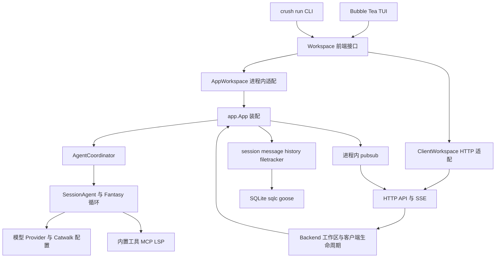
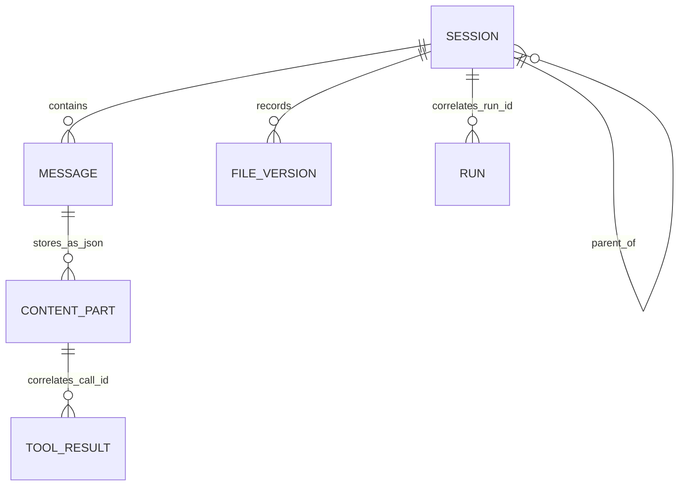
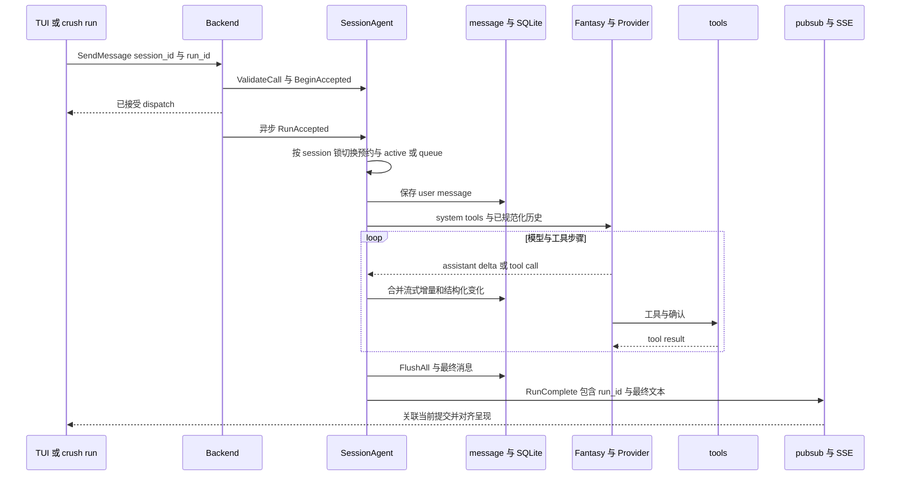
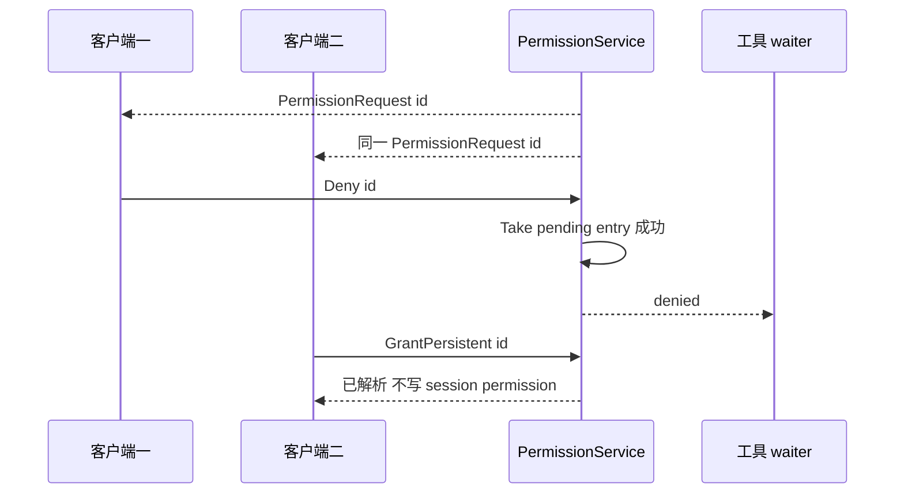

# Crush 技术调研与 Harness 架构对照

补充：[同场景数据对象与读写比较](../agent-harness-comparison/data-flow-io-comparison.md)；[Crush 流式更新与 SQL 计数](../agent-harness-comparison/io/pi-crush.md)。

Crush 最适合参考的是 Go 工程组织、终端交互、结构化会话存储和工具生态。当前版本同时保留进程内工作区与可选的客户端/服务器工作区，并围绕接纳、排队、取消、流式写入和多客户端确认处理了具体竞态。它的 `RunComplete` 是一次模型工具循环结束的信号；本项目还须独立保存任务完成依据、未决效果与后续核对责任。

本报告依据 2026-10-01 拉取的固定源码快照，未运行上游测试、模型请求、服务器或性能实验。实现存在、产品主张和本项目建议分别陈述；未发现某能力只表示所检查执行链没有提供等价证据。完整版本清单见[来源清单](../agent-harness-comparison/sources.json)，综合结论见[架构优化分析](../agent-harness-comparison/architecture-optimization.md)。

## 1. 定位、版本与复用范围

| 项目事实 | 本次范围 |
| --- | --- |
| 仓库 | `charmbracelet/crush` |
| 研究时缓存 | `.reference/crush`，当时使用深度为 1 的 Git 快照；当前无需常驻 |
| 分支与 commit | `main`，`76cc5c574e15072b15aaed0f4f843a5711fae0d9` |
| commit 时间 | `2026-09-30T20:25:14-04:00`，即北京时间 2026-10-01 |
| 主语言与组织 | 一个 Go module，manifest 要求 Go `1.27.0`，主要模块在 `internal/` |
| 模型与 UI 底座 | Fantasy `0.45.1`、Catwalk `0.52.49`、Bubble Tea v2、Lip Gloss v2；版本来自锁定 manifest |
| 当前许可证 | 根 `LICENSE.md` 为 FSL-1.1-MIT，含竞争性商业用途限制和该版本发布满两年的未来 MIT 许可条款；文件尾部另有早期代码声明 |

README 定位为可更换模型、按项目保存会话、使用 LSP/MCP 的编程终端。上述版本用于定位源码，不代表发布稳定性、支持范围或第三方依赖运行结果。讨论机制可与复制代码分开评审；直接复用当前 Crush 源码时应依据该快照的许可，不能把“未来 MIT”写成“当前全部 MIT”。[产品定位][CR02]、[依赖版本][CR01]、[许可正文][CR03]

客户端/服务器模式通过 `CRUSH_CLIENT_SERVER` 显式启用；默认入口仍可建立本地 `app.App`。因此应同时研究两条装配路径，不能因目录中有 server 就认定所有用户默认通过远程服务执行。[启动分支][CR04]

## 2. 分层与模块组织

图是依赖与调用关系，不是微服务拆分建议。`App` 将数据库 query、session/message/history、permission/question、文件读取跟踪、LSP、Skill manager 和 AgentCoordinator 装配起来。Backend 复用这些业务对象，增加工作区路径索引、客户端 presence、关闭排空与 channel 路由；HTTP controller 负责传输形状。前端通过 Workspace 隐藏进程内与远程的区别。[Workspace][CR05]、[App 装配][CR06]、[Backend][CR07]

| 目录 | 主要责任与边界 |
| --- | --- |
| `internal/cmd`、`internal/ui` | Cobra 命令、交互终端、非交互输出；运行状态来自业务服务或 Workspace |
| `internal/workspace` | 前端统一入口与两种适配器；含连接恢复、当前会话重申 |
| `internal/client`、`server`、`proto` | HTTP 客户端/服务端、SSE、序列化 DTO；`RunID` 区分同 session 的不同提交 |
| `internal/backend`、`app` | 生命周期管理与组装，Backend 调用 App 中服务，避免 controller 重建 Agent 逻辑 |
| `internal/agent` | main/task/plan Agent、模型选择、流回调、摘要、工具目录、子会话、循环检测 |
| `internal/agent/tools`、`shell` | 文件/搜索/编辑/网络/LSP/MCP 等工具，前台及后台 shell |
| `internal/session`、`message`、`history`、`filetracker` | 会话元数据、消息 parts、编辑历史、读取时间记录 |
| `internal/permission`、`question`、`hooks` | 工具确认、用户提问、PreToolUse 改写与阻断；主要等待状态在内存 |
| `internal/config`、`skills`、`lsp`、`agent/tools/mcp` | 配置来源及热更新、Skill 元数据、语言服务器和 MCP 生命周期 |
| `internal/db`、`pubsub` | SQLite schema/query/迁移与进程内通知 |

Workspace 接口把许多 UI 所需能力集中起来，适合作为消费端 facade，但接口本身较宽。移植到本项目时可在 SDK/交互侧提供组合入口，内部仍由九个领域负责自己的事实；不需要把所有核心服务合成一个大接口。[Workspace 定义][CR05]、[现行工程组织](https://github.com/ruipengliu/lerna/blob/e493ad266d110097aeeb69e10abdabfa771967ab/docs/architecture/.draft/engineering.md#layout)

服务器默认支持本机 Unix socket 或 Windows named pipe，也有 TCP host；客户端 HTTP transport 支持相应 dial。这里的“远程适配”解决前后端与进程生命周期，不等价于本项目 WSS/gRPC、可信发现、多租户身份及受限执行部署。[server][CR08]、[client][CR09]

## 3. 数据结构与关系

| 类型 | 字段或关联 | 语义与局限 |
| --- | --- | --- |
| `Session` | id、parent_session_id、title、message_count、token counters、summary_message_id、cost、todos、channel | 对话与子会话容器；没有本项目 GoalRevision、Requirement 和完成证明的等价结构 |
| `Message` | session_id、role、parts、model/provider、finished_at、summary 标记 | 持久会话内容；展示、模型转换和流写入复用这些结构 |
| `ContentPart` | Text、Reasoning、ToolCall、ToolResult、Binary、Finish 等变体 | 避免把所有消息当纯文本，保存 provider reasoning 元数据和工具关联 |
| `ToolCall` / `ToolResult` | call id、name/input、finished 与关联结果 | 对话内配对；不是独立的持久 Operation/Effect 账本 |
| `SessionAgentCall` | SessionID、RunID、Channel、Prompt、Attachments、Accepted、OnComplete | 对一次运行的输入和进程内控制信息；RunID 关联终结信号，Accepted 处理 dispatch race |
| `AcceptedRun` | session 关联、Close、接纳序号与取消水位 | 从 accepted 到 queued/active/cancel-on-entry 的进程内预约；不提供崩溃后持久接纳 |
| `PermissionRequest` / `PermissionKey` | request id、session/tool/action/path、params、tool_call_id | 单次 UI 请求与会话内复用确认；用途、收缩、额度与撤回核对未在该链体现 |
| `Question.Request` / `Answer` | request/question id、tool_call_id、choices/填空/notes | 结构化提问；等待通道不构成持久跨设备输入转交 |
| `history.File` | session/path/content/version | 文件编辑材料；内容直接存 DB，可查看版本 |
| `RunComplete` | session_id、run_id、message_id、text、error、cancelled | 一次运行终结及文本对齐；不能证明外部效果已查明或业务目标完成 |

类型与关联依据：[Session][CR10]、[message parts][CR11]、[调用与预约][CR18]、[permission][CR31]、[question][CR36]、[file history][CR15]、[RunComplete][CR37]。`EstimatedUsage` 是会话服务中的内存标记；cost 使用浮点字段和 provider usage 计算，不能直接当本项目按原物理请求结算的持久会计记录。[usage 标记][CR48]

图中 RUN 是逻辑运行关系，不是已发现的 `runs` 数据表；CONTENT_PART 是 JSON 内嵌内容，不是单独 SQL 表。实际 schema 的中心是 sessions/messages/files，后续迁移增加摘要、todos、读文件、MCP 启用与 channel 等字段。[初始 schema][CR12]、[消息查询][CR13]

## 4. 持久存储、缓冲与事实恢复

| 内容 | 存储与提交方式 | 能证明什么 |
| --- | --- | --- |
| 会话、消息、文件版本、读文件记录 | 工作区 data dir 的 `crush.db`，SQLite + sqlc 生成查询 + goose 迁移 | 本地结构化恢复；不是多节点共同账本 |
| global/workspace 配置 | global data 的 `crush.json` 与工作区 `.crush/crush.json` 等配置来源；workspace 最后合并 | 配置来源与更新 scope 分离；配置值不成为业务授权事实 |
| 高频消息增量 | message service 默认 33 ms debounce，在内存合并后写 DB 并通知 | 降低每 token 写入频率；该窗口内读写是最终一致 |
| terminal 或结构化工具变化 | 同步 flush；Run 退出时再调用 FlushAll | 运行结束前尽量将最终消息写入；flush 错误仍需明确处理 |
| permission/question pending、session confirmation、active/queued runs | 内存 map、锁和 channel | 同进程原子竞争；崩溃后不能由这些对象自行恢复 |
| 后台 shell | singleton manager 内存表、stdout/stderr buffer、done channel | 脱离当前工具等待；没有持久恢复队列或外部效果核对 |
| UI/SSE 消息 | pubsub channel，普通通知有损；终结通知有界等待 | 可观测呈现；不提供跨断线事件重放权威 |

依据：[DB 连接][CR14]、[配置加载][CR43]、[message debounce][CR16]、[运行退出 flush][CR21]、[permission 状态][CR31]、[后台 shell][CR30]、[pubsub][CR40]。数据库配置为 WAL、`synchronous=NORMAL`、foreign_keys 与 secure_delete；连接池同一文件复用并设置一条数据库连接，服务器路径可选 data-dir lock，而本地默认不启用该锁。不能据 WAL 或 secure_delete 宣称掉电 RPO=0、多写者分布式耐久、完整敏感副本擦除。[CR14]

文件历史以 `(path, session_id, version)` 唯一约束保存，冲突时有有限重试，commit 后再通知。filetracker 保存读取时间并提供 last-read 查询，写失败只记录日志；这可帮助编码工具避免盲改文件，但读取时间不是准确 ContentRef、内容 hash 或当前权限检查的替代品。[history][CR15]、[filetracker][CR17]

消息从摘要时间开始查询，再按摘要 id 切掉同秒较早记录，以处理 SQLite 时间戳只有秒级的问题。它用摘要界限收敛上下文读取，不删除全部旧历史；恢复和模型历史不应依赖“最新消息恰好就是最终事实”的假设。[query][CR13]、[摘要后切片][CR28]

## 5. 接纳、模型循环与取消时序

该图组合代码中的 happy path。Backend 用 workspace 生命周期 context 启动 goroutine，使运行不依赖最初 HTTP 请求仍在等待。BeginAccepted 先登记再进入 goroutine，解决“HTTP 已接受但取消观察不到任何 active run”的窗口；ValidateCall 发生在 dispatch 前。返回接纳不代表已经开始模型调用，更不代表持久 Task 接纳成功。[Backend dispatch][CR19]、[Run 入口][CR20]

每个 session 有 dispatch 锁，queued prompt 带 accept sequence，Cancel 保存水位并覆盖此前接纳；水位之后的输入仍可运行。active cancel 清理使用 compare-and-delete，避免旧运行的 defer 清掉刚登记的新运行。排队里有 RunID 的提交保留独立生命周期，不直接并入其他提交；没有 RunID 的 follow-up 可并入下一模型步骤。摘要续跑保留同一个 RunID，避免对同一提交双发终结信号。[accepted][CR22]、[cancel 水位][CR53]、[排队切换][CR23]

循环由 Fantasy 执行，Crush 回调负责准备步骤、消息落库、工具结果、usage、错误呈现及停止条件。工具目录会在 PrepareStep 重读并按 channel 与工作区禁用配置过滤，MCP instructions 会加入 system prompt；这对动态工具体验有用，但本项目必须在 Decision/Operation 准入时冻结 CatalogVersion 和准确安装事实，不能把“现在 tools map 中存在”当原调用的绑定。[流调用][CR24]、[system/MCP][CR20]、[内置目录][CR45]

代码包含 OAuth 刷新后的透明请求重试和额外的摘要、标题模型请求。它们适合交互宿主，但本项目 Brain 一次 Decision 零次或一次物理调用的约束仍应保留；辅助调用必须单独准入、记录预算和原请求未知状态。[调用合同][CR18]、[摘要][CR27]、[现行 Brain](https://github.com/ruipengliu/lerna/blob/e493ad266d110097aeeb69e10abdabfa771967ab/docs/architecture/.draft/brain/implementation.md)

重复工具循环检测在最近 10 个 step 内，按名称、输入和匹配结果形成 hash，签名出现超过 5 次触发停止。它检测机械空转，不证明目标成功；相同输入得到变化结果、合理重复轮询和有新事实的推进也应分别处理。对本项目可细化 TaskPolicy 的有界无进展规则，不宜把该启发式放进 Brain 自行循环。[loop detection][CR25]

## 6. 上下文组装与压缩

`preparePrompt` 先索引 assistant 的工具调用与结果，再把结果移到对应 assistant 之后，适配严格邻接要求；孤立结果被丢弃并记录警告。没有结果的工具调用会合成 interrupted error，甚至提示模型可重试。这修复的是模型输入形状，没有查询真实外部目标效果；本项目不能据合成错误新开同义 Operation 绕过原 unknown。[配对与过滤][CR26]、[合成结果][CR29]

自动摘要依据模型配置的 context window 与会话 usage 留出余量，未知 window 时不自动摘要。摘要使用单独模型调用，包含 todos，设置 summary_message_id 后后续仅读该边界后的消息；未完成工具工作可把原请求排回继续。该链展示了“保留摘要边界、单独存摘要、继续原运行”的做法，实际余量估算与自由摘要仍不足以证明硬约束完整、最后编码未超窗。[阈值和 stop][CR32]、[摘要保存][CR27]、[查询界限][CR28]

本项目可在 ModelAdapter 中建立纯转换：来源事实引用、工具配对关系、最终 request bytes/token 参数和材料版本均可追溯。兼容占位只能在模型编码层产生，附带明确缺口，不能回写为 ToolResult 或 Effect；撤权、控制事实、预算和目标变更按现行 ORC-02/BRN-01 保留。[现有上下文要求](https://github.com/ruipengliu/lerna/blob/e493ad266d110097aeeb69e10abdabfa771967ab/docs/architecture/.draft/brain/implementation.md#context-optimization)

## 7. 工具、权限与扩展

bash 工具在部分只读命令判断之外请求 permission，支持显式后台或默认 60 秒后转后台，随后使用 job_output/job_kill 查询和终止。后台 job 由内存 manager 创建，最多 50 个，完成项保留 8 小时；job 数量不是输出内存上限。后台 context 与当前工具等待分开，取消路径可请求 kill；终止本地进程不能撤销已发生的文件/网络效果。[bash][CR33]、[后台 manager][CR30]

命令/参数 blocker 及工具确认是本机用户体验策略，不是操作系统沙箱，也不是本项目 namespace、credential、网络出口及预算的完整边界。Permission.resolve 用 Take 使两个界面竞争时只有第一个回答生效；persistent grant 只在该回答获胜后写入，避免 deny 获胜但败方 grant 留下后续自动许可。这里的 persistent 指进程内会话复用，状态仍在 map。[blocker][CR34]、[确认竞争][CR31]

PreToolUse hook 仅包裹顶层工具；子 Agent 不重复执行 hooks，其入口工具在父端包裹。hook 可改参数、阻断工具或整轮停止，allow 会标记 context 跳过常规 permission 请求；hook 执行错误记录后继续工具调用。它是强影响的可执行扩展点，本项目若提供对应机制，参数变更必须发生在原 Operation 准入之前并重新检查，hook 声明 allow 不能产生 Grant，子 Agent 也必须在自己的准入边界校验授权。[hook aggregation][CR35]、[wrapper][CR38]

MCP 管理连接与工具列表，runTool 转换多种 content，但当前适配保留第一份 image/audio 并拼接文本，不能推断其覆盖任意多资源结果。本项目应据原始输出给完整/部分/截断/陈旧覆盖信息，并把大字节放入准确 ContentRef。[MCP result][CR44]、[现行 EXE-02](https://github.com/ruipengliu/lerna/blob/e493ad266d110097aeeb69e10abdabfa771967ab/docs/architecture/.draft/validation/optimization-evidence.md)

MCP 的 reconcile 是纯配置差异函数，区分 starting 使用的 PendingConfig 与 connected 使用的 Config；变化时 restart/remove/disable，重复更新通过单次协调合并。LSP manager 按文件类型懒启动，可跟踪已配置但未连接状态，启动后通知 coordinator 增加工具。Skill 从 SKILL.md frontmatter/body 解析 name/description/compatibility，目录配置解析后发现并发布 states。它们提供可用状态及低成本发现线索，尚不能替代 InstallLock 的精确字节、依赖闭包、健康与批准条件。[MCP lifecycle][CR46]、[LSP][CR47]、[Skill][CR41][CR42]

## 8. 子 Agent、交互恢复与观测

`agent` 是 parallel tool，父 message id 和 tool call id 用于生成子 session identity；Coordinator 创建 task session、运行子 Agent、返回文本，最后尝试将 child cost 加到 parent。父成本更新失败只告警并保留子输出，属于 best-effort 聚合，不能据此认定成本已封账。该接口同步等待一次子运行，缺少本项目独立 Delegation/phase/control/effect/closure 状态的等价闭环。[agent tool][CR39]、[子运行和成本][CR49]

该图反映确认竞争，适合作为本项目 UserAction 接纳/消费的验收反例；移植时需落入原 owner 的数据库事务而非内存 Take，并绑定准确 preview、用户身份、当前权限和 command id。[CR31]、[本项目交互契约](https://github.com/ruipengliu/lerna/blob/e493ad266d110097aeeb69e10abdabfa771967ab/docs/architecture/.draft/interaction/implementation.md)

服务器在 AttachClient 前先订阅 broker，避免 presence 显示已连接但尚未有订阅；SSE 帧发送 `data:`，检查的 handler 没有事件 id/Last-Event-ID 重放协议。ClientWorkspace 断开后按 250 ms 到 10 s 退避重连，workspace 丢失可重新注册，恢复后重申当前会话并通知 UI 重读状态。会话历史由 DB 恢复；active run、permission waiter 和已丢终结事件不会自然由 SSE 重现。[SSE][CR50]、[重连][CR51]

Run 退出 flush 失败会记日志，仍可能发布 RunComplete；Pubsub.PublishMustDeliver 名字虽含 MustDeliver，实际每订阅者有默认 50 ms 超时，超时仍丢事件并累计计数。因而正确借鉴点是关联、刷新顺序、最终文本对齐、丢失观测与状态重读，不是“终结事件可靠送达”或“flush 后所有事实必然耐久”。对本项目，通知应继续只是 JobStore/Surface 读取加速器。[退出分支][CR21]、[broker][CR40]

观测有 slog、event/telemetry、消息与运行通知、provider usage、Skill 诊断。CI 在 Linux/macOS/Windows 构建及执行 race 测试，源码有 accepted/cancel、RunComplete、权限竞争、SSE 多客户端、重连、message flush、MCP 生命周期等测试。本次只核查资产和源码机制，不宣称 CI 当前通过、质量提升或延迟下降。[CI][CR52]、[已有测试路径](https://github.com/charmbracelet/crush/tree/76cc5c574e15072b15aaed0f4f843a5711fae0d9/internal/backend)

## 9. 功能优势与适用边界

| 可证实的实现优势 | 代价与移植条件 |
| --- | --- |
| Go 单 module、SQL query 生成、可替换 Workspace，UI 不必关心本地或远程装配 [CR01][CR05][CR13] | Workspace 较宽；生产服务仍须按事实 owner 划分，不能逐目录变微服务 |
| 完整 message parts、摘要边界和工具邻接转换支持多个模型协议 [CR11][CR26][CR27] | 自由摘要及 synthetic interrupted 结果会掩盖业务缺口；需保留原事实及 unknown |
| 接纳序号、cancel 水位和 RunID 修复实际交互竞态 [CR18][CR22][CR23] | 多数运行控制为内存状态；需要转换成同事务持久接纳与控制记录 |
| debounce、终结 flush、RunComplete 文本对齐兼顾流体验与结束呈现 [CR16][CR21][CR37] | flush 错误和通知超时仍有缺口；用户看到结束不代表持久完成 |
| MCP、LSP、Skill 与文件版本组合实用编程工作流 [CR15][CR41][CR44][CR47] | 动态配置、进程全局 MCP 和元数据没有本项目精确安装/授权保证 |
| 多界面 first-winner 确认及 hook 元数据便于诊断 [CR31][CR35] | hook 可变更参数并跳过确认；本项目应由受信 owner 决定用途授权 |

本次没有发现该路径提供与本项目等价的长期 Effect 核对、多租户 Grant 结算、目标条件独立验证、跨任务 permissioned Memory、隔离评测/受信发布/独立批准回退。Crush 的优化目标更贴近个人编程交互，本项目的生产可靠任务体系需要额外的事实与执行边界。

## 10. 对照本项目九模块与基础设施

| 本项目模块或基线 | Crush 对应实现 | 判断与反推 |
| --- | --- | --- |
| [Orchestrator](https://github.com/ruipengliu/lerna/blob/e493ad266d110097aeeb69e10abdabfa771967ab/docs/architecture/.draft/orchestrator/implementation.md) | Coordinator、session 队列、accepted/cancel [CR18][CR22][CR23] | 借鉴交互竞态，需改造为原 Task owner 的持久控制；Coordinator 不能成为另一完成裁决者 |
| [Brain](https://github.com/ruipengliu/lerna/blob/e493ad266d110097aeeb69e10abdabfa771967ab/docs/architecture/.draft/brain/implementation.md) | Fantasy loop、prompt、摘要/邻接修复 [CR24][CR26][CR27] | 借鉴 ModelAdapter 转换；默认单轮 Proposal 与无隐藏请求仍成立 |
| [Execution](https://github.com/ruipengliu/lerna/blob/e493ad266d110097aeeb69e10abdabfa771967ab/docs/architecture/.draft/execution/implementation.md) | 工具、后台 shell、MCP [CR30][CR33][CR44] | 借鉴后台 read/kill 分离和结果覆盖诊断；效果未知必须保留原 Operation 和核对 job |
| [Security](https://github.com/ruipengliu/lerna/blob/e493ad266d110097aeeb69e10abdabfa771967ab/docs/architecture/.draft/security/README.md) | permission、hook、command blocker [CR31][CR34][CR38] | 不等价：确认竞争可借鉴，allowlist/hook 不构成 Grant/平台隔离 |
| [Memory](https://github.com/ruipengliu/lerna/blob/e493ad266d110097aeeb69e10abdabfa771967ab/docs/architecture/.draft/memory/README.md) | 摘要、上下文文件、Skill、file history [CR15][CR27][CR41] | 会话材料与工具历史；不能自动作为跨任务长期记忆或授权材料 |
| [Collaboration](https://github.com/ruipengliu/lerna/blob/e493ad266d110097aeeb69e10abdabfa771967ab/docs/architecture/.draft/collaboration/implementation.md) | agent tool、子 session、best-effort cost [CR39][CR49] | 借鉴父调用关联；phase/effect/control/预算封账独立实现，不能只收一段文本 |
| [Interaction](https://github.com/ruipengliu/lerna/blob/e493ad266d110097aeeb69e10abdabfa771967ab/docs/architecture/.draft/interaction/implementation.md) | Workspace、RunComplete、question、确认竞争、SSE [CR05][CR31][CR36][CR37][CR50] | 借鉴前端 facade 和准确 correlator；Surface/UserAction 仍按可信渲染与原 owner 消费 |
| [Extensions](https://github.com/ruipengliu/lerna/blob/e493ad266d110097aeeb69e10abdabfa771967ab/docs/architecture/.draft/extensions/implementation.md) | Skill manager、MCP reconcile、LSP 懒启动、hook [CR35][CR41][CR46][CR47] | 借鉴状态观测；批准、精确依赖及 InstallLock-ready 不由连接状态替代 |
| [Evaluation](https://github.com/ruipengliu/lerna/blob/e493ad266d110097aeeb69e10abdabfa771967ab/docs/architecture/.draft/evaluation/README.md) | race/多客户端/取消测试、Skill diagnostics [CR52][CR25] | 可扩充失败语料；不是 formal EvaluationRun、改善资格或发布证明 |
| [可靠工作](https://github.com/ruipengliu/lerna/blob/e493ad266d110097aeeb69e10abdabfa771967ab/docs/architecture/.draft/reliable-work.md) | 内存预约、pubsub、后台 job [CR18][CR30][CR40] | 局部机制反推故障用例；坚持事实与 jobs 共事务、有限扫描，不添加另一个事件权威 |
| [存储](https://github.com/ruipengliu/lerna/blob/e493ad266d110097aeeb69e10abdabfa771967ab/docs/architecture/.draft/storage-and-middleware.md) | SQLite、sqlc/goose、JSON parts [CR12][CR13][CR14] | 本地开发 adapter 可参考；生产 PG 多 AZ 与对象存储按 ADR-0003 保留 |
| [部署](https://github.com/ruipengliu/lerna/blob/e493ad266d110097aeeb69e10abdabfa771967ab/docs/architecture/.draft/deployment-production.md) | server、Backend/workspace 生命周期 [CR07][CR08] | 借鉴排空和连接 grace；不能由当前 presence 改变固定逻辑负责方 |
| [工程组织](https://github.com/ruipengliu/lerna/blob/e493ad266d110097aeeb69e10abdabfa771967ab/docs/architecture/.draft/engineering.md#layout) | 一个 Go module，App/Backend/transport/workspace 分层 [CR01][CR05][CR06] | 与既有布局相容；只细化组合根和 SDK 适配，不增加九套存储或服务 |

## 11. 可执行优化建议

以下 K-* 供跨项目汇总；主要细化已采纳的 EXE-02/03、UI-01/02、SEC-01/02、COL-01、BRN-01、EXT-01/03，不把这些现行要求重新列成缺失。

| 建议与优先级 | 具体改变与参考 | 代价、约束及验收 |
| --- | --- | --- |
| K-01 接纳与取消竞态 P0 | 在 [共事务接纳](https://github.com/ruipengliu/lerna/blob/e493ad266d110097aeeb69e10abdabfa771967ab/docs/architecture/.draft/reliable-work.md)和原业务 owner 中细化 accepted 尚未领取、active 刚退出、queue 转下一条、cancel 后新输入等状态；参考 accept sequence 与 watermark [CR22][CR23] | 持久 command/control id 已有，不新增第二套 RunID 权威；重复/乱序/跨 worker 消息不得误取消后来的独立输入 |
| K-02 可读状态与通知次序 P0 | 在 [交互](https://github.com/ruipengliu/lerna/blob/e493ad266d110097aeeb69e10abdabfa771967ab/docs/architecture/.draft/interaction/implementation.md)及 storage adapter 写路径明确“commit 成功→可读投影→可丢 hint”，借鉴 debounce/final flush/文本对齐 [CR16][CR21][CR37] | 仅呈现增量可缓冲；Operation/Grant/UserAction/完成依据不能 debounce。注入 flush 错误和 broker 丢失后读取原事实仍能解释状态 |
| K-03 模型兼容转换 P0 | 在 [Brain](https://github.com/ruipengliu/lerna/blob/e493ad266d110097aeeb69e10abdabfa771967ab/docs/architecture/.draft/brain/implementation.md#context-optimization)建立纯工具配对/邻接转换，记录孤立/缺失覆盖，参考 preparePrompt [CR26][CR29] | 缺结果必须带原 Operation 的 unknown，不把 synthetic error 存成已失败事实；重试同义动作被原效果责任阻挡 |
| K-04 多界面确认竞争 P0 | 在 [UserAction 消费](https://github.com/ruipengliu/lerna/blob/e493ad266d110097aeeb69e10abdabfa771967ab/docs/architecture/.draft/interaction/implementation.md)验收 deny/confirm、旧 preview/new version、两个设备与撤权同时发生；借鉴 first-winner [CR31] | 使用现行 command 去重及原 owner Tx，准确预览/当前权限仍是必要条件；败方不能写入下一次自动许可 |
| K-05 编程工具覆盖 P1 | 在 [Execution](https://github.com/ruipengliu/lerna/blob/e493ad266d110097aeeb69e10abdabfa771967ab/docs/architecture/.draft/execution/implementation.md)adapter 增加 LSP/MCP/文件读取与输出覆盖诊断，参考 read tracker 与 MCP content 转换 [CR17][CR44][CR47] | 时间戳不等于准确版本；多资源输出截断须显式 partial/缺失，所有派生材料继承用途限制 |
| K-06 Hook 准入位置 P0 | 在 [Extensions](https://github.com/ruipengliu/lerna/blob/e493ad266d110097aeeb69e10abdabfa771967ab/docs/architecture/.draft/extensions/implementation.md)只允许有明确合同的 hook 改写准入前候选；参考 input rewrite、allow bypass、子端 skip 三种边界 [CR35][CR38] | SEC-01 与 EXE-01 的实现细化。准确版本、最终参数、Grant 和预算在实际发送前重新核查，不能用 hook 成功替代业务授权 |
| K-07 SDK 与故障语料 P1 | 在 [SDK/host](https://github.com/ruipengliu/lerna/blob/e493ad266d110097aeeb69e10abdabfa771967ab/docs/architecture/.draft/engineering.md#layout)提供薄的 local/remote facade，并把 queued run、SSE 断线、通知过载、子 cost 保存失败形成 [Evaluation](https://github.com/ruipengliu/lerna/blob/e493ad266d110097aeeb69e10abdabfa771967ab/docs/architecture/.draft/evaluation/implementation.md)样本 [CR05][CR49][CR51][CR52] | facade 不包含另一状态机；样本必须冻结版本、声明已暴露情况并统计所有尝试/完整成本。只观察到实现便利，未证明效果提升 |

建议优先把 K-01～04、K-06 写入现有 L2 验收细化，再实现 K-05/K-07 的 adapter 与语料。依据本报告，不应把内存 accepted/broker/后台 job 作为生产恢复基础，也不应将本机工具确认直接替换本项目 Grant。

## 源码定位

所有 CR 引用固定到同一提交，行号对应本地拉取内容；用于核查机制，不表示已执行相关测试。

[CR01]: https://github.com/charmbracelet/crush/blob/76cc5c574e15072b15aaed0f4f843a5711fae0d9/go.mod#L1-L70
[CR02]: https://github.com/charmbracelet/crush/blob/76cc5c574e15072b15aaed0f4f843a5711fae0d9/README.md#L14-L23
[CR03]: https://github.com/charmbracelet/crush/blob/76cc5c574e15072b15aaed0f4f843a5711fae0d9/LICENSE.md#L1-L96
[CR04]: https://github.com/charmbracelet/crush/blob/76cc5c574e15072b15aaed0f4f843a5711fae0d9/internal/cmd/root.go#L233-L270
[CR05]: https://github.com/charmbracelet/crush/blob/76cc5c574e15072b15aaed0f4f843a5711fae0d9/internal/workspace/workspace.go#L1-L170
[CR06]: https://github.com/charmbracelet/crush/blob/76cc5c574e15072b15aaed0f4f843a5711fae0d9/internal/app/app.go#L65-L167
[CR07]: https://github.com/charmbracelet/crush/blob/76cc5c574e15072b15aaed0f4f843a5711fae0d9/internal/backend/backend.go#L54-L162
[CR08]: https://github.com/charmbracelet/crush/blob/76cc5c574e15072b15aaed0f4f843a5711fae0d9/internal/server/server.go#L36-L161
[CR09]: https://github.com/charmbracelet/crush/blob/76cc5c574e15072b15aaed0f4f843a5711fae0d9/internal/client/client.go#L31-L112
[CR10]: https://github.com/charmbracelet/crush/blob/76cc5c574e15072b15aaed0f4f843a5711fae0d9/internal/session/session.go#L20-L153
[CR11]: https://github.com/charmbracelet/crush/blob/76cc5c574e15072b15aaed0f4f843a5711fae0d9/internal/message/content.go#L20-L195
[CR12]: https://github.com/charmbracelet/crush/blob/76cc5c574e15072b15aaed0f4f843a5711fae0d9/internal/db/migrations/20250424200609_initial.sql#L1-L96
[CR13]: https://github.com/charmbracelet/crush/blob/76cc5c574e15072b15aaed0f4f843a5711fae0d9/internal/db/sql/messages.sql#L1-L81
[CR14]: https://github.com/charmbracelet/crush/blob/76cc5c574e15072b15aaed0f4f843a5711fae0d9/internal/db/connect.go#L18-L185
[CR15]: https://github.com/charmbracelet/crush/blob/76cc5c574e15072b15aaed0f4f843a5711fae0d9/internal/history/file.go#L14-L129
[CR16]: https://github.com/charmbracelet/crush/blob/76cc5c574e15072b15aaed0f4f843a5711fae0d9/internal/message/message.go#L21-L135
[CR17]: https://github.com/charmbracelet/crush/blob/76cc5c574e15072b15aaed0f4f843a5711fae0d9/internal/filetracker/service.go#L15-L77
[CR18]: https://github.com/charmbracelet/crush/blob/76cc5c574e15072b15aaed0f4f843a5711fae0d9/internal/agent/agent.go#L75-L144
[CR19]: https://github.com/charmbracelet/crush/blob/76cc5c574e15072b15aaed0f4f843a5711fae0d9/internal/backend/agent.go#L25-L157
[CR20]: https://github.com/charmbracelet/crush/blob/76cc5c574e15072b15aaed0f4f843a5711fae0d9/internal/agent/agent.go#L605-L733
[CR21]: https://github.com/charmbracelet/crush/blob/76cc5c574e15072b15aaed0f4f843a5711fae0d9/internal/agent/agent.go#L785-L838
[CR22]: https://github.com/charmbracelet/crush/blob/76cc5c574e15072b15aaed0f4f843a5711fae0d9/internal/agent/agent.go#L322-L368
[CR23]: https://github.com/charmbracelet/crush/blob/76cc5c574e15072b15aaed0f4f843a5711fae0d9/internal/agent/agent.go#L1299-L1410
[CR24]: https://github.com/charmbracelet/crush/blob/76cc5c574e15072b15aaed0f4f843a5711fae0d9/internal/agent/agent.go#L844-L965
[CR25]: https://github.com/charmbracelet/crush/blob/76cc5c574e15072b15aaed0f4f843a5711fae0d9/internal/agent/loop_detection.go#L10-L92
[CR26]: https://github.com/charmbracelet/crush/blob/76cc5c574e15072b15aaed0f4f843a5711fae0d9/internal/agent/agent.go#L1608-L1716
[CR27]: https://github.com/charmbracelet/crush/blob/76cc5c574e15072b15aaed0f4f843a5711fae0d9/internal/agent/agent.go#L1411-L1547
[CR28]: https://github.com/charmbracelet/crush/blob/76cc5c574e15072b15aaed0f4f843a5711fae0d9/internal/agent/agent.go#L1792-L1815
[CR29]: https://github.com/charmbracelet/crush/blob/76cc5c574e15072b15aaed0f4f843a5711fae0d9/internal/agent/agent.go#L1765-L1790
[CR30]: https://github.com/charmbracelet/crush/blob/76cc5c574e15072b15aaed0f4f843a5711fae0d9/internal/shell/background.go#L16-L168
[CR31]: https://github.com/charmbracelet/crush/blob/76cc5c574e15072b15aaed0f4f843a5711fae0d9/internal/permission/permission.go#L94-L232
[CR32]: https://github.com/charmbracelet/crush/blob/76cc5c574e15072b15aaed0f4f843a5711fae0d9/internal/agent/agent.go#L1095-L1127
[CR33]: https://github.com/charmbracelet/crush/blob/76cc5c574e15072b15aaed0f4f843a5711fae0d9/internal/agent/tools/bash.go#L198-L347
[CR34]: https://github.com/charmbracelet/crush/blob/76cc5c574e15072b15aaed0f4f843a5711fae0d9/internal/agent/tools/bash.go#L166-L197
[CR35]: https://github.com/charmbracelet/crush/blob/76cc5c574e15072b15aaed0f4f843a5711fae0d9/internal/hooks/hooks.go#L12-L145
[CR36]: https://github.com/charmbracelet/crush/blob/76cc5c574e15072b15aaed0f4f843a5711fae0d9/internal/question/question.go#L1-L97
[CR37]: https://github.com/charmbracelet/crush/blob/76cc5c574e15072b15aaed0f4f843a5711fae0d9/internal/proto/proto.go#L62-L150
[CR38]: https://github.com/charmbracelet/crush/blob/76cc5c574e15072b15aaed0f4f843a5711fae0d9/internal/agent/hooked_tool.go#L16-L94
[CR39]: https://github.com/charmbracelet/crush/blob/76cc5c574e15072b15aaed0f4f843a5711fae0d9/internal/agent/agent_tool.go#L14-L68
[CR40]: https://github.com/charmbracelet/crush/blob/76cc5c574e15072b15aaed0f4f843a5711fae0d9/internal/pubsub/broker.go#L1-L196
[CR41]: https://github.com/charmbracelet/crush/blob/76cc5c574e15072b15aaed0f4f843a5711fae0d9/internal/skills/skills.go#L118-L180
[CR42]: https://github.com/charmbracelet/crush/blob/76cc5c574e15072b15aaed0f4f843a5711fae0d9/internal/skills/manager.go#L173-L198
[CR43]: https://github.com/charmbracelet/crush/blob/76cc5c574e15072b15aaed0f4f843a5711fae0d9/internal/config/load.go#L42-L110
[CR44]: https://github.com/charmbracelet/crush/blob/76cc5c574e15072b15aaed0f4f843a5711fae0d9/internal/agent/tools/mcp/tools.go#L44-L113
[CR45]: https://github.com/charmbracelet/crush/blob/76cc5c574e15072b15aaed0f4f843a5711fae0d9/internal/agent/coordinator.go#L843-L955
[CR46]: https://github.com/charmbracelet/crush/blob/76cc5c574e15072b15aaed0f4f843a5711fae0d9/internal/agent/tools/mcp/lifecycle.go#L16-L117
[CR47]: https://github.com/charmbracelet/crush/blob/76cc5c574e15072b15aaed0f4f843a5711fae0d9/internal/lsp/manager.go#L26-L122
[CR48]: https://github.com/charmbracelet/crush/blob/76cc5c574e15072b15aaed0f4f843a5711fae0d9/internal/session/session.go#L93-L165
[CR49]: https://github.com/charmbracelet/crush/blob/76cc5c574e15072b15aaed0f4f843a5711fae0d9/internal/agent/coordinator.go#L1660-L1783
[CR50]: https://github.com/charmbracelet/crush/blob/76cc5c574e15072b15aaed0f4f843a5711fae0d9/internal/server/proto.go#L177-L232
[CR51]: https://github.com/charmbracelet/crush/blob/76cc5c574e15072b15aaed0f4f843a5711fae0d9/internal/workspace/client_workspace.go#L869-L949
[CR52]: https://github.com/charmbracelet/crush/blob/76cc5c574e15072b15aaed0f4f843a5711fae0d9/.github/workflows/build.yml#L1-L30
[CR53]: https://github.com/charmbracelet/crush/blob/76cc5c574e15072b15aaed0f4f843a5711fae0d9/internal/agent/agent.go#L2096-L2151
