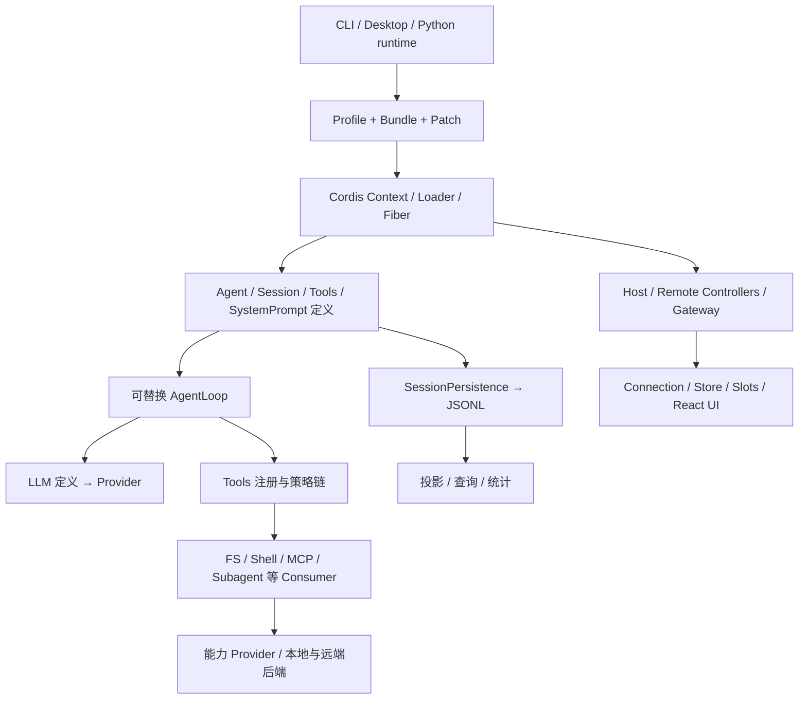
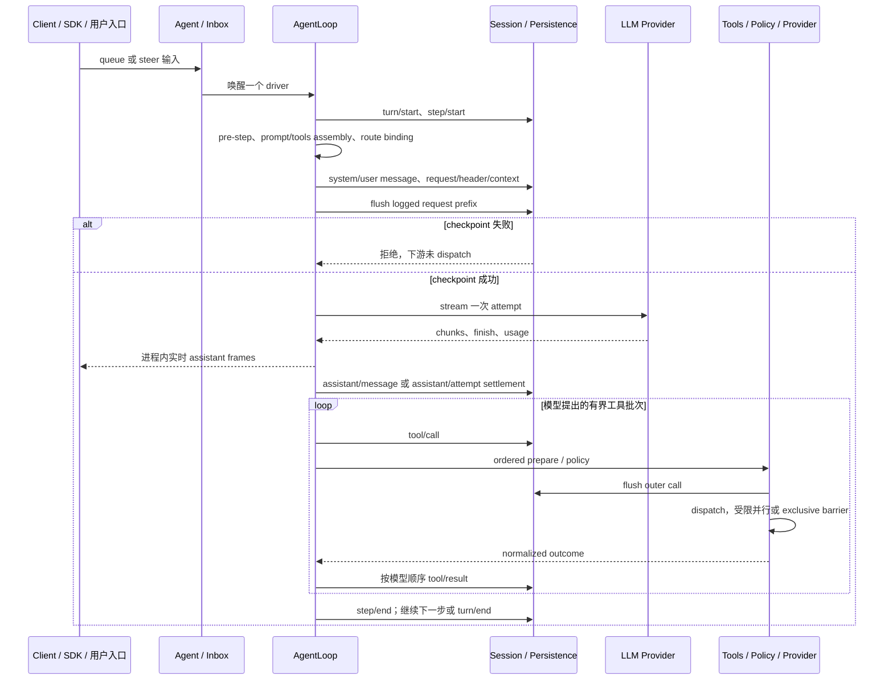

# DeepSeek Harness：源码架构与本项目优化映射

补充：[同场景数据对象与读写比较](../agent-harness-comparison/data-flow-io-comparison.md)；[DeepSeek 事件、批写与 checkpoint 推导](../agent-harness-comparison/io/deepseek.md)。

研究日期：2026-10-01。本文分析 `deepseek-ai/deepseek-harness` 的 `master` 固定提交 `639ed015397290b3745d163aafe02ffee4aa3f84`，根 manifest 版本 `0.2.0-rc.2`；分支名只说明采样入口，以下 GitHub 引用均固定到该提交。源码快照、树摘要与本项目基线摘要见[来源清单](../agent-harness-comparison/sources.json)，跨项目取舍由[综合优化报告](../agent-harness-comparison/architecture-optimization.md)汇总。[S01]

结论是：DeepSeek Harness 最有借鉴价值的是可替换的能力 seam、明确的进程生命周期、事件与模型可见历史分离、语义持久化检查点，以及从同一配置组合出多种产品入口的工程组织。它的中心对象是有事件历史的 `Session` 和进程内 `Agent`，不是本项目的跨进程 Task、固定逻辑 Orchestrator 和有持久核对责任的 Operation。移植时应把机制放入本项目既定的事实负责层，不直接搬入完整 AgentLoop。

## 1. 方法、证据等级与比较基线

- **代码事实**：固定提交中的类型、实现分支和配置明确支持的行为，引用紧跟相关陈述。README 只用于导航或说明作者声明，关键语义以实现为准。
- **推断**：由调用、存储和生命周期组合得出的适用范围；不把“该路径未发现”写成整个项目不存在。
- **建议**：对本项目的实现或实验要求，不是 DeepSeek 的现成能力，也不是本项目已实现能力。
- **未测量**：没有运行上游代码、安装依赖、执行测试、真实模型调用或 benchmark。测试源码说明覆盖意图，不能证明此提交测试已通过；没有吞吐、成本、故障恢复时间或质量胜负结论。

本项目比较对象是 [CONTEXT.md](../../../CONTEXT.md)、[ADR](../../adr/)、[`.draft` 架构](../../architecture/.draft/README.md)、[工程计划](../../architecture/.draft/engineering.md)、[可靠工作](../../architecture/.draft/reliable-work.md)、[存储](../../architecture/.draft/storage-and-middleware.md)和[生产部署](../../architecture/.draft/deployment-production.md)。本文按 L1 设计基线比较：设计与静态契约已形成，尚无参考运行实现。已采纳的九模块、24 项优化见[优化证据计划](../../architecture/.draft/validation/optimization-evidence.md)；本文建议细化实现和验收，不把已有设计写成新发现的缺失。

比较保持以下约束：Task 不等于 Session；固定逻辑 Orchestrator 不等于当前 worker；Brain 默认每轮零或一次物理调用并只返回 proposal；Operation 与 Effect 独立，unknown 必须由原负责方继续核对；Content 按准确版本及当前权限使用；Grant 的资源与用途授权不能被工具 consent 替代；生产主线仍是 Go、PostgreSQL 事实与 jobs 共事务、对象存储、WSS/gRPC。

## 2. 产品形状与模块依赖

### 2.1 工作区与部署单元

**代码事实。** 根工作区包括 `vendor/*`、`packages/*/*`、`native/system`、`apps/*` 和网站；TypeScript ESM、pnpm 是主要工程组织。桌面产品的 manifest 明确为 Electron shell；原生 system family 提供 Linux 限制执行器和 POSIX 文件锁绑定。Python 提供 SDK 和随包 runtime，而不是另写一套 Python Agent 决策内核。[S01][S02][S03][S04]

产品 API 主干位于 `packages/core`：Session、Agent 定义、默认 AgentLoop、Tools、SystemPrompt、作用域与品牌类型。业务能力扩展为 LLM、FS、Shell、Terminal、Sandbox、Skill、Compaction、Subagent、Jobs、Goal、Schedule、MCP、Workspace 等系列；API/Host 承载浏览器服务端，Client 承载连接、状态、React renderer 与 UI 插件；SDK/ACP 提供进程外入口。[S05]

**推断。** 包边界主要服务“能力实现可换、消费方不认识实现”的单宿主装配。它不直接表示独立服务或数据库边界。大量小包形成较高的依赖与发布治理成本，但让 headless、web、SDK、desktop 复用同一主干。

### 2.2 Definition、Provider、Consumer 三层

官方包约定明确要求扩展依赖 Service Definition，不能依赖具体 Provider；`dsh-agent-loop` 可替换，UI、hook、tool 使用 `dsh-agent` 定义。具体 AgentLoop 实现导入 Agent、Session、LLM、Tools 与 Persistence 定义，创建 `ReactLoopAgent`；SessionPersistence 本身是抽象 Service。[S05][S06][S07]

图是源码职责概括，不表示网络拓扑。Cordis Context 提供服务注册、依赖注入、事件派发和 Fiber 生命周期；销毁 Fiber 负责撤销监听、资源与子对象，不自动建立操作系统隔离或持久续跑责任。AgentLoop factory 用 accepting 标志、AbortController、活跃 Agent disposer 集合和 startup promise 集合组织有序退出。[S06]

模块依赖中的三个控制面应进一步分开：Cordis 管组合和生命周期，Agent/Tools 管一次交互的执行顺序与策略，OS runner 管真实进程限制。一个服务挂载成功，不证明限制 runner 可用；一个 Fiber 已 disposed，不证明远端副作用未发生；一个 session 文件可恢复，也不证明有 worker 会自动承担剩余工作。

### 2.3 Profile 是装配输入，不是授权事实

`profile-boot` 依次叠加 bundle patch、profile patch、命令行 overlay 和 telemetry switch，在空 root 上装配配置树；launcher 不解释具体产品旗标，而把不可变参数交给插件。ready 信号在 boot/host setup 成功之后才提交。[S08]

**推断。** Profile 和 bundle 有助于复制实验环境、选择不同入口；其名称不等于精确制品锁定清单，也不证明工具当前获准、模型费用已结或实例实际 ready。本项目可以借其“声明组合、统一启动、显式 readiness”，但必须继续由 InstallLock、ReleaseApproval 和实例激活事实分别承载版本与发布语义。

## 3. 核心数据类型、身份与状态归属

| 对象 | 源码语义与身份 | 生命周期与本项目对应边界 |
| --- | --- | --- |
| `SessionId`、`SessionHeader` | 不可变 header 保存版本、创建时间、cwd、父 session、seed 标记、delegationDepth、agentPreset | 持久交互/子会话地址，不是本项目 Task 或 Orchestrator 身份。preset 影响工具与 prompt，重启后不可随意换组合。[S09] |
| `SessionEvent`、`SessionSeq` | JSON 事件，连续序号；`SessionSeq` 是现有事件位置，`SessionLogOffset` 是间隙/前缀长度，两者分品牌 | 类型区分避免把事件位置与读取游标混用；品牌类型不是来自网络的可信校验。[S09] |
| turn / step | turn 从 input claim 前打开；step 包括一次模型请求及工具处理；turn 可以无 step 地完成/阻塞 | 是交互执行边界，不证明用户目标全部完成。`completed` 在无工具调用的普通回复上也成立。[S10] |
| assistant attempt | 原始紧凑 stream 随一次 attempt 的 settlement 入日志，实时帧另行发布 | “实时显示、模型请求物理尝试、已提交消息”分别处理；不能把流的最后一帧当作业务提交。[S10][S11] |
| tool call/result | 模型 ToolCallId，记录 call 开始与结果；失败恢复按该 id 配对 | 能解释没有结果的调用；它本身不是带资源授权、效果核验、费用责任的本项目 Operation。[S12][S13] |
| `SessionHandle` | header、只读/可写 access、连续 append、flush、close；单写所有权 | writer 是文件/句柄所有权；不等于逻辑 Task owner，不能用 close 宣称外部效果撤销。[S14] |
| Subagent child / run / Activation | child SessionId 可跨激活稳定；SubagentRunId 配对一次 run；Activation 为进程内驻留对象 | 一次性运行与 continuable child 分开；子工作返回不等于父任务条件通过。[S15][S16] |
| background job | JobId、owner Agent、运行/停止/终态、输出 ring、模型消费游标 | `jobs-local` 把状态与输出保存在内存；不是本项目数据库中的可恢复逻辑 jobs。[S17] |

**代码事实。** 当前 `SESSION_FORMAT_VERSION` 为 4，按结构/核心语义变化递增；一般事件词汇扩展通过 per-event 规则处理。Header 与 replayable log 分开，fork 的继承前缀长度是显式 storage metadata。Subagent descriptor 版本为 3，刻意只保存冷启动组合必需字段，不把 merge-extensible AgentOptions 直接序列化。[S09][S16]

**推断。** DeepSeek 的 identity 分层体现了“逻辑对象可以长于某个进程对象”的价值；但其 durable session 身份不能替代本项目 Command、Operation、Effect、UseSettlement、ConditionResult、Surface 等各自事实归属。比较应按职责匹配，而不是按同名词匹配。

## 4. 事件历史、模型上下文和读模型

### 4.1 Append-only 事实与可变 surface

Session 是追加事件的主对象。`append` 对输入做 JSON snapshot、deep freeze，验证事件数据和 surface 操作，拒绝发布边界内重入，随后推进内存日志。事件观察者在 log push 后运行；失败被容纳，不把已提交内存事件回滚。`requestHeader()` 增量折叠配置，冻结对外返回状态。[S18]

模型看到的消息历史由事件和 surface 操作导出。普通 log-only 事件不进入历史；例如子 agent descriptor 明确没有 surfaceOp，因此可回放身份但不暴露为 prompt。压缩在原日志不删除的前提下替换选定 surface 区域：记录 compaction start、summary body 与 end；有 unmatched start 时可以检测未完成压缩。它保存源事件关系，避免把“压缩后上下文”误当成完整原始日志。[S16][S19]

准确的压缩提交路径把摘要所用 provider/model、usage、shadowed range 和节点列表写入 `compaction/summary`，再用带 `sourceEventSeqs` 的 `user/message` 替换 surface 区间。替换是模型消费视图的改变，不是删除原 events。这种分离让“某摘要从哪些材料形成、消耗过哪些调用”可追踪；字段有记录并不证明摘要保留了全部目标语义。[S33]

**收益与代价。** 事件可以重建不同 projection，UI 与模型无需共享一个可变聊天数组；重建、版本迁移、源关系验证和冷读成本同时增加。保存所有历史还需要留存与隐私治理，不能因为“日志只追加”就永久保存受限正文。

### 4.2 Compaction 与检索不是长期记忆许可

`compaction-basic` 按实际 route 的 context capacity、已预留输出 token、阈值及保留尾部进行处理；支持模型摘要、可选工具结果 pruning、溢出后 retry。摘要重试属于额外物理模型调用，不能因为主 AgentLoop 有一个 step 就忽略它。所读实现还把工具调用配对平衡作为切分约束。[S20][S19]

SessionQuery 定义逻辑记录读取、关系追踪和过滤，SQLite FTS5 是检索 Provider；相关工具把查询暴露给模型。第三方 memory MCP examples 是独立配置层。**本次所读第一方主干没有建立本项目那样的跨任务长期记忆保存许可、用途、来源关闭及逐 holder 清理协议**；这句话限定于所读能力与示例，不能据目录命名证明所有外部插件都没有此功能。[S21][S22]

本项目应借鉴“事实日志与消费视图分离、保留来源关系、预算在真实模型编码侧计算”，并继续让 Memory 保存独立的范围、时间、冲突、推断性质和使用权限。Compaction 不应成为删除未知 Effect、预算未结项或长期记忆获准条件的捷径。

## 5. 存储、提交、恢复与崩溃边界

### 5.1 三种容易混淆的提交

1. **内存提交**：`Session.append` 验证并推进当前 Session，允许观察者处理；函数同步返回不等于字节已耐久。[S18]
2. **存储接纳**：`SessionHandle.append` 接纳连续 batch，后续同后端读取可见；接口明示允许缓冲/批量写，不能据此保证 crash 后存在。[S14]
3. **耐久屏障**：`flush` 保证已接纳 append 耐久并实体化，`close` 对 write handle 完成 pending durability 后释放 writer。SessionStore 的 flush 等所有 listener 结束，任一失败向调用方抛出。[S14][S23]

SessionPersistence 允许 lazy materialization：create 后当前进程能 stat/list/open，另一进程在物化后才可见；物化前 crash 的 session 没有耐久存在。JSONL provider 是第一方 session persistence 后端；另有 JSON/SQLite 非 session storage 系列，不能把 SQLite FTS 或设置库称为会话主账本。[S07][S24][S05]

### 5.2 JSONL 后端和单写责任

JSONL 将 session 存成按 cwd 分组、按安全转义 id 分目录的产物；默认为校验和 Zstandard frame，亦可纯文本。当前逻辑格式和物理 generation 分开，历史 generation 经 catalog 转成当前逻辑事件。读者只拿到连续有效前缀；torn tail 由下一写者在 append 前耐久截断。写句柄用 per-handle mutation promise chain，实时事件 batch 有最大 200ms 的有意等待窗口，显式 flush 通过同一路径排空。[S24][S25][S07]

跨进程 writer 通过原生文件锁/Windows 对应机制防止同时改同一 session。Native layer 只提供锁和执行机制，策略与 Session 生命周期由 Node 层拥有。这属于单个 session 产物的所有权保护，不能直接替代分布式 worker lease、条件提交和 PostgreSQL 的原事实恢复。[S03][S24]

具体 JSONL 实现的保证比最小 seam 更强：POSIX 首次物化使用已 sync 的 temp，`link` 在目标已存在时失败，随后同步目录，避免并发物化覆盖旧日志；追加 batch 写后 `handle.sync()`，失败尝试截回原长度并 sync；torn-tail 修复也 sync。这里的“原子发布”只覆盖单个物理产物，不是多领域事务。[S34]

写锁没有过期接管：进程死亡时内核释放，活着但卡死的 holder 会继续持有，直到退出；POSIX 还检查锁定 inode 仍对应路径。其优点是不会让恢复后的旧 writer 与新 writer 同时撕裂文件，代价是不能仅等待一个 timeout 就抢占卡死 writer。浏览器 worker 的锁 stub 只适用于单进程替代。[S35]

文档校核还发现一个范围差异：固定提交的部分 JSONL README 示例把 v3 写作 current，而当前 Session 源码常量为 v4。本文用源码常量确定版本；示例布局只用于说明 generation 形状，不把 README 的 current 字样当作准确格式事实。[S09][S24]

### 5.3 语义检查点的准确保证

独立 `session-checkpoint-policy` 插件在下游模型 stream 构造前 flush、顶层 tool dispatch 前 flush、下一 pre-step 前 flush。模型或工具边界上的 flush 失败会阻止真正下游调用；嵌套工具复用已耐久 outer call。顶层检查点后再次检查 abort，避免取消期间继续 dispatch。[S26]

**推断。** 这是“先有恢复依据，再启动费用或效果”的有效机制，但不是跨 Session、Goal、授权或外部系统的原子事务；检查点不能证明工具效果已发生，也不能确认模型供应商到底已扣费。安装这个策略是装配前提，不能把 AgentLoop 的每个 append 都描述成默认立即 fsync。

### 5.4 已记录启动而未记录结果

`repair.ts` 区分 `TOOL_NOT_STARTED` 与 `TOOL_OUTCOME_UNKNOWN`；对 crash-tail/fork-tail 合成缺失 tool result 和 step/turn closer，不修改原历史。unknown 文本要求只对只读/幂等操作重试，有副作用时先核对外部状态或询问用户，fork 还提示父 session 可能已在分叉后执行。[S13]

这是保守且有用的恢复标记。**推断。** 所读路径把后续行为交给模型和工具语义，未形成独立于聊天下一轮的持久 Effect 核对 job。因此不能宣传“崩溃后保证外部操作 exactly once”。本项目 EXE-03、可靠 jobs 与 unknown 责任已经规定更强边界，应复用其约束，只借鉴更清晰的启动前/启动后诊断。

### 5.5 非会话数据和附件字节有各自保证

Storage hub 只是 named backend registry 和 data-form facility，不做 I/O；领域层拥有语义，backend 拥有媒介。SQLite backend 把 KV document 存成每行 JSON；所读 `SqliteKvUnit` 的 primitive 为单 SQL statement，明确无多语句 transaction/write queue，排序由 caller 负责。JSON backend 自己的 atomic replacement 则做 temp fsync、rename 和 POSIX 目录 fsync。它们不能仅凭共用 hub 就与 Session JSONL 成为同一原子提交域。[S62][S63][S64]

附件的 verbatim file 有准确 sha256、显示文件名和 byte length，先发布 immutable canonical object，再发布显示名 alias；图片先经过解码、normalization 和限制检查，其引用摘要对应归一化后的字节，并在降采样时保留原尺寸。底层 staged write 用 file sync，POSIX 目录另 sync 后才返回持久引用。它值得借给本项目“字节先耐久、准确引用后提交”的顺序，但 attachmentId 不是 bearer permission，也不提供跨 holder 清理证明。[S65][S66][S67]

另一个值得保留的局部差别：Credentials-local 部分写入使用共享 `writeFileAtomic`，而该 helper 明示 crash fsync 不在保证内并留有后续事项。不能把 session/attachment 的强耐久保证泛化到所有名字含 atomic 的设置或凭据写入。本项目每种媒介的 conformance 应单独声明原子可见、crash 耐久和跨领域提交边界。[S68][S69]

## 6. 用户输入到模型与工具的一条主路径

**代码事实。** AgentLoop phase 区分 idle、maintenance、running，wake 可以在 maintenance/abort 后锁存；输入经过 pre-step，空输入可以结束 turn 而不消费模型调用。一次 step 的 request-error waterfall 可能指定 retry；成功无 tool calls 即 completed，有 tool calls 则执行并决定继续。[S10][S11]

Inbox 也是事件投影，不是单纯 volatile 队列：`agent/inbox/spliced` 保存插入/移除，`next-turn` 和 `next-step` 分开，pending MessageId 不可重复；claim 在 step 边界移除输入，输入是否被丢弃需要把 splice 与 turn/step 一起折叠，不能只看 turn/end。尚在队列与已被消费的身份约束仍不是本项目长期保留的 Command receipt。[S36][S37]

工具调度分 exclusive barrier 与 bounded rolling parallel pool，开始前重新读取 executionMode；只有 dispatch/body 重叠，prepare/policy/result context 保持模型顺序。abort 停止补充新调用并排空已启动调用，为未启动调用记录 synthetic result；调度器失败也先排空，再由 owning step 记录保守缺失结果。[S12]

**收益与代价。** 有界并行能降低独立工具批次的等待，顺序提交维持可回放和模型预期；较早 slot 的慢调用仍可能阻塞后续结果发布。exclusive 属性必须由真实 Provider 能力决定，不能仅据模型名字或“看起来只读”判断并行安全。本次没有测量加速比、内存占用或中止耗时。

Tools 的实际分类默认保守：只有当前可见 tool 的 `isConcurrencySafe(args)` 返回精确的 `true` 才是 parallel；未知、隐藏、未声明、非法或抛错都归 exclusive。这个规则是执行调度属性，不能当成 read-only、幂等或已授权证明。[S38]

## 7. 模型接入、工具契约与安全

### 7.1 决策、传输和工具执行

LLM 能力系列有共享定义与 Provider adapter；AgentLoop 把有效 model route、调用配置、assembled schema 和请求 surface 写入历史。工具注册表拥有 schema、执行函数及 pre-execute / around-dispatch / post-execute 链；参数需在工具层校验，invalid JSON 仍能作为原文本进入错误处理。[S05][S11][S12][S27]

模型绑定发生在 `prepareCall`：先通过 request waterfall 形成候选配置，再拿 exact adapter 的有效配置/default；`buildRequest` 记录 initial/resume/change/series header，记录 tool addition/removal，再冻结从当前 surface 导出的 messages。`llm-pi-ai` route 复用所装 pi-ai 的协议/目录，也允许显式自定义 route；DeepSeek adapter 将 HTTP 和 in-band failure 规范为 AUTH、QUOTA、RATE_LIMIT、CONTEXT_WINDOW_EXCEEDED 等，并保留 provider request id 与 Retry-After。[S39][S40][S41]

`llm-retry` 是独立 request recovery 插件，policy 属于各 Provider，支持 normal 的 retryableCodes/maxRetries 和 always 模式；退避与生命周期取消分开，retry/retry-started 写入 Session，dispose 取消并等待活跃 recovery。代码在 cancellable wait 前做 `Session.append`，此处不能仅据注释的 durable 用词宣称完成了独立 fsync；物理耐久仍依赖存储写入/检查点。always 模式需要额外预算约束，本项目默认单轮 Brain 不直接采用它。[S42]

工具成功返回也有独立规范化：先 snapshot candidate、验证 output Schema、冻结 value，再从 value render model-facing content，并可生成 presentationMeta；around-dispatch wrapper 的结果会重新按当前执行 token 校验。它能拦截结构错误和包装器破坏，但 Schema pass 不证明输出覆盖了全部分页、来源仍新鲜或外部效果已经核实。[S43]

**推断。** 其默认循环把“模型提出工具”与“宿主按策略执行工具”接在同一个进程状态机中，适合终端/桌面开发 Agent。本项目 Brain 适配器应只实现一个 bounded proposal，不因迁入默认 Loop 而隐藏多次 retry、compaction、子 agent 调用或工具执行。provider retry policy、hook retry、物理 attempt 的费用与错误身份必须由既定 Brain/UseSettlement 路径可查。

### 7.2 人工批准与 OS 限制是不同层

ApprovalService 提供 session 策略和 ask/outcome 审计；`ask`/`never` 等策略影响 answerer 流程，`allowed-once` 是一次批准结果，late answer 不得在已取消之后复活原请求。沙箱策略统一持有 read-only / workspace-write / danger-full-access，工具每次解析当前 session/cwd；缺失或不可用限制 runner 不能退回裸 argv。[S28][S29][S44]

策略 service 的 fail-safe 默认是 read-only；站立 mode 与显式已批准 override 分开，执行请求中的 session 决定 cwd。它是文件沙箱的统一策略，不因此覆盖任意 MCP 或普通网络插件。[S44]

本地 sandbox 根据平台选择 Linux bwrap/Landlock、macOS Seatbelt、Windows ACL/restricted token 并记录 enforcement 事实。代码特别标注 Windows 的 partial：NTFS hard link、未限制读取等边界。因此“有 sandbox 插件”不能概括所有平台都提供同等文件、凭据与网络保护。[S29]

对本项目的借鉴是实际平台 probe、typed unavailable/partial、当前请求时策略解析和一次原批准审计。Grant 仍须绑定受信主体、资源、用途、期限、额度；UI consent、plugin config、模型指令和 OS confinement 彼此不能充当对方的证明。Cordis dispose 是协作式生命周期清理，系统隔离必须由实际执行宿主保证。

### 7.3 连接认证与模型附加数据出口

浏览器 carrier 有独立的 trust fence 和 authentication：`/api` fence 检查 Host、Origin/Fetch-Metadata，防本地 API 的 DNS rebinding 和 cross-site 请求，源码明确它不是 auth 层；BrowserAuth 使用 launch token 换取 authority-bound 签名 cookie，并验证发行/过期时间。它保护进入同一 host 的连接，并不由此实现本项目多用户目录、固定 Task 路由或每资源/用途 Grant。[S73][S74]

官方 DeepSeek 请求还存在可选装配的扩展数据面：`session-log-deepseek` 插件的 enabled 默认 true、单请求字段默认上限 8MiB；base 与 sdk-minimal bundle 声明挂载。**仅当该插件挂载、enabled 且官方 DeepSeek adapter 采用扩展时**，它把 canonical log 中 accepted watermark 之后能容纳的 event prefix 加为 `dsh_session_log`，含 event data、seq/time、header/cwd/lineage 等；这不同于只发送当前 surface messages。接受后 watermark 作为 Session event 追加，代码明示 2xx 后 crash 可能重传未知尾部，尚有 immediate-checkpoint 后续项。[S75][S76][S77]

**推断与本项目约束。** enabled 开关和当前模型调用获准，不自动证明原日志全部字段已取得另一个上传用途的许可；压缩后的模型视图更小也不证明附加字段未出站。该机制可借其有界前缀、watermark 与重传分类，但本项目 ModelAdapter/telemetry 的每个实际序列化出口应检查当前用途权限，诊断只保存获准元数据。不能把这个插件的默认开关泛化为所有 DeepSeek Harness profile 的不可关闭行为。

## 8. 长任务、Goal、Schedule 与后台工作

Core turn 的 completed 只是交互 loop 结束。Goal 是同 session 的扩展状态和轮次驱动，Schedule 是 host 后续操作，Jobs 是通用后台执行能力；三者不应因用户都感知为“继续工作”而合并。[S05]

### 8.1 Goal：持久目标与当次继续权分开

GoalRef 用稳定 GoalId + revision 做 compare-and-set；持久快照保存 objective、active/paused/blocked/complete、block reason 和 maxGoalRounds。`armed/disarmed` activation 刻意为进程本地，初次恢复为 disarmed；pause/disarm 不把原目标删掉，human-authorized resume 建立新的 activation edge。round driver 用 goal id、revision、round 和 message id 对照预留输入，在自动继续前 flush 并复核条件。[S45][S46][S47]

**推断。** 这比仅靠末尾回复或内存 while-loop 表示持续目标更明确，也说明作者没有把 durable active 自动解释为“任何重启都可无条件继续”。本项目借这种 phase/authorization/runtime 区分，不把 GoalRef 直接替代有 Requirement、预算、Effect 和完成裁决的 Task。

### 8.2 Schedule：确有持久记录，交付跨两个提交

Schedule 在 host storageDomain 的 tasks 表保存 SessionId、ScheduleRecord、active/inactive、lastDelivery 及有界 deliveryHistory；它独立于 Session 是否已激活，管理读取、删除和改时间不激活会话。runtime 处理 due occurrence 时找到原 Session 的 Agent，形成新 UserMessage、followup 入 inbox，要求 Session flush 确认，然后提交 schedule receipt/next scheduledAt。[S48][S49][S50]

**推断。** 此路径存在“inbox 已耐久、Schedule receipt 尚未成功”的提交窗口：重启后 schedule 仍 active，所读 runtime 会重新形成消息；源码不能据该顺序证明 occurrence exactly once。它是可恢复提醒设施，不是本项目 facts/jobs 共事务框架。下文 D-11 将这一窗口用于验收本项目原命令交接，而不是照搬存储顺序。失败 occurrence 在当轮计时选择中被排除，重新触发及恢复策略必须另查运行证据。[S50]

### 8.3 Jobs：进程内生产者和有界观测

`jobs-local` 明示生命周期、bounded output ring 和模型消费 cursor 都在内存；每 owner 默认活跃上限 10，live ring 默认 256KiB，settled ring 默认 16KiB。producer/controller fiber 结束不自动删除登记；Agent/service disposal 对活跃工作取消并等待合规 producer，teardown cancel 抛错时只强制失败记录并报告可能 orphan。[S17]

**推断。** 这类 bounded runtime 对终端命令、长工具和实时输出很实用；并不天然满足进程故障后的领取、重试、原结果归并或独立效果核对。本项目 reliable-work 已用原数据库 jobs 定义这些责任。可以借鉴 ring/cursor 和 exact-owner 授权作为观测层，不把本地 JobId 当成主账本 job_id。

## 9. 子 Agent 协作

DeepSeek 同时定义一次性 subagent 和可继续的 durable child；Provider capability 对 agentOptions、outputSchema、depthLimit、toolFilter、persona 显式声明，不支持的请求在开始前失败，不能静默忽略。continuable child 只有一个 durable Session 和至多一个进程内 Activation，只有 Agent inbox 是 turn queue；manager 不再建立中间 result-bearing Task wrapper。[S15][S30]

durable descriptor 记录 provider、mode、label 与冷启动必需组合；父子传递、interrupt authority、depth floor 与子身份分别处理。它刻意不保存 maxTokens/outputSchema 等一次 activation 的预算和结果条件，冷启动须按 descriptor 还原组合，不把父当前配置随意继承为历史子配置。[S16]

**收益与代价。** session-backed child 使 UI 导航、冷读和后续消息可以复用原历史；One-shot、durable child、进程 Activation 分离减轻语义歧义。外部 ACP/Codex/Claude/DSH SDK Provider 的能力和权限不同，adapter 必须明确其降级；层层委派还放大模型费用、上下文复制及结果核验成本。[S05][S15]

本项目可借“显式 capabilities + 冷启动组合快照 + 父子身份校验”，但内部 Agent 生命周期与外部 Agent adapter 继续按 Collaboration 定义区分。父任务仍裁决原 Requirement 与 ConditionResult，子返回的 stopReason、最后消息或 outputSchema 通过都不能自动代表父条件通过；未决 Effect 与费用必须沿原责任归并。

## 10. UI、远程接口与扩展入口

Remote BFF 的 Gateway 承载类型化 unary、多路复用双向流与 host events；SessionController 拥有会话命令、历史流、控制状态与身份策略，Workspace/Terminal/Job Controller 分别拥有各自对象。Client 分离 Connection、observable store、typed slots 与 React renderer，功能插件填充会话、approval、子 agent、jobs、goal、文件和交付物视图。[S31][S32]

当前 Web follower 的 assistant reconnect baseline 是 **process-local** accumulator：保存 attemptId、startedAfterSeq、turn/step、nextIndex、stream 和 revision，接受 dense frame；revision 或 index 不连续时清除 active attempt。它让重新连接的浏览器接续活跃模型前缀，但进程死亡后仍只能从已落盘 settlement/log 恢复，不能把内存 baseline 称作持久 checkpoint。[S55]

**推断。** 这种分层便于浏览器入口适配同一宿主，也便于把工具/轨迹的展示独立于核心循环。所读 UI 能展示会话和实时执行，并不能因此声称已有本项目 Surface 的持久业务生命周期、精确正文预览 Confirmation 或生产断线恢复协议；本项目 WSS/gRPC 不需要改为 Typert RPC。

MCP 把外部服务工具接成原生工具，名字带 `mcp__<server>__` 命名空间。同步先 fetch/build 下一 generation，失败保留旧 generation；成功再 swap，注册冲突撤回本 server 的局部新工具，避免半套工具。call 传递 execution signal 和 deadline，输出 Schema 可单独规范 structuredContent。Server instructions 按 server 归属以 literal text 进入 systemPrompt section；这保留 attribution，但其文字不是 Grant 或当前可执行权限。[S70][S71]

Skills 注册表合并 Provider catalog、按 name 选获胜项，提供 source/resource base 和独立的 modelInvocable/userInvocable 标志；bundled/local/runtime 来源可以有不同优先级。这里的 invocation policy 是目录/加载可见性，不是本项目用途许可；选中 skill 也不授权其指令要求的行动。[S72]

Extensions 存在 Cordis runtime inspection 和模型编写挂载能力。动态 host runner 把 package 定义、active run 和 human-approved client activation 分开；其 `node:vm` fresh realm 禁掉若干 Node APIs，引导调用 ctx.fs/web/bash 和 Cordis timer。源码明确说这只让 cooperative packages 可检查与可销毁，**不是 containment**，host-realm helper 仍可能逃逸；browser half 在自身 closure 中运行。这不能作为执行不可信插件的系统隔离证据。[S51][S52]

扩展代码的可执行性、OS 权限、用户授权和发布资格仍是不同问题。移植时优先借声明目录、生成索引和消费者只依赖契约的工程机制；自修改运行时代码需要本项目既定的 InstallLock、评测、ReleaseApproval 与隔离宿主入口。

进程外 SDK 的协议是换行分帧 JSON-RPC；TS client 启动 runtime child process，server 插件从 stdio 服务。Python SDK 没有独立应用，调用 bundled dsh 的 `--profile sdk`，显式要求 dsh_home/DSH_HOME，延迟启动后复用 runtime 至 close。SDK cwd 是 Agent workspace，runtime_cwd 是子进程 cwd；initialize timeout 与一般轮次 timeout 分开。它提供编程调用边界，不给调用者另外一套授权裁决或默认耐久 worker。[S53][S54][S56]

SDK transport 本身的 request id 是 RPC pending-map 身份：close 拒绝 pending promise，malformed line 被忽略，未注册 method 返回协议错误。TS launch 还核对 SDK client 与 dsh manifest version 一致。单次 RPC 答复丢失仍需业务原身份恢复，不把新 JSON-RPC id 当作本项目 Command 去重键。[S56][S57]

## 11. 测试、回放、诊断与发布证据

根脚本区分 typecheck、lint、Vitest、expected snapshots、e2e、benchmark、native build 与 desktop packaging；test-support 提供 replay/Loader smoke，runtime-diagnostics 提供按包归属的不变式检查。仓库包含 session 历史格式与 corpus、headless/provider retry、subagent、浏览器长会话与重连等场景。[S01][S05]

**可借机制。** 应冻结模型回放输入、关键事件序列和存储代际样本，对同一逻辑场景分别检查宿主 API、UI 与后端恢复；generated catalog/graph 的新鲜度检查能防止代码与文档分叉。**证据上限。** 源码中的 benchmark 名称和 fixture 不说明真实模型质量、有效成本、故障 RPO/RTO 或本项目规模已经达标。本项目 Evaluation 的独立真值、实验分母、正式评测暴露限制及费用最终性更强，仍按原规范执行。

所读 crash-recovery e2e 明确有两条验证意图：模型 dispatch 前完整 request 已持久；工具 side effect 前 intent 已持久，缺失结果被修复成 unknown。这条 hard-crash suite 对 Windows skip，不能用它代表 Windows 已验证。checkpoint spec 还列出取消在 flush 中到达、flush 拒绝、嵌套复用和 Fiber dispose 移除 wrapper 等负例。这为 D-02 提供真实可借的测试形状，而非笼统“需要容错测试”。[S58][S59]

性能场景也有明确边界：active-stream-reconnect 测的是 Node 中 100,000 delta 前缀的 Client fold/保留堆，明确不测浏览器渲染；agent-continuation adapter 不调用供应商序列化/网络，工具体主要为合成，SDK 变体才走真实文件读取。文档中的预算是上游回归口径，不是本次实测，也不能用于声称本项目 production latency。[S60][S61]

## 12. 九模块与工程主线逐项映射

| 本项目负责层与已有约束 | DeepSeek 可对照的机制 | 本项目实施取舍 |
| --- | --- | --- |
| Orchestrator：固定 task owner、目标/控制/预算/完成，ORC-01～03 | AgentLoop、Goal、inbox 与 turn/step 日志 | 借有界 driver、显式边界和事件回放；不把 loop completed 当目标完成，不由 worker 身份重写 Orchestrator。[S10] |
| Brain：输入绑定、零/一物理调用 proposal，BRN-01～03 | Request header/context、LLM route、retry waterfall、compaction | 借准确输入/adapter metadata；把额外调用显式形成独立责任，不把多步 loop 放进默认 Brain。[S11][S20] |
| Execution：绑定能力、输出范围、未知效果，EXE-01～03 | Tools schema/policy、parallel/exclusive、repair unknown、sandbox | 借启动前 gate 与排空；在本项目 Operation/Effect ledger 中落实结果和核对，模型建议不能消灭 unknown。[S12][S13][S26] |
| Memory：准确版本、范围/冲突、许可及清理，MEM-01～03 | Log/surface、compaction、SessionQuery/FTS、外部 memory MCP | 借可回原证据和裁剪诊断；跨任务保存与使用仍走 Memory 当前许可，不把 session history 自动升级为长期记忆。[S19][S21][S22] |
| Collaboration：父子交接、独立费用与未决项，COL-01～02 | Provider capabilities、child descriptor、stable child vs Activation | 借显式能力和组合快照；父 Requirement、效果与费用继续归原 owner，外部 child 不假装内部生命周期。[S15][S16][S30] |
| Interaction：准确正文预览、Surface 和缺口，UI-01～02 | Controller/Connection/store/slot、实时帧和 committed log | 借 reader projection 和组件边界；用户展示必须指向已核实版本，确认由业务端消费，连接关闭不终结 Surface。[S31][S32] |
| Security：当前 Grant、一次消费、真实宿主隔离，SEC-01～02 | approval/policy、sandboxPolicy、platform probe/partial | 借安全失败和真实限制诊断；consent 与 Grant 分开，OS 探测结果进执行准入而非只写 prompt。[S28][S29] |
| Extensions：InstallLock、精确制品/材料、发布/回退，EXT-01～03 | seam、profile/bundle patch、runtime registry | 借依赖方向和组合声明；保持静态契约/制品核验/发布批准，活动 loader 状态不能代替锁定清单。[S05][S08] |
| Evaluation：冻结计划、独立真值/完整成本，EVA-01～03 | replay、expected corpus、diagnostics、benchmarks | 借机制回归资产；正式质量/成本结论依本项目冻结实验，而不是“snapshot 全过”。[S01] |
| Engineering：Go 单 module、显式 SQL、共享契约/SDK | pnpm seam packages、Cordis DI、generated docs/type graph | 采用依赖检查与接口生成思路；不复制 npm 多包数量或动态 DI 技术栈。[S01][S05] |
| Reliable-work：原命令接纳、facts/jobs 共事务、lease/条件提交/原事实恢复 | flush checkpoint、factory drain、jobs-local | checkpoint 加为边界测试；数据库责任主线不变，不用内存 JobRegistry替代持久 jobs。[S17][S23][S26] |
| Storage：PG 事实、对象字节先耐久后引用、最小终态长期保留 | JSONL generation、torn-tail、防同时 writer、FTS | 借 schema 演进和重建纪律；按生产数据归属选择 PG，session export 可选 JSONL，不另设权威账本。[S24][S25] |
| Deployment：网关/应用/工作池/隔离宿主、三可用区目标 | 单 host 组合、desktop、原生 payload、Python runtime | 借入口闭包与 readiness；跨进程恢复、RPO/RTO、发布排空仍在公司平台单独验收。[S02][S03][S04][S08] |

## 13. 具体优化建议

下列 D 编号为本报告的局部追踪 ID。P0/P1 表示建议建设顺序，成本是定性实现与运行代价，全部收益尚未测量。它们不增加未冻结的公共方法或自由 wire 字段；需要新字段时先在原负责层形成内部类型/fixture，再走契约发布审查。

### D-01 / P0：把日志、决策视图与 UI 投影分开验证

- **owner / 改哪层**：Orchestrator 维护原事实；Brain 编码输入；Interaction 维护读投影。细化 ORC-02、BRN-01、UI-01 的内部 projection 接口。
- **依据**：Session log、surface、requestHeader fold 及 assistant settlement 分离。[S18][S11][S19]
- **约束**：本项目事实仍在权威数据库，view 不增获准事实；裁剪不得丢 unknown、硬约束、准确 Content 引用及当前使用权限。DeepSeek surface 名称不覆盖本项目持久 Surface。
- **成本**：新增投影版本/水位、冷重建和对照 fixture；减少从可变聊天数组推断事实的耦合，但是否减少故障未测量。
- **验收**：同一原事实生成 UI、Brain 和恢复视图；打乱通知、重连、连续三次压缩后，硬约束、来源版本和未结效果逐项一致；投影落后明确显示水位，不宣布完成。

### D-02 / P0：在真实启动出口验证提交失败会阻止 dispatch

- **owner / 改哪层**：Reliable-work 框架与 Brain/Executor owner；默认适配器的出站调用 gate，衔接 EXE-03、BRN-01 与既定共事务规则。
- **依据**：模型和顶层工具的 semantic checkpoint fail-closed。[S26]
- **约束**：本项目不是把 PG commit 改为 JSONL flush；业务状态与下一 jobs 仍共事务，commit unknown 必须先按原 command 查询。嵌套调用需要可追责的独立费用/效果，不能无条件只复用 outer marker。
- **成本**：各真实出口增加 recorder/fault hook；耐久等待可能增加时延，需分配既定预算。
- **验收**：分别在提交前失败、提交答复丢失、提交成功后 worker crash 注入故障；记录实际出站次数，未确认 durable 准入前为零；原事实恢复后只对同一逻辑 Operation继续，unknown 不另造 operation。

### D-03 / P0：将“未启动”和“效果未知”做成稳定诊断类别

- **owner / 改哪层**：Executor 事实归并和 Interaction 缺口视图；落实 EXE-03、UI-02 的 internal error mapping。
- **依据**：TOOL_NOT_STARTED / TOOL_OUTCOME_UNKNOWN 及 fork 保守措辞。[S13]
- **约束**：日志缺 call marker 只能在本项目可证明的 dispatch gate 下判未启动；收到 abort、timeout、进程退出均不能直接判未发生。原 Effect reconciliation job 不依赖新一轮模型或用户碰巧打开会话。
- **成本**：typed 分类、准确原标识及核对/晚到结果用例；正常路径几乎不需额外模型。
- **验收**：读操作、幂等写、非幂等写分别测试丢答复和晚到效果；UI 与 SDK 展示同一事实类别；未知操作沿原身份继续查，确认重复效果计数为零，截止未知单列。

### D-04 / P0：为所有可替换能力设依赖方向门禁

- **owner / 改哪层**：Engineering + Extensions；Go import graph、SDK/Schema generation 与能力目录。
- **依据**：Definition/Provider/Consumer 约定与生成 module graph。[S05]
- **约束**：保持 Go 单 module，避免为了 seam 新增服务/数据库。默认组件依赖 api/runtime 契约，第三方扩展不能导入内部实现；生成内容不得发明第二套领域字段。
- **成本**：构建 import 规则和生成新鲜度检查；需维护例外清单，减少插件接入时的隐式实现耦合。
- **验收**：换一个测试 Provider 时消费方无需修改；故意导入具体 backend 或改 schema 不重生成时 CI 拒绝；目录绑定与真实装载版本一致，衔接 EXE-01、EXT-01。

### D-05 / P0：以同一 attempt 测试实时流、提交结果与重连

- **owner / 改哪层**：Interaction + Brain 适配器；流 reader、committed result projection 与原请求恢复 fixture。
- **依据**：AssistantStreamAttempt 的 live frame 和耐久 settlement 分开；Web reconnect 的 live baseline 为进程内缓存。[S11][S55]
- **约束**：保持本项目 WSS/gRPC 的恢复与流控协议；实时 token 不创造 Task、ConditionResult 或获准成功。物理 attempt 身份与逻辑 Generation/费用责任按原契约处理。
- **成本**：重连/慢消费者/部分 stream fixture，增加客户端水位和 stale frame 防护；不引入新的权威 UI 存储。
- **验收**：在中间 chunk、finish、settlement 前后断线；先收 live 再收 committed 不重复显示，不将失败 partial 合并为成功；原逻辑请求的所有物理尝试与费用可追踪。

### D-06 / P1：冷启动恢复先核对组合和 Provider 能力

- **owner / 改哪层**：Collaboration + Extensions；内部 child composition descriptor、能力协商及恢复 mapper。
- **依据**：durable child 与 Activation 分离，capability 在 start 前拒绝，descriptor 显式版本化。[S15][S16][S30]
- **约束**：子任务归属和外部 delegation 仍按本项目 Command/Task 映射；组合引用精确 InstallLock，恢复前重验当前 Grant。每 activation 预算与父任务累计预算不能被默认值重置。
- **成本**：versioned descriptor 与 adapter conformance；不同 Provider 字段支持需维护矩阵。
- **验收**：撤下 Provider、换默认 preset、权限撤销、子进程死亡后恢复；不支持项开始前明确拒绝，旧 child 不继承新工具；父可查子原结果、未决效果及累计费用，衔接 COL-01/EXT-01。

### D-07 / P1：把实际隔离强度作为可测试准入证据

- **owner / 改哪层**：Security + Executor 宿主；平台能力探测、adapter readiness 和 diagnostic projection。
- **依据**：sandbox 功能 probe、不可用 fail-closed 和 Windows partial 声明；动态 Cordis VM 明示不提供 containment。[S29][S03][S52]
- **约束**：不靠 prompt 声明权限；Grant 和人工确认仍各自裁决。partial 平台按具体开放能力准入，不用“沙箱打开”布尔值抹平网络、凭据、文件和进程差异；不可信 plugin code 不能在宿主 `node:vm` 或其 Go 同类包装中取得系统信任。
- **成本**：平台测试矩阵、原生或公司平台适配；probe 有启动代价，可在精确宿主配置不变时缓存，但失效须重验。
- **验收**：runner 缺失/不支持、文件越界、符号/硬链接、凭据访问、网络出口、取消 orphan 逐项取得真实记录；禁用失败不裸执行，报告 partial 的具体剩余范围，落实 SEC-02。

### D-08 / P1：压缩事件保留原依据并计量额外调用

- **owner / 改哪层**：Orchestrator + Memory + Brain；已有 context optimization 的摘要内部记录与输入测量。
- **依据**：surface replacement、sourceEventSeqs、真实 target window 与摘要 retries。[S19][S20]
- **约束**：默认 Brain 单轮零/一次调用不变；摘要、修复或额外调用由独立且有界责任承载。来源撤销后不能借旧摘要继续使用受限内容。
- **成本**：摘要模型费用、版本映射、质量反例和 token measurement；只在冻结对照有收益时启用候选。
- **验收**：同一长任务有/无候选压缩配对比较，记录全部摘要和重试 token、完整成本、硬约束违例、unknown 丢失和来源混淆；超窗不发送，衔接 ORC-02/MEM-01/BRN-01 和 X-01。

### D-09 / P0：建设后端与历史格式共用回放语料

- **owner / 改哪层**：Engineering + 各存储 owner + Evaluation；migration fixture、真实 SQLite/PG conformance 和 UI/API replay。
- **依据**：Session format generation、torn-tail、历史 corpus 和 expected 测试入口。[S09][S24][S01]
- **约束**：SQLite/PG 各用真实事务路径，JSONL 只作可选导出/fixture；迁移遵守本项目独立迁移入口和发布批准。受限正文不进入通用回放日志，数据用途与正式暴露按 EVA-01处理。
- **成本**：跨版本样本保养、结构真值和真实 DB 故障套件；运行时间随矩阵增长，需要选择适用路径。
- **验收**：旧版日志/库转成当前记录后身份、终态、未知和费用不变；不兼容或不允许忽略的未知词汇拒绝且保留原制品；正文清理后仍拒绝重复 command，不能用“新解析器读得懂”掩盖语义变化。

### D-10 / P1：为后台观测设有界输出和不消费读取

- **owner / 改哪层**：Interaction + Executor；持久 jobs 上方的 output projection/cursor，运行时 admission 与取消排空。
- **依据**：jobs-local 的 exact owner、ring、modelCursor 与 teardown orphan 分类。[S17]
- **约束**：观测丢通知或 ring eviction 不丢权威 job、Effect 与费用；人类读取不得偷偷推进模型消费 cursor。不能把进程内 status 写成 PostgreSQL 作业终态。
- **成本**：ring/spill/backpressure 和公平调度测试；限制输出能控制内存，但保留字节仍走准确 Content 权限与清理。
- **验收**：大量输出、慢 reader、owner 取消、producer 不响应、服务重启同时发生；任务/核对责任继续存在，结果 finality 不从 ring 空白推断，Orphan 和 truncated 明示；按生产队列与过载预算测量。

### D-11 / P0：把两份持久账本之间的提醒交付窗口列入原命令套件

- **owner / 改哪层**：Reliable-work + Interaction 输入 owner + Orchestrator；内部 schedule/后续输入 adapter 的原 command、receipt 与 jobs 映射。
- **依据**：DeepSeek Schedule 先 Session inbox flush，再写 schedule receipt，存在两个提交点。[S48][S49][S50]
- **约束**：同数据库的 schedule 状态与后续 job 共事务；跨负责方必须持久保存 exact command、目标和 receipt，然后按原 command 查询/重放。提醒还未完成时，不能因 worker/SDK close 清掉继续责任。保持原 Orchestrator，不把恢复误作新 Task。
- **成本**：原 command/query adapter 和 occurrence-to-command 内部身份映射；增加边界 fault fixture，不另加工作流平台。
- **验收**：分别在 schedule 接纳后、发送后、目标接纳后、receipt 返回前、receipt 提交未知时 crash；同一 occurrence 只消费一次目标输入，答复丢失可恢复原 receipt；时钟回拨、停用、旧 worker 晚到不能重启已终结 occurrence。此项落实现有可靠接纳和去重规则，不新增业务裁决者。

### D-12 / P0：在包装器前后验证结构结果和模型/UI投影

- **owner / 改哪层**：Execution 能力 owner + Interaction renderer + Evaluation 独立参考；细化 EXE-02、UI-01、EVA-02 的能力专属输出契约。
- **依据**：ToolRuntime 把验证后的 canonical value、model content 和 presentationMeta 分开，并重新规范化 around-dispatch 返回。[S43]
- **约束**：Schema 验证与语义覆盖、效果核实、当前 Content 权限分别成立；value 校验不能制造 ConditionResult 通过。只借内部字段和测试，尚未冻结的输出先留在能力专属类型，不能冒称公共协议。
- **成本**：每能力一份输出校验/投影与独立真值 fixture；结构检查增加少量 CPU，独立读回/分页核验的 I/O 另计。
- **验收**：植入丢字段、漏页、旧版本、错误 render、包装器把 error 改 success；分别给出结构错误、范围不足、未核实效果或 UI 投影失败，原结果/未知保留，模型与 UI 不用展示文本覆盖权威 value。

### D-13 / P0：验证最终模型请求及附加日志字段的用途权限

- **owner / 改哪层**：Security 授权 owner + Brain ModelAdapter + Evaluation 数据出口真值；补充已有 SEC-01、BRN-01、MEM-03 的 serialized-request conformance。
- **依据**：官方 adapter 附带 canonical session log 的扩展不等于当前 model surface；enabled 和 byte cap 只决定贡献开关/大小。[S75][S76][S77]
- **约束**：保持本项目火山方舟 adapter 路线；只允许明确配置、获准用途的数据字段，模型正文、调试、日志上传、评测采集分别核验。准确 Content、派生摘要和当前权限遵循原 owner；不能从“内存里还存在”推导“允许再传”。不引入新公开许可方法。
- **成本**：对最终序列化请求做可注入测试 capture、字段白名单和用途核验；只记录元数据/获准样本，避免测试采集本身形成受限副本。
- **验收**：主 prompt 合法但附加日志含已关闭来源、子 agent 隐藏描述、旧 snapshot 或未获准数据时，实际 mock-provider 接收不到该字段/字节；hook/SDK/profile 覆盖不得绕开。摘要裁剪、撤销、崩溃重传和 provider 切换分别测，费用重传与数据重传独立记账。

## 14. 采纳顺序与不直接迁移的机制

建议先做 D-01～05、D-09、D-11～13，进入本项目现有阶段 A 的可恢复最小闭环；D-06、D-07 随子委派和真实隔离能力开放取证；D-08 进入长任务对照阶段；D-10 随后台工具和慢消费者场景增长实施。全部条件仍以本项目已有优化计划和生产准入为准，不用这份源码报告放宽 gate。

不直接迁移默认由模型与插件控制继续的多步 AgentLoop、聊天日志代替 Task ledger、模型建议代替 Effect 核对、进程内 jobs 代替持久 jobs、Cordis 生命周期代替隔离、动态挂载代替发布批准、FTS 命中代替长期记忆获准。这些是两项目职责不同的取舍，并非 DeepSeek 所有能力的缺陷判断。TypeScript、Electron、Python 分发和多 npm 包也不改变本项目已经确认的 Go/React 技术路线。

| 机制 | 可预期的机制收益 | 必须承担的代价或范围 |
| --- | --- | --- |
| Seam + 声明组合 | Provider 替换、多个入口复用、接入依赖更明确 | 包/类型/发布矩阵和生命周期治理增加；不是隔离或发布批准 |
| Log/surface/projection 分开 | 回放原依据，同时给模型与 UI 不同消费视图 | 冷重建、格式迁移、索引和权限清理增加；摘要质量需独立核验 |
| Semantic checkpoint | 在出站前拥有可恢复请求/意图，flush 失败不启动 | 增加耐久等待；不能原子提交远端效果和本地日志 |
| 保守工具 unknown 修复 | 不把结果缺失说成未发生，fork 不重复断言父效果 | 当前主要提供提示与形状修复；更强恢复须有持久核对责任 |
| Bounded parallel + ordered finalize | 独立 dispatch 可重叠，结果稳定可回放 | 顺序 head-of-line 等待与 drain；安全属性和授权仍需分别判断 |
| Durable child + process Activation | 原子对象身份长于进程驻留，冷启动复原组合 | 更多 descriptor/能力兼容和父子权限；不能默认复原旧预算 |
| 平台功能 probe | 不可用或 partial 真实可见，避免失败后裸执行 | 平台差异和原生维护；VM/生命周期不能替代 OS confinement |
| Python/desktop 载体复用 | 编程入口和桌面都使用同一运行闭包 | 原生制品、同步版本、SDK进程退出和升级矩阵仍须验证 |

以上是机制分析而非已测收益。后续只能按完整冻结样本的真实成功、错误完成、完整费用、时延分布和恢复证据判断是否采用。

## 15. 固定提交引用索引

下列链接全部指向同一固定提交；区间只覆盖支撑正文陈述的类型、实现或第一方说明。没有把默认分支动态链接当证据。

| 阅读问题 | 固定源码入口 |
| --- | --- |
| 工程、装配、运行载体 | [根 manifest][S01]、[包角色地图][S05]、[profile boot][S08]、[native system][S03]、[SDK launch][S57] |
| 核心身份、循环与队列 | [Session 类型][S09]、[Agent turn][S10]、[step/stream][S11]、[inbox][S36]、[输入消费折叠][S37] |
| 事实、持久化及恢复 | [append][S18]、[handle 语义][S14]、[JSONL 写入][S34]、[writer lock][S35]、[检查点][S26]、[工具 unknown 修复][S13] |
| 压缩、查询和内容 | [压缩提交][S33]、[策略与测量][S20]、[查询系列][S21]、[附件 file store][S65]、[附件 sync][S67] |
| 工具、模型和权限 | [执行策略链][S27]、[canonical output][S43]、[model binding][S39]、[retry][S42]、[approval][S28]、[sandbox][S29] |
| 连接及附加数据出口 | [API trust fence][S73]、[browser auth][S74]、[官方请求 session-log 扩展][S75] |
| 长任务及协作 | [Goal 类型][S45]、[Goal activation][S46]、[Schedule 交付][S50]、[jobs-local][S17]、[child descriptor][S16]、[continuation][S30] |
| UI 与扩展 | [API 地图][S31]、[client 地图][S32]、[活跃重连状态][S55]、[MCP 工具同步][S70]、[skill registry][S72]、[动态 VM 边界][S52] |
| 回归证据与性能口径 | [crash e2e][S58]、[checkpoint spec][S59]、[reconnect benchmark 范围][S60]、[continuation benchmark 范围][S61] |

[S01]: https://github.com/deepseek-ai/deepseek-harness/blob/639ed015397290b3745d163aafe02ffee4aa3f84/package.json#L1-L64 "根 manifest、workspace 与验证脚本"
[S02]: https://github.com/deepseek-ai/deepseek-harness/blob/639ed015397290b3745d163aafe02ffee4aa3f84/apps/desktop/package.json#L1-L26 "Electron 桌面载体"
[S03]: https://github.com/deepseek-ai/deepseek-harness/blob/639ed015397290b3745d163aafe02ffee4aa3f84/native/system/docs/architecture.md#L3-L19 "Native 执行器与锁的职责"
[S04]: https://github.com/deepseek-ai/deepseek-harness/blob/639ed015397290b3745d163aafe02ffee4aa3f84/python/sdk-runtime/README.zh.md#L28-L47 "Python 随包 runtime 载体与解析"
[S05]: https://github.com/deepseek-ai/deepseek-harness/blob/639ed015397290b3745d163aafe02ffee4aa3f84/packages/README.zh.md#L29-L108 "能力系列、依赖方向与生成图"
[S06]: https://github.com/deepseek-ai/deepseek-harness/blob/639ed015397290b3745d163aafe02ffee4aa3f84/packages/core/agent-loop/src/index.ts#L14-L147 "AgentLoop 定义依赖与 factory ownership"
[S07]: https://github.com/deepseek-ai/deepseek-harness/blob/639ed015397290b3745d163aafe02ffee4aa3f84/packages/session/session-persistence/src/index.ts#L115-L178 "SessionPersistence 接纳、可见与所有权"
[S08]: https://github.com/deepseek-ai/deepseek-harness/blob/639ed015397290b3745d163aafe02ffee4aa3f84/apps/cli/src/profile-boot.ts#L1-L64 "Profile 叠加与 readiness"
[S09]: https://github.com/deepseek-ai/deepseek-harness/blob/639ed015397290b3745d163aafe02ffee4aa3f84/packages/core/session/src/types.ts#L31-L130 "Session 序号、格式版本与 header"
[S10]: https://github.com/deepseek-ai/deepseek-harness/blob/639ed015397290b3745d163aafe02ffee4aa3f84/packages/core/agent-loop/src/agent.ts#L296-L395 "Turn/step 进入、完成及错误"
[S11]: https://github.com/deepseek-ai/deepseek-harness/blob/639ed015397290b3745d163aafe02ffee4aa3f84/packages/core/agent-loop/src/agent.ts#L398-L538 "Request、实时 stream、settlement、retry 与工具"
[S12]: https://github.com/deepseek-ai/deepseek-harness/blob/639ed015397290b3745d163aafe02ffee4aa3f84/packages/core/agent-loop/src/tool-calls.ts#L1-L225 "有界工具并行与顺序提交"
[S13]: https://github.com/deepseek-ai/deepseek-harness/blob/639ed015397290b3745d163aafe02ffee4aa3f84/packages/core/session/src/repair.ts#L14-L97 "未启动、未知与 crash/fork closer"
[S14]: https://github.com/deepseek-ai/deepseek-harness/blob/639ed015397290b3745d163aafe02ffee4aa3f84/packages/session/session-persistence/src/handle.ts#L45-L116 "SessionHandle append、flush 与 close"
[S15]: https://github.com/deepseek-ai/deepseek-harness/blob/639ed015397290b3745d163aafe02ffee4aa3f84/packages/subagent/subagent/src/types.ts#L19-L135 "Child、run、interrupt authority 与能力"
[S16]: https://github.com/deepseek-ai/deepseek-harness/blob/639ed015397290b3745d163aafe02ffee4aa3f84/packages/subagent/subagent/src/descriptor.ts#L1-L68 "持久 descriptor 与 activation 参数边界"
[S17]: https://github.com/deepseek-ai/deepseek-harness/blob/639ed015397290b3745d163aafe02ffee4aa3f84/packages/jobs/jobs-local/src/index.ts#L1-L115 "进程本地 jobs、owner 与有界输出"
[S18]: https://github.com/deepseek-ai/deepseek-harness/blob/639ed015397290b3745d163aafe02ffee4aa3f84/packages/core/session/src/index.ts#L711-L795 "Session append 与 request header fold"
[S19]: https://github.com/deepseek-ai/deepseek-harness/blob/639ed015397290b3745d163aafe02ffee4aa3f84/packages/compaction/compaction-basic/src/region.ts#L135-L275 "配对切分、compaction 生命周期与 flush"
[S20]: https://github.com/deepseek-ai/deepseek-harness/blob/639ed015397290b3745d163aafe02ffee4aa3f84/packages/compaction/compaction-basic/src/index.ts#L145-L345 "压力、溢出、测量与重试"
[S21]: https://github.com/deepseek-ai/deepseek-harness/blob/639ed015397290b3745d163aafe02ffee4aa3f84/packages/session-query/README.zh.md#L27-L43 "SessionQuery 与 SQLite FTS 角色"
[S22]: https://github.com/deepseek-ai/deepseek-harness/blob/639ed015397290b3745d163aafe02ffee4aa3f84/apps/cli/tests/memory-mcp-configs.spec.ts#L1-L55 "第三方 memory MCP 配置示例测试"
[S23]: https://github.com/deepseek-ai/deepseek-harness/blob/639ed015397290b3745d163aafe02ffee4aa3f84/packages/core/session/src/index.ts#L1182-L1210 "SessionStore flush 的全部 listener 屏障"
[S24]: https://github.com/deepseek-ai/deepseek-harness/blob/639ed015397290b3745d163aafe02ffee4aa3f84/packages/session/session-persistence-jsonl/README.zh.md#L12-L72 "JSONL 后端声明与 generation 示例"
[S25]: https://github.com/deepseek-ai/deepseek-harness/blob/639ed015397290b3745d163aafe02ffee4aa3f84/packages/session/session-persistence-jsonl/src/storage.ts#L35-L103 "实时 batch 窗口与单句柄 mutation chain"
[S26]: https://github.com/deepseek-ai/deepseek-harness/blob/639ed015397290b3745d163aafe02ffee4aa3f84/packages/session/session-checkpoint-policy/src/index.ts#L20-L82 "模型与工具出站前的 semantic checkpoints"
[S27]: https://github.com/deepseek-ai/deepseek-harness/blob/639ed015397290b3745d163aafe02ffee4aa3f84/packages/core/tools/src/index.ts#L142-L187 "ToolRuntime 策略链"
[S28]: https://github.com/deepseek-ai/deepseek-harness/blob/639ed015397290b3745d163aafe02ffee4aa3f84/packages/interaction/user-approval/src/index.ts#L199-L306 "原批准请求、outcome 审计与晚到答复"
[S29]: https://github.com/deepseek-ai/deepseek-harness/blob/639ed015397290b3745d163aafe02ffee4aa3f84/packages/sandbox/sandbox-local/src/index.ts#L1-L99 "平台 runner、功能 probe 与 partial 限制"
[S30]: https://github.com/deepseek-ai/deepseek-harness/blob/639ed015397290b3745d163aafe02ffee4aa3f84/packages/subagent/subagent/src/continuation.ts#L1-L101 "可继续 child 的持久与驻留职责"
[S31]: https://github.com/deepseek-ai/deepseek-harness/blob/639ed015397290b3745d163aafe02ffee4aa3f84/packages/api/README.zh.md#L27-L49 "Remote BFF 和控制器"
[S32]: https://github.com/deepseek-ai/deepseek-harness/blob/639ed015397290b3745d163aafe02ffee4aa3f84/packages/client/README.zh.md#L27-L85 "Connection、store、slot 与 UI 包"
[S33]: https://github.com/deepseek-ai/deepseek-harness/blob/639ed015397290b3745d163aafe02ffee4aa3f84/packages/compaction/compaction-basic/src/region.ts#L470-L508 "摘要费用/来源记录和 surface 替换"
[S34]: https://github.com/deepseek-ai/deepseek-harness/blob/639ed015397290b3745d163aafe02ffee4aa3f84/packages/session/session-persistence-jsonl/src/index.ts#L1195-L1373 "JSONL no-clobber 发布、sync、追加回滚与 torn-tail 修复"
[S35]: https://github.com/deepseek-ai/deepseek-harness/blob/639ed015397290b3745d163aafe02ffee4aa3f84/packages/session/session-persistence-jsonl/src/lease.ts#L1-L27 "内核 writer 锁与无 expiry 接管"
[S36]: https://github.com/deepseek-ai/deepseek-harness/blob/639ed015397290b3745d163aafe02ffee4aa3f84/packages/core/agent-loop/src/inbox.ts#L20-L242 "Durable inbox fold、pending 身份与 splice 提交"
[S37]: https://github.com/deepseek-ai/deepseek-harness/blob/639ed015397290b3745d163aafe02ffee4aa3f84/packages/core/agent/src/consumed-work.ts#L1-L93 "输入消费和丢弃的独立折叠"
[S38]: https://github.com/deepseek-ai/deepseek-harness/blob/639ed015397290b3745d163aafe02ffee4aa3f84/packages/core/tools/src/index.ts#L1296-L1311 "只有显式 true 才并行"
[S39]: https://github.com/deepseek-ai/deepseek-harness/blob/639ed015397290b3745d163aafe02ffee4aa3f84/packages/core/agent-loop/src/agent.ts#L546-L686 "绑定 exact adapter 与冻结有效 request"
[S40]: https://github.com/deepseek-ai/deepseek-harness/blob/639ed015397290b3745d163aafe02ffee4aa3f84/packages/llm/llm-pi-ai/src/index.ts#L1-L30 "Pi-ai provider route 适配"
[S41]: https://github.com/deepseek-ai/deepseek-harness/blob/639ed015397290b3745d163aafe02ffee4aa3f84/packages/llm/llm-deepseek/src/transport.ts#L16-L43 "Provider failure、request id 与 Retry-After"
[S42]: https://github.com/deepseek-ai/deepseek-harness/blob/639ed015397290b3745d163aafe02ffee4aa3f84/packages/llm/llm-retry/src/index.ts#L164-L258 "Normal/always retry、事件和取消排空"
[S43]: https://github.com/deepseek-ai/deepseek-harness/blob/639ed015397290b3745d163aafe02ffee4aa3f84/packages/core/tools/src/index.ts#L1822-L1900 "Canonical value、output Schema 和展示投影"
[S44]: https://github.com/deepseek-ai/deepseek-harness/blob/639ed015397290b3745d163aafe02ffee4aa3f84/packages/sandbox/sandbox-policy/src/index.ts#L64-L179 "沙箱默认、session 与批准 override"
[S45]: https://github.com/deepseek-ai/deepseek-harness/blob/639ed015397290b3745d163aafe02ffee4aa3f84/packages/goal/goal/src/types.ts#L19-L111 "Goal revision、持久 phase 与 process activation"
[S46]: https://github.com/deepseek-ai/deepseek-harness/blob/639ed015397290b3745d163aafe02ffee4aa3f84/packages/goal/goal/src/index.ts#L282-L492 "Disarm、resume 与初始 disarmed"
[S47]: https://github.com/deepseek-ai/deepseek-harness/blob/639ed015397290b3745d163aafe02ffee4aa3f84/packages/goal/goal-round-driver/src/index.ts#L21-L159 "Goal round 身份、检查点和继续条件"
[S48]: https://github.com/deepseek-ai/deepseek-harness/blob/639ed015397290b3745d163aafe02ffee4aa3f84/packages/schedule/schedule/src/index.ts#L92-L114 "Host durable Schedule 与不激活的管理接口"
[S49]: https://github.com/deepseek-ai/deepseek-harness/blob/639ed015397290b3745d163aafe02ffee4aa3f84/packages/schedule/schedule/src/storage.ts#L22-L60 "Schedule task、receipt 与独立存储 domain"
[S50]: https://github.com/deepseek-ai/deepseek-harness/blob/639ed015397290b3745d163aafe02ffee4aa3f84/packages/schedule/schedule/src/runtime.ts#L86-L164 "先 inbox flush、后 Schedule commit 的交付"
[S51]: https://github.com/deepseek-ai/deepseek-harness/blob/639ed015397290b3745d163aafe02ffee4aa3f84/packages/extensions/cordis-host-runner/src/index.ts#L1-L38 "动态 Package、Plugin run 与 client activation"
[S52]: https://github.com/deepseek-ai/deepseek-harness/blob/639ed015397290b3745d163aafe02ffee4aa3f84/packages/extensions/cordis-host-runner/src/sandbox.ts#L1-L10 "Node VM 明确不提供 containment"
[S53]: https://github.com/deepseek-ai/deepseek-harness/blob/639ed015397290b3745d163aafe02ffee4aa3f84/packages/sdk/README.zh.md#L27-L43 "SDK 协议、TS client 与 stdio server"
[S54]: https://github.com/deepseek-ai/deepseek-harness/blob/639ed015397290b3745d163aafe02ffee4aa3f84/python/sdk/README.zh.md#L11-L33 "Python SDK、显式 home 与 runtime 复用"
[S55]: https://github.com/deepseek-ai/deepseek-harness/blob/639ed015397290b3745d163aafe02ffee4aa3f84/packages/api/session-controller/src/assistant-stream.ts#L1-L101 "Process-local Web assistant reconnect baseline"
[S56]: https://github.com/deepseek-ai/deepseek-harness/blob/639ed015397290b3745d163aafe02ffee4aa3f84/packages/sdk/protocol/src/transport.ts#L1-L77 "JSON-RPC transport 请求身份和 close 语义"
[S57]: https://github.com/deepseek-ai/deepseek-harness/blob/639ed015397290b3745d163aafe02ffee4aa3f84/packages/sdk/client/src/launch.ts#L49-L65 "SDK 与 dsh 准确版本匹配"
[S58]: https://github.com/deepseek-ai/deepseek-harness/blob/639ed015397290b3745d163aafe02ffee4aa3f84/packages/session/session-checkpoint-policy/tests/crash-recovery.e2e.ts#L91-L120 "Crash recovery e2e 的请求、未知工具断点与 Windows skip"
[S59]: https://github.com/deepseek-ai/deepseek-harness/blob/639ed015397290b3745d163aafe02ffee4aa3f84/packages/session/session-checkpoint-policy/tests/session-checkpoint-policy.spec.ts#L52-L257 "Checkpoint 失败、取消、嵌套及生命周期负例"
[S60]: https://github.com/deepseek-ai/deepseek-harness/blob/639ed015397290b3745d163aafe02ffee4aa3f84/benchmarks/active-stream-reconnect/README.zh.md#L1-L7 "Node 重连合成基准与不测浏览器的边界"
[S61]: https://github.com/deepseek-ai/deepseek-harness/blob/639ed015397290b3745d163aafe02ffee4aa3f84/benchmarks/agent-continuation/README.zh.md#L19-L27 "Continuation 合成 Provider 和工具的测量边界"
[S62]: https://github.com/deepseek-ai/deepseek-harness/blob/639ed015397290b3745d163aafe02ffee4aa3f84/packages/storage/storage/src/index.ts#L1-L93 "Storage hub 与数据形态职责"
[S63]: https://github.com/deepseek-ai/deepseek-harness/blob/639ed015397290b3745d163aafe02ffee4aa3f84/packages/storage/storage-sqlite/src/unit.ts#L1-L63 "SQLite KV 单语句原子边界"
[S64]: https://github.com/deepseek-ai/deepseek-harness/blob/639ed015397290b3745d163aafe02ffee4aa3f84/packages/storage/storage-json/src/atomic.ts#L1-L52 "JSON storage replacement 耐久协议"
[S65]: https://github.com/deepseek-ai/deepseek-harness/blob/639ed015397290b3745d163aafe02ffee4aa3f84/packages/attachment/attachment-local/src/file-store.ts#L69-L104 "Verbatim file 的准确 digest、对象与 alias"
[S66]: https://github.com/deepseek-ai/deepseek-harness/blob/639ed015397290b3745d163aafe02ffee4aa3f84/packages/attachment/attachment-local/src/store.ts#L93-L138 "Image normalization 与目录 sync"
[S67]: https://github.com/deepseek-ai/deepseek-harness/blob/639ed015397290b3745d163aafe02ffee4aa3f84/packages/attachment/attachment-local/src/store.ts#L311-L376 "Staged immutable object 的字节 hash 与 sync"
[S68]: https://github.com/deepseek-ai/deepseek-harness/blob/639ed015397290b3745d163aafe02ffee4aa3f84/packages/util/atomic-write/src/index.ts#L70-L93 "共享 atomic-write helper 的 fsync 边界"
[S69]: https://github.com/deepseek-ai/deepseek-harness/blob/639ed015397290b3745d163aafe02ffee4aa3f84/packages/credentials/credentials-local/src/index.ts#L682-L693 "Credentials-local 使用 atomic-write helper"
[S70]: https://github.com/deepseek-ai/deepseek-harness/blob/639ed015397290b3745d163aafe02ffee4aa3f84/packages/mcp/mcp-client/src/tools.ts#L90-L265 "MCP 工具 generation 同步、dispatch 与 canonical output"
[S71]: https://github.com/deepseek-ai/deepseek-harness/blob/639ed015397290b3745d163aafe02ffee4aa3f84/packages/mcp/mcp-client/src/server-context.ts#L16-L38 "Server instructions 的有归属 literal section"
[S72]: https://github.com/deepseek-ai/deepseek-harness/blob/639ed015397290b3745d163aafe02ffee4aa3f84/packages/skill/skill/src/index.ts#L1-L68 "Skill provider registry、source 与 invocation policy"
[S73]: https://github.com/deepseek-ai/deepseek-harness/blob/639ed015397290b3745d163aafe02ffee4aa3f84/packages/client/connection/src/api-request-trust.ts#L1-L13 "Host/Origin trust fence 不是 authentication"
[S74]: https://github.com/deepseek-ai/deepseek-harness/blob/639ed015397290b3745d163aafe02ffee4aa3f84/packages/client/connection/src/browser-auth.ts#L203-L299 "Launch token、authority-bound cookie 与有效期"
[S75]: https://github.com/deepseek-ai/deepseek-harness/blob/639ed015397290b3745d163aafe02ffee4aa3f84/packages/session/session-log-deepseek/src/index.ts#L38-L240 "Session-log 扩展开关、序列化与重传水位"
[S76]: https://github.com/deepseek-ai/deepseek-harness/blob/639ed015397290b3745d163aafe02ffee4aa3f84/packages/bundle/base/cordis.patch.yml#L37-L44 "Base 声明装配 session-log request extension"
[S77]: https://github.com/deepseek-ai/deepseek-harness/blob/639ed015397290b3745d163aafe02ffee4aa3f84/packages/bundle/sdk-minimal/cordis.patch.yml#L17-L21 "SDK-minimal 声明装配 session-log request extension"
