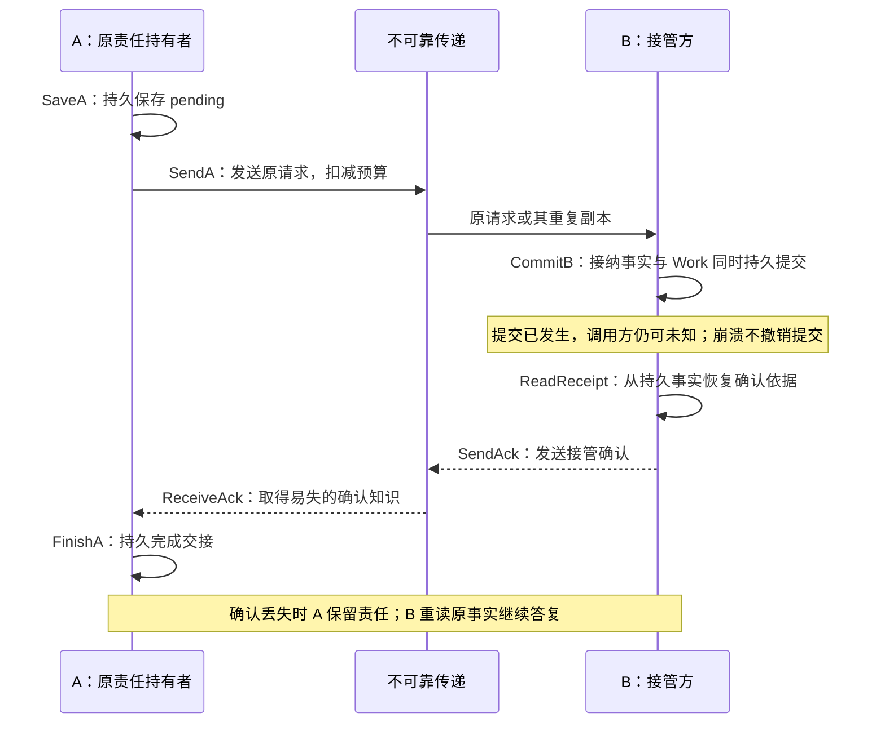

# 持久责任交接：TLC 检查与 Lean 证明结果

> 本文引用的历史归档已从当前分支移除，可通过 Git 历史查看；文中结论仍对应当时的方案与验证范围。

> 归档说明（2026-09-26）：本文讨论与验证的对象是当时的架构及形式化模型，引用已转向对应归档；本文结果不表示现行架构已经通过验证。

验证日期：2026-09-25（Asia/Shanghai）。交付范围为两个持久提交域、一项固定身份与意图的交接。模型、配置、证明和运行记录见 验证包；方法选择背景见 [形式化方法研究](formal-methods-for-architecture.md)。

后续已扩展到十个模块与内容来源专题，见 [全方案机制验证结果](all-mechanisms-verification-results.md)及[逐机制、逐用例覆盖索引](all-mechanisms-coverage.md)。本页保留两域交接样板的独立结论和原始证据。

**本次验证了方案中的“先持久接管，再确认卸责”机制。** TLC 对指定有限实例完成安全与有条件活性检查；Lean 对同一核心状态机的一般参数、任意有限合法历史证明安全性质。错误变体和去掉公平性的配置产生预期反例。结论覆盖形式模型；生产代码、数据库耐久性和端到端多层交接尚未取得形式精化或运行验证。

## 1. 验证对象与契约映射

抽象对象是 A 向 B 交接的一项持久责任。A 保存原责任；B 在自己的本地事务中保存接纳事实及后续 Work；A 得到可信确认后，提交本地交接完成。这个模型可以作为交付接纳、入站交接或业务接纳中的一个交接边界的样板。现行方案有多处交接，本次没有把它们串成一个全系统模型。

图中实线表示请求或本地动作，虚线表示确认；A、B 是独立提交域，网络可以丢失或复制消息。B 的 Work 是可恢复的后续责任，图中没有业务执行与外部效果。

| 现行契约 | 模型动作／状态 | 本次能够判断什么 |
| --- | --- | --- |
| 两处本地提交与确认顺序 | `SaveA`、`CommitB`、`ReadReceipt`、`SendAck`、`FinishA` | 每个实例内，卸责前接管事实与后续工作已经存在 |
| 原身份去重、原决定恢复 | 一个固定操作；`DuplicateB` 消耗副本且不新建 Work | 该操作在 B 只创建一份后续工作 |
| 本地事务及提交未知第 3 节 | `bAccepted/bWork` 是持久事实，`bKnown/ackSeen` 是易失知识 | 调用方未知与实际未提交有不同状态；崩溃只清除知识 |
| 有限重试及迟到事实 | 持久预算、`DeclareGap`；缺口下仍允许接收确认 | 预算耗尽不释放责任；合法迟到确认仍可完成交接 |
| 接纳与效果的区分 | `bWork` 表示后续责任，模型中没有执行动作 | 不能据此声称外部效果恰好一次 |

模型没有指定 Akka、消息中间件或部署拓扑。可提炼的核心机制是**独立持久状态机、由持久事实支持的确认、可恢复责任交接、按原身份去重、事实与知识分离，以及有界重试后保留缺口**。本次结果约束这些机制的组合，不决定它们应部署成几个进程。

## 2. 模型边界与前提

### 状态与原子性

| 状态类别 | 字段 | 崩溃时的行为 |
| --- | --- | --- |
| A 的持久记录 | `aPhase`、`aRemaining`、`gap` | 保留；`idle → pending → released` 不回退 |
| B 的持久记录 | `bAccepted`、`bWork`、`bRemaining` | 保留；首次接纳与 Work 一次提交 |
| 验证用历史计数 | `bCreates` | 统计 Work 创建次数；不是生产表字段要求 |
| 易失知识与进程状态 | `bKnown`、`ackSeen`、`aUp/bUp` | 各自崩溃会清除相应知识；恢复不自动恢复知识 |
| 在途消息 | `reqGood`、`reqBad`、`acks` | 有容量上限的无序计数，可丢失／复制，无 FIFO 保证 |
| 环境阶段 | `stable` | 为真后不再允许新的消息丢失与进程崩溃 |

`CommitB` 与 A 的所有动作分开；模型不存在跨域事务。B 收到请求但尚未持久提交时的失败，抽象为请求继续等待或丢失。`bAccepted=true, bKnown=false` 表示 B 内部已经提交，但处理者尚未读取或恢复回执依据。A 尚未获知接管则表现为 `bAccepted=true, aPhase=pending, ackSeen=false`；即使 B 已知提交，确认丢失仍会让 A 保持未知。B 恢复后读取原记录可以重新取得确认依据。

这里把本地原子提交、提交后的耐久保存、权威账本不回滚作为环境假设。状态机将并发更新表示为原子动作交错，实际数据库需用事务、唯一约束或等价机制实现这些边界。磁盘损坏、丢失已确认记录、旧备份回滚、多主同时写入不在本次故障范围。

确认只能由 B 读取已提交接纳记录后产生，网络可以丢失或复制，不能伪造或篡改它；真实系统的来源认证与原身份绑定另行验证。**A 的 `FinishA` 只检查本地 `ackSeen`，不读取 B 内部状态。** “已看到确认意味着 B 已持久接管”由可达性证明得出，没有直接作为 A 的执行条件。

原操作身份和意图在模型中固定。`reqBad` 只代表接纳后注入的异意图探针；它只能被丢弃或拒绝，不能改写已存决定。`ConflictAfterBinding` 是这个模型范围的辅助约束，不能算成“任意两个意图竞争时身份绑定都正确”的证明。单操作计数也没有验证多消息序号、累计 ACK 连续前缀或跨流因果顺序。

### 活性的附加条件

安全检查允许故障持续发生，也允许永久不调度。活性检查另外使用 `LiveSpec`：

1. `Stabilize` 最终发生，此后不再丢包或崩溃；已停机的进程最终恢复。这里给出的是一个足够强的环境条件，没有声称它是最弱条件。
2. 保存、接纳、读回执、发送／接收确认、完成、登记缺口及恢复等动作满足弱公平性：持续可执行时最终执行。
3. `SendA` 使用强公平性：反复获得发送机会时最终发送。原因是有限请求容量可能被冲突探针反复占用，发送机会不一定持续存在。
4. 成功命题的触发状态还要求 `stable ∧ pending ∧ aRemaining>0 ∧ bRemaining>0`。剩余额度是稳定状态下的额度；初始额度为正不能替代这一条件。

在这些前提下，`CompletionWhenResourcesRemain` 要求最终 `released`；一般的 `SettledOrGap` 要求 pending 最终到达 released 或留下 gap。`DeclareGap` 在最后一次发送额度用尽后即可发生，此时请求可能仍在途，因此 **gap 表示不再主动尝试且结果尚待核对，不表示 B 确定未接纳**。它不是业务失败终态，迟到确认仍能解除它。

B 已接纳的 Work 在本模型中持续保留，没有对其实际执行施加活性要求。缺口“可查询”在这里落实为持久状态可被读取的抽象，尚未验证生产查询接口、权限或保留期限。

## 3. TLC 实际检查结果

固定工具为官方 TLA+ 发布包 v1.7.4 中的 **TLC 2.19（2024-08-08，rev 5a47802）**；Java 为 OpenJDK 25.0.2。本次使用宽度优先完整探索，1 个 worker、seed 1、fp 0。没有随机模拟、状态截断条件、动作截断条件或对称约简。模型中的消息容量与发送预算是显式有限参数。

所有配置允许静止状态，关闭一般死锁报警；需要推进的行为由下列活性性质单独约束。通过项日志均有完成标记且待探索队列为 0；状态指纹碰撞的工具估计也保存在日志中。TLC 的有限模型检查结果不等同于 Lean 内核证明。运行清单及文件哈希

| 配置 | 请求／ACK 容量；A／B 预算 | 检查内容 | 实际结果 |
| --- | --- | --- | --- |
| safety | 2／2；2／2 | 全部 `Safety` 不变量及 `PhaseMonotonic`，无公平性要求 | 通过；生成 17,941 状态，3,112 个不同状态，深度 18 |
| liveness | 1／1；2／2 | `Safety`、稳定且额度足够时完成、最终完成或登记缺口 | 通过；生成 3,691 状态，868 个不同状态，深度 17 |
| healthy | 1／1；1／1 | 初始即稳定，公平调度下最终完成，并检查 `Safety` | 通过；生成 48 状态，22 个不同状态，深度 9 |
| safety-recheck | 2／2；2／2 | 错误变体检查后重新运行基准配置 | 通过；与 safety 的状态统计一致 |

`Safety` 包含以下性质；辅助约束的作用单独注明，避免把前提自身当作新的业务保证。

| 性质 | 结论 |
| --- | --- |
| `NoEarlyRelease` | A 已卸责时，B 的持久接纳和 Work 均存在 |
| `Responsibility` | 已开始的交接由 A 的 pending 或 B 的 Work 承担，允许交接期间双方同时保留责任 |
| `NoDuplicate` | B 的 Work 创建次数不超过 1 |
| `ReceiptAndWork` | B 接纳与 Work 一致，计数为接纳指示值 |
| `AckProvenance` | B 的确认依据、在途确认、A 已见确认均来自已持久接纳 |
| `GapRetained` | gap 时 A 仍为 pending |
| `TypeOK` | 类型正确，消息容量及预算不越界 |
| `ConflictAfterBinding` | 辅助范围约束：只在 B 已接纳后研究冲突探针 |
| `PhaseMonotonic` | 额外动作时序性质：开始后不回 idle，released 不回退；不依赖公平性 |

### 负面对照、修正与复检

基准没有发现违反上述性质的反例，因此没有据此修改现行架构契约。下面两种错误是专门注入的模型变体，用来检查性质是否能够发现关键顺序与去重错误；它们的“修正”是恢复基准规则，不是声称修复了现有生产缺陷。

| 配置 | 实际反例 | 应保留的规则／复检 |
| --- | --- | --- |
| mutant-early-ack | `SaveA → SendA → EarlyAckBug → SendAck → ReceiveAck → FinishA`；7 个状态即出现 A released、B 未接纳且无 Work；退出码 12 | B 只能从持久接纳记录取得确认依据；恢复 `Mutant="none"` 的基准后通过 |
| mutant-duplicate | `SaveA → SendA → DuplicateReq → CommitB → DuplicateB`；6 个状态出现 `bCreates=2`；退出码 12 | 重复接纳恢复原决定，不再新建 Work；基准复检通过 |
| no-fairness | 即便环境初始稳定、预算为正，也存在开始后永久静止的时序反例；退出码 13 | 活性需要明确的调度前提，不能从安全不变量推出；加回 `LiveSpec` 的配置通过 |

提前确认变体有意不启用更早触发的 `AckProvenance`，让反例继续走到真正的提前卸责。基准配置仍启用完整 `Safety`。错误变体找到反例后停止，不能将它们的状态统计理解为完整探索。

### 非真空检查

| 见证 | 方法与实际含义 |
| --- | --- |
| witness-completion | 刻意断言“永不 released”，TLC 给出完成轨迹；说明模型允许成功 |
| witness-gap | 刻意断言“不存在尚未接纳的 gap”，TLC 给出最后额度用尽、请求仍在途的状态；说明缺口可达，不证明丢包已发生 |
| witness-live-premise | 刻意断言“没有稳定且双方预算为正的 pending”，TLC 给出反例；说明成功活性的前提可达 |

这三项退出码均为 12，是预期的可达性证据，不是基准安全失败。另有 Lean 检查的“B 接纳、ACK 丢失、B 崩溃恢复、A 重投、B 去重、最终完成”具体轨迹，覆盖上述短见证未展示的恢复组合。

## 4. Lean 证明结果

证明源文件为 Handoff.lean，固定 **Lean 4.19.0**，仅导入随工具链提供的 `Std`。`Reachable` 从初始状态与 `Step` 归纳定义，容量和初始预算取任意自然数；轨迹允许任意有限长度，没有 TLC 配置中的数值上限。`Step` 包含 21 种基准动作及不变动作，不包含两种错误变体。

TLA+ 与 Lean 的字段及基准动作经过人工对照。Lean 分别证明安全不变量、容量／预算界限和生命周期一步保持；没有对两种语言做机器检查的语义等价或精化证明。

| 证明项 | 命题与使用范围 |
| --- | --- |
| `initial_safe`、`step_preserves_safety`、`reachable_safe` | 初态满足安全不变量，每个合法动作保持，故所有有限可达状态满足 |
| `released_has_durable_owner`、`responsibility_never_lost` | A 卸责前 B 已持久接管；已开始的责任仍由 A 或 B 保留 |
| `work_created_at_most_once`、`acceptance_and_work_agree` | Work 至多创建一次，且接纳记录、Work 与创建次数一致 |
| `acknowledgements_have_durable_origin` | 已见或在途确认必须有 B 的持久来源 |
| `gap_is_pending`、`reachable_bounds` | 缺口不卸责；容量及预算界限保持 |
| `step_never_returns_to_idle`、`step_keeps_released` | 已开始不回 idle；已 released 不回退 |
| `normal_completion_witness` | 不含丢包或崩溃的正常完成轨迹存在 |
| `restart_duplicate_witness`、`completion_after_restart_witness` | 具体的提交后崩溃、恢复去重及完成轨迹存在 |
| `lost_ack_recovery_witness` | 确认丢失后仍可沿原责任和原记录恢复完成，最终只创建一份 Work |

**实际编译退出码为 0，无错误或警告。** 最终统一复跑于 2026-09-25 00:21:56（Asia/Shanghai）完成，17 项 `#print axioms` 输出保存在 lean.log：安全、缺口及生命周期定理依赖 `propext`；容量／预算界限依赖 `propext` 与 `Quot.sound`；四项具体轨迹见证无公理依赖。这些是 Lean 标准逻辑公理，最终依赖没有 `sorryAx`，源码没有项目自定义公理、未完成证明占位或 `native_decide`。

编写期间有一次 `CrashA` 分支的证明未完成，旧输出单独保留在 失败证明记录。补齐“遗忘一种确认知识后，剩余来源仍来自原持久接纳”的推导后，最终编译与统一复跑均通过；没有为通过检查增设假设或修改状态转移。该失败记录及 TLA+ 动作性质的语法修正记录属于模型／证明开发过程，不是架构缺陷证据。

安全归纳不需要故障最终停止或调度公平性；允许无限执行的每个有限前缀同样受已证安全性质约束。存在一条恢复成功轨迹不能替代“所有公平执行最终成功”的命题，后者本次由 TLC 在所列有限配置与前提下检查，未提供 Lean 活性定理。

## 5. 结论、交付证据与剩余边界

这次结果支持将原方案中反复出现的交接逻辑统一描述为：**各域用本地原子提交保存事实与后续责任，以可信确认完成跨域卸责；故障使知识变旧或缺失，但不能抹除持久事实；重试沿原身份继续，耗尽后留下缺口。** 两域同时保留责任是允许的，危险的是双方都不再承担它。

| 验证层次 | 本次交付 |
| --- | --- |
| 文档与模型语义核对 | 对照现行契约、动作原子边界、事实／知识区分、异常恢复、成功含义；独立审查后补生命周期检查和 ACK 丢失恢复见证 |
| TLC 实际运行 | 基准安全、条件活性、稳定环境完成、负面对照、非真空见证及基准复检；原始日志保留 |
| Lean 实际运行 | 编译退出 0，17 项公理依赖审计完成；一般安全定理与四项具体见证通过 |
| 文档静态检查与图示渲染 | 新增文档本地链接、证据源／日志哈希核对；Mermaid 时序图实际渲染并目视检查，结果另存 静态检查记录 |
| 生产运行验证 | 未执行数据库、消息通道或业务代码的故障注入；无实现精化证明 |

未覆盖的后续范围包括多操作及多租户、完整发送端／中继／入站／业务的交接组合、owner 与 fencing、取消与迟到结果、授权变更、预算费用结算、窗口清理与备份恢复、外部副作用，以及多消息累计回执。这些需要各自的状态与假设，不能从本次单项交接证明自动推出。

复跑入口、工具来源、首轮与最终版本索引见 验证包说明。本次没有改动架构中的职责和契约；“已证明”的范围以本页列出的命题、模型及环境条件为限。
