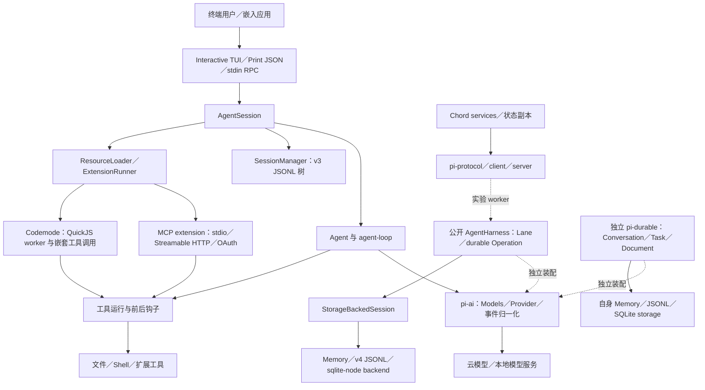
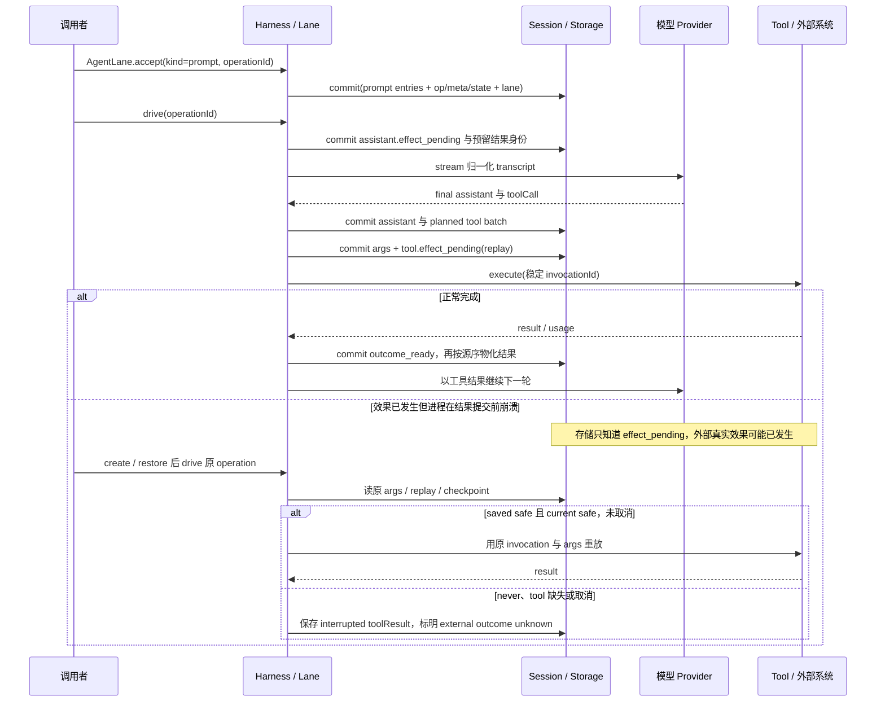

# Pi Agent Harness 技术调研与本项目架构对照

补充：[同场景数据对象与读写比较](../agent-harness-comparison/data-flow-io-comparison.md)；[Pi 经典 CLI 与变体的读写边界](../agent-harness-comparison/io/pi-crush.md)。

调研日期：2026-10-01。对象为 `earendil-works/pi`，源码固定于 `8ce69e9d2b171d173fe4b6b2b6256f1f4411e69d`，研究时本地缓存位于 `.reference/pi`，当前不要求保留。工作区包版本为 `0.99.2`，根工作区元数据版本为 `0.0.3`；根许可证为 MIT，运行要求 Node.js ≥22.19.0。[版本与工作区][workspace]、[许可证][license]

本报告依据固定源码和仓库内测试做静态研究；没有安装依赖、运行测试、调用模型或启动服务。**事实**表示可直接追到实现，**推断／建议**表示对本项目的设计判断。“存在测试”不表示本次测试通过；未发现能力只限定于下文指出的入口与组件。共同来源快照见[调研元数据](../agent-harness-comparison/sources.json)。

## 1. 定位与版本中的三条运行主线

Pi 是可嵌入的 Agent runtime、多供应商模型层与可自扩展的编程 CLI。固定提交已经包含 MCP、编码工具、持久 harness、服务协议和评测包；用早期 pi-mono 的“只有轻量循环、无 MCP”印象解释此提交会遗漏主要实现。[工作区][workspace]、[MCP 实际入口][mcp-entry]

| 主线 | 实际入口、职责与接入状态 | 能确认的边界 |
| --- | --- | --- |
| 默认编程 CLI／SDK | `createAgentSession()` 创建 `Agent`，再由 `AgentSession` 组织资源、工具、扩展、重试和压缩；`SessionManager` 保存 v3 JSONL | 默认 SDK 确实使用经典 `Agent`，没有因为新增 durable 包就自动迁移成持久阶段调度。[new Agent][sdk-agent]、[SessionManager 装配][sdk]、[AgentSession 构造][session-ctor] |
| `pi-agent-core` 的 `AgentHarness` | `AgentHarness.create()` → `runtime/Harness` → `Lane` → `driveOperation()`；`experimental/session-worker` 等接入 | 创建时恢复配置、inbox 和原 operation，返回 `open` 列表；恢复与再次启动 effect 分开，调用者选择何时 drive。[createAgentHarness][harness-open]、[worker 接入][worker] |
| 独立 `pi-durable` 与 Pico 实验线 | 独立 durable 包提供 `Conversation`、`Submission`、`Task`、可版本化 Document 和 scheduler；另有 `agent/experimental/pico3`、coding-agent `experimental/micro` | 它们是并存的实现，不能把其 Task／恢复保证套到默认 CLI。durable 的 `Harness.open()` 检查内置 task 后加载任务，与上一行 `AgentHarness.create()` 不是同一 API。[durable.open][durable-open]、[Pico 导出][agent-package] |

根 README 明确默认继承启动用户／进程权限，没有内置的文件、进程、网络和凭据限制系统。项目可信选择、工具拦截钩子、QuickJS 与外置容器分别提供局部控制，不能拼成一个内置租户授权账本。[权限声明][permissions]、[扩展载入][extension-load]

## 2. 模块组织与依赖架构

下图箭头表示调用／持有关系；上半为默认 CLI，下半为独立或实验装配。虚线连接不表示默认 CLI 已启用该路径。

`agent` 依赖 `ai + telemetry + chord`；`coding-agent` 组合 `agent + ai + tui + mcp + codemode + chord`；`session-backends/sqlite-node` 依赖 `agent`，SQLite runtime 没有被强塞进基础 Agent 包。`durable` 另依赖 `ai + chord`，默认 CLI 的 package dependencies 没有依赖它。这是“可嵌入内核、应用装配、特定 runtime backend 分包”的实际边界。[Agent manifest][agent-package]、[CLI manifest][cli-package]、[durable manifest][durable-package]、[SQLite manifest][sqlite-package]

| 包／目录 | 源码职责 | 对架构的意义 |
| --- | --- | --- |
| `packages/ai` | 模型目录、Provider／认证、供应商 stream 适配、图像与 classifier API、事件和 token／cost | 模型、供应商和调用操作分开；具体 SDK 留在适配层 |
| `packages/agent` | 经典 Agent loop；harness／lane／operation；session ports；压缩、skill、默认工具与测试契约 | 同一包保留多个 API，不能仅按名字判断默认执行路径 |
| `packages/coding-agent` | CLI、AgentSession、JSONL SessionManager、settings／auth／resource loader、扩展和 TUI／RPC | 产品工作流主要集中在应用层；AgentSession 依赖较多 |
| `packages/session-backends/sqlite-node` | `Storage` 的 SQLite 实现与 `node:sqlite` 工厂 | 隔离特定 runtime，维护与其他 backend 的一致性 |
| `packages/durable` | Conversation／Submission／Task、事务、Document 与 scheduler、自有三种 storage | 更细粒度的持久工作／状态建模路线 |
| `packages/chord` | facet／service 组合、RPC、服务实例和 replicated state／delta、插件打包加载 | 应用组合与状态传递独立于模型循环 |
| `packages/protocol`, `client`, `server` | 版本化信封、CBOR／帧、客户端连接、服务发布、session attachment 与 Unix transport | 与 CLI 的 stdin JSONL RPC 是两种协议 |
| `packages/mcp` | MCP 协议、客户端、stdio／HTTP transport、OAuth | 不依赖 TUI，产品 extension 负责接入与展示 |
| `packages/codemode` | QuickJS WASI worker、工具声明和调用桥 | 模型脚本与宿主工具之间建立受控出口 |
| `packages/telemetry`, `tui`, `evals` | 类型化 span／一致性测试；差分终端渲染；文档对照评测 | 可独立观察和验证边界；不是运行效果账本 |

包清单来自根 workspace 与包 manifests；以上运行职责由下述具体符号核对。[workspace][workspace]、[协议][protocol]、[telemetry schema][telemetry]、[eval plan][eval-plan]

## 3. 身份、状态与数据结构

### 3.1 经典 Agent 与模型接口

**事实：**`AgentMessage` 容许应用自定义角色，`convertToLlm` 把它转换为模型理解的 Message，`transformContext` 在转换前处理上下文。Provider 收到经过归一化的 `TranscriptContext`，prompt 和工具声明位于 system messages；后续 system message 的 sections／toolsAdded／toolsRemoved 记录配置变化，而非只保留一份可变 prompt。[AgentLoopConfig／自定义消息][agent-config]、[归一化 transcript][ai-context]、[SystemMessage][ai-message]

| 对象 | 关键字段／关系 | 身份含义 |
| --- | --- | --- |
| `Model`／`Provider` | `provider + model.id + api`；Provider 持有 auth、模型目录及 stream／classify／image 操作 | Provider ID 不等于 API 类型；多个 Provider 可使用相同 API 适配 |
| `AssistantMessage` | content 中 text／thinking／toolCall；provider、model、responseId、Usage、StopReason、deferred | 保留请求模型、实际响应模型和供应商句柄；模型响应不是任务完成决定 |
| `ToolCall` → `ToolResultMessage` | toolCall.id；name／arguments；结果 toolCallId／toolName／isError／details／nestedCalls | 关联一次模型工具调用；经典 loop 本身没有独立的持久 Effect 账本 |
| `AgentState` | 模型、工具、messages、isStreaming、streamingMessage、pendingToolCalls | 活动状态主要在内存，持久化由应用订阅事件承担 |
| `Usage` | input／output／cacheRead／cacheWrite／reasoning／totalTokens、按类 cost | 能记录 token 与目录计价；不能由此证明供应商账单最终、费用预留严格或未知费用已结 |

以上字段由 [Message／Usage][ai-message]、[Provider][provider]、[Agent 类型][agent-types]定义。reasoning 是 output 的子集，不能再加一次；partial 是持续变化的共享 live helper，不是事件时刻的不可变快照。[Usage][ai-usage]、[stream event contract][ai-events]

### 3.2 会话树、lane 与 operation

默认 Session v3 的 header 保存 session ID、cwd、时间及 parentSession；entry 保存 `id + parentId + timestamp + type`。message、model／thinking change、compaction、branch_summary、custom、label、context_edit 等沿树存储。`custom` 用于扩展状态且不进入模型上下文，`custom_message` 才投影为上下文。[Session 类型][legacy-types]

公开 AgentHarness 的结构进一步拆分：Session 是树和存储容器，Branch 是具名 tip，Lane 是配置加 inbox 加单个当前 operation 的运行域。`OperationMeta` 固定 operationId／lane／sourceTipId／intent；`OperationState.at` 有 starting、checkpoint、assistant.ready／effect_pending／retry_wait、tools、deferred、summary、navigation 等 13 种 leaf。`OperationResultRecord` 与活动 state 分开，终态包含 completed／declined／aborted／failed。[durable session types][harness-types]

工具 batch 用 `assistantEntryId + sourceIndex + resultEntryId` 指定原调用；sourceIndex 是完整 assistant content 数组中的位置。resultEntryId 又是稳定 invocationId，safe replay 仍用该身份，并提供 invocation-scoped memo。inbox 的 steer／followUp／nextRun／write 与消息 entry 分开保存。[ToolCall 状态][harness-types]、[Invocation capability][invocation]

独立 `pi-durable` 使用带类型品牌的数字 ID，分别表示 Conversation／Entry／Task／Submission／Document；Seq 属于原子 commit。Document 明示 session／conversation／task scope、latest／rewindable history、fork 的 current／initial／asOf 语义。其 Task 是可检查点恢复的运行作业，**不等同于本项目接纳用户目标的领域 Task**。scheduler 根据 task／conversation ownership 树处理取消、等待与 completing；父普通 owned work 尚存活时不能立刻结束。[Document／ID][durable-types]、[TaskScheduler][scheduler]

## 4. 持久化、分支、压缩与恢复边界

### 4.1 默认 CLI 的 v3 JSONL

**事实：**默认全局目录是 `~/.pi/agent`，可由 `PI_CODING_AGENT_DIR` 覆盖；auth.json、settings.json、models.json 与 sessions 分开。会话路径按 cwd 编码为 `sessions/--<cwd-components>--/<timestamp>_<sessionId>.jsonl`。首次 user 或 assistant message 出现才用 `wx` 创建文件，之后同步 append；仅打开 CLI 产生的 setup entries 不落盘。[全局路径][paths]、[cwd 目录][legacy-path]、[persist][legacy-persist]

运行时持有 fileEntries、byId、leafId。`branch(id)` 只移 leaf，下一次 append 以该 entry 为父，保留旧分支；`branchWithSummary` 则额外保存离开路径的摘要；`createBranchedSession` 提取 root→leaf 路径，重建 label 并调整 parent／firstKeptEntryId；`forkFrom` 则复制源文件全部非 header entries，保留树并更换 session ID／cwd。**推断：**branch() 后尚无 append 就重启，不能仅靠旧文件恢复这次内存 leaf 选择；这和具名 Branch tip 的持久更新不同。[branch／路径提取][legacy-branch]、[forkFrom][legacy-fork]、[重建索引][legacy-index]

`buildContextEntries()` 沿当前 leaf 路径寻找最新 compaction，把 summary、firstKeptEntryId 起的保留尾部和之后 entries 投影为模型上下文。`context_edit` 追加一条覆盖／省略规则，保留原始历史并变更 model projection；压缩不是删除旧文件。自动压缩分别处理 threshold 与 overflow；生成摘要保留 readFiles／modifiedFiles，摘要保存 usage；error／length 摘要不能成为完整 checkpoint，摘要请求另有 transient retry。**推断：**这些记录利于回溯，并不证明目标约束、授权和未知效果在摘要中完整保真。[上下文投影][projection]、[自动压缩入口][auto-compact]、[压缩结构][legacy-compaction]、[摘要调用／失败检查][summary-call]

加载时跳过 malformed JSON 行，验证 header，必要时补换行；这是容错读取，不是每条记录严格验证。persist 路径未显式调用 fsync／目录同步，也没有 session 文件跨进程写者隔离。不能把同步 append 或可读历史解释为多写者安全、掉电 RPO=0、跨可用区恢复或工具恰好一次执行。[loadEntriesFromFile][legacy-load]、[_persist][legacy-persist]

AuthStorage 的 `0o600` 文件选项与 `proper-lockfile` 保护凭据更新；该锁是 auth 存储责任，不能外推成 Session 的写者 fence，也不能称凭据已经加密。[auth storage][auth]

### 4.2 AgentHarness 的 Storage 与 v4 JSONL／SQLite

`Storage.commit(Write[])` 原子处理 entry／usage／scalar value／list write；SessionMutation 把一次 session 修改串行化，最多一次 commit。Lane 的规划、commit 和本地 state 采纳在这一修改线内完成，provider／工具／hook／等待在事务外。存储或不变量错误使 harness fault；create 恢复时检查 lane 的 tip／configuration／state 与原 operation 是否一致。[Storage／SessionMutation][storage-port]、[Lane.command][lane-command]、[restoreSession][restore]

| backend | 实际格式与恢复方式 | 实际限制 |
| --- | --- | --- |
| Memory | `InMemoryStorageState`／memory session 实现同一 ports | 仅进程内；不能被 durable 接口名赋予磁盘耐久 |
| JSONL v4 | header 的 format v=4、storageVersion=1；一行一个完整 transaction（单 write 或数组）；commitQueue 串行 append；完整行错误拒绝打开，未换行末尾被当 torn tail 原子重写移除；首次非空写升级 legacy v3 | 正常追加依赖注入 FileSystem；atomic publisher 用 `.tmp + rename`，接口与实现未提供完整磁盘 flush 保证。打开 replay 到内存，增长与内存／重放成本有关 |
| SQLite | 默认每 session 一个 `<id>.sqlite`，可配置同一 databasePath 多 session；WAL、busy_timeout=5000；entry／value／list／usage 按 session_id 分区，branch index 和 stats 是投影；node adapter 用同步 BEGIN IMMEDIATE／COMMIT | 数据库事务提供存储原子性，进程内 queue／repo map 不等于跨进程运行权 fence；不据此宣称外部 effect 的恰好一次 |

证据：[v4 format][jsonl-types]、[JsonlStorage replay／commit][jsonl-storage]、[atomic publisher][jsonl-io]、[SQLite placement][sqlite-repo]、[SQL schema][sqlite-schema]、[node transaction][sqlite-adapter]。独立 pi-durable 自有 Memory／JSONL／SQLite storage，和 agent 的 SessionBackend 并非一套互换格式。[导出入口][durable-package]、[durable Storage ports][durable-storage]

独立 durable 的 JSONL 使用调用者指定目录中的 `main.jsonl`（format=1）和 `task-<id>.jsonl`／`doc-<id>.jsonl` sidecar，以 `Seq + ordinal` 关联主 commit marker 和外置内容；写 sidecar 后再 append 主 marker。其 `fsync` 默认 false；打开该选项会在 marker 前 flush sidecar，主文件 flush 见后续 reclamation 分支。**推断：**这是第三种存储协议，不能把 v3 的宽松载入、v4 的单行事务或该选项混为同一掉电保证；RPO 仍需具体 FileSystem／磁盘实验。[durable JSONL][durable-jsonl]、[reclaim flush][durable-reclaim]

### 4.3 持久阶段与外部效果

AgentHarness 工具先保存即将执行的参数、`effect_pending` 和 replay 策略，再调用 tool。恢复时只有**已保存策略与当前 tool 同时 safe**才沿原 invocation 重放；默认 never 的调用写合成 error，保留最新 committed progress，并明确 external outcome unknown。assistant 的 effect_pending 恢复也只使用已提交 frame prefix，写 interrupted error，不盲目再发 provider 请求。[工具意图／unknown 构造][tool-intent]、[startToolInvocation／recoverToolInvocation][tool-recovery]、[assistant recovery][assistant-recovery]

正常与崩溃恢复时序如下，图对应公开 AgentHarness 的 `AgentLane.accept/drive`，而非默认 CLI。[AgentLane API][harness-api]

**推断：**这个默认不重放策略降低了未知副作用重复的机会，但合成 error 只是 transcript 完整性与运行收尾。它没有提供本项目所需的原效果持续查询、迟到效果／费用归并、Operation 去重保留、授权单次消费或完成阻断；尤其不能因 loop 继续产生答案便视为未知已核清。独立 durable 的 `ToolTask` 也先保存 execute intent，采用 saved/current safe 双检查；它在 hooks 后统一再次 validate；公开 AgentHarness 的 `applyBeforeToolDecision` 则只在 hook 显式返回 replacement args 时重验；经典 CLI 的可变 `tool_call` 修改后不再验证。三种行为须分别评估。[durable ToolTask][durable-tool]、[AgentHarness replacement validation][harness-validation]、[CLI mutable tool hook][tool-mutation]

## 5. 核心 Agent loop 与模型调用

默认正常路径是：用户输入预处理／扩展命令 → 保存 user message → prepareRequest／当前上下文投影 → transformContext → convertToLlm → Models／Provider stream → assistant message_end → 工具 preflight／执行／结果 → finishTurn／turn_end → steering 或 follow-up → agent_end。AgentSession 订阅 Agent 事件完成 session 写入、扩展事件、自动压缩和失败重试；UI／RPC 使用相同 session API。[SDK][sdk-agent]、[AgentSession][session-ctor]、[runLoop][loop]

`streamAssistantResponse` 归并 text／thinking／toolCall 事件；error／aborted 为 hard exit；length 造成的可能截断工具参数全部拒绝执行。工具按 name 解析并 TypeBox validate，beforeToolCall 可 block，afterToolCall 可改写结果／terminate。全局默认 parallel；含 sequential 工具时整 batch 串行。parallel 先顺序 preflight，再并发执行；完成通知按完成顺序，最终 transcript／turn_end 的工具结果按原 assistant source 顺序。全部结果 terminate 才跳过自动下一次模型请求。[tool loop／preflight][loop-tools]、[hook 契约][agent-config]、[Agent 默认配置][agent-default]

Steer 是下一正常轮边界注入的新输入；当前 batch 已启动的工具仍会执行完毕。follow-up 只在没有更多 tool／steer 时注入。两队列支持 all／one-at-a-time，默认后者；不能把 steer 解释为强制终止已经发出的动作。abort 使用 AbortController，外部 provider／子进程／工具是否已经停止需各适配器事实。[循环调度][loop]、[queue／abort][agent-control]、[AbortController lifecycle][agent-abort]

Provider 是具体运行单元，持有 auth 与 model catalog；Models 做认证、上下文归一化、委派和能力检查。已实现 OpenAI completions／responses／Codex、Anthropic、Bedrock、Google、Mistral 等 API；还提供分类、图像及 capable providers 的 fetchDeferred／cancelDeferred。Assistant stream 使用 start／delta／end／done／error；正常 delta 前有 start，setup 失败允许直接 error，partial 仍是可变 live helper。DeferredHandle 保存 provider／modelId／api／id／过期与轮询提示。[Provider][provider]、[API union][ai-api]、[事件][ai-events]、[deferred][ai-message]

**实际代价：**供应商兼容、思考签名、tool ID 与 message 转換集中在 ai，但适配表和 SDK 仍需持续维护。经典 CLI 显式允许 provider retry、agent retry、summary retry 等配置；其透明重试策略**与本项目每 Decision 至多一次物理模型调用的基线冲突**，若借鉴 adapter 必须关闭隐藏重试并记录独立请求、收费和结果未知。classifier API 可作为本项目 S1 技术实现参考，其可返回 confidence 不证明已校准或有资格决定开放质量。[request retry options][sdk-retry]、[本项目 Brain 恢复](https://github.com/ruipengliu/lerna/blob/e493ad266d110097aeeb69e10abdabfa771967ab/docs/architecture/.draft/brain/README.md#model-recovery)

## 6. 扩展、Skill、MCP、隔离与协作

### 6.1 Extension 生命周期与 Skill

extension module 通过 jiti 载入宿主进程，默认 factory 接收 ExtensionAPI。load 期注册 handler／tool／command／provider／flag 等；loader staging 在成功时 commit，失败时 discard pending runtime changes 与订阅。AgentSession 绑定运行 context，发 session_start、input、before_agent_start、turn／tool、compaction／navigation、agent_before_settle、session_shutdown 等事件；reload／session switch 有生命周期处理。工具可附独立渲染／状态、message renderer 与 custom entry，用于自扩展而不改变 loop。[load/commit/discard][extension-load]、[API registrations][extension-register]、[事件定义][extension-types]

**边界：**这些是进程内扩展能力，拥有 Node 宿主权限；加载前可信判断不能约束扩展自行文件／网络调用，handler 参数修改也不天然保持准入对象的准确版本。经典 hook 明示“修改 input 后不再验证”，独立 durable 与 AgentHarness 显式替换后再验证的做法可供本项目参考，但还须规范化／授权和请求摘要绑定。经典 loop 测试直接把已通过 string schema 的参数改成 number 并确认其执行，证明这是当前契约行为。[不重验证测试][hook-test][权限声明][permissions]、[tool hook][tool-mutation]、[durable validation][durable-tool]

Skill 是 YAML frontmatter + Markdown 操作知识，CLI 保存 name／description／filePath／baseDir／SourceInfo／disableModelInvocation；loader 按 ignore rules／路径发现材料并校验 metadata；缺描述拒绝载入，一些名字／长度问题告警后仍载入。prompt 暴露描述／位置，显式调用读取正文。该版本支持来源诊断，但没有本项目 InstallLock、Grant 或 Skill 实际字节锁定的完整模型；“Skill 能指导工具”不等于授予工具权限。[Skill metadata][skill-cli]、[loadSkillFromFile][skill-load]、[harness skill loader][skill-harness]、[CLI invocation][skill-invoke]

### 6.2 MCP 与 Codemode

MCP 已是内置 extension：读全局及**可信项目**的 mcp.json；名称规范化冲突拒绝，HTTP auth 仅准全局配置。stdio／Streamable HTTP 客户端有初始化／版本核验和请求 timeout／cancel；HTTP SSE 按 Last-Event-ID 有界重连。OAuth 凭据另存 `mcp-auth.json`，登录由用户显式 `/mcp` 触发。工具命名 `mcp__<server>__<tool>`；direct 立即声明、deferred 经 tool_search 加载、默认 codemode 只供脚本发现调用、hidden 不可达；首 prompt 只等待 direct servers。[配置边界][mcp-config]、[MCP integration][mcp-entry]、[初始化][mcp-client]、[请求取消][mcp-request]、[SSE 恢复][mcp-http]、[OAuth 入口][mcp-oauth]

Codemode 在独立 QuickJS WASI worker 中跑模型写的 JS；无直接 Node、文件、fetch 出口，工具调用经 `ctx.executeTool` 走相同 validate／hook pipeline，嵌套结果由脚本过滤后输出，store／load 成功写入 custom entries 并遵循分支。CLI 脚本设 256 MB 内存限制，deadline 可配置且默认无硬 deadline（区别于 sandbox 库默认值）；这些属于局部脚本隔离；**宿主工具与 credential 出口仍要独立管理**，取消脚本也不证明已派发工具的效果消失。[codemode tool][codemode]、[CLI execute][codemode-run]、[worker host][codemode-host]

### 6.3 多 Agent 的两种不同实践

默认 CLI 通过示例 subagent extension 支持 single／parallel／chain：spawn 新 pi 进程，使用 `--mode json -p --no-session`、隔离上下文、可指定模型／工具，聚合 message、exitCode、stderr、usage。它是可选例子，不是默认 durable delegation 服务；不持久 session 的子进程路径不能证明父崩溃后能够按原子请求继续查询／结算。[subagent modes][subagent]、[spawn flags][subagent-spawn]

独立 durable 示例把子 Conversation 与 background Reporter Task 配合，以稳定 `requestId` 向子输入、等待 Submission、提交 reported answer 去重，展示可恢复异步交接。scheduler 的 ownership 和 completing 使普通子工作影响父终结；background 有独立行为。**推断：**这是内部协作可借鉴的代码样式，未发现该示例具备本项目跨 Orchestrator 预分配额度、父许可子集／撤权、外部创建去重及效果封闭证明。[durable reporter][durable-subagent]、[scheduler ownership][scheduler]

## 7. 交互、RPC、观测和评测

默认 UI 有 Interactive TUI、print／JSON 和 stdin／stdout JSONL RPC。RPC command 带可选 id，支持 prompt／steer／follow_up／abort／model／compaction／session／fork；response 的 success 与 prompt disposition 表示该命令预处理／排队／即时处理成功，另有 Agent events。它不能当成 Task succeeded，也未见对这些 RPC ids 设跨进程持久 command 去重账本。[RPC types][rpc-types]、[prompt acknowledgment][rpc-ack]

新增 pi-protocol version=8 使用严格顶层 TypeBox 信封，serverId＋sessionId＋attachmentId 防止 session 路由串用，支持 response／service_update／attachment。bytes framing 默认最大 16 MiB，server connection 以“已授权 ordered byte connection”为前提，Unix send 有 pending byte limit；Chord 把 snapshot／revision／delta 和远端 service consumer 分离。协议可借鉴路由、陈旧 attachment 拒绝和 bounded update delivery，不能直接作为本项目 WSS／gRPC、tenant Grant 与 command恢复的替代。[protocol][protocol]、[attachment fence][attachment]、[framing][framing]、[authorized connection][connection]、[Unix pending bytes][unix-queue]、[Chord replicated state][chord-state]

telemetry 有 typed schema、no-op、in-memory reference adapter 与 conformance；harness span 记录 provider／model／stop／responseId／HTTP error、token／cost、首 chunk 时间等。新 session 的 usage_ledger 与 transcript 分离；两者都只证明各自事实，trace 不成为授权／效果 owner。[telemetry schema][telemetry]、[reference adapter conformance][telemetry-adapter]、[SQLite usage ledger][sqlite-schema]

测试资产覆盖经典 loop／queue／hooks、session projection／tree／compaction、harness mutation／恢复、多个 backend 的共享 conformance、MCP transports／OAuth、codemode sandbox 和服务协议。`evals` 用显式 model 建立 without_docs／with_docs 配对任务，交替实验顺序；保存 session artifact、token／tool calls／totalMs／estimatedCostUsd、blocked pairs，区分 scored／unscored／skipped／pending／errored。它具体而可复用，但不是本项目正式 EvaluationRun、数据暴露资格、ReleaseApproval 的实现。[conformance][conformance]、[recovery tests][recovery-tests]、[paired plan][eval-plan]、[report types][eval-report]、[eval runner][eval-harness]

## 8. 实际优势与代价

| 源码可支持的优势 | 与之一起承担的代价／限制 |
| --- | --- |
| 模型适配、可嵌入 loop 和 CLI 编排分层；backend 与特定 runtime 分包 | 经典和新运行时并存，阅读／集成时需确认实际入口；API 和格式迁移成本较高 |
| 树、context projection、compaction 与原历史分开，扩展状态可保存 | append-only 不自动提供来源撤销清理、隐私保留和长期记忆治理；全历史增长／重放需测量 |
| 工具 parallel 与 source-order transcript 分开，嵌套工具仍走 pipeline | 来源顺序不证明效果依赖安全；文件 queue 只保护同进程环境／canonical path；无法 canonicalize 时回退 absolute path，不隔离外部写者。[withFileMutationQueue][file-queue] |
| 持久 intent、safe replay 与 committed progress 明确处理中断 | unsafe 只写 unknown 合成错误；缺业务核对时，运行收尾与成果可用性存在距离 |
| MCP 延迟暴露和 Codemode 过滤大结果，扩展可快速构建能力 | 召回／选择质量、token 降低与总费用收益没有本次实测；插件权限不因脚本沙箱收敛 |
| typed telemetry、backend conformance 与 paired eval 可独立取证 | trace／目录估价不是业务账单；局部单测不能证明真实隔离、分布式 HA 或正式评测资格 |

以上是结构性判断，未声称 pi 在质量、延迟、费用、容量、高可用方面优于本项目或其他项目。

## 9. 对照本项目九模块与共同工程基线

本项目已有九模块事实 owner、Go 核心／WSS／gRPC、固定 Orchestrator、PG 责任账本、对象存储与共用可靠工作模板；[24 项优化](https://github.com/ruipengliu/lerna/blob/e493ad266d110097aeeb69e10abdabfa771967ab/docs/architecture/.draft/validation/optimization-evidence.md)是已采用的设计要求，运行实现和收益取证待完成。下表不把这些内容描述成待从 pi 补齐的空白，先区分可借鉴实现与不能照搬的模型。[架构入口](https://github.com/ruipengliu/lerna/blob/e493ad266d110097aeeb69e10abdabfa771967ab/docs/architecture/.draft/README.md)、[工程边界](https://github.com/ruipengliu/lerna/blob/e493ad266d110097aeeb69e10abdabfa771967ab/docs/architecture/.draft/engineering.md#layout)

| 模块与准确草稿位置 | pi 对应实现与适用结论 | 应保留的本项目边界 |
| --- | --- | --- |
| [Orchestrator](https://github.com/ruipengliu/lerna/blob/e493ad266d110097aeeb69e10abdabfa771967ab/docs/architecture/.draft/orchestrator/implementation.md#module-shape) | **需改造**：Lane 单 operation、inbox 和 durable step 是调度局部模板；`runLoop` 直接做模型→工具循环 | 本项目由 TaskCoordinator 采纳单轮 Brain 提案并准入，不把 pi Agent loop 放进 Brain；完成需目标覆盖／ConditionResult |
| [Brain](https://github.com/ruipengliu/lerna/blob/e493ad266d110097aeeb69e10abdabfa771967ab/docs/architecture/.draft/brain/implementation.md#module-shape) | **直接借鉴接口分层，需改造调用语义**：Models／Provider／TranscriptContext、typed stream 与 classifier | 保留 snapshot、ContentRef、来源用途、每 Decision 至多一次调用；分类器资格沿 ADR-0005，不从 confidence 推导 |
| [Execution](https://github.com/ruipengliu/lerna/blob/e493ad266d110097aeeb69e10abdabfa771967ab/docs/architecture/.draft/execution/implementation.md#key-sequence) | **需改造**：intent-before-execute、stable invocation、safe replay、result source order | 原 Operation／Effect、准入 Grant Use、发送 fence、未知持续核对先于重试；不能采用“unknown 合成 error 即结束责任” |
| [Security](https://github.com/ruipengliu/lerna/blob/e493ad266d110097aeeb69e10abdabfa771967ab/docs/architecture/.draft/security/implementation.md#module-shape) | **不适用为授权内核**：Node extension、project trust、工具 hooks、Codemode VM；未发现默认 Grant／Use 账本 | 保留资源规范化、准确批准、当前权限与隔离宿主；hook 属于请求变换，不能授予许可或绕过末次核验 |
| [Memory](https://github.com/ruipengliu/lerna/blob/e493ad266d110097aeeb69e10abdabfa771967ab/docs/architecture/.draft/memory/implementation.md#module-shape) | **直接借鉴 context projection；长期记忆需独立实现**：JSONL tree／摘要／custom data | 不把 session history 当长期记忆；继续来源、时间、冲突、许可、关闭／副本清理，MEM-01～03 已规定 |
| [Collaboration](https://github.com/ruipengliu/lerna/blob/e493ad266d110097aeeb69e10abdabfa771967ab/docs/architecture/.draft/collaboration/implementation.md#delegation-closure) | **需改造**：durable ownership／Submission／Reporter；CLI spawn 例子不适用 durable 外部协作 | 保留父子同库提交或外部原创建责任、子许可收缩、预算／费用／未决效果与封闭证明 |
| [Interaction](https://github.com/ruipengliu/lerna/blob/e493ad266d110097aeeb69e10abdabfa771967ab/docs/architecture/.draft/interaction/implementation.md#key-sequence) | **直接借鉴视图与输入处分的分离；需改造可靠输入**：TUI／RPC events／Chord snapshot | 保留 Surface 版本、InputRequest、受信 Renderer、原 input消费；delivery／success 不等于本人确认或完成 |
| [Extensions](https://github.com/ruipengliu/lerna/blob/e493ad266d110097aeeb69e10abdabfa771967ab/docs/architecture/.draft/extensions/implementation.md#artifact-integrity) | **直接借鉴 loader staging 与来源诊断；需改造发布安全**：extension factory／Skill／package checks | InstallLock 对实际字节、当前批准、ready／draining 与回退必须独立核验；代码加载成功不等于有数据权限 |
| [Evaluation](https://github.com/ruipengliu/lerna/blob/e493ad266d110097aeeb69e10abdabfa771967ab/docs/architecture/.draft/evaluation/README.md#component-comparison) | **直接借鉴 paired plan、blocked pairs、typed diagnostics；正式资格需改造** | 保留冻结计划／独立真值、样本与物理尝试分母、暴露记录与改善批准；EVA-01～03 已规定 |
| [Contracts](https://github.com/ruipengliu/lerna/blob/e493ad266d110097aeeb69e10abdabfa771967ab/docs/architecture/.draft/contracts/README.md) | **直接借鉴协议 envelope 与 stale attachment 测试；编码不适用**：pi v8／CBOR／RPC 分层 | 继续严格 JSON 唯一权威、WSS／gRPC 外壳；attachment 不替代 command、owner 或权限身份 |
| [Storage](https://github.com/ruipengliu/lerna/blob/e493ad266d110097aeeb69e10abdabfa771967ab/docs/architecture/.draft/storage-and-middleware.md)／[可靠工作](https://github.com/ruipengliu/lerna/blob/e493ad266d110097aeeb69e10abdabfa771967ab/docs/architecture/.draft/reliable-work.md#interfaces) | **直接借鉴 backend conformance、原子 intent／result、projection index；generic schema 需改造** | 保留 PG 事务、原命令去重／JobStore／Claim Guard；JSONL 只用于研究／导出，不能替换生产账本 |
| [Deployment](https://github.com/ruipengliu/lerna/blob/e493ad266d110097aeeb69e10abdabfa771967ab/docs/architecture/.draft/deployment.md)／[Engineering](https://github.com/ruipengliu/lerna/blob/e493ad266d110097aeeb69e10abdabfa771967ab/docs/architecture/.draft/engineering.md) | **分包思想可借鉴，具体栈不适用**：workspace、特定 runtime adapter、Unix backpressure | ADR-0002／0003／0004／0009／0010 保持；monorepo 已确定，不为借鉴 TypeScript 重写 Go 或取消固定 owner |

### 9.1 具体优化建议、成本与验收

建议编号供跨项目汇总。**落实**表示 24 项优化或 ADR 已规定，pi 仅提供实现／测试样式；**新增细化**表示可补充内部实现规约或验收向量，不预设新增公开方法。需要新增字段／方法时先走同版契约修订。

| 编号／性质 | 建议与准确落点 | 参考证据、代价与验收 |
| --- | --- | --- |
| **P-01／落实 ORC-02、BRN-01；新增投影细化** | 在 [Brain context optimization](https://github.com/ruipengliu/lerna/blob/e493ad266d110097aeeb69e10abdabfa771967ab/docs/architecture/.draft/brain/implementation.md#context-optimization) 明确原始材料、权威 Task／Operation 事实、摘要、最终 provider编码四种表示；追加投影记录绑定来源 entry／ContentRef，不覆盖原事实 | 参考 `buildSessionProjection` 与 system replay。[projection][projection]、[ai-message][ai-message]；代价是投影／摘要版本和来源账本增长。OPT-02 至少三次压缩后保留硬约束／冲突／unknown，撤源后派生摘要仍受限，最终编码超窗不发送 |
| **P-02／落实 EXE-03；新增安全重放测试** | 在 [Execution 效果归并](https://github.com/ruipengliu/lerna/blob/e493ad266d110097aeeb69e10abdabfa771967ab/docs/architecture/.draft/execution/implementation.md#4-效果归并及重试算法) 给每驱动的原命令恢复／安全重试声明建立准确版本断言；重启检查存量声明与当前资格均满足，默认保持 unknown，安排原核对 Job | 参考 persisted/current safe 双检查与 invocation memo。[tool-recovery][tool-recovery]；代价是能力版本、恢复实现与效果查询接口。保存已生效／丢答复／旧 replay 声明被收紧时不重复写；晚到效果和费用归原 Operation，unknown 阻止成功 |
| **P-03／落实 SEC-01、EXE-01；新增变换后核验顺序** | 在 [Execution catalog](https://github.com/ruipengliu/lerna/blob/e493ad266d110097aeeb69e10abdabfa771967ab/docs/architecture/.draft/execution/implementation.md#catalog-conformance) 与 [Security 入口](https://github.com/ruipengliu/lerna/blob/e493ad266d110097aeeb69e10abdabfa771967ab/docs/architecture/.draft/security/README.md#boundary-validation) 规定 hook／MCP／脚本参数变换后再 Schema validate、资源规范化、绑定摘要与最终 use／发送检查 | 经典 tool hook 不重验、AgentHarness 显式 args 替换重验、durable ToolTask hooks 后统一重验是三条不同证据。[tool-mutation][tool-mutation]、[harness-validation][harness-validation]、[durable-tool][durable-tool]；代价是多一次校验与拒绝诊断。OPT-03／08：钩子把合法路径改到越界符号链接、变更金额／接收方／工具身份均在实际发送前拒绝，合法变换通过 |
| **P-04／落实 EXE-02、UI-02；新增结果顺序规约** | 在 [Execution output coverage](https://github.com/ruipengliu/lerna/blob/e493ad266d110097aeeb69e10abdabfa771967ab/docs/architecture/.draft/execution/implementation.md#output-coverage) 明确 batch 内逻辑源序与实际完成序分别记录，结果须带截断／分页／输出时间与范围；并发仅对独立行动开放，同资源由 owner 判断依赖 | 参考 parallel 完成通知／source-order transcript 与 bounded output。[loop-tools][loop-tools]、[bounded bash][bash-output]；代价为缓冲、队列和范围元数据。工具晚完成／不同完成序／超量输出仍关联原 Operation，结果 partial 不证明完整；跨进程冲突不靠本地 queue 解决 |
| **P-05／落实 ADR-0009、EXE-03；新增恢复准入分离** | 在 [可靠工作恢复](https://github.com/ruipengliu/lerna/blob/e493ad266d110097aeeb69e10abdabfa771967ab/docs/architecture/.draft/reliable-work.md#8-原事实归并与恢复)、[宿主重启](https://github.com/ruipengliu/lerna/blob/e493ad266d110097aeeb69e10abdabfa771967ab/docs/architecture/.draft/deployment.md#5-首次启动重启与迁移) 固定“加载未决事实→校验旧实例隔离／权限／版本→开放新 effect”顺序；readiness 明示恢复中 | 参考 create 返回 open、不自动 effect。[harness-open][harness-open]；代价是启动窗口与有界扫描。恢复后可查原 unknown，但旧发送者未隔离／PG不可写／批准缺失时不开新派发；本机断进程测试与生产单区实验分开 |
| **P-06／落实 BRN-02、EXT-02；新增发现策略候选** | 在 [Brain 选择诊断](https://github.com/ruipengliu/lerna/blob/e493ad266d110097aeeb69e10abdabfa771967ab/docs/architecture/.draft/brain/decision-paths.md#6-验证启用与后续范围) 对大目录比较 direct／受控搜索／延迟加载，按准确 provider／能力版本绑定；Skill 记录描述、来源、实际加载正文摘要和前提，已有权限不因材料加载改变 | 参考 MCP 四种 exposure 与 Skill sourced loader。[mcp-entry][mcp-entry]、[skill-harness][skill-harness]；代价是发现延迟、缓存当前性和召回诊断。X-03 按未召回／选错／加载晚／无收益分别计分；同名工具、断连、旧 schema、错误 Skill 反例通过，收益不明确保留基线 |
| **P-07／落实 COL-01；新增内部协作恢复向量** | 在 [Collaboration internal create](https://github.com/ruipengliu/lerna/blob/e493ad266d110097aeeb69e10abdabfa771967ab/docs/architecture/.draft/collaboration/implementation.md#3-内部委派的原子创建) 增加稳定 input／answer引用和父报告消费记录；父终结判定同时查普通 owned 子与已授权 background 子的封闭责任 | 参考 durable Reporter requestId／reported answer 和 completing ownership。[durable-subagent][durable-subagent]、[scheduler][scheduler]；代价为更多状态、关联查询与清理。父在子效果后崩溃、重复 report、父取消、background晚输出时不重复动作，迟到费用可查；CLI --no-session 子流程不照搬 |
| **P-08／落实 UI-01／02 与 ADR-0008；新增流帧向量** | 在 [Interaction 恢复](https://github.com/ruipengliu/lerna/blob/e493ad266d110097aeeb69e10abdabfa771967ab/docs/architecture/.draft/interaction/implementation.md#module-shape) 及 [WSS](https://github.com/ruipengliu/lerna/blob/e493ad266d110097aeeb69e10abdabfa771967ab/docs/architecture/.draft/contracts/transport.md) 测旧 attachment／订阅 generation、buffer过载、快照重建；展示命令 applied／queued、工具 unknown 与 Task完成依据的不同状态 | 参考协议目标 fence、Chord revisions、RPC disposition。[attachment][attachment]、[chord-state][chord-state]、[rpc-ack][rpc-ack]；代价是重连快照流量与缓冲上限。旧流晚到不改新 Surface、背压不吃掉 input回执、重连读原 command；不能把 preview refs 当已阅读凭据 |
| **P-09／落实 EVA-01～03；新增 backend／stream 契约套件** | 在 [Engineering tests](https://github.com/ruipengliu/lerna/blob/e493ad266d110097aeeb69e10abdabfa771967ab/docs/architecture/.draft/engineering.md#layout) 为 PG／SQLite共用存储原子性和恢复向量，另给模型 adapter 使用固定 fake stream；在 [Evaluation 配对](https://github.com/ruipengliu/lerna/blob/e493ad266d110097aeeb69e10abdabfa771967ab/docs/architecture/.draft/evaluation/README.md#component-comparison) 固定输出 eligible／blocked pair 与全部尝试／未知费用 | 参考 conformance、stream start-before-delta／done 与 paired eval report。[conformance][conformance]、[ai-events][ai-events]、[eval-report][eval-report]；代价是后端差异测试和取证维护。同一失败原子提交、取消竞争、torn/corrupt 导入、partial 与终态区分；失败／取消／未评分样本不能从总体分母消失 |
| **P-10／落实 EXT-01／03；新增装载 staging 细化** | 在 [Extensions activation](https://github.com/ruipengliu/lerna/blob/e493ad266d110097aeeb69e10abdabfa771967ab/docs/architecture/.draft/extensions/implementation.md#5-激活事务与排空) 先 stage registry／依赖与实例，再核对 InstallLock实际字节和当前批准后发布 ready；失败清理 staged handler／工具但保留可查询失败记录 | 参考 loader commit／discard 与 shrinkwrap／install检查。[extension-load][extension-load]、[workspace][workspace]；代价是暂存制品、生命周期和失败清理。OPT-09：半包、加载异常、重启／依赖漂移不 ready；回退仍按 ADR-0007 核验旧版独立批准，而不是仅恢复旧 JS module |

### 9.2 必须显式拒绝的架构替换

- 不把 pi 的 model→tool 多轮 loop 作为 Brain 的自治权威；本项目 Brain 给单轮提案，Orchestrator 拥有循环、修订和完成裁决。
- 不把 session replay／SQLite WAL／合成 interrupted error 当成 PG 持久作业、外部效果核对或生产 HA 的等价实现。
- 不因 pi 的 MCP、extension／Codemode 可加载而取消 Grant Use、受控执行宿主、来源披露和 InstallLock；Skill 仍只有知识内容。
- 不把 CLI RPC success、stream done、child process exitCode 或 TaskScheduler completed 映射为本项目目标 succeeded；须沿当前条件、准确成果与未知效果判定。
- 不照搬 provider SDK／agent 自动重试、透明 fallback；保留本项目固定 owner、每 Decision一次模型调用、原调用未知／费用责任。

这些边界沿 [ADR-0002](../../adr/0002-go-wss-grpc.md)、[ADR-0003](../../adr/0003-production-distributed.md)、[ADR-0004](../../adr/0004-discovery-fixed-task-routing.md)、[ADR-0005](../../adr/0005-evaluator-evidence-eligibility.md)、[ADR-0006](../../adr/0006-adopt-requirements-before-actions.md)、[ADR-0007](../../adr/0007-independent-rollback-approval.md)、[ADR-0008](../../adr/0008-trusted-renderer-preview.md)、[ADR-0009](../../adr/0009-reliable-work-framework.md)、[ADR-0010](../../adr/0010-monorepo-shared-contract-release.md)；树分支／历史导出也不能消除 [ADR-0001](../../adr/0001-retain-closed-identities.md) 规定的关闭身份保留。

## 10. 一手源码索引

以下引用全部固定在同一 commit，锚点为核实过的源码行号。正文对应符号和结论在其所属段落就地说明；后续 pi 版本不自动改变本报告结论。

[workspace]: https://github.com/earendil-works/pi/blob/8ce69e9d2b171d173fe4b6b2b6256f1f4411e69d/package.json#L1-L73
[license]: https://github.com/earendil-works/pi/blob/8ce69e9d2b171d173fe4b6b2b6256f1f4411e69d/LICENSE#L1-L21
[permissions]: https://github.com/earendil-works/pi/blob/8ce69e9d2b171d173fe4b6b2b6256f1f4411e69d/README.md#L35-L47
[agent-package]: https://github.com/earendil-works/pi/blob/8ce69e9d2b171d173fe4b6b2b6256f1f4411e69d/packages/agent/package.json#L1-L92
[cli-package]: https://github.com/earendil-works/pi/blob/8ce69e9d2b171d173fe4b6b2b6256f1f4411e69d/packages/coding-agent/package.json#L1-L109
[durable-package]: https://github.com/earendil-works/pi/blob/8ce69e9d2b171d173fe4b6b2b6256f1f4411e69d/packages/durable/package.json#L1-L102
[sqlite-package]: https://github.com/earendil-works/pi/blob/8ce69e9d2b171d173fe4b6b2b6256f1f4411e69d/packages/session-backends/sqlite-node/package.json#L1-L45
[sdk]: https://github.com/earendil-works/pi/blob/8ce69e9d2b171d173fe4b6b2b6256f1f4411e69d/packages/coding-agent/src/core/sdk.ts#L175-L195
[sdk-agent]: https://github.com/earendil-works/pi/blob/8ce69e9d2b171d173fe4b6b2b6256f1f4411e69d/packages/coding-agent/src/core/sdk.ts#L387-L448
[sdk-retry]: https://github.com/earendil-works/pi/blob/8ce69e9d2b171d173fe4b6b2b6256f1f4411e69d/packages/coding-agent/src/core/sdk.ts#L316-L341
[session-ctor]: https://github.com/earendil-works/pi/blob/8ce69e9d2b171d173fe4b6b2b6256f1f4411e69d/packages/coding-agent/src/core/agent-session.ts#L362-L491
[worker]: https://github.com/earendil-works/pi/blob/8ce69e9d2b171d173fe4b6b2b6256f1f4411e69d/packages/coding-agent/src/experimental/session-worker.ts#L805-L875
[harness-open]: https://github.com/earendil-works/pi/blob/8ce69e9d2b171d173fe4b6b2b6256f1f4411e69d/packages/agent/src/harness/runtime/harness.ts#L375-L408
[agent-types]: https://github.com/earendil-works/pi/blob/8ce69e9d2b171d173fe4b6b2b6256f1f4411e69d/packages/agent/src/types.ts#L377-L510
[ai-api]: https://github.com/earendil-works/pi/blob/8ce69e9d2b171d173fe4b6b2b6256f1f4411e69d/packages/ai/src/types.ts#L17-L37
[ai-usage]: https://github.com/earendil-works/pi/blob/8ce69e9d2b171d173fe4b6b2b6256f1f4411e69d/packages/ai/src/types.ts#L427-L448
[ai-message]: https://github.com/earendil-works/pi/blob/8ce69e9d2b171d173fe4b6b2b6256f1f4411e69d/packages/ai/src/types.ts#L500-L607
[ai-context]: https://github.com/earendil-works/pi/blob/8ce69e9d2b171d173fe4b6b2b6256f1f4411e69d/packages/ai/src/types.ts#L732-L749
[ai-events]: https://github.com/earendil-works/pi/blob/8ce69e9d2b171d173fe4b6b2b6256f1f4411e69d/packages/ai/src/types.ts#L751-L783
[provider]: https://github.com/earendil-works/pi/blob/8ce69e9d2b171d173fe4b6b2b6256f1f4411e69d/packages/ai/src/models.ts#L133-L239
[harness-types]: https://github.com/earendil-works/pi/blob/8ce69e9d2b171d173fe4b6b2b6256f1f4411e69d/packages/agent/src/harness/session/types.ts#L16-L350
[invocation]: https://github.com/earendil-works/pi/blob/8ce69e9d2b171d173fe4b6b2b6256f1f4411e69d/packages/agent/src/harness/runtime/drive/tools.ts#L82-L130
[storage-port]: https://github.com/earendil-works/pi/blob/8ce69e9d2b171d173fe4b6b2b6256f1f4411e69d/packages/agent/src/harness/session/types.ts#L388-L555
[lane-command]: https://github.com/earendil-works/pi/blob/8ce69e9d2b171d173fe4b6b2b6256f1f4411e69d/packages/agent/src/harness/runtime/lane.ts#L290-L357
[restore]: https://github.com/earendil-works/pi/blob/8ce69e9d2b171d173fe4b6b2b6256f1f4411e69d/packages/agent/src/harness/runtime/restore.ts#L91-L171
[paths]: https://github.com/earendil-works/pi/blob/8ce69e9d2b171d173fe4b6b2b6256f1f4411e69d/packages/coding-agent/src/config.ts#L539-L608
[legacy-types]: https://github.com/earendil-works/pi/blob/8ce69e9d2b171d173fe4b6b2b6256f1f4411e69d/packages/coding-agent/src/core/session-manager.ts#L41-L194
[legacy-path]: https://github.com/earendil-works/pi/blob/8ce69e9d2b171d173fe4b6b2b6256f1f4411e69d/packages/coding-agent/src/core/session-manager.ts#L585-L602
[legacy-index]: https://github.com/earendil-works/pi/blob/8ce69e9d2b171d173fe4b6b2b6256f1f4411e69d/packages/coding-agent/src/core/session-manager.ts#L1057-L1133
[legacy-persist]: https://github.com/earendil-works/pi/blob/8ce69e9d2b171d173fe4b6b2b6256f1f4411e69d/packages/coding-agent/src/core/session-manager.ts#L1160-L1195
[legacy-load]: https://github.com/earendil-works/pi/blob/8ce69e9d2b171d173fe4b6b2b6256f1f4411e69d/packages/coding-agent/src/core/session-manager.ts#L616-L669
[legacy-branch]: https://github.com/earendil-works/pi/blob/8ce69e9d2b171d173fe4b6b2b6256f1f4411e69d/packages/coding-agent/src/core/session-manager.ts#L1573-L1726
[projection]: https://github.com/earendil-works/pi/blob/8ce69e9d2b171d173fe4b6b2b6256f1f4411e69d/packages/coding-agent/src/core/session-manager.ts#L434-L582
[legacy-compaction]: https://github.com/earendil-works/pi/blob/8ce69e9d2b171d173fe4b6b2b6256f1f4411e69d/packages/coding-agent/src/core/compaction/compaction.ts#L52-L135
[auto-compact]: https://github.com/earendil-works/pi/blob/8ce69e9d2b171d173fe4b6b2b6256f1f4411e69d/packages/coding-agent/src/core/agent-session.ts#L2854-L2882
[auth]: https://github.com/earendil-works/pi/blob/8ce69e9d2b171d173fe4b6b2b6256f1f4411e69d/packages/coding-agent/src/core/auth-storage.ts#L25-L110
[jsonl-types]: https://github.com/earendil-works/pi/blob/8ce69e9d2b171d173fe4b6b2b6256f1f4411e69d/packages/agent/src/harness/session/jsonl/types.ts#L4-L44
[jsonl-storage]: https://github.com/earendil-works/pi/blob/8ce69e9d2b171d173fe4b6b2b6256f1f4411e69d/packages/agent/src/harness/session/jsonl/storage.ts#L30-L188
[jsonl-io]: https://github.com/earendil-works/pi/blob/8ce69e9d2b171d173fe4b6b2b6256f1f4411e69d/packages/agent/src/harness/session/jsonl/io.ts#L66-L118
[sqlite-repo]: https://github.com/earendil-works/pi/blob/8ce69e9d2b171d173fe4b6b2b6256f1f4411e69d/packages/session-backends/sqlite-node/src/sqlite/repo.ts#L24-L66
[sqlite-schema]: https://github.com/earendil-works/pi/blob/8ce69e9d2b171d173fe4b6b2b6256f1f4411e69d/packages/session-backends/sqlite-node/src/sqlite/migrations/001_initial.sql#L1-L121
[sqlite-adapter]: https://github.com/earendil-works/pi/blob/8ce69e9d2b171d173fe4b6b2b6256f1f4411e69d/packages/session-backends/sqlite-node/src/index.ts#L78-L104
[tool-recovery]: https://github.com/earendil-works/pi/blob/8ce69e9d2b171d173fe4b6b2b6256f1f4411e69d/packages/agent/src/harness/runtime/drive/tools.ts#L478-L539
[assistant-recovery]: https://github.com/earendil-works/pi/blob/8ce69e9d2b171d173fe4b6b2b6256f1f4411e69d/packages/agent/src/harness/runtime/drive/recovery.ts#L22-L84
[loop]: https://github.com/earendil-works/pi/blob/8ce69e9d2b171d173fe4b6b2b6256f1f4411e69d/packages/agent/src/agent-loop.ts#L163-L320
[loop-tools]: https://github.com/earendil-works/pi/blob/8ce69e9d2b171d173fe4b6b2b6256f1f4411e69d/packages/agent/src/agent-loop.ts#L508-L776
[agent-default]: https://github.com/earendil-works/pi/blob/8ce69e9d2b171d173fe4b6b2b6256f1f4411e69d/packages/agent/src/agent.ts#L247-L267
[agent-control]: https://github.com/earendil-works/pi/blob/8ce69e9d2b171d173fe4b6b2b6256f1f4411e69d/packages/agent/src/agent.ts#L278-L343
[bash-output]: https://github.com/earendil-works/pi/blob/8ce69e9d2b171d173fe4b6b2b6256f1f4411e69d/packages/agent/src/harness/tools/bash.ts#L51-L145
[extension-load]: https://github.com/earendil-works/pi/blob/8ce69e9d2b171d173fe4b6b2b6256f1f4411e69d/packages/coding-agent/src/core/extensions/loader.ts#L523-L583
[extension-register]: https://github.com/earendil-works/pi/blob/8ce69e9d2b171d173fe4b6b2b6256f1f4411e69d/packages/coding-agent/src/core/extensions/loader.ts#L269-L317
[extension-types]: https://github.com/earendil-works/pi/blob/8ce69e9d2b171d173fe4b6b2b6256f1f4411e69d/packages/coding-agent/src/core/extensions/types.ts#L1541-L1628
[tool-mutation]: https://github.com/earendil-works/pi/blob/8ce69e9d2b171d173fe4b6b2b6256f1f4411e69d/packages/coding-agent/src/core/extensions/types.ts#L1198-L1212
[skill-cli]: https://github.com/earendil-works/pi/blob/8ce69e9d2b171d173fe4b6b2b6256f1f4411e69d/packages/coding-agent/src/core/skills.ts#L67-L105
[skill-harness]: https://github.com/earendil-works/pi/blob/8ce69e9d2b171d173fe4b6b2b6256f1f4411e69d/packages/agent/src/harness/skills.ts#L38-L108
[skill-invoke]: https://github.com/earendil-works/pi/blob/8ce69e9d2b171d173fe4b6b2b6256f1f4411e69d/packages/coding-agent/src/core/agent-session.ts#L2074-L2098
[mcp-entry]: https://github.com/earendil-works/pi/blob/8ce69e9d2b171d173fe4b6b2b6256f1f4411e69d/packages/coding-agent/src/extensions/mcp/index.ts#L1-L27
[mcp-config]: https://github.com/earendil-works/pi/blob/8ce69e9d2b171d173fe4b6b2b6256f1f4411e69d/packages/coding-agent/src/extensions/mcp/config.ts#L75-L124
[mcp-client]: https://github.com/earendil-works/pi/blob/8ce69e9d2b171d173fe4b6b2b6256f1f4411e69d/packages/mcp/src/client.ts#L204-L256
[codemode]: https://github.com/earendil-works/pi/blob/8ce69e9d2b171d173fe4b6b2b6256f1f4411e69d/packages/coding-agent/src/extensions/codemode/tool.ts#L1-L145
[codemode-host]: https://github.com/earendil-works/pi/blob/8ce69e9d2b171d173fe4b6b2b6256f1f4411e69d/packages/codemode/src/runtime/host.ts#L276-L351
[subagent]: https://github.com/earendil-works/pi/blob/8ce69e9d2b171d173fe4b6b2b6256f1f4411e69d/packages/coding-agent/examples/extensions/subagent/index.ts#L471-L545
[subagent-spawn]: https://github.com/earendil-works/pi/blob/8ce69e9d2b171d173fe4b6b2b6256f1f4411e69d/packages/coding-agent/examples/extensions/subagent/index.ts#L300-L375
[durable-open]: https://github.com/earendil-works/pi/blob/8ce69e9d2b171d173fe4b6b2b6256f1f4411e69d/packages/durable/src/harness/harness.ts#L396-L419
[durable-types]: https://github.com/earendil-works/pi/blob/8ce69e9d2b171d173fe4b6b2b6256f1f4411e69d/packages/durable/src/types.ts#L17-L113
[durable-storage]: https://github.com/earendil-works/pi/blob/8ce69e9d2b171d173fe4b6b2b6256f1f4411e69d/packages/durable/src/types.ts#L986-L1082
[durable-tool]: https://github.com/earendil-works/pi/blob/8ce69e9d2b171d173fe4b6b2b6256f1f4411e69d/packages/durable/src/harness/tool.ts#L33-L115
[durable-subagent]: https://github.com/earendil-works/pi/blob/8ce69e9d2b171d173fe4b6b2b6256f1f4411e69d/packages/durable/test/examples/23-subagent-background.ts#L77-L119
[scheduler]: https://github.com/earendil-works/pi/blob/8ce69e9d2b171d173fe4b6b2b6256f1f4411e69d/packages/durable/src/harness/scheduler.ts#L159-L194
[rpc-types]: https://github.com/earendil-works/pi/blob/8ce69e9d2b171d173fe4b6b2b6256f1f4411e69d/packages/coding-agent/src/modes/rpc/rpc-types.ts#L1-L74
[rpc-ack]: https://github.com/earendil-works/pi/blob/8ce69e9d2b171d173fe4b6b2b6256f1f4411e69d/packages/coding-agent/src/modes/rpc/rpc-mode.ts#L394-L428
[protocol]: https://github.com/earendil-works/pi/blob/8ce69e9d2b171d173fe4b6b2b6256f1f4411e69d/packages/protocol/src/protocol.ts#L5-L110
[attachment]: https://github.com/earendil-works/pi/blob/8ce69e9d2b171d173fe4b6b2b6256f1f4411e69d/packages/server/src/session-router.ts#L224-L235
[framing]: https://github.com/earendil-works/pi/blob/8ce69e9d2b171d173fe4b6b2b6256f1f4411e69d/packages/protocol/src/framing.ts#L1-L25
[connection]: https://github.com/earendil-works/pi/blob/8ce69e9d2b171d173fe4b6b2b6256f1f4411e69d/packages/server/src/connection.ts#L1-L34
[unix-queue]: https://github.com/earendil-works/pi/blob/8ce69e9d2b171d173fe4b6b2b6256f1f4411e69d/packages/server/src/transports/unix/listener.ts#L212-L227
[chord-state]: https://github.com/earendil-works/pi/blob/8ce69e9d2b171d173fe4b6b2b6256f1f4411e69d/packages/chord/src/services/state.ts#L343-L391
[telemetry]: https://github.com/earendil-works/pi/blob/8ce69e9d2b171d173fe4b6b2b6256f1f4411e69d/packages/agent/src/harness/telemetry.ts#L42-L118
[conformance]: https://github.com/earendil-works/pi/blob/8ce69e9d2b171d173fe4b6b2b6256f1f4411e69d/packages/session-backends/sqlite-node/test/storage-conformance.test.ts#L1-L55
[recovery-tests]: https://github.com/earendil-works/pi/blob/8ce69e9d2b171d173fe4b6b2b6256f1f4411e69d/packages/durable/test/harness-tools-recovery.test.ts#L1-L160
[eval-plan]: https://github.com/earendil-works/pi/blob/8ce69e9d2b171d173fe4b6b2b6256f1f4411e69d/packages/evals/src/plan.ts#L1-L59
[eval-report]: https://github.com/earendil-works/pi/blob/8ce69e9d2b171d173fe4b6b2b6256f1f4411e69d/packages/evals/src/report.ts#L9-L83
[eval-harness]: https://github.com/earendil-works/pi/blob/8ce69e9d2b171d173fe4b6b2b6256f1f4411e69d/packages/evals/src/harness.ts#L316-L411
[agent-config]: https://github.com/earendil-works/pi/blob/8ce69e9d2b171d173fe4b6b2b6256f1f4411e69d/packages/agent/src/types.ts#L193-L374
[agent-abort]: https://github.com/earendil-works/pi/blob/8ce69e9d2b171d173fe4b6b2b6256f1f4411e69d/packages/agent/src/agent.ts#L507-L529
[legacy-fork]: https://github.com/earendil-works/pi/blob/8ce69e9d2b171d173fe4b6b2b6256f1f4411e69d/packages/coding-agent/src/core/session-manager.ts#L1815-L1865
[summary-call]: https://github.com/earendil-works/pi/blob/8ce69e9d2b171d173fe4b6b2b6256f1f4411e69d/packages/coding-agent/src/core/compaction/compaction.ts#L585-L639
[durable-jsonl]: https://github.com/earendil-works/pi/blob/8ce69e9d2b171d173fe4b6b2b6256f1f4411e69d/packages/durable/src/storage/jsonl/storage.ts#L28-L305
[durable-reclaim]: https://github.com/earendil-works/pi/blob/8ce69e9d2b171d173fe4b6b2b6256f1f4411e69d/packages/durable/src/storage/jsonl/storage.ts#L507-L531
[tool-intent]: https://github.com/earendil-works/pi/blob/8ce69e9d2b171d173fe4b6b2b6256f1f4411e69d/packages/agent/src/harness/runtime/drive/tools.ts#L44-L210
[skill-load]: https://github.com/earendil-works/pi/blob/8ce69e9d2b171d173fe4b6b2b6256f1f4411e69d/packages/coding-agent/src/core/skills.ts#L277-L343
[mcp-request]: https://github.com/earendil-works/pi/blob/8ce69e9d2b171d173fe4b6b2b6256f1f4411e69d/packages/mcp/src/client.ts#L409-L570
[mcp-http]: https://github.com/earendil-works/pi/blob/8ce69e9d2b171d173fe4b6b2b6256f1f4411e69d/packages/mcp/src/transports/streamable-http.ts#L356-L432
[mcp-oauth]: https://github.com/earendil-works/pi/blob/8ce69e9d2b171d173fe4b6b2b6256f1f4411e69d/packages/coding-agent/src/extensions/mcp/oauth.ts#L1-L39
[codemode-run]: https://github.com/earendil-works/pi/blob/8ce69e9d2b171d173fe4b6b2b6256f1f4411e69d/packages/coding-agent/src/extensions/codemode/execute.ts#L245-L305
[file-queue]: https://github.com/earendil-works/pi/blob/8ce69e9d2b171d173fe4b6b2b6256f1f4411e69d/packages/agent/src/harness/tools/file-mutation-queue.ts#L10-L62
[telemetry-adapter]: https://github.com/earendil-works/pi/blob/8ce69e9d2b171d173fe4b6b2b6256f1f4411e69d/packages/telemetry/test/conformance.test.ts#L1-L23
[harness-api]: https://github.com/earendil-works/pi/blob/8ce69e9d2b171d173fe4b6b2b6256f1f4411e69d/packages/agent/src/harness/agent-harness.ts#L538-L622
[hook-test]: https://github.com/earendil-works/pi/blob/8ce69e9d2b171d173fe4b6b2b6256f1f4411e69d/packages/agent/test/agent-loop.test.ts#L487-L546
[harness-validation]: https://github.com/earendil-works/pi/blob/8ce69e9d2b171d173fe4b6b2b6256f1f4411e69d/packages/agent/src/harness/execution/tools.ts#L77-L122
