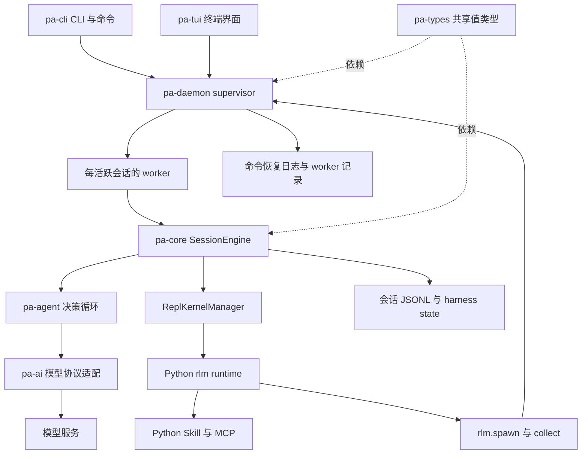
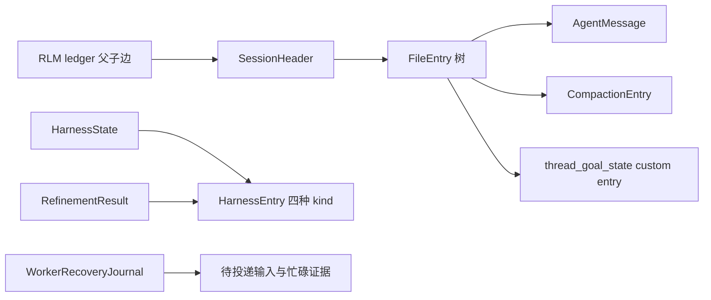
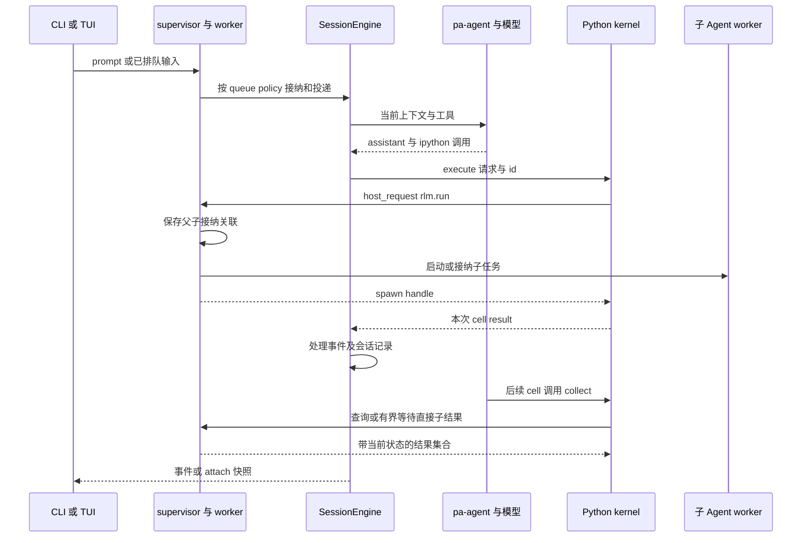
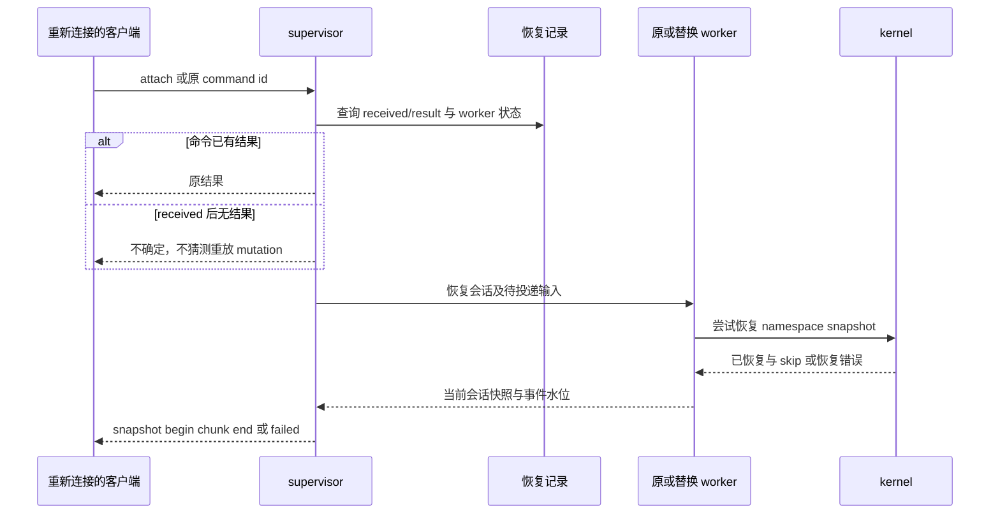

# Prime Agent 技术调研与 Harness 架构对照

Prime Agent 的主要参考价值是把持续目标、后台会话、程序化工具、递归子 Agent 和可编辑经验连成工作链。它采用 Rust 会话宿主与 Python REPL：模型面对较小的工具入口，复杂工具组合、材料处理和子任务控制由代码表达。对本项目，最值得借鉴的是这些机制的组合方式和可恢复记录；采用时仍须保持 Orchestrator 的唯一裁决、逐行动授权和外部效果核对。

本文依据 2026-10-01 拉取的默认分支快照，分析实际源码，未运行上游测试、模型请求或性能实验。代码证明实现机制存在；README 中的“自我改善”、后台连续运行等产品主张不作为质量或容灾实测结论。版本与全项目基线见[来源清单](../agent-harness-comparison/sources.json)，跨项目结论见[架构优化分析](../agent-harness-comparison/architecture-optimization.md)。

## 1. 项目定位与版本

| 项目事实 | 本次范围 |
| --- | --- |
| 仓库 | `PrimeIntellect-ai/prime-agent` |
| 本地源码 | `.reference/prime-agent`，深度为 1 的 Git 快照 |
| 分支与 commit | `main`，`5784abc2aef523a78d5a8850a0c0be89883388b2` |
| commit 时间 | `2026-09-30T18:56:08-07:00`，即北京时间 2026-10-01 |
| 主要语言与模块 | Rust workspace 的九个 crate；Python `prime-agent-runtime` 和可执行 Skill |
| manifest 版本 | workspace `0.9.8`，不是独立确认的稳定发行标签 |
| 许可证 | 根 LICENSE 为 MIT；依赖及 vendor 仍有各自声明 [PA49] |

当前源码以 Rust workspace 为主。文件中大量“TS port”说明实现渊源及兼容目标，不能把已不存在于当前树的旧 TypeScript 路径作为当前实现定位。README 所说 persistent REPL、continual harness 和后台会话分别对应 kernel、refinement 和 daemon 三条实现链。[workspace][PA01]、[定位与使用边界][PA02]

## 2. 架构与模块组织

图中的进程划分是 supervisor、worker、Python kernel；crate 是代码组织边界。supervisor 不承载模型会话，负责启动、路由、监督和恢复 worker。会话引擎组合循环、资源、Skill、MCP、压缩、目标、精炼与 kernel；`pa-agent` 保持模型流、工具执行、steering/follow-up 和停止钩子的通用循环。[daemon 分工][PA03]、[core 装配][PA04]、[循环接口][PA05]

| 目录或 crate | 职责与依赖意义 |
| --- | --- |
| `pa-types` | 模型、会话、goal、daemon command/event 等共享类型，避免 UI 和宿主各自解释状态 |
| `pa-ai` | Provider registry、消息转换、流式事件、认证与不同模型接口；与 Agent 循环分开 |
| `pa-models` | 模型目录相关模块；workspace 单独组织，不承担任务完成判断 |
| `pa-agent` | 一轮及多轮循环、工具批次、取消、消息注入与窄流接口 |
| `pa-core` | `SessionEngine`、资源装配、会话文件、Skill、MCP、模型策略、压缩、refine、goal、cron、kernel |
| `pa-daemon` | supervisor/worker、命令日志、会话 lease、queue checkpoint、递归子映射、attach 与恢复 |
| `pa-tui`、`pa-cli` | 呈现与用户入口，调用会话/daemon 能力 |
| `pa-telemetry` | 观测公共机制；具体会话事件及 trace 上传另有 core 代码 |
| `prime-agent-runtime/src/rlm` | Python 请求循环、bash、MCP、Skill、harness CRUD、spawn/collect 等程序接口 |

以上分工取自 workspace、core/agent/daemon 的导出与实际模块，并非九套独立服务。core 本身聚合职责较多：对外有 `SessionEngine`，内部仍有 `AgentSession`、goal/autonomous/compaction/refine 等多种持续策略；移植时应抽取独立机制，避免把整个会话引擎再装进本项目 Brain 而形成第二套任务负责方。[PA01][PA03][PA04][PA05][PA06]

## 3. 核心数据结构与身份

| 类型 | 关键字段或关系 | 实际含义 |
| --- | --- | --- |
| `SessionHeader` | `id`、`cwd`、`parent_session`、`rlm_depth`、Git 信息、格式 version | 文件与会话来源；不提供本项目 tenant/Grant 语义 |
| `FileEntry` 与 `EntryBase` | entry `id`、`parent_id`、timestamp；message、compaction、custom、session_state 等变体 | 追加记录形成可选择分支的历史；entry 身份不等于外部 Operation 身份 |
| `AgentMessage` | user、assistant、toolResult、bashExecution、custom、branchSummary、compactionSummary | 完整会话材料与模型消息有差异，调用边界再转换 |
| `CompactionEntry` | `first_kept_entry_id`、summary、tokens_before、usage、harness digest/fingerprint | 固定裁剪边界及摘要，保留与后续上下文组装有关的依据 |
| `GoalState` | goal_id、objective、status、token_budget、tokens_used、continuations_used、no_progress_streak | 持续目标及推进预算；状态由 goal driver 持久更新 |
| `HarnessEntry` | kind、id、content、scope、reference、arguments、source、version | prompt/memory/skill/subagent 四类可编辑补充状态 |
| `RefinementResult` | 应用编辑、before/after、rationale、expected_outcome、rollback_of | 对一次精炼的记录和回退材料；expected_outcome 是期望，不是改善证据 |
| `RlmSpawnLedger` | 父子边、名称、深度、spawn/rename/delete 记录 | 历史与非驻留子 Agent 的拓扑权威来源 |
| `QueuedItem`、`TurnSettle` | steering/follow-up lane，queued/injected/direct 类，Completed/Aborted/Withdrawn/Failed | 输入等待、投递与终结的独立语义 |

这些类型分别由 [session 格式][PA07]、[goal 格式][PA08]、[refinement 状态][PA09]及[结果记录][PA44]、[父子账本][PA10]、[worker queue][PA11] 定义。模型 stop reason、会话状态和 goal 状态是不同层次；不能把 `agent_end` 或 `GoalStatus::Complete` 直接映射为本项目所有 Requirement 已通过。

## 4. 存储布局、提交与恢复

默认状态根是 `~/.prime/agent`，可由 `PRIME_AGENT_CODING_AGENT_DIR` 覆盖；会话根默认是其下 `sessions/`，可独立覆盖。无法解析用户目录时 daemon 返回错误，而非静默改存临时目录。[目录解析][PA12]

| 存储 | 记录内容 | 可靠性和使用边界 |
| --- | --- | --- |
| 会话 JSONL | 首行 header，后续 FileEntry；当前分支由 parent 关联及 leaf 选择 | 已进入 append 路径的行经 `sync_data`；初始无 assistant 时部分条目可以先留内存 |
| session window cache | 大历史的窗口/索引侧车 | 校验文件 generation 后使用；权威 append 成功后，cache 失败不反转 append |
| 命令恢复 JSONL | `(client_id, command_id)` 的 received/result | received 先落盘；崩溃后 pending 报不确定，避免直接重放 mutation |
| worker recovery journal | 最新 busy/operation、queue checkpoint | 替换 worker 识别中断及恢复待投递项，区别于聊天正文 |
| session lease | 规范化会话路径对应的目录/owner 记录和进程身份 | 防止合作宿主重复拥有一个本地会话；不是分布式共识或业务 Grant |
| RLM ledger | 每 sessions 目录的父子拓扑追加日志 | 非驻留 child 仍可恢复发现；有 32 MiB/100000 条读取上限 |
| `harness/harness_state.json` | 当前 prompt/memory/skill/subagent 内容 | 原子替换；局部 scope 与 global scope 分开。Python mtime 检查只能降低覆盖风险，不等于事务 CAS |
| `refinement_history.jsonl` 与会话精炼记录 | 应用历史、before/after、rollback 关联 | 状态文件、历史文件和会话文件不是一个数据库事务 |
| `scheduled-jobs.json` 或文件型 cron store | job 与 claimed dispatch | 尝试跨进程锁、到期领取和中断恢复；锁/写失败存在继续分支，claim 返回不证明耐久接纳 |
| Python namespace snapshot 与 manifest | 可序列化变量、saved/skipped/pruned 等清单 | 尽力保存，变量与总字节受限；不能恢复全部外部资源或执行效果 |

表中依据：[会话写入][PA13]、[cache/耐久 append][PA14]、[命令日志][PA15]、[lease][PA16]、[RLM ledger][PA10]、[harness 保存][PA17]、[精炼历史][PA44]、[cron][PA18]及[领取/恢复][PA47]、[snapshot][PA19]。

会话 rewrite 使用私有临时文件、文件 `sync_all` 后 rename，append 先写权威 JSONL 后更新可丢缓存。但 `append_message_retained` 专门允许写盘失败时保留 live index，并返回供记录的 I/O 错误；普通 `append_message` 则回滚内存插入。因而“UI 已见消息”“消息存在内存”和“已耐久保存”有不同成功点。源码中的 `flush_now` 是显式能力，不能仅凭其注释认定所有模型调用前都执行了它；首次写入与 retained 写入也不能泛化为多文件原子事务。[PA13][PA14][PA43]

`CommandRecoveryJournal` 的 begin 先持久化 received，result 再追加；已完成的重复命令可返回原响应。未完成记录避免猜测重放，这是有限 mutation 恢复策略。代码注释使用 exactly-once，但它不证明 shell、HTTP、文件写入等外部目标效果恰好一次；`write_all + fsync` 也不能作为任意断电下多行批次原子性的实测证据。[PA15]

Python harness 文件通过临时文件和 `os.replace` 避免读到半份 JSON，保存前可按 mtime 重读其他进程修改；这仍有并发读改写窗口。读取损坏 JSON 可退化为空状态，适合补充材料容错，不能用于本项目 Task、Grant、Operation 或去重终态账本。[PA17]

## 5. 决策循环、模型与上下文

`pa-agent::run_loop` 先纳入待处理消息，流式取得 assistant，执行工具批次，写 tool results，调用 stop hook，再依次检查 steering、follow-up 和 continuation。tool batch 的完成与消息顺序分开：并行工具可按完成次序发结束事件，而模型历史保持 assistant 的源顺序；工具也可声明顺序执行。循环本身不定义 goal 或 autonomous 预算，由宿主 hook 提供。[循环][PA20]、[批次执行][PA21]

`AgentSession::prompt_with_images` 在接纳前展开 Skill/模板并识别 slash command；忙碌时必须明确 steer 或 follow-up。图片与文本一起排队，避免图片在 queue race 中丢失；特殊注入消息跳过普通命令解析。daemon 的 queue 又把人类、pinned、background 优先级与投递类分开，同一 lane 只在插入点调整顺序，不重排恢复后或用户移动过的已有队列。[prompt 接纳][PA22]、[queue][PA11]

模型层把 provider-specific 协议转换为共享消息及流事件，core 中的 `ProviderRetryPolicy` 再集中判断永久失败、context overflow、Retry-After 和退避。默认配置启用三次重试，另外有 one-shot completion 调用方；压缩、refine、side question 都可能产生额外模型请求。该策略利于个人交互恢复，却与本项目“一个 Decision 零次或一次模型调用、未知原请求保留账务、无隐藏修复调用”的既定行为不同，不能整段搬入 ModelAdapter。[模型层][PA23]、[重试策略][PA24]

静态 system prompt 分成 core/usage/opinionated/per-model 层，动态会话信息在尾部组装，源码有 cache safety 的测试约束。这是减少配置变动污染缓存前缀的实现线索，而不是缓存命中率或成本下降的实测证明。[prompt layers][PA25]

压缩先确定既有 compaction 边界、要保留的近期 tokens 和 split-turn，再用 previous summary 与 retained tail 的 recent-state anchor 更新摘要；文件列表是机械附加的材料。摘要完成后，宿主再读 harness state，以同一次读取生成 digest 和 fingerprint，随 compaction entry 提交而不经过摘要模型。它比仅保留一个自由文本摘要更容易追踪上下文，但 token 估算包含字符启发式，摘要仍可能丢约束或混淆来源，不能替代本项目 Brain 最终请求大小与全输入来源检查。[压缩准备][PA26]、[机械 digest 提交][PA54]、[token 估算][PA27]

## 6. Python RLM、工具与安全

模型主要通过 `ipython` 操作持久 namespace；Python 接口再提供 bash、文件处理、MCP、Skill、子 Agent、目标与显示等能力。kernel protocol v3 用带 id 的 JSONL execute/interrupt/host_reply/snapshot/restore 帧，`done` 和 `host_request` 必须有非空 id，以免等待责任无从结清。[工具入口与prompt][PA25]、[kernel protocol][PA28]

时序是相关源码的组合解释，并不主张跨文件/跨进程原子性。`rlm.spawn` 返回的是 child admission handle（`rlm_child_id`、name、session_dir、model），不是子答案；`collect` 查询直接子 Agent，零超时返回快照，正超时有限等待，完成结果在删除前保留。[spawn][PA29]、[collect][PA45]、[父子接纳账本][PA10]

kernel 的 `force_abort` 能先令调用方拿到 aborted 结果，同时仍保留 active execution，直到实际运行清理。下次复用需要等待及反复 interrupt，在窗口耗尽后返回 busy 错误。这个区分很有价值：调用方停止等待与 Python 实际停止不同；但源码未给任意外部 shell/网络副作用提供本项目声明的 Effect 核对协议。[中断与复用][PA30]

namespace snapshot 默认总上限 256 MiB、单变量 16 MiB，保存时逐变量处理不可序列化或过大的值并记录 skip，新 framing 的 restore 检查字节上限；兼容旧文件的分支直接调用 `dill.load`，不能将新格式的限额泛化为所有恢复路径。它使用 Python 对象序列化恢复计算状态，适合受信本机任务；不能当成用户数据的通用可交换内容格式或任意不可信 checkpoint 的安全载体，也不能恢复外部 socket、子进程和真实世界效果。[snapshot runtime][PA31]、[默认上限][PA50]、[恢复][PA46]、[宿主 best-effort snapshot][PA19]

README 明确模型生成 Python 与工程命令使用当前用户权限，worker/kernel 的进程划分不构成安全沙箱。MCP host 管理认证和配置，协议调用主要在 Python runtime；Skill 可从 Markdown 识别为 Python package，要求 pyproject 和可导入包结构。认证、Skill 元数据、独立进程均不足以证明本项目用途授权或文件/凭证/网络隔离。[安全边界][PA02]、[MCP 分工][PA32]、[Skill 发现][PA33]

## 7. 长任务、自动化与精炼

Goal driver 将目标状态作为 `thread_goal_state` 写入会话，累计 token、continuation 和无进展计数。`no_progress_streak` 与对应 turn timestamp 都是持久字段，重启不能轻易重置空转计数；continuation 有 owed/pending 等区分，避免把重复触发当新的进展。其“进展”是宿主定义的可观察活动，并不等于业务目标条件已经通过。[goal state][PA08]、[goal 保存][PA34]、[continuation 准入][PA48]

autonomous driver 单独定义 account_message/after_turn，返回 inactive、continue 或有理由的 stop。Shell gate 有超时、输出上限和工作区 snapshot：同一失败 gate 在工作区未变化时不会重新运行，但继续计入失败尝试。GatePassed、GateRetryExhausted 和预算到达分别表达，符合“限额用尽不等于成功”的区分；shell 返回零只证明 gate 声明范围，不能证明任务全目标完成。[autonomous driver][PA35]、[quality gates][PA36]

cron 文件保存 job 和 dispatch claim，scheduler/worker 负责把到期工作注入已有会话，heartbeat 与独立 schedule 有不同生命周期。它提供“离开终端后继续”的实现支撑，持久目标、进程在场和可定时唤醒仍是三件事。当前实现的降级尤其需要保留：锁获取耗尽后 warn 并无锁执行 action；`write_jobs_state` 忽略启用 fsync 的 atomic write 返回错误；`mutate_states` 仍能返回新的 dispatches。因此 claim API 不能确认跨进程唯一或状态已耐久，也不能据后台 daemon 推导跨可用区耐久。本项目应把锁/提交失败阻止派发列为反例，而不是照搬这条降级路径。[cron store][PA18]、[领取/恢复][PA47]、[锁失败][PA51]、[写失败][PA53]、[仍返回派发][PA52]、[daemon 恢复分工][PA03]

refine 先生成可审查 CRUD 提案，再在重新读取的 harness state 上应用。local 是默认 scope，global 用于跨会话材料；规划阶段基线与实际应用时条目不同时拒绝该项编辑。逐项 applied/error、before/after、rationale 和 expected outcome 支持回退及解释，同时允许部分编辑成功，因此不是整组编辑全有或全无。[精炼规划和应用][PA37]、[版本竞争][PA38]

对本项目，应把这条链拆为“经验候选形成→准确版本固定→隔离评测→受信发布→应用到后续任务”。Prime 的 auto refine review 与 expectedOutcome 只能提供候选理由，不能替代 EvaluationRun、未暴露测试集、ReleaseApproval 和旧版独立批准；也不应允许 session-local 状态静默影响同租户其他任务。[现行评测](../../architecture/.draft/evaluation/README.md)、[现行发布](../../architecture/.draft/extensions/implementation.md)

## 8. 断线恢复、界面与观测

daemon attach 支持按 snapshot id、generation、event sequence 关联的 begin/chunk/end，目标 chunk 的 messages 数组预算为 512 KiB，并有 snapshot_failed。客户端可要求省略历史图片 payload，但存储中的 payload 保留。这是大量历史与图片的恢复优化；chunked transfer 不能替代各内容当前权限，也不改变本项目大字节经 HTTPS 的选择。[attach snapshot][PA39]

此图解释命令、worker、kernel、呈现四种恢复边界；不是一个跨层自动成功流程。源码有本地 session lease、意图停止记录及恢复监督；客户端断开不必令 promoted 会话退出，但不同 ownership、shutdown 和 stop 路径有自己的生命周期规则。[命令恢复][PA15]、[owned session][PA40]、[lease][PA16]、[snapshot][PA39]

观测包含 tracing/telemetry、会话事件和 trace 上传。上传模块有显式 credential precedence、请求/大小上限及 outbox 关联；它与任务账本不是同一事实来源。CI 及源码包含 Rust fmt/clippy、测试分片、scripted/faux provider、goal/queue/abort/kernel/Python harness 等测试入口。本次只查阅这些资产，未确认全部通过，也未据此认定改善幅度或生产恢复指标。[trace 引擎][PA41]、[CI][PA42]、[循环测试接口][PA05]

## 9. 功能优势与代价

| 可证实的机制优势 | 代价与适用边界 |
| --- | --- |
| 小模型工具入口与程序化组合，使循环逻辑不必为每个工具增加一种调度分支 [PA25][PA28] | Python code 的可组合性放大权限与副作用范围；受限执行宿主和逐效果记录是另一个工作包 |
| 后台 worker、持久 goal、queue checkpoint 和定时工作把长期推进拆成可恢复责任 [PA03][PA08][PA11][PA18] | 本地文件、进程 lease 和 supervisor 不等于多租户分布式恢复；实现存在也不证明掉电保证 |
| spawn admission 与 collect result 分开，父子拓扑持久可查 [PA10][PA29] | 需要关联子用量、终态和取消；不能因为拿到 handle 就认定子完成 |
| compaction boundary、recent anchor、digest 与缓存前缀分层可追踪 [PA25][PA26][PA54] | 多次摘要、辅助模型调用和 Python snapshot 增加成本；实际 token 必须在最终编码时测量 |
| refine 保存 scope、version、before/after 和条目竞争，能解释和回退编辑 [PA09][PA37][PA38] | 部分应用与多文件提交存在中断窗口；候选本身没有独立改善证明 |
|  typed aborted/withdrawn/failed 与 kernel busy 区分用户等待及实际运行 [PA11][PA30] | 没有由这些标记自然推导出的外部 Effect 真值 |

调研范围内未找到与本项目等价的多租户 Grant/use settlement、分布式固定 Orchestrator 路由、目标效果长期核对、受信 Surface 输入一次消费、正式样本暴露隔离与旧版独立批准闭环。这里的“未找到”指上述文件和执行链没有提供等价证据，不是断言仓库不可能增加或通过外部平台实现这些能力。

## 10. 对照本项目九模块与基础设施

表中“需改造”指保留机制但加入本项目既有身份、授权、账务、恢复及完成规则；全部优化属于建议，未修改 `.draft` 或 ADR。

| 本项目基线 | Prime 对应实现 | 判断与反推 |
| --- | --- | --- |
| [Orchestrator](../../architecture/.draft/orchestrator/implementation.md) | GoalDriver、queue、autonomous driver [PA11][PA34][PA35] | 需改造：使用 JobStore 持久保存无进展及下一次推进责任；模型 stop 不能裁决 Task |
| [Brain](../../architecture/.draft/brain/implementation.md#context-optimization) | pa-agent、prompt layers、compaction [PA20][PA25][PA26] | 借鉴内部编码与摘要组装；Brain 仍返回单轮 Proposal，不能接管 Python 的长行动循环 |
| [Execution](../../architecture/.draft/execution/implementation.md#key-sequence) | ipython、kernel id、interrupt/restore [PA28][PA30][PA31] | 需改造：代码运行是有界 Operation，内部对外发送仍逐项准入及保留原效果；默认用户权限直接执行不适用 |
| [Security](../../architecture/.draft/security/README.md#boundary-validation) | MCP auth、private 文件、用户进程权限 [PA02][PA32] | 不等价：认证不是用途授权；平台受限出口、凭证、文件和预算不能靠 Python 包声明兑现 |
| [Memory](../../architecture/.draft/memory/README.md) | HarnessEntry local/global、搜索/CRUD、摘要 [PA09][PA17] | 借鉴材料种类与局部范围；来源、用途、纠正、派生关闭和副本清理沿当前 Memory 规则，不能把 namespace snapshot 当长期记忆 |
| [Collaboration](../../architecture/.draft/collaboration/implementation.md) | RLM ledger、spawn/collect、child usage 类型 [PA07][PA10][PA29] | 借鉴 SDK 的异步 handle 与批量有界读；内部唯一子映射、收缩授权、预算封账已规定，应具体实现 |
| [Interaction](../../architecture/.draft/interaction/implementation.md) | queue lanes、attach snapshot/chunk、ownership [PA11][PA39][PA40] | 借鉴事件关联与大历史加载；输入消费、准确预览和可信确认由本项目原业务 owner 保存 |
| [Extensions](../../architecture/.draft/extensions/implementation.md#artifact-integrity) | Skill discovery、Python package、静态 prompt layers [PA25][PA33] | 借鉴可发现材料元数据；依赖、精确字节和平台由 InstallLock 固定，package 可导入不证明 ready |
| [Evaluation](../../architecture/.draft/evaluation/README.md) | autonomous gates、refine plan、faux/CI/trace [PA35][PA36][PA37][PA41][PA42] | 借鉴 gate runner 与可回放失败材料；自评理由不具备正式改善资格 |
| [共同契约](../../architecture/.draft/contracts/README.md) | pa-types 与 kernel JSONL v3 [PA07][PA08][PA28] | 借鉴共享类型与严格 correlator；不把开放 rest Map 或内部协议字段并入已冻结 harness/1 |
| [可靠工作框架](../../architecture/.draft/reliable-work.md) | command journal、lease、cron claim [PA15][PA16][PA18] | 需改造为共事务接纳/JobStore；pending uncertain 可作反例，不替代本项目继续核对责任 |
| [存储](../../architecture/.draft/storage-and-middleware.md) | JSONL 权威、window cache、多个 state 文件 [PA13][PA14][PA17] | 权威与可丢缓存分离值得借鉴；生产 PG 账本及对象存储既定，不改为文件型多写者存储 |
| [部署](../../architecture/.draft/deployment-production.md) | supervisor/worker/kernel [PA03][PA30] | 借鉴生命周期和排空顺序；沿既定 gateway/application/worker/execution 角色，不逐会话复制生产进程 |
| [工程组织](../../architecture/.draft/engineering.md#layout) | Rust workspace、共享 types 与 UI 分开 [PA01][PA03][PA04] | 借鉴代码依赖；本项目一个 Go module 和公开 facade 已确定，不据 crate 数新增微服务或 module |

## 11. 可执行优化建议

以下编号用于跨项目汇总。现有 ORC-02、EXE-03、COL-01、EXT-02、EVA-01 等已经覆盖行为要求，表格给的是实现细化或候选实验，不重新宣布这些要求缺失。

| 建议与优先级 | 具体改变与参考 | 代价、约束及验收 |
| --- | --- | --- |
| R-01 上下文机械重建 P0 | 在 [Brain 组装](../../architecture/.draft/brain/implementation.md#context-optimization)把不可压缩目标/控制/unknown、准确事实引用、近期上下文和候选摘要分栏；借鉴 digest/fingerprint 与 recent-state anchor [PA26][PA54]，保存编码配置和材料版本 | 细化 ORC-02/BRN-01。三次压缩、目标修订和未知写入后仍保留硬约束，摘要污染不可改变权威事实；最终编码超窗不发送 |
| R-02 无进展持续推进 P0 | 在 [任务 jobs](../../architecture/.draft/orchestrator/implementation.md#job-completion)及 TaskPolicy 内实现持久 no-progress 计数、已计数事实标识、下一次 wake 和原因；参考 goal driver [PA08][PA34] | 属有界自治实现细化。进程重启/重复领取不能重置预算或双计一次反馈；无新事实不得反复花模型费探活。需要定义业务进展口径 |
| R-03 异步子 Agent SDK P1 | 在 [协作](../../architecture/.draft/collaboration/implementation.md#phase-projection)之上提供 admission handle、read/wait/batch read 辅助，参考 spawn/collect [PA29]；直接复用已固定 Delegation 和子映射 | 细化 COL-01/02。handle 不含伪造子答案；timeout 返回已知状态和缺口；父取消/子晚到/未结费仍按原映射继续，SDK 不新增负责方 |
| R-04 代码组合执行候选 P1 实验 | 在 [Executor driver](../../architecture/.draft/execution/implementation.md)做受限程序化组合适配器候选，代码、材料与输出固定 ContentRef；借鉴 REPL request id、明确中断和 snapshot skip [PA28][PA30][PA31] | 必须先满足 SEC-02/EXE-03；代码内对外效果继续逐项准入，不允许一个无限制 cell 隐藏多次物理调用。编译为既有有界计划时可纳入 X-06；交互 cell 则另冻结策略实验，不能混用有限计划分母。失败即不启用 |
| R-05 精炼变成候选 P1 | 在 [Evaluation](../../architecture/.draft/evaluation/README.md)和 [Extensions](../../architecture/.draft/extensions/README.md)复用 typed CRUD、scope、before/after、竞争检测 [PA09][PA37][PA38]生成准确候选内容，随后走现有评测/批准 | 细化 EXT-02/03、EVA-01/03。local 经验未经独立保存许可不可进入跨任务记忆；计划后材料变更时拒绝应用；旧版回退检查 ADR-0007 的独立批准 |
| R-06 呈现与耐久状态分开 P0 | 在 [交互缺口视图](../../architecture/.draft/interaction/README.md#completion-view)明确“已呈现”“输入接纳”“业务消费”“运行中断”“原效果未知”；用 retained write、kernel abort 反例做联调 [PA13][PA30] | 细化 UI-01/02、EXE-03。写盘失败和终端断线不得显示已完成；取消 cell 但旧网络动作迟到时仍显示原 Operation 的 unknown |
| R-07 大历史恢复预算 P1 | 在 [WSS 传输](../../architecture/.draft/contracts/transport.md)现有快照读取路径借鉴 snapshot id、generation、chunk failure 和图片元数据省略 [PA39]，只优化内部装配和呈现 | 需与原协议字节上限、当前权限及 HTTPS 大内容路径一起验收；不增加第二套事件权威。跨代次、少块、重复块、受限内容撤权时拒绝完整恢复声明 |

本报告支持优先实现 R-01、R-02、R-06，再对 R-03～05 和 R-07 取得运行与配对成本证据。没有源码或测量支撑的部分保留为建议；尤其不主张采用默认无限制 Python、直接全局 auto-refine、透明模型重试，或用本地后台进程替代 ADR-0003 的生产恢复要求。

## 源码定位

所有 PA 引用都固定到同一 commit；行号对应本地拉取内容。引用范围用于阅读机制，不代表已运行相关测试。

[PA01]: https://github.com/PrimeIntellect-ai/prime-agent/blob/5784abc2aef523a78d5a8850a0c0be89883388b2/Cargo.toml#L1-L32
[PA02]: https://github.com/PrimeIntellect-ai/prime-agent/blob/5784abc2aef523a78d5a8850a0c0be89883388b2/README.md#L39-L120
[PA03]: https://github.com/PrimeIntellect-ai/prime-agent/blob/5784abc2aef523a78d5a8850a0c0be89883388b2/crates/pa-daemon/src/lib.rs#L1-L10
[PA04]: https://github.com/PrimeIntellect-ai/prime-agent/blob/5784abc2aef523a78d5a8850a0c0be89883388b2/crates/pa-core/src/lib.rs#L32-L91
[PA05]: https://github.com/PrimeIntellect-ai/prime-agent/blob/5784abc2aef523a78d5a8850a0c0be89883388b2/crates/pa-agent/src/lib.rs#L1-L40
[PA06]: https://github.com/PrimeIntellect-ai/prime-agent/blob/5784abc2aef523a78d5a8850a0c0be89883388b2/crates/pa-core/src/session_engine/engine.rs#L104-L170
[PA07]: https://github.com/PrimeIntellect-ai/prime-agent/blob/5784abc2aef523a78d5a8850a0c0be89883388b2/crates/pa-types/src/session.rs#L1-L395
[PA08]: https://github.com/PrimeIntellect-ai/prime-agent/blob/5784abc2aef523a78d5a8850a0c0be89883388b2/crates/pa-types/src/goal.rs#L12-L101
[PA09]: https://github.com/PrimeIntellect-ai/prime-agent/blob/5784abc2aef523a78d5a8850a0c0be89883388b2/crates/pa-core/src/refinement/mod.rs#L11-L110
[PA10]: https://github.com/PrimeIntellect-ai/prime-agent/blob/5784abc2aef523a78d5a8850a0c0be89883388b2/crates/pa-daemon/src/rlm_ledger.rs#L1-L167
[PA11]: https://github.com/PrimeIntellect-ai/prime-agent/blob/5784abc2aef523a78d5a8850a0c0be89883388b2/crates/pa-daemon/src/worker/queue.rs#L1-L196
[PA12]: https://github.com/PrimeIntellect-ai/prime-agent/blob/5784abc2aef523a78d5a8850a0c0be89883388b2/crates/pa-daemon/src/paths.rs#L9-L71
[PA13]: https://github.com/PrimeIntellect-ai/prime-agent/blob/5784abc2aef523a78d5a8850a0c0be89883388b2/crates/pa-core/src/session/manager/persist.rs#L52-L173
[PA14]: https://github.com/PrimeIntellect-ai/prime-agent/blob/5784abc2aef523a78d5a8850a0c0be89883388b2/crates/pa-core/src/session/window_cache.rs#L137-L208
[PA15]: https://github.com/PrimeIntellect-ai/prime-agent/blob/5784abc2aef523a78d5a8850a0c0be89883388b2/crates/pa-daemon/src/journal.rs#L1-L240
[PA16]: https://github.com/PrimeIntellect-ai/prime-agent/blob/5784abc2aef523a78d5a8850a0c0be89883388b2/crates/pa-daemon/src/lease.rs#L1-L109
[PA17]: https://github.com/PrimeIntellect-ai/prime-agent/blob/5784abc2aef523a78d5a8850a0c0be89883388b2/prime-agent-runtime/src/rlm/harness.py#L345-L493
[PA18]: https://github.com/PrimeIntellect-ai/prime-agent/blob/5784abc2aef523a78d5a8850a0c0be89883388b2/crates/pa-core/src/cron/store/mod.rs#L1-L99
[PA19]: https://github.com/PrimeIntellect-ai/prime-agent/blob/5784abc2aef523a78d5a8850a0c0be89883388b2/crates/pa-core/src/kernel/manager/snapshot.rs#L25-L151
[PA20]: https://github.com/PrimeIntellect-ai/prime-agent/blob/5784abc2aef523a78d5a8850a0c0be89883388b2/crates/pa-agent/src/agent_loop/run.rs#L29-L248
[PA21]: https://github.com/PrimeIntellect-ai/prime-agent/blob/5784abc2aef523a78d5a8850a0c0be89883388b2/crates/pa-agent/src/agent_loop/tools.rs#L1-L190
[PA22]: https://github.com/PrimeIntellect-ai/prime-agent/blob/5784abc2aef523a78d5a8850a0c0be89883388b2/crates/pa-core/src/session_engine/admission.rs#L81-L237
[PA23]: https://github.com/PrimeIntellect-ai/prime-agent/blob/5784abc2aef523a78d5a8850a0c0be89883388b2/crates/pa-ai/src/lib.rs#L1-L76
[PA24]: https://github.com/PrimeIntellect-ai/prime-agent/blob/5784abc2aef523a78d5a8850a0c0be89883388b2/crates/pa-core/src/session_engine/provider_retry.rs#L1-L102
[PA25]: https://github.com/PrimeIntellect-ai/prime-agent/blob/5784abc2aef523a78d5a8850a0c0be89883388b2/crates/pa-core/src/prompts/layers.rs#L1-L165
[PA26]: https://github.com/PrimeIntellect-ai/prime-agent/blob/5784abc2aef523a78d5a8850a0c0be89883388b2/crates/pa-core/src/session_engine/compact_session/prepare.rs#L38-L140
[PA27]: https://github.com/PrimeIntellect-ai/prime-agent/blob/5784abc2aef523a78d5a8850a0c0be89883388b2/crates/pa-core/src/session_engine/compaction.rs#L48-L150
[PA28]: https://github.com/PrimeIntellect-ai/prime-agent/blob/5784abc2aef523a78d5a8850a0c0be89883388b2/crates/pa-core/src/kernel/protocol.rs#L1-L245
[PA29]: https://github.com/PrimeIntellect-ai/prime-agent/blob/5784abc2aef523a78d5a8850a0c0be89883388b2/prime-agent-runtime/src/rlm/__init__.py#L161-L185
[PA30]: https://github.com/PrimeIntellect-ai/prime-agent/blob/5784abc2aef523a78d5a8850a0c0be89883388b2/crates/pa-core/src/kernel/manager/execution.rs#L37-L108
[PA31]: https://github.com/PrimeIntellect-ai/prime-agent/blob/5784abc2aef523a78d5a8850a0c0be89883388b2/prime-agent-runtime/src/rlm/repl.py#L714-L877
[PA32]: https://github.com/PrimeIntellect-ai/prime-agent/blob/5784abc2aef523a78d5a8850a0c0be89883388b2/crates/pa-core/src/mcp/mod.rs#L1-L123
[PA33]: https://github.com/PrimeIntellect-ai/prime-agent/blob/5784abc2aef523a78d5a8850a0c0be89883388b2/crates/pa-core/src/skills/discovery.rs#L39-L150
[PA34]: https://github.com/PrimeIntellect-ai/prime-agent/blob/5784abc2aef523a78d5a8850a0c0be89883388b2/crates/pa-core/src/session_engine/goal_driver.rs#L380-L410
[PA35]: https://github.com/PrimeIntellect-ai/prime-agent/blob/5784abc2aef523a78d5a8850a0c0be89883388b2/crates/pa-core/src/autonomous/driver.rs#L21-L170
[PA36]: https://github.com/PrimeIntellect-ai/prime-agent/blob/5784abc2aef523a78d5a8850a0c0be89883388b2/crates/pa-core/src/autonomous/gates.rs#L11-L187
[PA37]: https://github.com/PrimeIntellect-ai/prime-agent/blob/5784abc2aef523a78d5a8850a0c0be89883388b2/crates/pa-core/src/refinement/executor.rs#L191-L312
[PA38]: https://github.com/PrimeIntellect-ai/prime-agent/blob/5784abc2aef523a78d5a8850a0c0be89883388b2/crates/pa-core/src/refinement/planner.rs#L285-L358
[PA39]: https://github.com/PrimeIntellect-ai/prime-agent/blob/5784abc2aef523a78d5a8850a0c0be89883388b2/crates/pa-daemon/src/snapshot_stream.rs#L1-L198
[PA40]: https://github.com/PrimeIntellect-ai/prime-agent/blob/5784abc2aef523a78d5a8850a0c0be89883388b2/crates/pa-daemon/src/ownership.rs#L1-L183
[PA41]: https://github.com/PrimeIntellect-ai/prime-agent/blob/5784abc2aef523a78d5a8850a0c0be89883388b2/crates/pa-core/src/agent_traces.rs#L1-L101
[PA42]: https://github.com/PrimeIntellect-ai/prime-agent/blob/5784abc2aef523a78d5a8850a0c0be89883388b2/.github/workflows/ci.yml#L164-L213
[PA43]: https://github.com/PrimeIntellect-ai/prime-agent/blob/5784abc2aef523a78d5a8850a0c0be89883388b2/crates/pa-core/src/session/manager/append.rs#L11-L100
[PA44]: https://github.com/PrimeIntellect-ai/prime-agent/blob/5784abc2aef523a78d5a8850a0c0be89883388b2/crates/pa-core/src/refinement/mod.rs#L244-L408
[PA45]: https://github.com/PrimeIntellect-ai/prime-agent/blob/5784abc2aef523a78d5a8850a0c0be89883388b2/prime-agent-runtime/src/rlm/__init__.py#L390-L425
[PA46]: https://github.com/PrimeIntellect-ai/prime-agent/blob/5784abc2aef523a78d5a8850a0c0be89883388b2/prime-agent-runtime/src/rlm/repl.py#L1053-L1096
[PA47]: https://github.com/PrimeIntellect-ai/prime-agent/blob/5784abc2aef523a78d5a8850a0c0be89883388b2/crates/pa-core/src/cron/store/jobs.rs#L303-L414
[PA48]: https://github.com/PrimeIntellect-ai/prime-agent/blob/5784abc2aef523a78d5a8850a0c0be89883388b2/crates/pa-core/src/session_engine/goal_driver.rs#L590-L688
[PA49]: https://github.com/PrimeIntellect-ai/prime-agent/blob/5784abc2aef523a78d5a8850a0c0be89883388b2/LICENSE#L1-L21
[PA50]: https://github.com/PrimeIntellect-ai/prime-agent/blob/5784abc2aef523a78d5a8850a0c0be89883388b2/prime-agent-runtime/src/rlm/repl.py#L35-L54
[PA51]: https://github.com/PrimeIntellect-ai/prime-agent/blob/5784abc2aef523a78d5a8850a0c0be89883388b2/crates/pa-core/src/cron/store/state.rs#L261-L310
[PA52]: https://github.com/PrimeIntellect-ai/prime-agent/blob/5784abc2aef523a78d5a8850a0c0be89883388b2/crates/pa-core/src/cron/store/state.rs#L40-L67
[PA53]: https://github.com/PrimeIntellect-ai/prime-agent/blob/5784abc2aef523a78d5a8850a0c0be89883388b2/crates/pa-core/src/cron/store/state.rs#L361-L375
[PA54]: https://github.com/PrimeIntellect-ai/prime-agent/blob/5784abc2aef523a78d5a8850a0c0be89883388b2/crates/pa-core/src/session_engine/compact_session.rs#L425-L473
