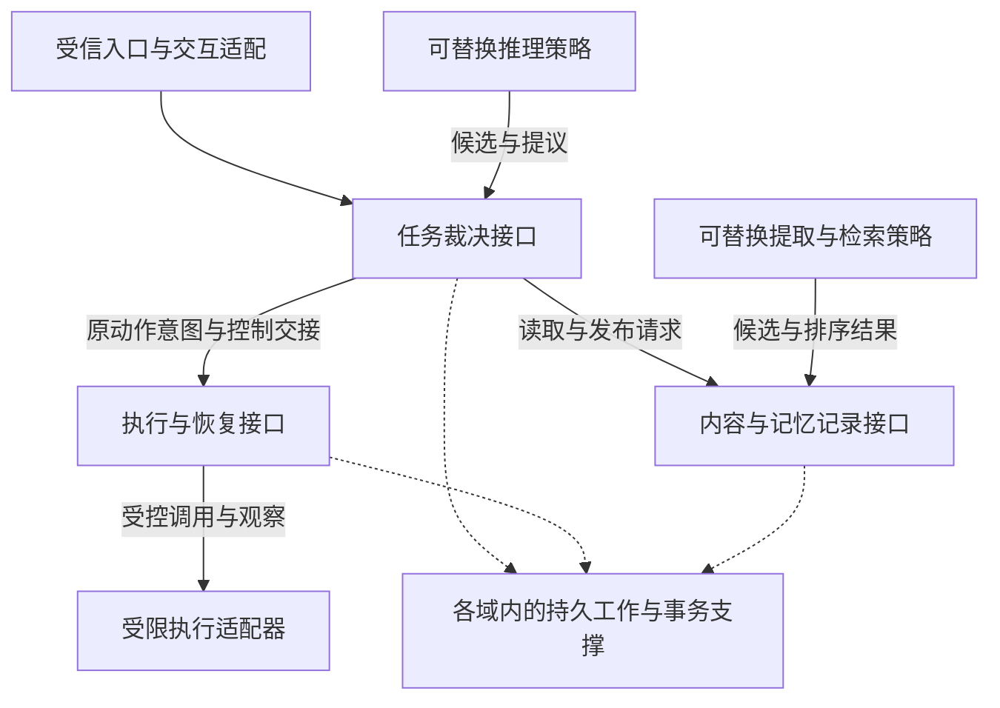

# 分层方案与研究设计的取舍

用户追问：“分层与模块划分方案是否最优，docs/research/architecture 的内容有哪些可取？”本次按事实归属、事务完整性、接口复杂度、替换成本、实现与验收成本比较。没有运行内核的修改和测量证据，不能证明全局最优；就目前目标而言，建议保留现有架构的责任划分，收敛模块接口，并补齐研究设计中更具体的实现合同。

研究目录是候选材料，不是第二套规范。本篇重新推导建议，不复制其正文、旧字段或历史 ADR 决定。以下研究路径只用于说明这次比较的范围；建议是否成立仍由现行项目目标、架构与已采纳 ADR 判断。

---

当前方案最值得保留的五个选择：

- 任务、会话、授权、预算按用户共置，准入在同一个短事务中成立；内容控制元数据也参与需要的联合检查。拆成独立服务会把目前可以本地完成的裁决变成分布式协调。
- 动作账本持有效果和恢复责任，执行适配器只连接目标并回报证据。更换工具实现不能改变未知效果的语义。
- 内容治理持有来源、用途、删除和清理，记忆算法只提取与排序。更换记忆库不能削弱治理。
- 内部协作采用子任务，外部 Agent 采用受控动作。暂时没有必要建立另一套能绕过任务与动作状态的协作内核。
- 逻辑模块、事务域和进程角色分别决定；端側账本的独立责任保留，M1 单进程仍验证正式恢复语义。

这些选择比重新回到 Brain、Memory、Executor 各自持有大块权威的做法更适合现有不变量。但 research 实际也区分了不少内部负责方，不能仅凭它的章节标题就断言其中完全没有这些隔离。

---

当前最值得调整的不是模块数量，而是哪些复杂性暴露给调用者。建议用三组业务接口组织现有模块；它们不是三个必须拆开的微服务，也不改变原事实的写入方：

| 业务接口组 | 内部组合 | 向调用者隐藏的复杂性 |
| --- | --- | --- |
| 任务裁决 | 任务、会话、授权、预算；通过内容接口参与联合检查 | 输入接纳、条件更新、原子准入、确认消费、预算预留、核验与关闭 |
| 执行与恢复 | 动作账本、出口流程、受信宿主；受限执行适配器在其外侧 | 意图接纳、尝试身份、开始检查、可能发送、回报、核对和安全重发 |
| 内容与记忆记录 | 内容治理、记忆语义记录；可替换的提取与检索策略 | 准确版本、发布、来源、纠正、使用检查、派生失效与清理 |

持久工作作为嵌入各负责域的运行支撑，继续与本域事实同事务提交，不变成全局工作流裁决服务。运行记录保留必要的持久关联与缺口状态，作为事实的诊断投影；不把其接收成功变成任务正确性的第二次裁决，也不因此删掉其可靠交接要求。

图只展示主要运行关系，不表示所有命令和回报，也不表示共享一个全局事务。执行出口向裁决域取得当前开始许可，内容使用也会检查授权；这些运行关系通过声明的接口实现，不据此建立相互导入内部代码的依赖环。推理按 R4 读取获准记忆的能力仍可保留，由受信宿主实施检查。

若调用者仍必须知道各组内部的每个落盘点、每个 SQL 锁和手工补偿顺序，上述分组就只是包装，应继续收敛接口，而不是再增加一层转发。

---

研究材料的主要可取之处与吸收方式如下。这里区分“已有，应对齐”“缺少，应补充”和“候选，应测量”，不把每一个研究细节都新建成架构模块。

| 研究范围 | 可取之处 | 吸收方式与限制 |
| --- | --- | --- |
| `engineering/` | 领域依赖小型存储、事务、时钟接口；公开 SDK 与内部记录分开；按完整请求推进实现 | 补显式内部接口和装配入口，见 R2-08；不直接继承技术栈、进程数量或旧 ADR |
| `protocol/method-contract.md`、`data/` | 每个方法写明接纳／决定成功点、原子记录集合、并发条件、错误和恢复入口；数据有明确写入与保留责任 | 按现行身份与状态重建方法表和机器合同。尤其使用当前四元组 CommandIdentity，避免重新引入旧命令范围 |
| `brain/` | 固定输入中的必要事实，区分候选材料、实际模型编码和物理调用；输出发布失败沿原身份恢复 | 受信宿主封存事实核心、全部实际来源和编码结果；策略负责选择与排布。补入 R2-05，不新增第二个模型调用账本 |
| `memory/` | 内容治理与记忆语义分开；纠正影响当前检索和依赖项；投影可重建 | 明确现有内容模块内部的记忆记录写入方，见 R2-09；不把算法和权威记录重新放进同一个插件 |
| `memory/` 的索引与查询 | 连续变化水位、权限变化使查询集合失效、partial 与无命中分开 | 转为索引适配的合同和故障用例；先实现有界词法基线，再测混合召回，不能只靠默认向量库配置 |
| `extensions/` | 能力语义、具体实现绑定和安装依赖锁定分别表达；迟到初始化不得覆盖新实例 | 现行扩展设计已有多数对应字段，补准确映射和 CAS 竞争用例；不重复增加一套发布权威 |
| `workflows.md`、`data/requirement-lifecycle.md` | 沿原输入、条件采纳、准入、执行、读回和 Result 串联恢复产物 | 重写现行端到端实例，用它检查模块接口是否闭合；不机械加入全部旧中间对象或强制自然语言覆盖证明 |
| `validation/` | 文档检查、有界模型、真实实现故障、质量与生产证据分层；错误变体必须被反例推翻 | 移植用例意图并按现行状态重写，先核模型假设；研究脚本通过不代表真实数据库或系统正确 |
| `engineering/`、`production/` | 分开测量模型调用、事务、同步屏障、内容字节和恢复积压 | 作为比较接口与同库优化的测量方法；不把研究参数或表数量推算成已经验证的容量 |

索引水位是一个值得保留的具体例子：分配序号不等于事务已提交。PostgreSQL 官方说明 sequence 取值不会随事务中止回收，因此它不能单独作为已提交连续前缀；本项目可以在受控事务内维护变化头并逐段确认，或者使用具有明确提交语义的日志位置。[PostgreSQL 18 序列说明](https://www.postgresql.org/docs/18/functions-sequence.html)支撑这个前提，具体的索引水位合同仍需本项目自己定义和验证。

---

不建议直接吸收的部分也需要明确。

研究方案把 Brain 的 Decision／ModelCall 设置为独立持久负责记录，而现行核心已有提议请求、模型动作账本和用量来源。可以吸收“一次物理请求有独立身份、输出发布可恢复”，但不新增另一套效果与费用裁决，否则两边状态会需要额外对账。

研究中的远端资格与离线窗口允许显式的陈旧窗口。现行架构选择了当前事实无法证明就等待；这是安全与可用性的实质取舍。任何窗口方案必须先修改相应目标和授权契约，经明确决定采纳，不能当作性能优化悄悄替换。

研究中的严格覆盖门禁、默认逐条记忆确认、估算费用接受、跨域预算分配，以及 Schedule、可复用环境和子会话都有各自产品与恢复成本。现行方案已经选择的预算上界、保存授权、阶段范围和条件核验不能被旧字段自动覆盖。先完成基本闭环，按明确需求逐项启用。

研究目录中的公开对象数量和方法数量也不是完整性的证明。固定 4 个行动、200 个候选、5 分钟 TTL 等初值只能作为测试输入；真实限制需要跟当前的费用、授权、内容大小和质量目标一起确定。

---

“更优”需要用修改与运行证据比较，而非图上框的多少。建议固定四条请求：直接回答、读取后回答、保存并独立读回、冷恢复。分别比较调用者必须知道的模块数量、重复的恢复逻辑、修改传播范围，以及事务数、跨域往返、同步写、延迟和费用。安全违规单列，不能用较低时延抵消。

本次比较后的优先顺序：先落实 R2-08 的接口与装配规则；按 R2-05 统一准备、固定和模型准入；在 M2 落实 R2-09 的记忆语义状态；把方法合同、模式与故障用例放进同一发布检查。继续保留裁决共置、账本独立责任与正式 R7；同库事务折叠仍待测量，没有新证据就不重复推翻上一轮的取舍。

本次建议尚未修改已采纳的 layers 和 ADR。检查覆盖了当前分层、关键核心与策略接口，以及研究的系统模型、工程、协议、上下文、记忆、执行、扩展、数据与验证材料；未将研究目录中每一项功能都当作必须纳入的需求，也没有宣称完成运行性能对照。
